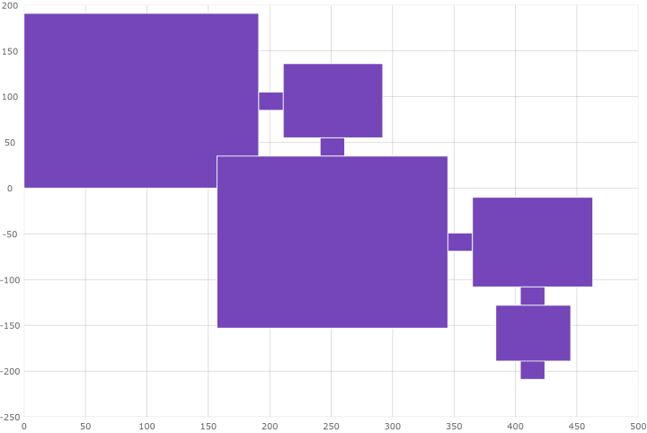
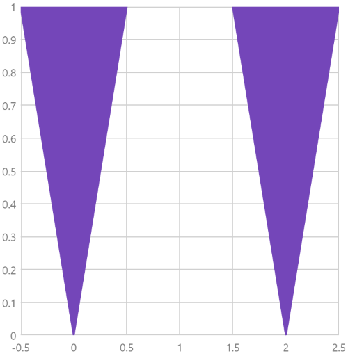

---
title: "散布多角形シリーズの構成 (igDataChart)"
slug: shapeseries-polygon-series
---

# 散布多角形シリーズの構成 (igDataChart)

## トピックの概要

### 目的

このトピックでは、`igDataChart` コントロールで散布多角形シリーズ要素を使用する方法を提供します。

### 前提条件

以下のトピックを事前に読んでおくことをお勧めします。

- [igDataChart の追加](/igdatachart-adding): このトピックでは、`igDataChart`™ コントロールをページに追加し、データにバインドする方法を紹介します。

- [igDataChart をデータにバインド](/igdatachart-databinding): このトピックでは、`igDataChart`™ コントロールを各種データ ソース (JavaScript 配列、`IQueryable<T>`、Web サービス) にバインドする方法について説明します。


### このトピックの内容

このトピックは、以下のセクションで構成されます。

-   [概要](#overview)
	-   [プレビュー](#preview)
-   [データ要件](#data-requirements)
-   [例](#example)
-   [関連コンテンツ](#related-content)
    -   [トピック](#topics)
	-   [サンプル](#samples)

## <a id="overview"></a> 概要

`igDataChart` コントロールで、散布多角形シリーズは多角形を使用してデータを表示するビジュアル要素です。このシリーズのタイプは任意の図形を描画できます。散布多角形シリーズは、データがポリラインの代わりに多角形で描画されることを除いて、散布ポリライン シリーズとほどんど同様に機能します。

### <a id="preview"></a> プレビュー

以下は、建物の間取り図を描画する散布多角形シリーズを持つ `igDataChart` コントロールのプレビューです。



## <a id="data-requirements"></a> データ要件

`igDataChart` コントロールのシリーズの他のタイプと同様、散布多角形シリーズには、データ バインディングのための `dataSource` オプションがあります。このオプションは項目の配列を受けます。各項目には、図形の X および Y 値のポイント位置を配列として保存するデータ列が必要です。このデータ列は、`shapeMemberPath` オプションにマップされます。散布多角形シリーズは、`igDataChart` コントロールで多角形をプロットするために、このマップされたデータ列のポイントを使用します。

## <a id="example"></a> 例

データ要件に基づいて、以下はデータの構造の例です。

**JavaScript の場合:**

```js
var data = [
    { Points: [
        [{x: 0, y: 0}, {x: 0.5, y: 1}, {x: -0.5, y:1}],
        [{x: 2, y: 0}, {x: 2.5, y: 1}, {x: 1.5, y:1}]]}]
```

データの準備ができた後、チャートに設定します。

**JavaScript の場合:**

```js
$("#chart").igDataChart({
    width: "400px",
    height: "400px",
    axes: [{
        name: "xAxis",
        type: "numericX",
    }, {
        name: "yAxis",
        type: "numericY",
    }],
    series: [{
        name: "series1",
        type: "scatterPolygon",
        dataSource: data,
        xAxis: "xAxis",
        yAxis: "yAxis",
        shapeMemberPath: "Points",
    }],
});
```

上記のようにデータとチャートを構成すると、以下のようになります。



## <a id="related-content"></a>関連コンテンツ

### <a id="topics"></a>トピック

- [シェープ シリーズの構成](/shapeseries-shape-series): このトピックでは、`igDataChart` コントロールで散布多角形および散布ポリライン シリーズの概要を提供します。

- [散布ポリライン シリーズの構成](/shapeseries-polyline-series): このトピックでは、`igDataChart` コントロールで散布ポリライン シリーズを構成する方法について説明します。

### <a id="samples"></a>サンプル

- [散布多角形シリーズ](&#123;environment:SamplesUrl&#125;/data-chart/polygon): このサンプルでは、`igDataChart` コントロールの多角形シリーズを紹介します。
