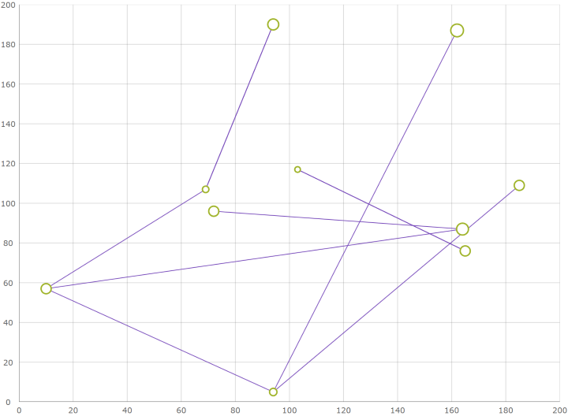
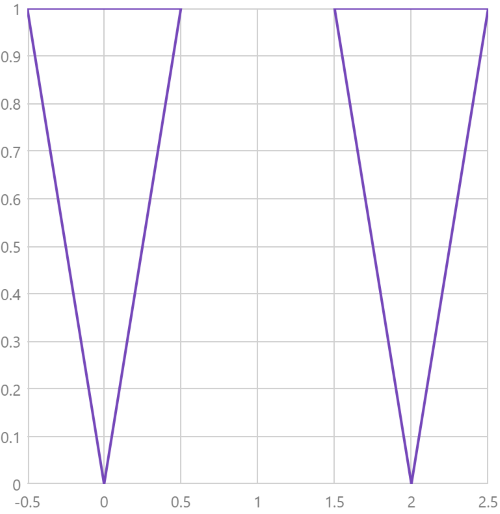

# 散布ポリライン シリーズの構成 (igDataChart)

## トピックの概要

### 目的

このトピックでは、`igDataChart` コントロールで散布ポリライン シリーズ要素を使用する方法を説明します。

### 前提条件

以下のトピックを事前に読んでおくことをお勧めします。

- [igDataChart の追加](/igdatachart-adding): このトピックでは、`igDataChart`™ コントロールをページに追加し、データにバインドする方法を紹介します。

- [igDataChart をデータにバインド](/igdatachart-databinding): このトピックでは、`igDataChart`™ コントロールを各種データ ソース (JavaScript 配列、`IQueryable<T>`、Web サービス) にバインドする方法について説明します。


### このトピックの内容

このトピックは、以下のセクションで構成されます。

-   [概要](#overview)
	-   [プレビュー](#preview)
-   [データ要件](#data-requirements)
-   [例](#example)
-   [関連コンテンツ](#related-content)
    -   [トピック](#topics)
	-   [サンプル](#samples)


## 概要

`igDataChart` コントロールで、散布ポリライン シリーズはポリラインを使用してデータを表示するシリーズです。この散布シリーズのタイプは、ネットワーク グラフなどの切断された折れ線の描画が必要な場合に使用されます。散布ポリライン シリーズは、データが多角形の代わりにポリラインで描画されることを除いて、散布多角形シリーズとほどんど同様に機能します。

### プレビュー

以下は、様々なポイントの間に接続を描画する散布ポリライン シリーズを持つ `igDataChart` コントロールのプレビューです。



## データ要件

`igDataChart` コントロールのシリーズの他のタイプと同様、散布ポリライン シリーズには、データ バインディングのための `dataSource` オプションがあります。このオプションは項目の配列を受けます。各項目には、図形の X および Y 値のポイント位置を配列として保存するデータ列が必要です。このデータ列は、`shapeMemberPath` オプションにマップされます。散布ポリライン シリーズは、`igDataChart` コントロールでポリラインをプロットするために、このマップされたデータ列のポイントを使用します。

## 例

以下はデータ要件に基づいたデータ構造の例です。

**JavaScript の場合:**

```js
var data = [
    { Points: [
        [{x: 0, y: 0}, {x: 0.5, y: 1}, {x: -0.5, y:1}, {x: 0, y: 0}],
        [{x: 2, y: 0}, {x: 2.5, y: 1}, {x: 1.5, y:1}, {x: 2, y: 0}]]}]
```

データの準備ができた後、チャートに設定します。

**JavaScript の場合:**

```js
$("#chart").igDataChart({
    width: "400px",
    height: "400px",
    axes: [{
        name: "xAxis",
        type: "numericX",
    }, {
        name: "yAxis",
        type: "numericY",
    }],
    series: [{
        name: "series1",
        type: "scatterPolyline",
        dataSource: data,
        xAxis: "xAxis",
        yAxis: "yAxis",
        shapeMemberPath: "Points",
    }],
});
```

上記のようにデータとチャートを構成すると以下のようになります。



## 関連コンテンツ

### トピック

- [シェープ シリーズの構成](/shapeseries-shape-series): このトピックでは、`igDataChart` コントロールで散布多角形および散布ポリライン シリーズの概要を提供します。

- [散布多角形シリーズの構成](/shapeseries-polygon-series): このトピックでは、`igDataChart` コントロールで散布多角形シリーズを構成する方法について説明します。

### サンプル

- [散布ポリライン シリーズ](&#123;environment:SamplesUrl&#125;/data-chart/polyline): このサンプルでは、`igDataChart` コントロールのポリライン シリーズを紹介します。