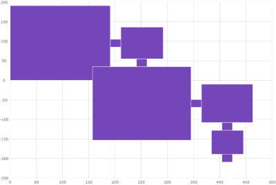
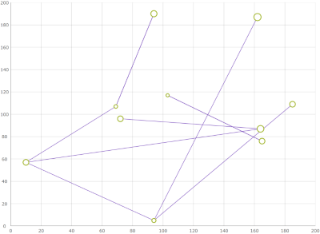

---
title: "シェープ シリーズの構成 (igDataChart)"
slug: shapeseries-shape-series
---

# シェープ シリーズの構成 (igDataChart)

## このグループのトピックについて

### 概要

このグループのトピックでは、多角形およびポリラインシリーズについて説明します。このシリーズを使用すると、igDataChart でカスタム図形を表示できます。X および Y 値を含むポイントのリストをシリーズに提供する必要があります。これらのポイントで図形が定義されます。

図 1.散布多角形シリーズ

図 2.散布ポリライン シリーズ

### トピック

- [散布多角形シリーズの構成 (igDataChart)](/controls/igdatachart/configuring/shape-series/polygon-series): このトピックでは、多角形シリーズの情報を提供します。多角形シリーズのプロパティについて説明し、実装例を示します。

- [散布ポリライン シリーズの構成 (igDataChart)](/controls/igdatachart/configuring/shape-series/polyline-series): このトピックでは、ポリライン シリーズの情報を提供します。ポリライン シリーズのプロパティについて説明し、実装例を示します。
