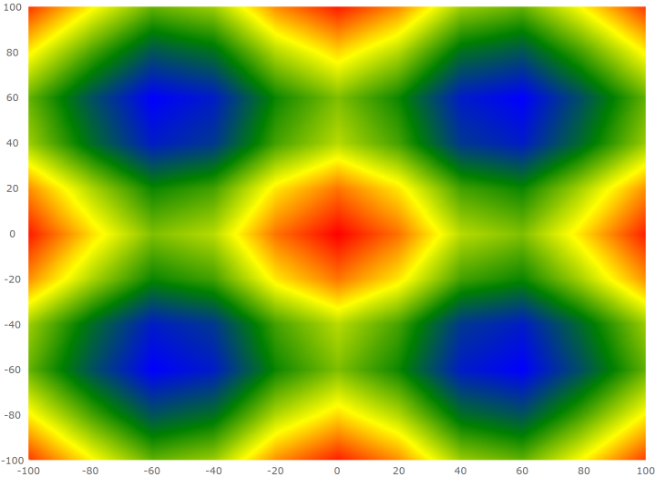
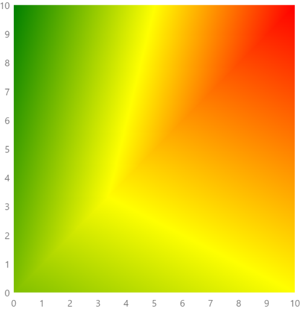

---
title: "散布エリア シリーズの構成 (igDataChart)"
slug: triangulationseries-area-series
---

# 散布エリア シリーズの構成 (igDataChart)

## トピックの概要

### 目的

このトピックでは、`igDataChart` コントロールで散布エリア シリーズ要素を使用する方法を提供します。

### 前提条件

以下のトピックを事前に読んでおくことをお勧めします。

- [igDataChart の追加](/controls/igdatachart/adding): このトピックでは、`igDataChart`™ コントロールをページに追加し、データにバインドする方法を紹介します。

- [igDataChart をデータにバインド](/controls/igdatachart/databinding): このトピックでは、`igDataChart`™ コントロールを各種データ ソース (JavaScript 配列、`IQueryable<T>`、Web サービス) にバインドする方法について説明します。

### このトピックの内容

このトピックは、以下のセクションで構成されます。

-   [概要](#overview)
	-   [プレビュー](#preview)
-   [データ要件](#data-requirements)
-   [データ バインディング](#data-binding)
-   [カラー スケール](#color-scale)
-   [例](#example)
-   [関連コンテンツ](#related-content)
    -   [トピック](#topics)

## <a id="overview"></a> 概要

`igDataChart` コントロールで、散布エリア シリーズは各ポイントに割り当てられた数値を使って、X および Y データの三角測量に基づいて、色付きのサーフェスを描画します。

このシリーズのタイプはヒート マップ、磁場の強さ、またはオフィスの WIFI の強さを描画する場合などに便利です。散布エリア シリーズは散布等高線シリーズと同様ですが、同じ値を持つデータ ポイントを接続する等高線の代わりに補間で色つきサーフェス エリアとしてデータを表します。

### <a id="preview"></a> プレビュー

以下は、3D サーフェス データをプロットする散布エリア シリーズを持つ `igDataChart` コントロールのプレビューです。Z 軸は、サーフェスの色の変更として描画されます。より低い Z 値は青色で、より高い値は赤色になります。



## <a id="data-requirements"></a> データ要件

`igDataChart` コントロールのシリーズの他のタイプと同様、散布エリア シリーズには、データ バインディングのための `dataSource` オプションがあります。このオプションは配列に設定することができます。配列の各項目には、ポイント位置を保存する 2 つのデータ列が必要です (X と Y に各 1 列)。このデータ列は、`xMemberPath` および `yMemberPath` オプションにマップされます。データには各ポイントの値を保存するデータ列も 1 列必要です。この値はシリーズにサーフェスの色を設定するために使用されます。この値列は、`colorMemberPath` オプションにマップされます。

## <a id="data-binding"></a> データ バインディング

以下の表は、データ バインドに使用される散布エリア シリーズ オプションの概要です。

プロパティ名|プロパティ タイプ|説明
---|---|---
`datasource` |array|三角測量を実行する項目のソース。
`xMemberPath`|string |`dataSource` の各項目の X 位置を含むプロパティの名前。
`yMemberPath`|string |`dataSource` の各項目の Y 位置を含むプロパティの名前。
`colorMemberPath`|string |`colorScale` オプションに設定されて、カラー スケールによって色への変換が可能な数値を含む各項目のプロパティの名前。
`colorScale` |オブジェクト|`colorMemberPath` プロパティの値に基づいて各項目に適用するカラー スケール。

## <a id="color-scale"></a> カラー スケール

散布エリア シリーズの `colorScale` オプションを使用して、ポイントの値を解決し、シリーズのサーフェスを塗りつぶします。色は、ピクセル単位の三角ラスタライザーを三角測量データに適用することによって、サーフェスの図形の周りをなめらかに補間します。サーフェスの描画がピクセル単位であるため、カラー スケールはブラシではなく色を使用します。

以下の表は、散布エリア シリーズのサーフェスの色付けに関わる `colorScale` プロパティを示します。

プロパティ名|プロパティ タイプ|説明
---|---|---
`palette` |array|選択または補間するための色の配列。
`interpolationMode` |string |色の選択に使用される補間タイプ。利用可能なオプションは `"interpolateRGB"`、`"interpolateHSV"` および `"select"` です。`"interpolateRGB"` は RGB 補間を使用します。`"interpolateHSV"` は HSV 補間を使用します。`"select"` は `palette` から色を選択します。
`minimumValue`|string |色を割り当てるための最大値。この値より大きい項目値は透明になります。 
`maximumValue`|string |色が割り当てられる最小値。この値より小さい項目値は透明になります。

## <a id="example"></a> 例

以下のコードは散布エリア シリーズをデータにバインドします。

```js
var data = [
    { x: 0, y: 0, z: 2 },
    { x: 10, y: 0, z: 3 },
    { x: 10, y: 10, z: 5 },
    { x: 0, y: 10, z: 1 }];

$("#chart").igDataChart({
    width: "400px",
    height: "400px",
    axes: [{
        name: "xAxis",
        type: "numericX",
    }, {
        name: "yAxis",
        type: "numericY",
    }],
    series: [{
        name: "polygonSeries",
        type: "scatterArea",
        dataSource: data,
        xAxis: "xAxis",
        yAxis: "yAxis",
        xMemberPath: "x",
        yMemberPath: "y",
        colorMemberPath: "z",
        colorScale: {
            palette: [ "green", "yellow", "red" ],
            interpolationMode: "interpolateRGB",
        }
    }],
});
```
このコードは以下の結果になります。



## <a id="related-content"></a>関連コンテンツ

### <a id="topics"></a>トピック

- [三角測量シリーズの構成](/controls/igdatachart/configuring/triangulation-series/triangulation-series): このトピックでは、`igDataChart` コントロールの散布エリアおよび散布等高線シリーズの構成の概要を提供します。

- [散布等高線シリーズの構成](/controls/igdatachart/configuring/triangulation-series/contour-series): このトピックでは、`igDataChart` コントロールで散布等高線シリーズを構成する方法について説明します。
