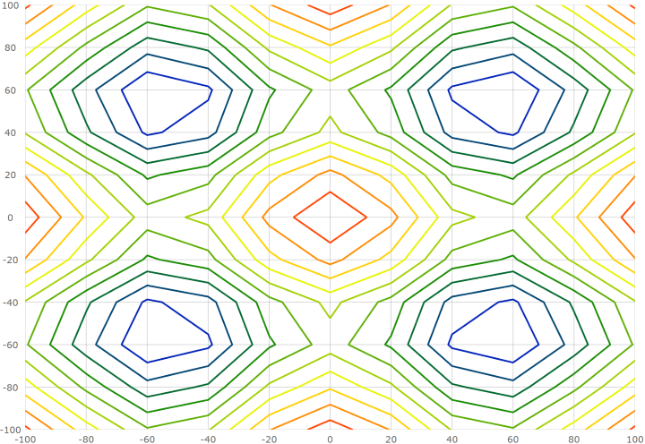
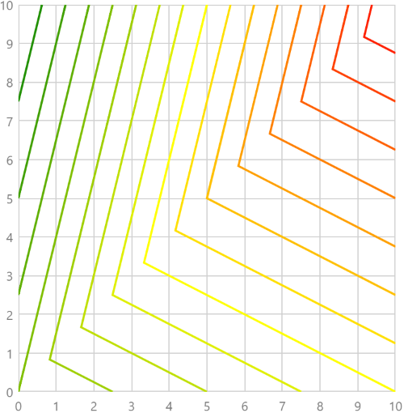

---
title: "散布等高線シリーズの構成 (igDataChart)"
slug: triangulationseries-contour-series
---

# 散布等高線シリーズの構成 (igDataChart)

## トピックの概要

### 目的

このトピックでは、`igDataChart` コントロールで散布等高線シリーズ要素を使用する方法を提供します。

### 前提条件

以下のトピックを事前に読んでおくことをお勧めします。

- [igDataChart の追加](/igdatachart-adding): このトピックでは、`igDataChart`™ コントロールをページに追加し、データにバインドする方法を紹介します。

- [igDataChart をデータにバインド](/igdatachart-databinding): このトピックでは、`igDataChart`™ コントロールを各種データ ソース (JavaScript 配列、`IQueryable<T>`、Web サービス) にバインドする方法について説明します。

### このトピックの内容

このトピックは、以下のセクションで構成されます。

-   [概要](#overview)
	-   [プレビュー](#preview)
-   [データ要件](#data-requirements)
-   [データ バインディング](#data-binding)
-   [塗りつぶしスケール](#fill-scale)
-   [値リゾルバー](#value-resolver)
-   [例](#example)
-   [関連コンテンツ](#related-content)
    -   [トピック](#topics)

## <a id="overview"></a> 概要

`igDataChart` コントロールで、散布等高線シリーズは各ポイントに割り当てられた数値を使って、X および Y データの三角測量に基づいて、色付きの等高線を描画します。

このシリーズのタイプはヒート マップ、磁場の強さ、またはオフィスの WIFI の強さを描画する場合などに便利です。散布等高線シリーズは散布エリア シリーズと同様ですが、塗りつぶしスケールを使用した色付きの等高線でデータを表します。散布エリア シリーズはカラー スケールを使用して補間されサーフェスとしてデータを表します。

### <a id="preview"></a> プレビュー

以下は、3D サーフェス データをプロットする散布等高線シリーズを持つ `igDataChart` コントロールのプレビューです。Z 軸は、サーフェスの色の変更として描画されます。より低い Z 値は青色で、より高い値は赤色になります。



## <a id="data-requirements"></a> データ要件

`igDataChart` コントロールのシリーズの他のタイプと同様、散布等高線シリーズには、データ バインディングのための `dataSource` オプションがあります。このオプションは配列に設定することができます。配列の各項目には、ポイント位置を保存する 2 つのデータ列が必要です (X と Y に各 1 列)。このデータ列は、`xMemberPath` および `yMemberPath` オプションにマップされます。データには各ポイントの値を保存するデータ列も 1 列必要です。この値はシリーズにサーフェスの色を設定するために使用されます。この値列は、`valueMemberPath` オプションにマップされます。

## <a id="data-binding"></a> データ バインディング

以下の表に、データ バインドに使用される散布等高線シリーズのオプションをまとめています。

プロパティ名|プロパティ タイプ|説明
---|---|---
`datasource` |array |三角測量を実行する項目のソース。
`xMemberPath`|string |`dataSource` の各項目の X 位置を含むプロパティの名前。
`yMemberPath`|string |`dataSource` の各項目の Y 位置を含むプロパティの名前。
`valueMemberPath`|string |数値を含む各項目のプロパティ名。この値は、近似の数値を含むポイントをグループ化して等高線を生成するために使用されます。
`fillScale` |object |等高線に使用される色を決定するために使用されます。

## <a id="fill-scale"></a> 塗りつぶしスケール

散布等高線シリーズの `fillScale` オプションを使用して等高線の塗りブラシを解決します。

以下の表は散布等高線シリーズのサーフェスの色付けに関わる `fillScale` プロパティをリストします。

プロパティ名|プロパティ タイプ|説明
---|---|---
`brushes`|array |等高線を塗りつぶすためのブラシ配列。
`minimumValue`|numeric |塗りつぶしスケールでブラシが割り当てられる最小値。割り当てられない場合、シリーズはデータに含まれている一番低い値を使用します。
`maximumValue`|numeric |塗りつぶしスケールでブラシが割り当てられる最大値。割り当てられない場合、シリーズはデータに含まれている一番高い値を使用します。

## <a id="value-resolver"></a> 値リゾルバー

散布等高線シリーズは、`valueMemberPath` オプションにマップされた項目の最小値と最大値の間を等間隔でちょうど 10 本の等高線を使用して描画します。等高線の数を変更するには、`valueResolver` オプションをオブジェクトに設定し、`valueCount` プロパティを等高線の数に設定します。

以下のコードは、散布等高線シリーズの等高線の数を構成する方法を示します。

```js
valueResolver: {
    type: "linear",
    valueCount: 15,
}
```

## <a id="example"></a> 例

以下のコードは散布等高線シリーズをデータにバインドします。この例は、等高線の数を 10 から 15 に変更します。

```js
var data = [
    { x: 0, y: 0, z: 2 },
    { x: 10, y: 0, z: 3 },
    { x: 10, y: 10, z: 5 },
    { x: 0, y: 10, z: 1 }];

$("#chart").igDataChart({
    width: "400px",
    height: "400px",
    axes: [{
        name: "xAxis",
        type: "numericX",
    }, {
        name: "yAxis",
        type: "numericY",
    }],
    series: [{
        name: "series1",
        type: "scatterContour",
        dataSource: data,
        xAxis: "xAxis",
        yAxis: "yAxis",
        xMemberPath: "x",
        yMemberPath: "y",
        valueMemberPath: "z",
        fillScale: {
            brushes: [ "green", "yellow", "red" ],
        },
        valueResolver: {
            type: "linear",
            valueCount: 15
        }
    }],
});
```
このコードは以下の結果になります。



## <a id="related-content"></a>関連コンテンツ

### <a id="topics"></a>トピック

- [三角測量シリーズの構成](/triangulationseries-triangulation-series): このトピックでは、`igDataChart` コントロールで散布エリアおよび散布等高線シリーズの概要を提供します。

- [散布エリア シリーズの構成](/triangulationseries-area-series): このトピックでは、`igDataChart` コントロールで散布エリア シリーズを構成する方法について説明します。
