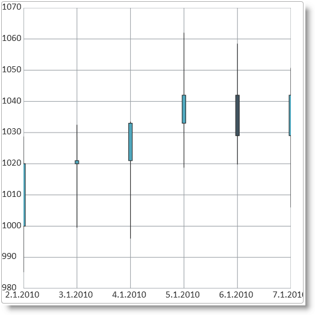
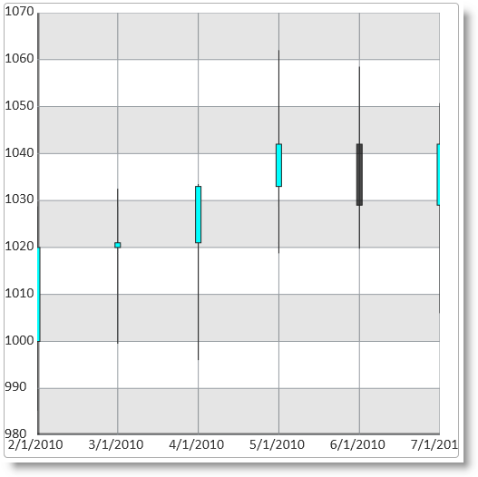
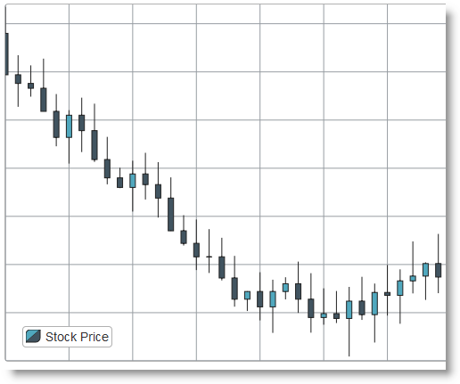

---
title: "igDataChart をデータにバインド"
slug: igdatachart-databinding
---

# igDataChart をデータにバインド


##トピックの概要


### 目的

このトピックでは、`igDataChart`™ コントロールを各種データ ソース (JavaScript 配列、IQueryable&lt;T&gt;、Web サービス) にバインドする方法について説明します。

### 前提条件

以下の表に、このトピックを理解するための前提条件として求められる素材をリストします。


**概念**

-   データ バインディング
-   JSON
-	XML
-   Web サービス
-   WCF サービス
-   ASP.NET MVC


**トピック**

-	[igDataSource の概要](/igdatasource-igdatasource-overview): データ バインドされたコントロールと実際のデータ ソースとの中間層として機能する `igDataSource`™ コントロールに関する全般的な説明。

-	[igDataChart 概要](/igdatachart-overview): このトピックでは、`igDataChart` コントロールについての概念情報を提供します。これには、その主な機能、チャートとユーザー機能を使用するための最低要件が含まれます。

-	[igDataChart の追加](/igdatachart-adding): このトピックでは、`igDataChart` をコントロールを作成して追加し、データにバインドする方法を紹介します。


### このトピックの内容

このトピックは、以下のセクションで構成されます。

-   [データ ソースにバインド](#binding-to-data-sources)
   -   [サポートされるデータ ソース](#supported-data-sources)
    -   [バインドの要件](#requirements-for-binding)
    -   [データ ソースの要約](#data-sources-summary)
-   [JavaScript 配列へのバインド](#bind-to-js-array)
   -   [概要](#js-introduction)
    -   [前提条件](#js-array-prerequisites)
    -   [プレビュー](#js_preview)
    -   [手順](#js_steps)
-	[XML 文字列にバインド](#binding-to-xml)
	-   [概要](#xml-introduction)
	-	[例](#xml-example)
-   [ASP.NET MVC での IQueryable&lt;T&gt; へのバインド](#binding-to-iqueryable)
   -   [概要](#mvc-introduction)
    -   [前提条件](#mvc_prerequisites)
    -   [プレビュー](#mvc_preview)
    -   [手順](#mvc_steps)
-   [WCF サービスへのバインド](#binding_wcf)
   -   [概要](#wcf-introduction)
    -   [プレビュー](#wcf-preview)
    -   [手順](#wcf-steps)
-   [関連コンテンツ](#related-content)
   -   [トピック](#topics)
    -   [サンプル](#samples)
    -   [リソース](#resources)


##<a id="binding-to-data-sources"></a>データ ソースにバインド

###<a id="supported-data-sources"></a> サポートされるデータ ソース

`igDataChart` コントロールは以下のデータ ソースに対応しています。


| データ ソース | バインディング |
| --- | --- |
| igDataSource | データ操作を管理するために、コントロールで内部で使用されます。 |
| IQueryable&lt;T&gt; | MVC コントローラー メソッドからデータを提供するために使用されます。 |


###<a id="requirements-for-binding"></a> バインドの要件

各データ ソースには、`igDataSource` コントロールへのデータ バインディングの異なる要件があります。以下の表に、各要件カテゴリを示します。


|  |  |
| --- | --- |
| 要件のカテゴリ | 要件の一覧 |
| データ構造 | JSON (クライアント側、あるいは Web または WCF サービスから) XML (クライアント側、あるいは Web または WCF サービスから) JavaScript 配列 ASP.NET MVC での IQueryable&lt;T&gt; |
| データ型 | 文字列値 (カテゴリ軸のデータ型) 数値 日付 |


###<a id="data-sources-summary"></a> データ ソースの要約

`igDataChart` コントロールのデータ バインドは、&#123;environment:ProductName&#125;™ ライブラリに含まれる他のコントロールのデータ バインドと同じです。データのバインドは、`dataSource` オプションにデータ ソースを割り当てるという形で行い、Web または WCF サービスによって提供されるデータについては `dataSourceUrl` に URL を指定するという形で行います。

##<a id="bind-to-js-array"></a>JavaScript 配列へのバインド


###<a id="js-introduction"></a> 概要

ここでは、`igDataChart` コントロールを JavaScript データ配列にバインドする際の手順を示します。

###<a id="js-array-prerequisites"></a> 前提条件

この手順を実行するには、以下のリソースが必要です。

-   HTML5 Web ページ
-   Web サイトまたは Web アプリケーション プロジェクトに追加された、必要なすべての JavaScript および CSS ファイル。igDataChart インスタンスの作成および構成の詳細については、[「igDataChart の追加」](/igdatachart-adding)を参照してください。

###<a id="js_preview"></a> プレビュー

次のスクリーンショットは、サンプル配列へのバインドに成功して、所定のデータが表示されるようになった状態の `igDataChart` コントロールです。



###<a id="js_steps"></a> 手順

ここでは、`igDataChart` コントロールを JavaScript データ配列にバインドする際の手順を示します。

1. データ配列を定義します。

 次のコードは、サンプルの JavaScript 配列を定義するものです。

 **JavaScript の場合:**

```js
	<script type="text/javascript">
        var data = [
                { "DateString": "2.1.2010", "Open": 1000, "High": 1028.75, "Low": 985.25, "Close": 1020, "Volume": 1995 },
                { "DateString": "3.1.2010", "Open": 1020, "High": 1032.5, "Low": 999.5, "Close": 1021, "Volume": 1964.5 },
                { "DateString": "4.1.2010", "Open": 1021, "High": 1033.5, "Low": 996, "Close": 1033, "Volume": 1974.75 },
                { "DateString": "5.1.2010", "Open": 1033, "High": 1062, "Low": 1018.75, "Close": 1042, "Volume": 1978.5 },
                { "DateString": "6.1.2010", "Open": 1042, "High": 1058.5, "Low": 1019.75, "Close": 1029, "Volume": 1979 },
                { "DateString": "7.1.2010", "Open": 1029, "High": 1050.75, "Low": 1006, "Close": 1042, "Volume": 1990 }
            ];
    </script>
```

2. `igDataChart` コントロールを追加して構成します。

 **1.**チャートの div 要素を Web ページに追加します。

 Web ページの body 部分に `igDataChart` チャート コントロール用の div 要素を追加します。

 **HTML の場合:**

```html
	<body>
        ...
        <div id="chart"></div>
        ...
    </body>
```

 **2.**`igDataChart` チャート コントロールのインスタンスを作成して、そのデータ ソースを構成します。

 これを行うには、1 つ前の手順で定義したデータ配列を `igDataChart` コントロールの `dataSource` オプションに割り当てます。

 **JavaScript の場合:**

```js
	<script type="text/javascript">
        $(function () {
            $("#chart").igDataChart({
                dataSource: data,
                axes: [{
                    type: "categoryX",
                    name: "xAxis",
                    label: "DateString",
                }, {
                    type: "numericY",
                    name: "priceAxis",
                }],
                series: [{
                    type: "financial",
                    name: "finSeries",
                    title: "Price Movements",
                    xAxis: "xAxis",
                    yAxis: "priceAxis",
                    openMemberPath: "Open",
                    lowMemberPath: "Low",
                    highMemberPath: "High",
                    closeMemberPath: "Close",
                }]
            });
        });
    </script>
```

このサンプルは、JSON データにバインドされたデータ チャートを表示します。

<div class="embed-sample">
   [&#123;environment:SamplesEmbedUrl&#125;/data-chart/json-binding](&#123;environment:SamplesEmbedUrl&#125;/data-chart/json-binding)
</div>

##<a id="binding-to-xml"></a> XML 文字列にバインド

###<a id="xml-introduction"></a> 概要

この例では、`igDataChart` コントロールを XML 文字列にバインドする方法を示します。

###<a id="xml-example"></a> 例

<div class="embed-sample">
   [&#123;environment:SamplesEmbedUrl&#125;/data-chart/xml-binding](&#123;environment:SamplesEmbedUrl&#125;/data-chart/xml-binding)
</div>

##<a id="binding-to-iqueryable"></a>ASP.NET MVC での IQueryable&lt;T&gt; へのバインド


###<a id="mvc-introduction"></a> 概要

ここでは、&#123;environment:ProductName&#125; ライブラリにある ASP.NET ヘルパーを使用して一連のデータ オブジェクトをバックエンド コントローラー メソッドからデータ チャートにバインドする手順を示します。

###<a id="mvc_prerequisites"></a> 前提条件

この手順を実行するには、以下のリソースが必要です。

-   ASP.NET MVC アプリケーション
-   Web サイトまたは Web アプリケーション プロジェクトに追加された、必要なすべての JavaScript および CSS ファイル。igDataChart インスタンスの作成および構成の詳細については、[「igDataChart の追加」](/igdatachart-adding)を参照してください。

###<a id="mvc_preview"></a> プレビュー

次のスクリーンショットは、サンプル配列へのバインドに成功して、所定のデータが表示されるようになった状態の `igDataChart` コントロールです。



###<a id="mvc_steps"></a> 手順

以下の手順では、ASP.NET MVC で `igDataChart` コントロールのインスタンスを作成してデータ ソースにバインドする方法を示します。ここでは、厳密に型指定されたビューに表示するデータ オブジェクトのリストを指定し、データ チャートに &#123;environment:ProductNameMVC&#125; DataChart を使用します。

1. データ モデルを定義します。

 データ モデル クラスを定義します。

 **C# の場合:**

```csharp
	public class StockMarketDataPoint
    {
        public double Open { get; set; }
        public double High { get; set; }
        public double Low { get; set; }
        public double Close { get; set; }
        public double Volume { get; set; }
        public DateTime Date { get; set; }
        public string DateString { get { return Date.ToShortDateString(); } }
    }
```

2. コントローラー メソッドを定義します。

 `StockMarketDataPoint` オブジェクトの配列を作成するためにコントローラー メソッドにロジックを追加します。ここには、データベースからのデータ取得に適用するカスタム ロジックを指定します。

 `StockMarketDataPoint` オブジェクトのリストが IQueryable&lt;StockMarketDataPoint&gt; に変換されてからビューに渡されるという点に注意してください。これは &#123;environment:ProductNameMVC&#125; を呼び出すという形で実行することもできますが、ここに示した実装の方がきれいに実行できます。

 **C# の場合:**

```csharp
	public ActionResult Index()
    {
        List<StockMarketDataPoint> stockMarketData = new List<StockMarketDataPoint>
        {
            new StockMarketDataPoint { Date = DateTime.Parse("2.1.2010"), Open = 1000, High = 1028.75, Low = 985.25, Close = 1020, Volume = 1995 },
            new StockMarketDataPoint { Date = DateTime.Parse("3.1.2010"), Open = 1020, High = 1032.5, Low = 999.5, Close = 1021, Volume = 1964.5 },
            new StockMarketDataPoint { Date = DateTime.Parse("4.1.2010"), Open = 1021, High = 1033.5, Low = 996, Close = 1033, Volume = 1974.75 },
            new StockMarketDataPoint { Date = DateTime.Parse("5.1.2010"), Open = 1033, High = 1062, Low = 1018.75, Close = 1042, Volume = 1978.5 },
            new StockMarketDataPoint { Date = DateTime.Parse("6.1.2010"), Open = 1042, High = 1058.5, Low = 1019.75, Close = 1029, Volume = 1979 },
            new StockMarketDataPoint { Date = DateTime.Parse("7.1.2010"), Open = 1029, High = 1050.75, Low = 1006, Close = 1042, Volume = 1990 }
        };
        return View(stockMarketData.AsQueryable());
    }
```

3. `igDataChart` コントロールのインスタンスを作成して、データ ソースを構成します。

 ASP.NET MVC ビューに含まれる次のコードが、`igDataChart` のインスタンスを作成して、このリストを割り当てます。厳密に型指定されたビューのデータ モデルが `DataChart(Model)` の呼び出しによってチャートにマップされる仕組みに注目してください。軸定義では、`item.DateString` プロパティが `Label()` 関数呼び出しによってカテゴリの X 軸にマップされます。シリーズの定義では、`OpenMemberPath`、`CloseMemberPath`、`LowMemberPath`、および `HighMemberPath` の各呼び出しが、対応するプロパティを金融取引チャートにバインドします。`DataBind()` メソッドが実際のデータ バインディングを実行し、最後に、`Render()` メソッドが、クライアント側で実行される最終的な JavaScript コードを発行します。

 **ASPX の場合:**

```csharp
	<%@ Page Language="C#" Inherits="System.Web.Mvc.ViewPage<IQueryable<DataChartSample.Models.StockMarketDataPoint>>" %>
    <%@ Import Namespace="Infragistics.Web.Mvc" %>
    ...
    <%= 
        Html.Infragistics().DataChart(Model)
            .ID("chart")
            .Axes(axes =>
                {
                    axes.CategoryX("xAxis").Label(item => item.DateString);
                    axes.NumericY("priceAxis");
                }
            )
            .Series(series =>
                {
                    series.Financial("finSeries")
						.XAxis("xAxis")
						.YAxis("priceAxis")
						.OpenMemberPath(item => item.Open)
						.CloseMemberPath(item => item.Close)
						.LowMemberPath(item => item.Low)
						.HighMemberPath(item => item.High);
				}
            )
            .DataBind()
            .Render()
    %>
```


##<a id="binding_wcf"></a>WCF サービスへのバインド


###<a id="wcf-introduction"></a> 概要

ここでは、`dataSourceUrl` オプションを利用して `igDataChart` を WCF サービスにバインドする手順を示します。Web サービスへのバインドも同様です。

###<a id="_Prerequisites3"></a> 前提条件

この手順を実行するには、以下のリソースが必要です。

-   HTML5 Web ページ
-   Web サイトまたは Web アプリケーション プロジェクトに追加された、必要なすべての JavaScript および CSS ファイル。`igDataChart` インスタンスの作成および構成の詳細については、[「igDataChart の追加」](/igdatachart-adding)を参照してください。

###<a id="wcf-preview"></a> プレビュー

次のスクリーンショットは、サンプル配列へのバインドに成功して、所定のデータが表示されるようになった状態の `igDataChart` コントロールです。



###<a id="wcf-steps"></a> 手順

`igDataChart` コントロールを WCF　サービスにバインドする手順を以下に示します。


1. WCF サービス インターフェイスを定義します。

 WCF サービスの完全な実装は、この例とは関連がないので省略します。以下に、GET HTTP 要求に応じてクライアントにデータを提供するサービス コントラクト クラスおよび操作コントラクト メソッドのサンプルを示します。データ モデル クラスは、前の手順 [ASP.NET MVC での IQueryable&lt;T&gt; へのバインド](#binding-to-iqueryable)で指定したものと同じです。

 このあとに定義するのは、クライアントに `StockMarketDataPoint` オブジェクトのリストという形で金融取引データを送るサンプルの `StockMarket` WCF サービスのインターフェイスです。

 **C# の場合:**

```csharp
	[ServiceContract]
    [AspNetCompatibilityRequirements(RequirementsMode = AspNetCompatibilityRequirementsMode.Allowed)]
    public class StockMarket
    {
        [OperationContract]
        [WebGet(BodyStyle = WebMessageBodyStyle.Bare, ResponseFormat = WebMessageFormat.Json)]
        public List<StockMarketDataPoint> GetStockData()
        {
            return StockMarketGenerator.GenerateData();
        }
    }
```

 ここで注目すべき重要なものは、サーバー メソッド `GetStockData()` に適用される `WebGet` 属性です。これは、このメソッドが GET 要求に応答し、その応答がむき出しの（ラップされていない）JSON エンコード データ配列であることを宣言します。

2. チャート コントロールのインスタンスを作成し、データ ソースを設定します。

 **HTML/jQuery**

 `igDataChart` のインスタンスを作成するために次のコードを HTML5 ページの冒頭部に追加します。WCF サービス アドレスは、アドレスを `dataSourceUrl` オプションに割り当てることによって、データ ソースとして設定されます。X 軸定義では、軸のラベルが、サーバーから取得したデータの `DateString` プロパティにマップされます。同じように、金融取引データ シリーズのデータ オプションは、WCF データ ソースの Open (寄り値)、High　(高値)、Low(低値)、および Close (引け値) プロパティにマップされます。

 このサンプルでは、WCF サービスがインストール/実行されている場所のアドレスを `http://www.example.com/Services/StockMarket.svc/GetStockData` とします。 

 **JavaScript の場合:**

```js
	$(function () {
        $("#chart").igDataChart({
            dataSourceUrl: "http://www.example.com/Services/StockMarket.svc/GetStockData",
            axes: [{
                name: "xAxis",
                type: "categoryX",
                label: "DateString"
            },
            {
                name: "yAxis",
                type: "numericY"
            }],
            series: [{
                name: "dataSeries",
                title: "stockPrice",
                type: "financial",
                xAxis: "xAxis",
                yAxis: "yAxis",
                openMemberPath: "Open",
                highMemberPath: "High",
                lowMemberPath: "Low",
                closeMemberPath: "Close"
            }]
        });
    });
```

 **ASP.NET MVC**

 `igDataChart` のインスタンスを作成して WCF サービス アドレスを設定するために、次のコードを ASP.NET MVC ビューに追加します。このコードは HTML サンプルのコードと同じ意味を持ち、このコードで重要な箇所は、WCF サービスの URL を設定する呼び出しが定義されている部分です。この呼び出しにより、`DataSourceUrl 属性が http://www.example.com/Services/StockMarket.svc/GetStockData に設定されます。`

 **ASPX の場合:**

```csharp
	<%@ Page Language="C#" Inherits="System.Web.Mvc.ViewPage<dynamic>" %>
    <%@ Import Namespace="Infragistics.Web.Mvc" %>
    ...
    <%=
        Html.Infragistics().DataChart()
            .ID("chart")
            .Axes((axes) =>
                {
                    axes.CategoryX("xAxis").Label("DateString");
                    axes.NumericY("yAxis");
                })
            .Series((series) =>
                {
                    series
                    .Financial("finSeries")
                    .XAxis("xAxis").YAxis("yAxis")
                    .OpenMemberPath("Open")
                    .CloseMemberPath("Close")
                    .LowMemberPath("Low")
                    .HighMemberPath("High")
                    .VolumeMemberPath("Volume")
                })
			.DataSourceUrl("http://www.example.com/Services/StockMarket.svc/GetStockData")
            .DataBind()
            .Render()
    %>
```

##<a id="related-content"></a>関連コンテンツ


###<a id="topics"></a> トピック

このトピックの追加情報については、以下のトピックも合わせてご参照ください。

-	[igDataSource のクライアント側データへのバインド](/igdatasource-binding-igdatasource-to-client-side-data): このトピックでは、`igDataSource` をクライアント側の JavaScript 配列および JSON データにバインドする方法を説明します。

-	[igDataSource を REST サービスへバインド](/igdatasource-binding-to-rest-services): このトピックでは、`igDataSource` コントロールを REST サービスにバインドする方法を説明します。

-	[igDataSource を WCF データ サービスへバインド](/igdatasource-binding-to-wcf-data-services): このトピックでは、`igDataSource` コンポーネントを WCF サービスにバインドする方法を説明します。


###<a id="samples"></a> サンプル

このトピックについては、以下のサンプルも参照してください。

-	[大量のデータのバインド](&#123;environment:SamplesUrl&#125;/data-chart/binding-high-volume-data): このサンプルは、大量のレコードが `igDataChart` にバインドされる実例を示すものです。


###<a id="resources"></a> リソース

以下の資料 (Infragistics のコンテンツ ファミリー以外でもご利用いただけます) は、このトピックに関連する追加情報を提供します。

-	[WCF サービスのホストおよび利用](http://msdn.microsoft.com/ja-jp/library/bb332338.aspx): この MSDN 掲載記事は、WCF サービスの作成/ホスト/利用方法を詳しく解説したものです。

-	[チュートリアル: Visual Web Developer での ASP.NET Web サービスの作成および使用](http://msdn.microsoft.com/ja-jp/library/8wbhsy70%28v=vs.80%29.aspx): この MSDN 掲載記事は、Visual Web Developer で Web サービスを作成する方法を詳しく解説したものです。


 

 


