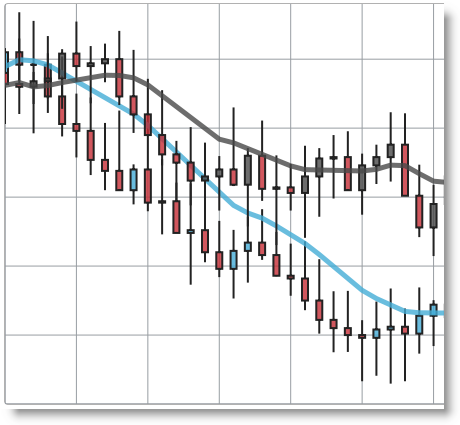
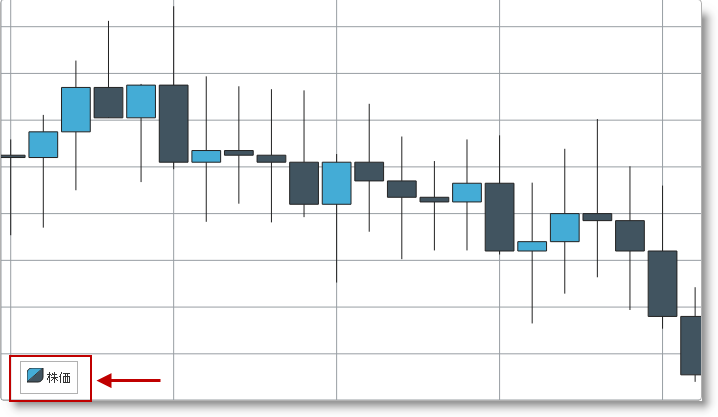
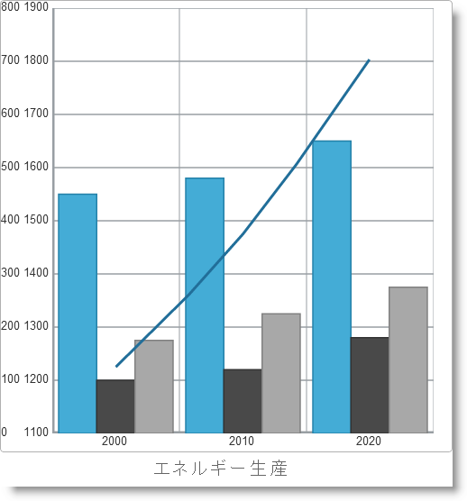
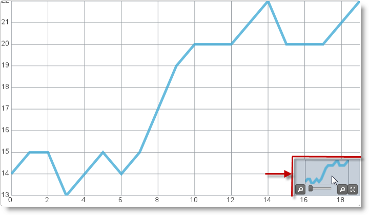
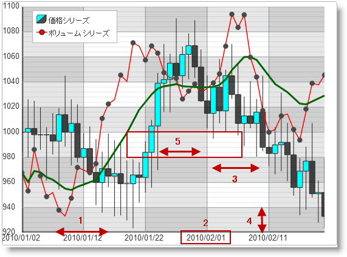
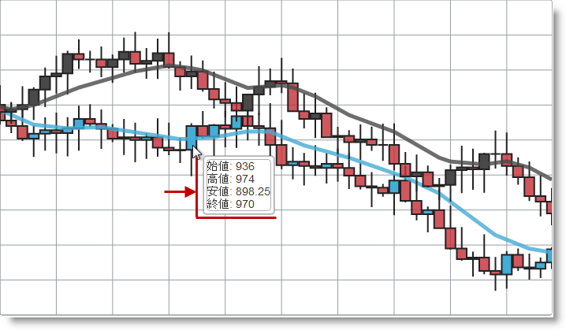
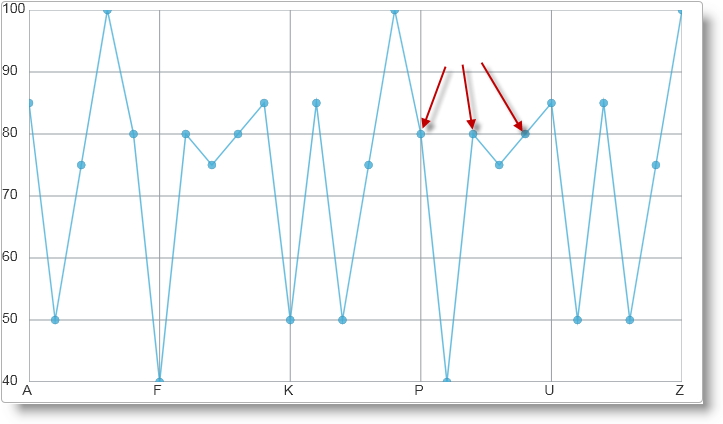

# 概要 (igDataChart)

import ApiLink from 'docs-template/components/mdx/ApiLink.astro';

# 概要 (igDataChart)

### 目的

このトピックは、`igDataChart`™ コントロールについて、その主要機能、最低必須事項、ユーザー機能といった事項の概念的情報を提供します。

### 必要な背景

以下の表に、このトピックを理解するための前提条件として求められる素材をリストします。

**概念**

-   チャート作成
-   チャート タイプ
-   データの可視化

**トピック**

-	[\{environment:ProductName\} の概要](/igniteui-for-jquery-overview)

\{environment:ProductName\}™ ライブラリにつぃての一般的情報

### このトピックの構成

このトピックは、以下のセクションで構成されます。

-   [概要](#introduction)
-   [サポートされるチャート タイプ](#supported-chart-types)
-   [最低必要条件](#min-requirements)
-   [主要機能](#main-features)
   -   [機能の概要](#features-overview)
    -   [凡例](#legend)
    -   [複合チャート](#composite-charts)
    -   [ナビゲーション](#navigation)
    -   [軸](#axis-options)
    -   [ツールチップ](#tooltips)
    -   [十字線](#crosshairs)
    -   [マーカー](#markers)
    -   [トレンドライン](#trend-lines)
-   [ユーザー相互作用と操作性](#user-interaction)
-   [関連コンテンツ](#related-content)
   -   [トピック](#topics)
    -   [サンプル](#samples)

##概要

### igDataChart の概要

igDataChart は、さまざまな種類のチャートを HTML5 Web アプリケーションおよびサイトに描画するチャート コントロールです。HTML5 の新しい Canvas タグを使用して、データ シリーズを Web ページにプロットします。

`igDataChart` コントロールを使用すると、多くのさまざまなシリーズ タイプを棒チャート/柱状チャート、財務、カテゴリ (折れ線、スプライン、エリアなど)、極座標、ラジアル、散布図 (散布図および散布図折れ線) 他のように描画できます。チャートは、各データ シリーズの意味をマークする 1 つまたは複数の凡例で構成できます。さらに、他のビジュアル要素およびユーザー操作要素を、十字線、概要と詳細 (OPD) ペイン、軸の主線/副線、軸の幅などのように構成できます。詳細については、[主な機能](#main-features)のセクションを参照してください。

##サポートされるチャート タイプ

### サポートされるチャート タイプの概要

`igDataChart` コントロールは、さまざまな可視化の目的に対して導入されるいろいろなシリーズ タイプを可能にします。

サポートされるチャート タイプの詳細と基本的な構成情報については、[サポートされるチャート タイプの表](#supported-chart-types)のブロックを参照してください。

>**注:** 円グラフは別のコントロール `igPieChart`™ で作成されます。詳細は [igPieChart の概要](/igbulletgraph-overview)をご覧ください。

### サポートされるチャート タイプの表

以下の表はサポートされているチャート タイプを示します。

| チャート タイプ | シリーズ タイプ | 説明 | Series.type プロパティの設定 | データ バインディング プロパティ |
| --- | --- | --- | --- | --- |
| 棒と柱状 | 棒 | 分類されたデータを水平の棒で可視化します。 | bar | <ApiLink type="igDataChart" member="valueMemberPath" section="options" label="valueMemberPath" /> |
|  | 列 | 分類されたデータを垂直の柱で可視化します。 | column | <ApiLink type="igDataChart" member="valueMemberPath" section="options" label="valueMemberPath" /> |
| カテゴリ | 線 | 分類されたデータをデータ ポイントに鋭い角をもつ線で可視化します。 | line | <ApiLink type="igDataChart" member="valueMemberPath" section="options" label="valueMemberPath" /> |
|  | エリア チャート | 分類されたデータをデータ ポイントに鋭い角をもつ線の下の色づけされた領域で可視化します。 | area | <ApiLink type="igDataChart" member="valueMemberPath" section="options" label="valueMemberPath" /> |
|  | スプライン | 分類されたデータをデータ ポイント上のなめらかな角をもつ線で可視化します。 | spline | <ApiLink type="igDataChart" member="valueMemberPath" section="options" label="valueMemberPath" /> |
|  | スプライン エリア チャート | 分類されたデータをデータ ポイントになめらかな角をもつ線の下の色づけされた領域で可視化します。 | splineArea | <ApiLink type="igDataChart" member="valueMemberPath" section="options" label="valueMemberPath" /> |
|  | ウォーターフォール | 分類されたデータを垂直の柱で可視化し、先頭のカテゴリーに対応する先頭の柱は x 軸から始まり、続くカテゴリーはそれぞれ前のカテゴリーが終わったとこから始まります。 | waterfall | <ApiLink type="igDataChart" member="valueMemberPath" section="options" label="valueMemberPath" /> |
| 財務 | ロウソク足チャート | ロウソク足の形で財務 (投資) 指標の始値、終値、安値、高値を表示します。 | candlestick | <ApiLink type="igDataChart" member="openMemberPath" section="options" label="openMemberPath" /> <ApiLink type="igDataChart" member="closeMemberPath" section="options" label="closeMemberPath" /> <ApiLink type="igDataChart" member="highMemberPath" section="options" label="highMemberPath" /> <ApiLink type="igDataChart" member="lowMemberPath" section="options" label="lowMemberPath" /> |
|  | OHLC チャート | Open、High、Low、Close の略開始と終わりの値のマーキングをもつ垂直線の形で財務 (投資) 指標の始値、終値、安値、高値を表示します。 | ohlc | <ApiLink type="igDataChart" member="openMemberPath" section="options" label="openMemberPath" /> <ApiLink type="igDataChart" member="closeMemberPath" section="options" label="closeMemberPath" /> <ApiLink type="igDataChart" member="highMemberPath" section="options" label="highMemberPath" /> <ApiLink type="igDataChart" member="lowMemberPath" section="options" label="lowMemberPath" /> |
| 極座標 | 極座標散布図 | 極座標系でドット (またはその他のマーカー) によるデータの可視化を行います。 | polarScatter | <ApiLink type="igDataChart" member="angleMemberPath" section="options" label="angleMemberPath" /> <ApiLink type="igDataChart" member="radiusMemberPath" section="options" label="radiusMemberPath" /> |
|  | 極座標折れ線チャート | 極座標系でデータ ポイントを直線で結んだ線によりデータを可視化します。 | polarLine | <ApiLink type="igDataChart" member="angleMemberPath" section="options" label="angleMemberPath" /> <ApiLink type="igDataChart" member="radiusMemberPath" section="options" label="radiusMemberPath" /> |
|  | 極座標エリア チャート | 極座標系でデータ ポイントを直線で結んだ線の下の色づけされた領域でデータを可視化します。 | polarArea | <ApiLink type="igDataChart" member="angleMemberPath" section="options" label="angleMemberPath" /> <ApiLink type="igDataChart" member="radiusMemberPath" section="options" label="radiusMemberPath" /> |
| ラジアル | ラジアル折れ線チャート | カテゴリー化されたデータをデータ ポイントを直線で結んだ線により可視化し、すべてのカテゴリーを円内に配置します。 | radialLine | <ApiLink type="igDataChart" member="valueMemberPath" section="options" label="valueMemberPath" /> |
|  | ラジアル柱状チャート | カテゴリー化されたデータを共通の中心から異なる角度で伸ばした柱で可視化します。 | radialColumn | <ApiLink type="igDataChart" member="valueMemberPath" section="options" label="valueMemberPath" /> |
|  | ラジアル円チャート | カテゴリー化されたデータを共通の中心から異なる角度で伸ばしたパイのスライス型要素で可視化します。 | radialPie | <ApiLink type="igDataChart" member="valueMemberPath" section="options" label="valueMemberPath" /> |
| 範囲カテゴリ | 範囲エリア チャート | 2 つの値の間の範囲内にある分類されたデータをデータ ポイントを 2 本の直線で結び、間の領域を色づけして可視化します。 | rangeArea | <ApiLink type="igDataChart" member="lowMemberPath" section="options" label="lowMemberPath" /> <ApiLink type="igDataChart" member="highMemberPath" section="options" label="highMemberPath" /> |
|  | 範囲柱状チャート | 2 つの値の間の範囲内にある分類されたデータを柱で可視化します。 | rangeColumn | <ApiLink type="igDataChart" member="lowMemberPath" section="options" label="lowMemberPath" /> <ApiLink type="igDataChart" member="highMemberPath" section="options" label="highMemberPath" /> |
| バブル | バブル | 複数のパラメータで記述されたデータを異なる直径の色づけされた円で可視化します。 | bubble | <ApiLink type="igDataChart" member="xMemberPath" section="options" label="xMemberPath" /> <ApiLink type="igDataChart" member="yMemberPath" section="options" label="yMemberPath" /> <ApiLink type="igDataChart" member="radiusMemberPath" section="options" label="radiusMemberPath" /> <ApiLink type="igDataChart" member="fillMemberPath" section="options" label="fillMemberPath" /> <ApiLink type="igDataChart" member="labelMemberPath" section="options" label="labelMemberPath" /> |
| 散布図 | 散布図 | データをデカルト座標系上のドットで可視化します。 | scatter | <ApiLink type="igDataChart" member="xMemberPath" section="options" label="xMemberPath" /> <ApiLink type="igDataChart" member="yMemberPath" section="options" label="yMemberPath" /> |
|  | 散布図 - 折れ線 | デカルト座標系でデータ ポイントを直線で結んだ線によりデータを可視化します。 | scatterLine | <ApiLink type="igDataChart" member="yMemberPath" section="options" label="xMemberPath" /> <ApiLink type="igDataChart" member="yMemberPath" section="options" label="yMemberPath" /> |

##最低必要条件

### 最低要件の概要

`igDataChart` コントロールは jQuery UI ウィジェットの 1 つであるため、jQuery ライブラリと jQuery UI ライブラリに依存します。Modernzr ライブラリは、内部的にブラウザーと装置の機能を検出するためにも使用されています。コントロールは、機能とデータのバインド用の \{environment:ProductName\}™ の共有リソースのいくつかを使用します。これらのリソースへの参照は、実際の jQuery または \{environment:ProductNameMVC\} が使用されているとしても必要となります。コントロールが ASP.NET MVC のコンテクスト内で使用されている場合、`Infragistics.Web.Mvc` アセンブリが必要です。

### 最低要件の概要表

以下の表で、 `igDataChart` コントロールを使用するための要件を簡単に説明します。

| 要件 | 説明 |
| --- | --- |
| HTML5 キャンバス API | チャート用ライブラリの機能は、HTML5 Canvas タグとそれに関する API に基づきます。これらをサポートする Web ブラウザーは、igDataChart コントロールで生成されたチャートを描画し、表示できます。その他の HTML5 機能は、igDataChart コントロールの操作に必要です。[Wikipedia™](http://en.wikipedia.org/wiki/Main_Page) の[キャンバス 要素: サポート](http://en.wikipedia.org/wiki/Canvas_element#Support)のトピックには、HTML5 キャンバス API をサポートしている、最も一般的なデスクトップとモバイル Web ブラウザのバージョンがが詳述されています。 |
| jQuery および jQuery UI JavaScript リソース | environment:ProductName は、これらのフレームワークの最上位にビルドされます。 [jQuery](http://docs.jquery.com/Main_Page) [jQuery UI](http://jqueryui.com/) |
| Modernizr | Modernizr ライブラリはブラウザー機能とデバイス機能を検出するため igDataChart で使用されます。これは必須ではなく、含まれていない場合、コントロールは HTML5 をサポートするブラウザーが動作する通常のデスクトップ環境であるように動作します。 [Modernizr](http://modernizr.com/docs/) |
| 一般のチャート JavaScript リソース | environment:ProductName ライブラリのチャート表示機能は、シリーズ タイプに応じて複数のファイルに渡って配布されます。 手動でリソースを組み込む場合は、以下の表に示す依存関係を使用する必要があります。 JS リソース |
| infragistics.util.js, infragistics.util.jquery.js | environment:ProductName ユーティリティ |
| infragistics.datasource.js | igDataSource コントロール |
| infragistics.ext_core.js, infragistics.ext_collections.js, infragistics.ext_ui.js, infragistics.dv_jquerydom.js, infragistics.dv_core.js, infragistics.dv_geometry.js, infragistics.datachart_core.js | データ可視化コア機能 |
| infragistics.dvcommonwidget.js | チャートおよびマップの共通ウィジェット |
| infragistics.ui.chart.js | チャート UI ウィジェット |
| infragistics.legend.js, infragistics.ui.chartlegend.js | チャート凡例機能および UI ウィジェット |
| infragistics.dv_opd.js | チャートの概要と詳細ペイン機能 |
| infragistics.ui.widget.js | すべての environment:ProductName ウィジェットの基本 igWidget。 |

			&lt;/td&gt;
&lt;/tr&gt;

		&lt;tr&gt;
			&lt;td&gt;チャート タイプ固有の JavaScript リソース&lt;/td&gt;
			&lt;td&gt;上記の一般的なチャート リソースに加えて、使用しているそれぞれのチャート タイプに関連する参照を組み込む必要があります。 | チャート シリーズの種類 | JS リソース | | --- | --- | | 共有のカテゴリ機能 | infragistics.datachart_categorycore.js | | エリア チャート、棒チャート、柱状チャート、折れ線チャート、スプライン チャートすべて、ウォーターフォール | infragistics.datachart_category.js | | 棒チャート | infragistics.datachart_verticalcategory.js | | Financial、平均値インジケーター | infragistics.datachart_financial.js, infragistics.datachart_extendedfinancial.js | | 極座標エリア チャート、極座標折れ線チャート、極座標チャートすべて | infragistics.datachart_polar.js (依存関係: infragistics.datachart_extendedaxes.js) | | ラジアル チャートすべて | infragistics.datachart_radial.js (依存関係: infragistics.datachart_extendedaxes.js) | | 範囲 チャートすべて | infragistics.datachart_rangecategory.js | | 散布図すべて | infragistics.datachart_scatter.js | | すべての積層型チャート | infragistics.datachart_stacked.js (依存関係: infragistics.datachart_verticalcategory.js, infragistics.datachart_extendedaxes.js) | | ツールチップ、強調表示、注釈 | infragistics.datachart_annotation.js | | DateTimeAxis / TimeAxis | infragistics.datachart_extendedaxes.js |&lt;/td&gt;
&lt;/tr&gt;

		&lt;tr&gt;
			&lt;td&gt;IG テーマ&lt;/td&gt;
			&lt;td&gt;このテーマには、\{environment:ProductName\} ライブラリ向けに作成されたカスタム ビジュアル スタイルが含まれます。これは次のファイルに含まれます。 <ul> <li> &#123;IG CSS root&#125;/themes/Infragistics/infragistics.theme.css </li> </ul>&lt;/td&gt;
&lt;/tr&gt;

		&lt;tr&gt;
			&lt;td&gt;チャート構造&lt;/td&gt;
			&lt;td&gt;この CSS リソースは、コントロールのさまざまな要素を描画するためにチャート コンポーネントによって使用されます。 <ul> <li> &#123;IG CSS root&#125;/structure/modules/infragistics.ui.chart.css </li> </ul>&lt;/td&gt;
&lt;/tr&gt;
	&lt;/tbody&gt;
&lt;/table&gt;

>**注:** 詳細については、[\{environment:ProductName\} で JavaScript リソースを使用](/deployment-guide-javascript-resources)トピックをご覧ください。

##主要機能

### 機能の概要

以下の表は、`igDataChart` コントロールの主な機能についてまとめています。追加の詳細は、以下の概要表の下に示します。

|  |  |
| --- | --- |
| 機能 | 説明 |
| [シリーズ タイプの選択](#supported-chart-types) | チャートは複数の異なるシリーズ タイプを描画し ([複合チャート](#composite-charts)を参照)、シリーズ タイプは各 series オブジェクトの type オプションで決まります。シリーズ タイプに応じて、異なるタイプの x 軸および y 軸を選択する必要があり、異なるデータ バインディング オプションを設定する必要があります。 |
| [複合チャート](#composite-charts) | 複合チャートには、タイプが異なる複数のシリーズ、または範囲が異なる複数の y 軸があります。 |
| [凡例](#legend) | チャートには凡例を構成し、視覚化されたあらゆるデータ シリーズのタイトルを表示できます。 |
| [ナビゲーション](#navigation) | drag-to-zoom、drag-to-pan、概要と詳細ペイン (OPD) パネルなどのインタラクティブ機能により、簡単に詳細情報を拡大し、チャートの異なるエリア間をナビゲートできます。 |
| [軸](#axis-options) | すべての軸で初期の範囲を定義し、後で外部コントロールをユーザー操作することで、実行時に範囲を変更できます。また、構成可能な軸ラベル、軸線、主線および副線、軸のストライプがあります。 |
| [ツールチップ](#tooltips) | ツールチップはチャートの上に浮かぶように表示されます。ツールチップは、ツールチップ内に表示される特定の構造とデータを定義するテンプレートに基づいています。 |
| [十字線](#crosshairs) | 十字線は、チャート上のマウスの動作に合わせて動き、2 本の線が正しい角度で交わることでマウス ポインターの先端の場所を指定します。 |
| [マーカー](#markers) | チャートのデータ ポイントを指定する場合に、さまざまなマーカーを使用できます。これらのマーカーは、三角形、ひし形、四角などタイプもさまざまです。 |
| [トレンドライン](#trend-lines) | 各種データ シリーズでは、示したデータのトレンドラインをコントロールにより計算し、表示できます。トレンドラインでは、既知の数学関数による傾向などを、視覚データで視覚的に特定できます。 |

### 凡例

凡例は、チャートの各データ シリーズのアイコンとタイトルを表示するビジュアル パネルです。

凡例は `igChartLegend` という \{environment:ProductName\} ライブラリとは異なるコントロールで実装されており、ページに異なる div 要素が必要です。div 要素は、凡例に含まれるよう各 series オブジェクトで参照されます。`igChartLegend` は、以下で記述するトピックでカバーされる非常にシンプルなコントロールです。

### 複合チャート

チャートは、タイプが異なる複数のシリーズを組み合わせたり、y 軸の範囲が異なるシリーズを持ったりすることができます。つまり、2 つのデータ シリーズは棒チャートや折れ線チャートなど異なるグラフで示すことができたり、値の範囲が異なるデータを同じチャートで示したりすることができます。

以下の図は、列と線のカテゴリ シリーズを組み合わせた複合チャートを示し、レグは個々の値を表し、線はこれらの値の合計を示し、その形式はトレンドを思わせます。

### ナビゲーション

ズーム、パンニング、概要と詳細 (OPD) ウィンドウによりチャートのナビゲーションが可能です。ズームはマウスをスクロールするか、拡大する領域を四角形にドラッグして行います。パンニングは、チャートがズームされているときにマウスをドラッグして行います。

OPD ウィンドウは、別のナビゲーション ツールです。ユーザーがチャートがアクティブ ビューのどこにあるのかわかるよう、アクティブ ビューがマークされたチャートを小型化した画像です。

OPD ウィンドウはデフォルトで表示したり、API メソッドで起動して表示するよう構成できます。ズームとパンニングは両方とも、マウス ボタンを押したまま動かすといったドラッグ操作に依存しているため、デフォルトのドラッグ操作や、ドラッグ操作に代わるどの修飾キー (Ctrl、Alt、Shift) を使用するか構成できます。

### 軸

軸はすべてのチャートの主要機能で、さまざまな設定ができます。あらゆる軸の範囲は API 呼び出しにより定義および変更でき、アクティブ ビューのチャートで表示される値の範囲を定義できます。主な軸線の他に、チャートはキー値のタイトル、主グリッド線および副グリッド線、チャート上のエリアを簡単に区別できる軸のストライプも表示できます。

軸の要素は以下の図をご覧ください。

**凡例:**

1.  軸線
2.  軸ラベル
3.  副線
4.  主線
5.  軸のストライプ

### ツールチップ

ツールチップは、現在のマウス位置に表示され、ツールチップ テンプレートで定義済みの情報を表示する小型のパネルです。通常は、チャートの特定のポイントで示された数値や他の関連する情報です。

ツールチップ テンプレートは「`text/x-jquery-tmp`l」型の HTML script タグで定義したり、単に HTML マークアップによる文字列の場合があります。実質的にツールチップは、画面に描画される、パラメーター付きの HTML マークアップを定義します。置き換える値は `${item.Price}` などの jQuery テンプレート構文で定義します。

### 十字線

十字線は、マウス ポインターをチャートに置いたときに、正しい角度で交わる現在のマウス位置に表示されている 2 本の線です。十字線は、チャート シリーズのデータを関連する軸上の同等の位置と画面上で揃えるのに役立ちます。

赤色の両矢印でマークされた十字線ラインは以下の図をご覧ください。

### マーカー

マーカーは、データ シリーズのデータ ポイントごとに表示される小さな挿絵です。円、三角形、ひし形、ピラミッド、四角、五角形、六角形など多数のマーカー タイプが使用できます。

円のマーカーがあるチャート (一部のマーカーは赤の矢印で指定されている) は以下の図をご覧ください。

### 関連トピック:

-   [igDataChart の追加](/igdatachart-adding)

### トレンドライン

トレンドラインでは、既知の数学関数による傾向などを、視覚データで視覚的に特定できます。これにより、データの特性を「この系はリニアである」または「この値は指数関数的に増加している」などと特定できます。トレンドラインは通常、財務およびカテゴリのデータ シリーズに適用されます。

データが五次関数 (五次の多項式) とどれだけ密接に一致しているかを示す、「quintic fit」型トレンドラインの線のカテゴリ シリーズは、以下の図をご覧ください。

##ユーザー相互作用と操作性

###ユーザー インタラクションの概要

以下の表で、`igDataChart` コントロールのユーザー相互作用機能を簡単に説明します。Configurable? 列にあるトピックに、さらに詳しい説明があります。

| 目的 | 方法 | 構成方法 |
| --- | --- | --- |
| ズーム | ドラッグ マウス スクロール 二重タップ |  |
| パン | ドラッグ Ctrl/Alt/Shift キー + ドラッグ |  |
| 移動する | OPD ウィンドウ |  |
| ホバー | マウス ホバー |  |
| 軸線のオン/オフ | 外部チェック ボックス |  |
| 軸の主線および副線のオン/オフ | 外部チェック ボックス |  |
| 軸のストライプのオン/オフ | 外部チェック ボックス |  |
| 軸ラベルのオン/オフ | 外部チェック ボックス |  |
| データ シリーズのオン/オフ | 外部チェック ボックス |  |
| 凡例のオン/オフ | 外部チェック ボックス |  |
| マーカーのオン/オフ | 外部チェック ボックス |  |

##関連コンテンツ

### トピック

このトピックの追加情報については、以下のトピックも合わせてご参照ください。

-	[igPieChart の概要](/igbulletgraph-overview)

Web ページに円グラフを表示するための関連 `igPieChart` コントロールに関する基本情報が入っています。

-	[シリーズ タイプ (igDataChart)](/igdatachart-series-types): このトピックでは、`igDataChart` コントロールにより生成できるあらゆる種類のチャートを表示します。

-	[構成可能な視覚要素 (igDataChart)](/igdatachart-visual-elements): このトピックでは、`igDataChart` コントロールとそれらを管理するプロパティの構成可能なすべての視覚要素の一覧を示します。

-	[jQuery および MVC API リファレンス リンク (igDataChart)](/igdatachart-api-links): `igDataChart` の jQuery API リファレンスを参照し、すべての MVC ヘルパー プロパティとコード スニペットを記載したリファレンス テーブルが入っています。

-	[igDataChart をデータにバインド](/igdatachart-databinding): 各種データ ソースから chart コントロールにデータをバインドする方法を示します。これには、JavaScript 配列、JSON、WCF サービスがあります。どれだけのボリュームのデータを chart コントロールにデータ バインドできるかを示します。

-	[igDataChart のスタイル設定](/igdatachart-styling-themes): さまざまなスタイルとテーマを chart コントロールに適用する方法と、標準テーマの要素を変更する方法を示します。

### サンプル

このトピックについては、以下のサンプルも参照してください。

-	[JSON のバインド](\{environment:SamplesUrl\}/data-chart/json-binding): このサンプルでは、`igDataChart` を JSON データにバインドする方法を示しています。

-	[棒および柱状シリーズ](\{environment:SamplesUrl\}/data-chart/bar-and-column-series): `igDataChart` コントロールを使用して棒チャートおよび柱状チャートを実装する方法を紹介します。

-	[チャート ナビゲーション](/igdatachart-configuring-navigation-features#example): ズーム、パンニング、ドラッグなどチャートに対するユーザー操作、およびこれらを API から制御する方法を紹介します。

-	[リアルタイムにデータをバインド](\{environment:SamplesUrl\}/data-chart/binding-real-time-data): リアルタイム データを動的にデータ チャートにバインドする方法を紹介します。

 

 

