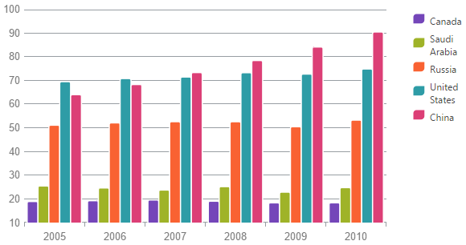
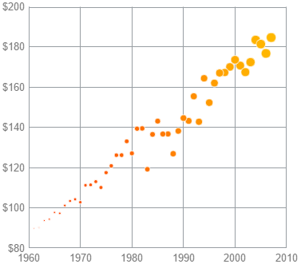
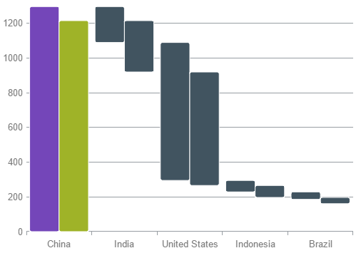
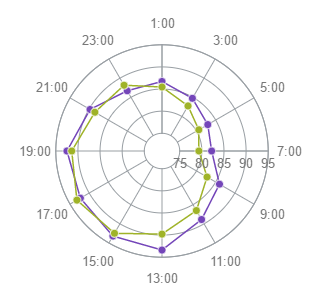
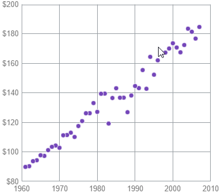
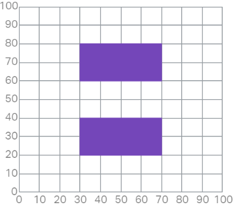

---
title: "シリーズ タイプ (igDataChart)"
slug: igdatachart-series-types
---

# シリーズ タイプ (igDataChart)

##トピックの概要

### 目的

このトピックでは、`igDataChart`™ コントロールが生成できるチャート シリーズの種類を概念的に説明します。

### 必要な背景

このトピックを理解するためには、以下のトピックを理解しておく必要があります。

-	[igDataChart の概要](/igdatachart-overview)

このトピックでは、`igDataChart` コントロールについての概念情報を提供します。これには、その主な機能、チャートとユーザー機能を使用するための最低要件が含まれます。

#### このトピックの構成

このトピックは、以下のセクションで構成されます。

-   [チャート シリーズの種類](#chart-series-types)
   -   [サポートされるチャート タイプの概要](#supported-chart-types)
    -   [サポートされるチャート タイプの表](#supported-chart-types-table)
    -   [棒と柱のシリーズ](#bars-and-columns)
    -   [バブル シリーズ](#bubble)
    -   [カテゴリー シリーズ](#category-series)
    -   [財務シリーズ](#financial-series)
    -   [極座標シリーズ](#polar-series)
    -   [レーダー シリーズ](#radial-series)
    -   [範囲カテゴリ シリーズ](#range-series)
    -   [散布シリーズ](#scatter-series)
-   [複合チャート](#composite)
-   [関連コンテンツ](#related-content)
  -   [トピック](#topics)
    -   [サンプル](#samples)

##チャート シリーズの種類

### サポートされるチャート タイプの概要

`igDataChart` コントロールは、さまざまな可視化の目的に対して導入されるいろいろなシリーズ タイプを可能にします。

サポートされるシリーズ タイプと基本の構成情報に関する詳細な情報については次のブロックをご覧ください。

>**注:** 円グラフは別の `igPieChart` コントロールで作成されます。詳細は [igPieChart の概要](/igbulletgraph-overview)をご覧ください。

### サポートされるチャート タイプの表

| チャート タイプ | シリーズ タイプ | 説明 | `Series.type` プロパティの設定 | データ バインディング プロパティ |
| --- | --- | --- | --- | --- |
| [棒と柱状](#bars-and-columns) | 棒 | 分類されたデータを水平の棒で可視化します。 | `bar` | [valueMemberPath](environment:jQueryApiUrl/ui.igDataChart#options:series.valueMemberPath) |
|  | 柱状 | 分類されたデータを垂直の柱で可視化します。 | `column` | [valueMemberPath](environment:jQueryApiUrl/ui.igDataChart#options:series.valueMemberPath) |
|  | 積層型棒 | 分類されたデータを水平に積層型のセグメントを含む水平棒で可視化します。 | `stackedBar` | [valueMemberPath](environment:jQueryApiUrl/ui.igDataChart#options:series.valueMemberPath) |
|  | 積層型 100 棒 | 分類されたデータをパーセント値に正規化される水平に積層型のセグメントを含む水平棒で可視化します。 | `stacked100Bar` | [valueMemberPath](environment:jQueryApiUrl/ui.igDataChart#options:series.valueMemberPath) |
|  | 積層型柱状 | 分類されたデータを垂直に積層型の柱で可視化します。 | `stackedColumn` | [valueMemberPath](environment:jQueryApiUrl/ui.igDataChart#options:series.valueMemberPath) |
|  | 積層型 100 柱状 | 分類されたデータをパーセント値に正規化される垂直に積層型の柱で可視化します。 | `stacked100Column` | [valueMemberPath](environment:jQueryApiUrl/ui.igDataChart#options:series.valueMemberPath) |
| [バブル](#bubble) | バブル | 複数のパラメータで記述されたデータを異なる直径の色づけされた円で可視化します。 | `bubble` | [xMemberPath](environment:jQueryApiUrl/ui.igDataChart#options:series.xMemberPath) [yMemberPath](environment:jQueryApiUrl/ui.igDataChart#options:series.yMemberPath) [radiusMemberPath](environment:jQueryApiUrl/ui.igDataChart#options:series.radiusMemberPath) [fillMemberPath](environment:jQueryApiUrl/ui.igDataChart#options:series.fillMemberPath) [labelMemberPath](environment:jQueryApiUrl/ui.igDataChart#options:series.labelMemberPath) |
| [カテゴリ](#category-series) | 折れ線 | 分類されたデータをデータ ポイントに鋭い角をもつ線で可視化します。 | `line` | [valueMemberPath](environment:jQueryApiUrl/ui.igDataChart#options:series.valueMemberPath) |
|  | エリア チャート | 分類されたデータをデータ ポイントに鋭い角をもつ線の下の色づけされた領域で可視化します。 | `area` | [valueMemberPath](environment:jQueryApiUrl/ui.igDataChart#options:series.valueMemberPath) |
|  | スプライン | 分類されたデータをデータ ポイント上のなめらかな角をもつ線で可視化します。 | `spline` | [valueMemberPath](environment:jQueryApiUrl/ui.igDataChart#options:series.valueMemberPath) |
|  | スプライン エリア チャート | 分類されたデータをデータ ポイントになめらかな角をもつ線の下の色づけされた領域で可視化します。 | `splineArea` | [valueMemberPath](environment:jQueryApiUrl/ui.igDataChart#options:series.valueMemberPath) |
|  | ウォーターフォール | 分類されたデータを垂直の柱で可視化し、先頭のカテゴリーに対応する先頭の柱は x 軸から始まり、続くカテゴリーはそれぞれ前のカテゴリーが終わったとこから始まります。 | `waterfall` | [valueMemberPath](environment:jQueryApiUrl/ui.igDataChart#options:series.valueMemberPath) |
|  | ポイント | 分類されたデータを別々にプロットされるポイント マーカーで可視化します。 | `point` | [valueMemberPath](environment:jQueryApiUrl/ui.igDataChart#options:series.valueMemberPath) |
|  | 積層型エリア | 分類されたデータをデータ ポイントに鋭い角をもつ線の下の積層型の色づけされた領域で可視化します。 | `stackedArea` | [valueMemberPath](environment:jQueryApiUrl/ui.igDataChart#options:series.valueMemberPath) |
|  | 積層型折れ線 | 分類されたデータをデータ ポイントに鋭い角をもつ積層型の線で可視化します。 | `stackedLine` | [valueMemberPath](environment:jQueryApiUrl/ui.igDataChart#options:series.valueMemberPath) |
|  | 積層型スプライン | 分類されたデータをデータ ポイント上のスムーズな角をもつ線で可視化します。 | `stackedSpline` | [valueMemberPath](environment:jQueryApiUrl/ui.igDataChart#options:series.valueMemberPath) |
|  | 積層型スプライン エリア | 分類されたデータをデータ ポイントにスムーズな角をもつ線の下の積層型の色づけされた領域で可視化します。 | `stacked100Bar` | [valueMemberPath](environment:jQueryApiUrl/ui.igDataChart#options:series.valueMemberPath) |
|  | 積層型 100 エリア | 分類されたデータを値がパーセンテージに正規化されるデータ ポイントに鋭い角をもつ線の下の積層型の色づけされた領域で可視化します。 | `stacked100Area` | [valueMemberPath](environment:jQueryApiUrl/ui.igDataChart#options:series.valueMemberPath) |
|  | 積層型 100 折れ線 | 分類されたデータを値がパーセンテージに正規化されるデータ ポイントに鋭い角をもつ積層型の線で可視化します。 | `stacked100Line` | [valueMemberPath](environment:jQueryApiUrl/ui.igDataChart#options:series.valueMemberPath) |
|  | 積層型 100 スプライン | 分類されたデータを値がパーセンテージに正規化されるデータ ポイントにスムーズな角をもつ積層型の線で可視化します。 | `stacked100Spline` | [valueMemberPath](environment:jQueryApiUrl/ui.igDataChart#options:series.valueMemberPath) |
|  | 積層型 100 スプライン エリア | 分類されたデータを値がパーセンテージに正規化されるデータ ポイントにスムーズな角をもつ線の下の積層型の色づけされた領域で可視化します。 | `stacked100SplineArea` | [valueMemberPath](environment:jQueryApiUrl/ui.igDataChart#options:series.valueMemberPath) |
| [財務](#financial-series) | ロウソク足チャート | ロウソク足の形で財務 (投資) 指標の始値、終値、安値、高値を表示します。 | `candlestick` | [openMemberPath](environment:jQueryApiUrl/ui.igDataChart#options:series.openMemberPath) [closeMemberPath](environment:jQueryApiUrl/ui.igDataChart#options:series.closeMemberPath) [highMemberPath](environment:jQueryApiUrl/ui.igDataChart#options:series.highMemberPath) [lowMemberPath](environment:jQueryApiUrl/ui.igDataChart#options:series.lowMemberPath) |
|  | OHLC チャート | Open、High、Low、Close の略開始と終わりの値のマーキングをもつ垂直線の形で財務 (投資) 指標の始値、終値、安値、高値を表示します。 | `ohlc` | [openMemberPath](environment:jQueryApiUrl/ui.igDataChart#options:series.openMemberPath) [closeMemberPath](environment:jQueryApiUrl/ui.igDataChart#options:series.closeMemberPath) [highMemberPath](environment:jQueryApiUrl/ui.igDataChart#options:series.highMemberPath) [lowMemberPath](environment:jQueryApiUrl/ui.igDataChart#options:series.lowMemberPath) |
| [極座標](#polar-series) | 極座標散布図 | 極座標系でドット (またはその他のマーカー) によるデータの可視化を行います。 | `polarScatter` | [angleMemberPath](environment:jQueryApiUrl/ui.igDataChart#options:series.angleMemberPath) [radiusMemberPath](environment:jQueryApiUrl/ui.igDataChart#options:series.radiusMemberPath) |
|  | 極座標折れ線チャート | 極座標系でデータ ポイントを直線で結んだ線によりデータを可視化します。 | `polarLine` | [angleMemberPath](environment:jQueryApiUrl/ui.igDataChart#options:series.angleMemberPath) [radiusMemberPath](environment:jQueryApiUrl/ui.igDataChart#options:series.radiusMemberPath) |
|  | 極座標エリア チャート | 極座標系でデータ ポイントを直線で結んだ線の下の色づけされた領域でデータを可視化します。 | `polarArea` | [angleMemberPath](environment:jQueryApiUrl/ui.igDataChart#options:series.angleMemberPath) [radiusMemberPath](environment:jQueryApiUrl/ui.igDataChart#options:series.radiusMemberPath) |
|  | 極座標スプライン | 極座標系でデータ ポイントの間にベジエ曲線のトランジションを表示するスプラインによりデータを可視化します。 | `polarSpline` | [angleMemberPath](environment:jQueryApiUrl/ui.igDataChart#options:series.angleMemberPath) [radiusMemberPath](environment:jQueryApiUrl/ui.igDataChart#options:series.radiusMemberPath) |
|  | 極座標スプライン エリア | 極座標系でデータ ポイントの間にベジエ曲線のトランジションを表示するスプラインの下の色づけされた領域によりデータを可視化します。 | `polarSplineArea` | [angleMemberPath](environment:jQueryApiUrl/ui.igDataChart#options:series.angleMemberPath) [radiusMemberPath](environment:jQueryApiUrl/ui.igDataChart#options:series.radiusMemberPath) |
| [ラジアル](#radial-series) | ラジアル折れ線チャート | カテゴリー化されたデータをデータ ポイントを直線で結んだ線により可視化し、すべてのカテゴリーを円内に配置します。 | `radialLine` | [valueMemberPath](environment:jQueryApiUrl/ui.igDataChart#options:series.valueMemberPath) |
|  | ラジアル柱状チャート | カテゴリー化されたデータを共通の中心から異なる角度で伸ばした柱で可視化します。 | `radialColumn` | [valueMemberPath](environment:jQueryApiUrl/ui.igDataChart#options:series.valueMemberPath) |
|  | ラジアル円チャート | カテゴリー化されたデータを共通の中心から異なる角度で伸ばしたパイのスライス型要素で可視化します。 | `radialPie` | [valueMemberPath](environment:jQueryApiUrl/ui.igDataChart#options:series.valueMemberPath) |
|  | ラジアル エリア | 分類されたデータをデータ ポイントを直線で結んだ線の下に色付きの領域により可視化し、すべてのカテゴリーを円内に配置します。 | `radialArea` | [valueMemberPath](environment:jQueryApiUrl/ui.igDataChart#options:series.valueMemberPath) |
| [範囲カテゴリ](#range-series) | 範囲エリア チャート | 2 つの値の間の範囲内にある分類されたデータをデータ ポイントを 2 本の直線で結び、間の領域を色づけして可視化します。 | `rangeArea` | [lowMemberPath](environment:jQueryApiUrl/ui.igDataChart#options:series.lowMemberPath) [highMemberPath](environment:jQueryApiUrl/ui.igDataChart#options:series.highMemberPath) |
|  | 範囲柱状チャート | 2 つの値の間の範囲内にある分類されたデータを柱で可視化します。 | `rangeColumn` | [lowMemberPath](environment:jQueryApiUrl/ui.igDataChart#options:series.lowMemberPath) [highMemberPath](environment:jQueryApiUrl/ui.igDataChart#options:series.highMemberPath) |
| [散布図](#scatter-series) | 散布図 | データをデカルト座標系上のドットで可視化します。 | `scatter` | [xMemberPath](environment:jQueryApiUrl/ui.igDataChart#options:series.xMemberPath) [yMemberPath](environment:jQueryApiUrl/ui.igDataChart#options:series.yMemberPath) |
|  | 散布図 - 折れ線 | デカルト座標系でデータ ポイントを直線で結んだ線によりデータを可視化します。 | `scatterLine` | [xMemberPath](environment:jQueryApiUrl/ui.igDataChart#options:series.xMemberPath) [yMemberPath](environment:jQueryApiUrl/ui.igDataChart#options:series.yMemberPath) |
|  | 散布図 - スプライン | デカルト座標系でデータ ポイントの間にベジエ曲線のトランジションを表示するスプラインによりデータを可視化します。 | `scatterSpline` | [xMemberPath](environment:jQueryApiUrl/ui.igDataChart#options:series.xMemberPath) [yMemberPath](environment:jQueryApiUrl/ui.igDataChart#options:series.yMemberPath) |
|  | 散布エリア | デカルト座標システムの X+Y+Value ポイントの三角測量に基づいて、データを色付きの 2D サーフェスとして視覚化します。 | `scatterArea` | [xMemberPath](environment:jQueryApiUrl/ui.igDataChart#options:series.xMemberPath) [yMemberPath](environment:jQueryApiUrl/ui.igDataChart#options:series.yMemberPath) [colorMemberPath](environment:jQueryApiUrl/ui.igDataChart#options:series.colorMemberPath) |
|  | 散布等高線 | デカルト座標システムの X+Y+Value ポイントの三角測量に基づいて、データを等高線として視覚化します。 | `scatterContour` | [xMemberPath](environment:jQueryApiUrl/ui.igDataChart#options:series.xMemberPath) [yMemberPath](environment:jQueryApiUrl/ui.igDataChart#options:series.yMemberPath) [valueMemberPath](environment:jQueryApiUrl/ui.igDataChart#options:series.valueMemberPath) |
|  | 散布多角形 | デカルト座標システムで、データを多角形のシリーズとして視覚化します。 | `scatterPolygon` | [shapeMemberPath](environment:jQueryApiUrl/ui.igDataChart#options:series.shapeMemberPath) |
|  | 散布ポリライン | デカルト座標システムで、データをポリラインのシリーズとして視覚化します。 | `scatterPolyline` | [shapeMemberPath](environment:jQueryApiUrl/ui.igDataChart#options:series.shapeMemberPath) |

### 棒と柱のシリーズ

棒チャートと柱チャートは、可視化される値に大きさが対応する塗りつぶしされた四角形でデータを可視化します。

技術的には棒チャートと柱チャートは同じですが、棒チャートは棒が水平に伸び、柱チャートは棒が垂直に伸びます。

棒チャートは、離散型のカテゴリー軸値に対して分離されたデータ関数を表示するのに使用されます。たとえば、以下の図は異なる地理的領域 (離散型のカテゴリー軸値) での 3 つのメーカー (個別の関数、つまりメーカー 1 社の販売が関数の領域) の自動車販売数を棒チャートで示したものです。

### バブル シリーズ

バブル チャートは、4 つの独立した数値パラメータをもつデータ要素を塗りつぶされた (通常は) 円で表現します。

それぞれの円の座標は各要素の通常の x-y 座標パラメータです。バブルの半径は 3 番目のパラメータを表します。バブルの一部を別の色で塗りつぶすことにより、データをシリーズの 4 番目のパラメータを表すことができます。4 番目のパラメータは必須ではなく、これを使用しない場合はすべてのバブルが同じ色で塗られます。5 つ目のパラメータを追加して、それぞれのデータ ポイントに対するラベルとして使用できます。

### カテゴリー シリーズ

カテゴリー シリーズ チャートは、データの相異なるカテゴリーの軸値をプロットすることができる `igDataChart` コントロールに対する シリーズ タイプの一群です。タイプとしては、領域、柱、線、スプライン、スプライン領域、ステップ領域、ステップ ライン、ウォーターフォールなどがあります。詳細については、カテゴリー シリーズ チャートに関するトピックを参照してください。

次に挙げたものはウォーターフォール チャートの例です。

### 財務シリーズ

財務チャート (ロウソク足とも呼ばれます) は、さらに多くの変数を表現することができる棒チャートの変形版です。

これは主に、一定期間での特定の商品や為替、株価の始値、終値、安値、高値を表します。各「ローソク」は、特定の時間範囲 (たとえば、日) を表し、ローソクの最下部が安値、最高部が高値で、棒の下部と上部が終値と始値をそれぞれ表します。

通常、このチャートはデータ シリーズに何らかの数学的演算を施してデータの近似や推定を計算することで得られるトレンドラインと組み合わされます。たとえば、平均、二次方程式、対数関数などです。

### 極座標シリーズ

極散布図は極座標でプロットされるもので、1 番目の座標は角度 (度、ラジアン) で、2 番目は中心からの距離 (半径) を使って表現されます。このチャートは連結されていない離散型ポイントを表示し、ポイントがチャート上の特定部分に集まった状態の「密度」を調べるのに有効です (たとえば、測定サンプル)。

目的に応じて、極線や領域をプロットすることもできます。

### レーダー シリーズ

レーダー図は極散布図と似ていますが、こちらはカテゴリー タイプのシリーズです。つまり、角度座標がない代わりにデータは円全体に均一に拡がるカテゴリーに分割されます。中心からの距離が可視化された値を表現します。

これは通常、小さなデータ集合を可視化し、ひとつのオブジェクトに対する複数の側面を量的に比較するのに用いられます。たとえば、敏捷さ、速さ、効果など、スポーツにおける選手の統計情報用に使われます。

### 範囲カテゴリ シリーズ

範囲カテゴリ チャートは、特定のカテゴリに合致する 2 つの値の間での拡がりを示すのに使われます。このチャートをプロットするために使われる変数は、カテゴリー座標で、そのカテゴリーに対する同じ測定単位の 2 つ値です。

このチャートは株式市場のトレーダーによって考案されたもので、主にその業界で使われます。具体的な機能としては、このチャートは時間ではなく*動き*を基本としたものです。つまり、カテゴリー (x) 軸の 2 つの異なる値は 2 つの異なる動きを表し、取引間の変化が追跡されます。

`igDataChart` を使用して、範囲領域チャートと範囲棒チャートを実現できます。上のサンプル チャートは範囲領域チャートです。

### 散布シリーズ

散布図は直交座標系に個々のポイントを示すもので、XY チャートとも呼ばれます。離散型のポイントをプロットすることも、ポイント間を線でつなぐこともできます。

散布図は、2 つの変数が関係する科学的な測定やその他のデータ収集に使われ、測定の特定の分野での標本の密度をわかりやすく示すことができ、データの分布についてトレンドを示すこともできます。

`scatterPolygon` および `scatterPolyline` の散布タイプは他のタイプとは異なるデータ表示を使用します。このタイプでは、ポイントのコレクションが 2 次元の図形として描画されます。各ポイントはその図形の 1 つの角または頂点を構成します。たとえば、矩形は各角を表す 4 つのポイントで定義されます。`scatterPolygon` 型は塗りつぶされた図形を表示し、`scatterPolyline` 型はポイント コレクションを各ポイントを接続する線分として表示します。

##　複合チャート

### 複合チャートの概要

複合チャートは、異なる軸範囲を使用するかまたはグラフの 2 つの異なるタイプによって可視化されるかのいずれかによって 2 つのデータ シリーズをプロットします。これはたとえば、1 つの関数が 1 と 100 の間をとり、他方が 5 から 500 までをとる、あるいは対数目盛、または1 つの関数が棒で他方が線で示されるというような形です。

このサンプルでは、別の範囲を持つ 2 つの Y 軸と柱状シリーズと折れ線シリーズの 2 つのデータ シリーズ タイプを含む複合チャートを構成する方法を紹介します。

複合チャートをつくるための特定の設定はなく、異なるシリーズ タイプと複数の軸を組み合わせます。

   [複合チャート](&#123;environment:SamplesEmbedUrl&#125;/data-chart/composite-chart)
   

##関連コンテンツ

### トピック

このトピックの追加情報については、以下のトピックも合わせてご参照ください。

-	[igDataChart の追加](/igdatachart-adding): このトピックでは、igDataChart コントロールを Web ページに追加し、データにバインドする方法を紹介します。

-	[jQuery および MVC API リファレンス リンク (igDataChart)](/igdatachart-api-links): このトピックでは、 `igDataChart` の jQuery および ASP.NET MVC ヘルパー クラスの API ドキュメントへのリンクを提供します。

### サンプル

このトピックについては、以下のサンプルも参照してください。

-	[棒および柱状シリーズ](&#123;environment:SamplesUrl&#125;/data-chart/bar-and-column-series): このサンプルは棒シリーズ チャートと柱状シリーズ チャートの作成を例示します。

-	[カテゴリ シリーズ](&#123;environment:SamplesUrl&#125;/data-chart/category-series): このサンプルはカテゴリー シリーズ チャートの作成を例示します。

-	[複合チャート](&#123;environment:SamplesUrl&#125;/data-chart/composite-chart): このサンプルは複合チャートの作成を例示します。

-	[財務シリーズ](&#123;environment:SamplesUrl&#125;/data-chart/financial-series): このサンプルは財務 (「ローソク足」) チャートの作成を例示します。

-	[極座標シリーズ](&#123;environment:SamplesUrl&#125;/data-chart/polar-series): このサンプルは極座標チャートの作成を例示します。

-	[ラジアル シリーズ](&#123;environment:SamplesUrl&#125;/data-chart/radial-series): このサンプルはレーダー チャートの作成を例示します。

-	[範囲カテゴリ シリーズ](&#123;environment:SamplesUrl&#125;/data-chart/range-category-series): このサンプルはカテゴリー チャートの作成を例示します。

-	[散布図シリーズ](&#123;environment:SamplesUrl&#125;/data-chart/scatter-series): このサンプルは散布部 (XY シリーズ) チャートの作成を例示します。

-	[積層シリーズ](&#123;environment:SamplesUrl&#125;/data-chart/stacked-series): このサンプルは積層シリーズ チャート (XY チャート) の作成を例示します。

 

 

