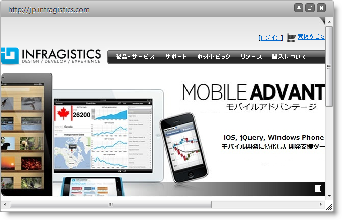

import ApiLink from 'docs-template/components/mdx/ApiLink.astro';

# igDialog 外部ページ

## トピックの概要

## 目的

このトピックは、外部ページを `igDialog`™ コントロールに読み込む方法を紹介します。

### 前提条件

このトピックを理解するために、以下のトピックを参照することをお勧めします。

- [***igDialog* の概要**](../00_igDialog Overview.mdx): このトピックでは、`igDialog` コントロールの主な機能を紹介します。

- [***igDialog*** の追加](../01_Adding igDialog.mdx): このトピックでは、`igDialog` コントロールを Web ページに追加する方法について説明します。


### このトピックの内容

このトピックは、以下のセクションで構成されます。

-   [**外部ページを使用した igDialog の構成**](#configuring)
	-   [概要](#overview)
    -   [プロパティの設定](#property-settings)
    -   [例](#example)
-   [**関連コンテンツ**](#related-content)
    -   [トピック](#topics)
    -   [サンプル](#samples)


## 外部ページを使用した igDialog の構成

### 概要

`igDialog` を使用して、一連の HTML 要素だけでなくページ全体を読み込むことができます。おわかりのように、`igDialog` を HTML `DIV` 要素に適用でき、その `DIV` 内のコンテンツはダイアログ ウィンドウのコンテンツになります。これは `igDialog` が外部ページを読み込むときと似ています。違いは HTML コンテナーが `IFRAME` 要素でなければならないという点です。`IFRAME` のコンテンツ ページは `igDialog` のコンテンツになります。

**HTML の場合:**


```html
<iframe id="dialog" src="http://www.infragistics.com/” frameborder="0"></iframe>
```

### プロパティの設定

外部ページを `igDialog` に読み込むには、前のパラグラフのコードで十分です。次の `igDialog` プロパティのみお勧めしています。それらのプロパティによりウィンドウがユーザー フレンドリになります。

以下の表では、目的のプロパティ設定をマップしています。

目的:|使用するプロパティ:|設定の選択肢:
--- | --- | ---
サイトのヘッダー テキスト - タイトルを表示する|<ApiLink type="igDialog" member="headerText" section="options" label="headerText" />|Infragistics
`igDialog` を最大化できるようにする|<ApiLink type="igDialog" member="showMaximizeButton" section="options" label="showMaximizeButton" /> |true
一時 `IFRAME` URL ソースを設定する|<ApiLink type="igDialog" member="temporaryUrl" section="options" label="temporaryUrl" /> |Infragistics.com


> **注:** <ApiLink type="igDialog" member="temporaryUrl" section="options" label="temporaryUrl" /> プロパティを使用しなければならないわけではありませんが、使用すると例外を回避できます。外部ページの `igDialog` を作成すると、ターゲット要素がその元のコンテナーから削除され、動的に作成されたメイン要素に挿入されます。`IFRAME` 要素にソースとして一時 URL がない場合、これにより例外が発生する場合があります。外部ページの読み込み中にエラーが表示された場合、`IFRAME` 要素の非永続的なソースを設定する <ApiLink type="igDialog" member="temporaryUrl" section="options" label="temporaryUrl" /> プロパティを使用できます。

### 例

以下のスクリーンショットは、上記の設定の結果として、`igDialog` は外部のページを読み込む方法を紹介しています。




## 関連コンテンツ

### トピック

このトピックの追加情報については、以下のトピックも合わせてご参照ください。

- [***igDialog* の概要**](../00_igDialog Overview.mdx): このトピックでは、`igDialog` コントロールの主な機能を紹介します。

- [***igDialog*** の追加](../01_Adding igDialog.mdx): このトピックでは、`igDialog` コントロールを Web ページに追加する方法について説明します。


### サンプル

このトピックについては、以下のサンプルも参照してください。

- [外部ページの読み込み](&#123;environment:SamplesUrl&#125;/dialog-window/loading-external-page): このサンプルでは、URL から外部のコンテンツを読み込む方法を紹介します。


 

 


