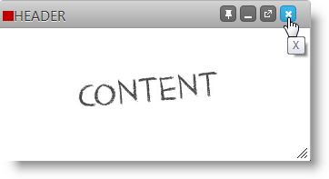
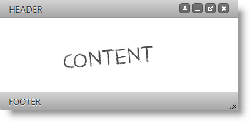

import ApiLink from 'docs-template/components/mdx/ApiLink.astro';

# igDialog  のヘッダーとフッター

## トピックの概要

### 目的

このトピックでは、`igDialog`™ のフッターとヘッダーを有効にする方法、およびそれらをカスタマイズする方法を示しています。

### 前提条件

このトピックを理解するために、以下のトピックを参照することをお勧めします。

- [***igDialog* の概要**](../00_igDialog Overview.mdx): このトピックでは、`igDialog` コントロールの主な機能を紹介します。

- [***igDialog*** の追加](../01_Adding igDialog.mdx): このトピックでは、`igDialog` コントロールを Web ページに追加する方法について説明します。

### このトピックの内容

このトピックは、以下のセクションで構成されます。

-   [**コントロールの構成の概要**](#configuration-summary)
-   [**igDialog ヘッダーの有効化と構成**](#header)
    -   [プロパティの設定](#header-property-settings)
    -   [例](#header-example)
-   [**igDialog フッターの有効化と構成**](#footer)
    -   [プロパティの設定](#footer-property-settings)
    -   [例](#footer-example)
-   [**関連コンテンツ**](#related-content)
    -   [トピック](#topics)
    -   [サンプル](#samples)

##  コントロールの構成の概要

以下の表は、`igDialog` の*ヘッダーおよびフッター* コントロールの構成可能な要素を示しています。このメソッドについては、表の下にある解説も参照してください。

|  |  |  |
| --- | --- | --- |
| 構成可能な要素 | 詳細 | プロパティ |
| `igDialog` ヘッダーの有効化と構成 | `igDialog` を有効にし、その要素のカスタマイズを可能にするために構成する必要があるプロパティ。 | <ApiLink type="igDialog" member="showHeader" section="options" label="showHeader" /> <ApiLink type="igDialog" member="headerText" section="options" label="headerText" /> <ApiLink type="igDialog" member="locale.closeButtonTitle" section="options" label="closeButtonTitle" /> <ApiLink type="igDialog" member="locale.minimizeButtonTitle" section="options" label="minimizeButtonTitle" /> <ApiLink type="igDialog" member="locale.maximizeButtonTitle" section="options" label="maximizeButtonTitle" /> <ApiLink type="igDialog" member="locale.pinButtonTitle" section="options" label="pinButtonTitle" /> <ApiLink type="igDialog" member="locale.unpinButtonTitle" section="options" label="unpinButtonTitle" /> <ApiLink type="igDialog" member="locale.restoreButtonTitle" section="options" label="restoreButtonTitle" /> <ApiLink type="igDialog" member="imageClass" section="options" label="imageClass" /> |
| `igDialog` フッターの有効化と構成 | `igDialog` を有効にし、その要素のカスタマイズを可能にするために構成する必要があるプロパティ。 | <ApiLink type="igDialog" member="showFooter" section="options" label="showFooter" /> <ApiLink type="igDialog" member="footerText" section="options" label="footerText" /> |

ヘッダー ボタンを有効/無効にする方法については、[**最小化/最大化および固定**](./01_igDialog Maximize and Minimize.mdx)トピックを参照してください。

##  igDialog ヘッダーの有効化と構成

`igDialog` API は、そのヘッダーを修正するための、いくつかの API プロパティを提案します。

###  プロパティの設定

以下の表では、目的のヘッダーをプロパティ設定にマップしています。

目的:|使用するプロパティ:|設定の選択肢:
--- | --- | ---
igDialog ヘッダーを表示します|<ApiLink type="igDialog" member="showHeader" section="options" label="showHeader" /> |true
igDialog ヘッダーのタイトルを設定します|<ApiLink type="igDialog" member="headerText" section="options" label="headerText" /> |“HEADER”
igDialog ヘッダーの画像を設定します|<ApiLink type="igDialog" member="imageClass" section="options" label="imageClass" /> |clsImage
igDialog ヘッダーの閉じるボタンを設定します|<ApiLink type="igDialog" member="locale.closeButtonTitle" section="options" label="closeButtonTitle" /> |“X”
igDialog の最小化ボタンのタイトルを設定します|<ApiLink type="igDialog" member="locale.minimizeButtonTitle" section="options" label="minimizeButtonTitle" /> |“MIN”
igDialog の最大化ボタンのタイトルを設定します|<ApiLink type="igDialog" member="locale.maximizeButtonTitle" section="options" label="maximizeButtonTitle" /> |“MAX”
igDialog の固定ボタンのタイトルを設定します|<ApiLink type="igDialog" member="locale.pinButtonTitle" section="options" label="pinButtonTitle" /> |“PIN”
igDialog の固定解除ボタンのタイトルを設定します|<ApiLink type="igDialog" member="locale.unpinButtonTitle" section="options" label="unpinButtonTitle" /> |“UNPIN”
igDialog の復元ボタンのタイトルを設定します|<ApiLink type="igDialog" member="locale.restoreButtonTitle" section="options" label="restoreButtonTitle" /> |“RESTORE”

###  例

下のスクリーンショットは、上記の設定を行った場合に表示される `igDialog` です。

> **注:**CSS で定義される `clsImage` のため、赤い四角形が上部にあります。
> `.clsImage { background-color: red; width: 5px; height: 5px; }`

##  igDialog フッターの有効化と構成

`igDialog` API は、そのフッターを修正するための、2 つの API プロパティを提案します。

###  プロパティの設定

以下の表は、目的のヘッダー機能とプロパティ設定の対応表です。

目的:|使用するプロパティ:|設定の選択肢:
--- | --- | ---
`igDialog` フッターを表示します|<ApiLink type="igDialog" member="showFooter" section="options" label="showFooter" /> |true
`igDialog` フッター タイトルを設定する|<ApiLink type="igDialog" member="footerText" section="options" label="footerText" /> |“FOOTER”

###  例

以下のスクリーンショットは、上の設定、および前の項でのヘッダー設定の結果、`igDialog` がどのように表示されるかを示しています。

##  関連コンテンツ

###  トピック

このトピックの追加情報については、以下のトピックも合わせてご参照ください。

- [***igDialog* の概要**](../00_igDialog Overview.mdx): このトピックでは、`igDialog` コントロールの主な機能を紹介します。

- [***igDialog*** の追加](../01_Adding igDialog.mdx): このトピックでは、`igDialog` コントロールを Web ページに追加する方法について説明します。

###  サンプル

このトピックについては、以下のサンプルも参照してください。

- [アイコン](&#123;environment:SamplesUrl&#125;/dialog-window/icons): `igDialog` のアイコンの表示方法を示すサンプル。

 

 

