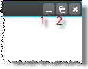
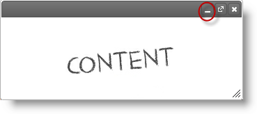
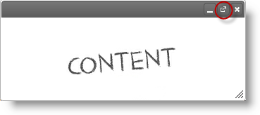

---
title: "igDialog の最大化と最小化"
slug: igdialog-maximize-and-minimize
---

# igDialog の最大化と最小化

## トピックの概要

### 目的

このトピックでは、`igDialog` を最小化および最大化できるように構成する方法、およびこれらのアクションの実行方法を示します。

### 前提条件

このトピックを理解するために、以下のトピックを参照することをお勧めします。

- [***igDialog* の概要**](../00_igDialog Overview.mdx): このトピックでは `igDialog` コントロールの主な機能を紹介します。

- [***igDialog*** の追加](../01_Adding igDialog.mdx): このトピックでは、`igDialog` コントロールを Web ページに追加する方法について説明します。


### このトピックの内容

このトピックは、以下のセクションで構成されます。

-   [**コントロールの状態**](#control-states)
	-   [状態](#states)
    -   [通常状態でのプレビュー](#normal-state)
    -   [最大化された状態でのプレビュー](#maximized-state)
    -   [最小化された状態でのプレビュー](#minimized-state)
-   [**コントロールの構成の概要**](#configuration-summary)
-   [**最小化と最大化アイコンの構成**](#minimize-maximize)
    -   [プロパティの設定](#minimize-maximize-properties)
    -   [例](#minimize-maximize-example)
-   [**ダブル マウス クリック時に最大化と最小化**](#double-click)
	-[プロパティ設定](#property-settings)   
-   [**igDialog の最小化**](#minimize)
    -   [コード](#minimize-code)
    -   [例](#minimize-example)
-   [**igDialog の最大化**](#maximize)
    -   [コード](#maximize-code)
    -   [例](#maximize-example)
-   [**関連コンテンツ**](#related-content)
    -   [トピック](#topics)
    -   [サンプル](#samples)


## <a id="control-states"></a> コントロールの状態

### <a id="states"></a> 状態

すでにご存知のように、`igDialog` にはオープン、クローズ、最小化、最大化の 4 つの状態があります。このトピックの中で最大化と最小化について話すとき、「開いた状態」を通常の状態とします。これはウィンドウが最小化も最大化もされていない場合の状態です。

以下の表では、コントロールの可能性のあるすべての状態をまとめていす。さらなる詳細については、以下のセクションをご覧ください。

状態|説明 
--- | --- 
標準|これはウィンドウが最小化も最大化もされていない場合の状態です。
最小化|この状態では、`igDialog` は最小化されています。
最大化|この状態では、`igDialog` は最大化されています。

### <a id="normal-state"></a> 通常状態でのプレビュー

以下の画像は、通常状態の `igDialog` を示しています。この状態のときは、ウィンドウのサイズ変更や移動が可能です。


上の画像のボタン:

1.  最小化ボタン
2.  最大化ボタン

### <a id="maximized-state"></a> 最大化された状態でのプレビュー

以下の画像は、最大化された状態の `igDialog` の一部を示しています。最大化された状態では、`igDialog` はその親の領域全体を占めます。この状態のときは、ウィンドウのサイズ変更や移動はできません。



上の画像のボタン:

1.  最小化ボタン
2.  復元ボタン

### <a id="minimized-state"></a> 最小化された状態でのプレビュー

以下の画像は、最小化された状態の `igDialog` を示しています。この状態のときは、ウィンドウのサイズ変更はできません。


上の画像のボタン:

1.  復元ボタン
2.  最大化ボタン


## <a id="configuration-summary"></a> コントロールの構成の概要

次の表は、 `igDialog` コントロールで構成可能な項目の一覧です。このメソッドについては、表の下にある解説も参照してください。


|  |  |  |
| --- | --- | --- |
| 構成可能な要素 | 詳細 | プロパティとメソッド |
| 最小化と最大化アイコンの構成 | コントロール UI を使用して、*igDialog*の最小化と最大化を可能にするように構成するために必要なプロパティ。 | [showMaximizeButton](environment:jQueryApiUrl/ui.igDialog#options:showMaximizeButton) [showMinimizeButton](environment:jQueryApiUrl/ui.igDialog#options:showMinimizeButton) |
| ダブル クリックで最大化と最小化 | ヘッダーがダブル クリックされたときに最大化または最小化するように、*igDialog* を構成するのを可能にするプロパティ。 | [enableDblclick](environment:jQueryApiUrl/ui.igDialog#options:enableDblclick) |
| *igDialog* の最大化 | 最大化を可能にする *igDialog* API からのメソッド 。 | [maximize()](environment:jQueryApiUrl/ui.igDialog#methods:maximize) |
| *igDialog* の最小化 | 最小化を可能にする *igDialog* API からのメソッド 。 | [minimize()](environment:jQueryApiUrl/ui.igDialog#methods:minimize) |


## <a id="minimize-maximize"></a> 最小化と最大化アイコンの構成

以下の表は、`igDialog` コントロールを最小化/最大化するために構成する必要があるプロパティを示しています。これらのプロパティを設定することによって、最大化と最小化ボタンが `igDialog` ヘッダーに現れます。

### <a id="minimize-maximize-properties"></a> プロパティの設定

以下の表では、目的の機能をプロパティ設定にマップしています。

目的:|使用するプロパティ:|設定の選択肢:
--- | --- | ---
最大化ボタンを表示|[showMaximizeButton ](&#123;environment:jQueryApiUrl&#125;/ui.igDialog#options:showMaximizeButton) |true
最小化ボタンを表示|[showMinimizeButton ](&#123;environment:jQueryApiUrl&#125;/ui.igDialog#options:showMinimizeButton) |true


### <a id="minimize-maximize-example"></a> 例

下のスクリーンショットは、上記の設定を行った場合に表示される `igDialog` です。


## <a id="double-click"></a> ダブル マウス クリック時に最大化と最小化

`igDialog` を構成すると、ヘッダーがダブル クリックされたときに反応することができます。そのときの状態に応じて最小化または最大化します。

### <a id="property-settings"></a> プロパティの設定

以下の表は、[`enableDblclick`](&#123;environment:jQueryApiUrl&#125;/ui.igDialog#options:enableDblclick) プロパティの値に従った、`igDialog` の動作を示しています。

値|使用するプロパティ:
--- | ---
true|ウィンドウが最小化されていた場合、その状態は通常になります。<br />ウィンドウが通常だった場合、その状態は最大化されます。<br />ウィンドウが最大化されていた場合、通常に戻ります。
false|`igDialog` はマウスのダブル クリックに反応しません。
“auto” | [`showMaximizeButton`](&#123;environment:jQueryApiUrl&#125;/ui.igDialog#options:showMaximizeButton) プロパティを true に設定した場合 (つまり `igDialog` ウィンドウに最大化ボタンがある)、コントロールは、[`enableDblclick`](&#123;environment:jQueryApiUrl&#125;/ui.igDialog#options:enableDblclick) の値が true に設定された場合と同じ様に反応します。<br />[`showMaximizeButton`](&#123;environment:jQueryApiUrl&#125;/ui.igDialog#options:showMaximizeButton) プロパティを false に設定した場合 (つまり `igDialog` ウィンドウに最大化ボタンがない)、コントロールはマウスのダブル クリックに影響を受けません。


## <a id="minimize"></a> igDialog の最小化

前の項での構成の結果として、ヘッダーの右上隅のボタンを使用して、ダイアログ ウィンドウを最小化できるようになります。[`showMinimizeButton`](&#123;environment:jQueryApiUrl&#125;/ui.igDialog#options:showMinimizeButton) オプションが無効になっている場合、その API を使用してコントロールを最小化できます。

### <a id="minimize-code"></a> コード

次のコードは、`igDialog` をその API を使用して閉じる方法を示したものです。

**JavaScript の場合:**

```js
$('#igDialog).igDialog("minimize");
```

### <a id="minimize-example"></a> 例

以下のスクリーンショットは、最小化ボタンの位置を示しています。




##  <a id="maximize"></a> igDialog の最大化

前の項での構成の結果として、ヘッダーの右上隅のボタンを使用して、またはダイアログ ヘッダーをダブル クリックすることによって、ダイアログ ウィンドウを最大化できるようになります。[`showMaximizeButton`](&#123;environment:jQueryApiUrl&#125;/ui.igDialog#options:showMaximizeButton) オプションが無効になっている場合、その API を使用してコントロールを最大化できます。

### <a id="maximize-code"></a> コード

次のコードは、`igDialog` をその API を使用して表示する方法を示したものです。

**JavaScript の場合:**

```js
$('#igDialog).igDialog("maximize");
```

### <a id="maximize-example"></a> 例

以下のスクリーンショットは、最大化ボタンの位置を示しています。




## <a id="related-content"></a> 関連コンテンツ

### <a id="topics"></a> トピック

このトピックの追加情報については、以下のトピックも合わせてご参照ください。

- [***igDialog* の概要**](../00_igDialog Overview.mdx): このトピックでは、`igDialog` コントロールの主な機能を紹介します。

- [*igDialog* の追加](../01_Adding igDialog.mdx): このトピックでは、`igDialog` コントロールを Web ページに追加する方法について説明します。


### <a id="samples"></a> サンプル

このトピックについては、以下のサンプルも参照してください。

- [アイコン](&#123;environment:SamplesUrl&#125;/dialog-window/icons): `igDialog` のアイコンの表示方法を示すサンプル。


 

 


