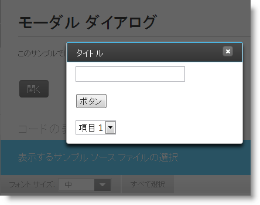

# igDialog モーダル状態

import ApiLink from 'docs-template/components/mdx/ApiLink.astro';

# igDialog モーダル状態

## トピックの概要

### 目的

このトピックでは、`igDialog`™ のモーダルの作成方法を示します。

### 前提条件

このトピックを理解するために、以下のトピックを参照することをお勧めします。

- [***igDialog* の概要**](../00_igDialog Overview.mdx): このトピックでは、`igDialog` コントロールの主な機能を紹介します。

- [***igDialog*** の追加](../01_Adding igDialog.mdx): このトピックでは、`igDialog` コントロールを Web ページに追加する方法について説明します。

### このトピックの内容

このトピックは、以下のセクションで構成されます。

-   [**概要**](#introduction)
-   [**コントロールの構成の概要**](#configuration-summary)
-   [**モーダル igDialog の構成**](#configuring)
    -   [プロパティの設定](#configuring-properties)
    -   [例](#configuring-example)
-   [**関連コンテンツ**](#related-content)
    -   [トピック](#topics)
    -   [サンプル](#samples)

##  モーダル igDialog とは

`igDialog` はモーダルに設定できます。その場合、背後のコンテンツはすべて無効で、非表示になります。モーダル ダイアログは複数表示できます。複数のモーダル ダイアログ インスタンスがあるとき、最後に開かれたダイアログがページの先頭になります。1 ページで複数のモーダル ダイアログを処理するときは、[複数のダイアログ](./07_igDialog Multiple Dialogs.mdx) トピックを参照してください。以下の例で示したのは、1 つのモーダル ダイアログの構成方法だけです。

> **注:** `igDialog` ウィンドウのモーダル状態は、最小化されているダイアログやピン留めされているダイアログではサポートしません。

##  コントロールの構成の概要

次の表は、 `igDialog` コントロールで構成可能な項目の一覧です。このメソッドについては、表の下にある解説も参照してください。

構成可能な要素|詳細|プロパティ
--- | --- | ---
モーダル `igDialog` の構成|`igDialog`モーダルの作成時に構成する必要のあるプロパティ。|<ApiLink type="igDialog" member="modal" section="options" label="modal" />

##  モーダル igDialog の構成

`igDialog` はモーダルに設定できます。その場合、背後のコンテンツはすべて無効で、非表示になります。

> **注:** `igDialog` ウィンドウのモーダル状態は、最小化されているダイアログやピン留めされているダイアログではサポートしません。

###  プロパティの設定

以下の表は、目的のヘッダー機能とプロパティ設定の対応表です。ダイアログの状態は最小化とピン留め以外とします。

目的:|使用するプロパティ:|設定の選択肢:
--- | --- | ---
igDialog モーダルにする|<ApiLink type="igDialog" member="modal" section="options" label="modal" />|true
igDialog フッター タイトルを設定する|<ApiLink type="igDialog" member="pinned" section="options" label="pinned" />|false
igDialog 状態を設定する|<ApiLink type="igDialog" member="state" section="options" label="state" />|opened

###  例

下のスクリーンショットは、上記の設定を行った場合に表示される `igDialog` です。

##  関連コンテンツ

###  トピック

このトピックの追加情報については、以下のトピックも合わせてご参照ください。

- [***igDialog* の概要**](../00_igDialog Overview.mdx): このトピックでは、`igDialog` コントロールの主な機能を紹介します。

- [*igDialog* の追加](../01_Adding igDialog.mdx): このトピックでは、`igDialog` コントロールを Web ページに追加する方法について説明します。

###  サンプル

このトピックについては、以下のサンプルも参照してください。

- [モーダル ダイアログ](\{environment:SamplesUrl\}/dialog-window/modal-dialog) : このサンプルでは、モーダル `igDialog` を作成する方法を紹介します。

 

 

