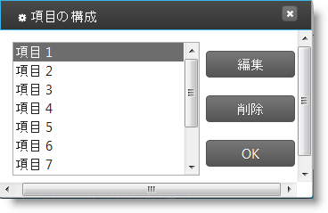

# igDialog の複数ダイアログ

import ApiLink from 'docs-template/components/mdx/ApiLink.astro';

# igDialog の複数ダイアログ

## トピックの概要

### 目的

このトピックでは、`igDialog`™ ウィンドウを次々に構築する方法を紹介します。

### 前提条件

このトピックを理解するために、以下のトピックを参照することをお勧めします。

- [***igDialog* の概要**](../00_igDialog Overview.mdx): このトピックでは、`igDialog` コントロールの主な機能を紹介します。

- [***igDialog*** の追加](../01_Adding igDialog.mdx): このトピックでは、`igDialog` コントロールを Web ページに追加する方法について説明します。


### このトピックの内容

このトピックは、以下のセクションで構成されます。

-   [**複数の igDialog の構成**](#configuring)
	-   [概要](#configuring-overview)
    -   [コード](#configuring-code)
    -   [例](#configuring-example)
-   [**複数の igDialog API**](#api)
    -   [メソッドの設定](#api-methods)
    -   [コード](#api-code)
-   [**関連コンテンツ**](#related-content)
    -   [トピック](#topics)
    -   [サンプル](#samples)


## <a id="configuring"></a> 複数の igDialog の構成

### <a id="configuring-overview"></a> 概要

複数の `igDialog` ウィジェットを 1 ページに表示できます。これらのウィジェットは互いの関係を定義しなくても正しく表示されます。必要な作業は、これらのダイアログを開閉するスクリプトを作成することだけです。通常の `igDialog` とモーダル ダイアログを組み合わせて使用することもできます。

コントロールが自動的に、最初の HTML プレースホルダーを検出して、最初のダイアログ ウィジェットを最下位で初期化します。最後の `igDialog` HTML プレースホルダーが、ひとつひとつ最初のウィジェットに対応します。`igDialog` は、最上位のダイアログのアクセスを許可し、他のダイアログが最上位レベルになければそれらのダイアログを最上位まで移動する機能を与える API メソッドを開示します。

> **注:** この機能は、\{environment:ProductNameMVC\} Dialog では利用できません。

### <a id="configuring-code"></a> コード

以下のコードでは、第 2 のダイアログを最初のダイアログより前に表示するためのマークアップの定義方法を紹介します。

**HTML の場合:**

```html
<div id="dialogBottom”>
    Parent HTML markup
</div>
<div id="dialogTop">
    Child HTML markup            
</div>
```

### <a id="configuring-example"></a> 例

上のコードを使用し、追加でいくつか HTML コンテンツを定義すると、以下のスクリーンショットにあるような結果が得られます。イメージ ソースの詳細については、  このトピック最後の関連サンプルを参照してください。




## <a id="api"></a> 複数の igDialog API

`igDialog` は、最上位のモーダルと非モーダル ダイアログへのアクセスを許可し、それらのダイアログが最上位レベルになければそれらのダイアログを最上位まで移動する機能を与える API メソッドを開示します。

### <a id="api-methods"></a> メソッドの設定

以下の表は、目的の機能と、それを提示するメソッドとの対応表です。

目的:|このメソッドを使用:|パラメーター|戻り型
--- | --- | --- | ---
最上位モーダル ダイアログとの参照情報を取得します。|<ApiLink type="igDialog" member="getTopModal" section="methods" label="getTopModal()" /> |なし|object - `igDialog` への参照情報
ダイアログがモーダルで、現在アクティブかどうかを確認します。|<ApiLink type="igDialog" member="isTopModal" section="methods" label="isTopModal()" /> |なし|boolean
モーダルでないダイアログを先頭に移動する|<ApiLink type="igDialog" member="moveToTop" section="methods" label="moveToTop(e)" /> |*e* - ブラウザー イベント|object - 移動した `igDialog` への参照情報


### <a id="api-code"></a> コード

以下のコードでは、前述の `igDialog` メソッドを 1 つ呼び出す方法を紹介します。

```
$(“#dialog”).igDialog(“moveToTop”, e);
```


## <a id="related-content"></a> 関連コンテンツ

### <a id="topics"></a> トピック

このトピックの追加情報については、以下のトピックも合わせてご参照ください。

- [***igDialog* の概要**](../00_igDialog Overview.mdx): このトピックでは、`igDialog` コントロールの主な機能を紹介します。

- [*igDialog* の追加](../01_Adding igDialog.mdx): このトピックでは、`igDialog` コントロールを Web ページに追加する方法について説明します。


### <a id="samples"></a> サンプル

このトピックについては、以下のサンプルも参照してください。

- [API およびイベント](../03_API Reference/02_igDialog Event Reference.mdx#attaching-handlers-jquery) : このサンプルでは、ダイアログ ウィンドウ コントロールのイベントを処理および API を使用する方法を紹介します。


 

 


