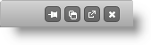
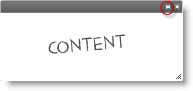

import ApiLink from 'docs-template/components/mdx/ApiLink.astro';

# igDialog の固定

## トピックの概要

### 目的

このトピックでは、`igDialog`™ を固定または固定解除できるように構成する方法およびこれらのアクションの実行方法を示します。

### 前提条件

このトピックを理解するために、以下のトピックを参照することをお勧めします。

- [***igDialog* の概要**](../00_igDialog Overview.mdx): このトピックでは、`igDialog` コントロールの主な機能を紹介します。

- [***igDialog*** の追加](../01_Adding igDialog.mdx): このトピックでは、`igDialog` コントロールを Web ページに追加する方法について説明します。


### このトピックの内容

このトピックは、以下のセクションで構成されます。

-   [**概要**](#introduction)
-   [**コントロールの構成の概要**](#configuration-summary)
-   [**固定/固定解除の構成**](#pin-unpin)
    -   [プロパティの設定](#pin-unpin-properties)
    -   [例](#pin-unpin-example)
-   [**初期化の固定**](#pin-on-minimized)
    -   [プロパティの設定](#pin-on-minimized-properties)
    -   [例](#pin-on-minimized-example)
-   [**igDialog の固定**](#pin)
    -   [コード](#pin-code)
    -   [例](#pin-example)
-   [**igDialog の固定解除**](#unpin)
    -   [コード](#unpin-code)
    -   [例](#unpin-example)
-   [**関連コンテンツ**](#related-content)
    -   [トピック](#topics)
    -   [サンプル](#samples)


## 概要

`igDialog` が固定されると、その HTML コンテンツを含めたコントロール全体がオリジナルのコンテナーに移動し、ダイアログの絶対位置が削除されます。固定された `igDialog` はモーダルおよび最大化された状態をサポートせず、またこれは移動できません。

> **注:** オリジナル `igDialog` コンテナーの親要素が非表示の場合にダイアログが固定されると、ダイアログも非表示になります。


## コントロールの構成の概要

次の表は、 `igDialog` コントロールで構成可能な項目の一覧です。このメソッドについては、表の下にある解説も参照してください。

|  |  |  |
| --- | --- | --- |
| 構成可能な要素 | 詳細 | プロパティとメソッド |
| 固定/固定解除の構成 | コントロール UI を使用して、*igDialog* の固定または固定解除を構成するのに必要なプロパティです。 | <ApiLink type="igDialog" member="showPinButton" section="options" label="showPinButton" /> <ApiLink type="igDialog" member="pinned" section="options" label="Pinned" /> |
| 初期化の固定 | 状態が最小化に変更された場合に、その親に固定されるように *igDialog* を構成するプロパティです。 | <ApiLink type="igDialog" member="pinOnMinimized" section="options" label="pinOnMinimized" /> |
| *igDialog* の固定 | 固定を可能にする *igDialog* API からのメソッド 。 | <ApiLink type="igDialog" member="pin" section="methods" label="pin()" /> |
| *igDialog* の固定解除 | 固定解除を可能にする *igDialog* API からのメソッド 。 | <ApiLink type="igDialog" member="unpin" section="methods" label="unpin()" /> |


## 固定/固定解除の構成

以下の表は、`igDialog` コントロールを固定するために構成する必要があるプロパティを示しています。<ApiLink type="igDialog" member="showPinButton" section="options" label="showPinButton" /> プロパティを設定すると ヘッダーのピン アイコンが有効になり、一方、<ApiLink type="igDialog" member="pinned" section="options" label="pinned" /> プロパティを設定するとコントロールの初期状態が構成されます。

### プロパティの設定

以下の表では、目的の機能をプロパティ設定にマップしています。

目的:|使用するプロパティ:|設定の選択肢:
--- | --- | ---
固定ボタンを表示|<ApiLink type="igDialog" member="showPinButton" section="options" label="showPinButton" /> |true
igDialog を固定|<ApiLink type="igDialog" label="pinned" /> |true


### 例

以下のスクリーンショットは、上記の設定の結果、`igDialog` がどのように表示されるかを示しています。ウィンドウはその親の左上隅に固定されます。


## 初期化の固定

最小化されたときに常に固定されるように、`igDialog` を構成します。この例のような要求の場合、`igDialog` は構成されると 、最小化されます。

### プロパティの設定

以下の表では、目的の機能をプロパティ設定にマップしています。

目的:|使用するプロパティ:|設定の選択肢:
--- | --- | ---
最小化して固定|<ApiLink type="igDialog" member="pinOnMinimized" section="options" label="pinOnMinimized" /> |true
igDialog の最小化|<ApiLink type="igDialog" member="state" section="options" label="state" /> |minimized


### 例

以下のスクリーンショットは、上記の設定の結果、`igDialog` がどのように表示されるかを示しています。ウィンドウは最小化され、その親の左上隅に固定されます。




## igDialog の固定

前の項での構成の結果として、ウィンドウの固定が解除されているときにヘッダーの右上隅のボタンを押すことによって、ダイアログ ウィンドウを固定できます。<ApiLink type="igDialog" member="showPinButton" section="options" label="showPinButton" /> オプションが無効になっている場合、その API を使用してコントロールを固定できます。

### コード

以下のコードは、その API を使って `igDialog` を固定する方法を示しています。

**JavaScript の場合:**

```js
$('#igDialog).igDialog("pin");
```

### 例

以下のスクリーンショットは、固定ボタンの位置を示しています。


## igDialog の固定解除

前の項での構成の結果として、ウィンドウが固定されているときにヘッダーの右上隅のボタンを押すことによって、ダイアログ ウィンドウの固定を解除できます。<ApiLink type="igDialog" member="showPinButton" section="options" label="showPinButton" /> オプションが無効になっている場合、その API を使用してコントロールを固定解除できます。

### コード

以下のコードは、その API を使用して `igDialog` の固定を解除する方法を示しています。

**JavaScript の場合:**

```js
$('#igDialog).igDialog("unpin");
```

### 例

以下のスクリーンショットは、固定解除ボタンの位置を示しています。




## 関連コンテンツ

### トピック

このトピックの追加情報については、以下のトピックも合わせてご参照ください。

- [***igDialog* の概要**](../00_igDialog Overview.mdx): このトピックでは、`igDialog` コントロールの主な機能を紹介します。

- [*igDialog* の追加](../01_Adding igDialog.mdx): このトピックでは、`igDialog` コントロールを Web ページに追加する方法について説明します。


### サンプル

このトピックについては、以下のサンプルも参照してください。

- [アイコン](&#123;environment:SamplesUrl&#125;/dialog-window/icons): `igDialog` のアイコンの表示方法を示すサンプル。


 

 


