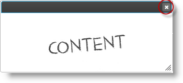

import ApiLink from 'docs-template/components/mdx/ApiLink.astro';

# igDialog の表示と非表示 

## トピックの概要

### 目的

このトピックでは、`igDialog`™ を構成して開閉できるようにする手順と、開閉アクションの実行方法を示します。

### 前提条件

このトピックを理解するために、以下のトピックを参照することをお勧めします。

- [**igDialog の概要**](../00_igDialog Overview.mdx): このトピックでは、`igDialog` コントロールの主な機能を紹介します。

- [**igDialog の追加**](../01_Adding igDialog.mdx): このトピックでは、`igDialog` コントロールを Web ページに追加する方法について説明します。


### このトピックの内容

-   [**コントロールの構成の概要**](#configuration-summary)
-   [**閉じことのできるコントロールとして igDialog を構成する**](#allow-closing)
    -   [プロパティとメソッドの設定](#closing-properties-methods)
    -   [例](#closing-example)
-   [**igDialog を非表示にする**](#hide)
    -   [コード](#hide-code)
    -   [例](#hide-example)
-   [**igDialog を表示する**](#show)
    -   [コード](#show-code)
-   [**関連コンテンツ**](#related-content)
    -   [トピック](#topics)
    -   [サンプル](#samples)


## <a id="configuration-summary"></a> コントロールの構成の概要


次の表は、 `igDialog` コントロールで構成可能な項目の一覧です。このメソッドについては、表の下にある解説も参照してください。

|  |  |  |
| --- | --- | --- |
| 構成可能な要素 | 詳細 | プロパティとメソッド |
| 閉じることのできるコントロールとして *igDialog* を構成する | *igDialog* コントロールをこのコントロール自体の UI からクローズできるようにするために構成する必要のあるプロパティです。 | <ApiLink type="igDialog" member="showCloseButton" section="options" label="showCloseButton" /> <ApiLink type="igDialog" member="closeOnEscape" section="options" label="closeOnEscape" /> |
| *igDialog* を非表示にする | *igDialog* コントロールをこのコントロール自体の API からを閉じるようにするメソッドです。 | <ApiLink type="igDialog" member="close" section="methods" label="close()" /> |
| *igDialog* を表示する | *igDialog* コントロールをこのコントロール自体の API からを開くようにするメソッドです。 | <ApiLink type="igDialog" member="open" section="methods" label="open()" /> |


## <a id="allow-closing"></a> 閉じことのできるコントロールとして igDialog を構成する

`igDialog` コントロールをこのコントロール自体の UI からクローズできるようにするために構成する必要のあるプロパティを下の表に示します。デフォルトでは、両方のプロパティが希望の値に設定されます。

### <a id="closing-properties-methods"></a> プロパティとメソッドの設定

次の表は、表示/非表示機能の設定とプロパティの設定値との対応関係を示したものです。

目的:|使用するプロパティ:|設定の選択肢:
--- | --- | ---
[閉じる] ボタンを表示する|<ApiLink type="igDialog" member="showCloseButton" section="options" label="showCloseButton" /> |true
キーボードを使用して *igDialog* を閉じる|<ApiLink type="igDialog" member="closeOnEscape" section="options" label="closeOnEscape" /> |true


#### <a id="closing-example"></a> 例

下のスクリーンショットは、上記の設定を行った場合に表示される `igDialog` です。


## <a id="hide"></a> igDialog を非表示にする

上のパラグラフで示した構成を行うと、ヘッダーの右上隅にあるボタンでダイアログ ウィンドウをクローズできるようになります。下の表に示す手順に従ってコントロールを構成すれば、Esc キーを使用してコントロールを閉じるようにすることもできます。

<ApiLink type="igDialog" member="showCloseButton" section="options" label="showCloseButton" /> と <ApiLink type="igDialog" member="closeOnEscape" section="options" label="closeOnEscape" /> の両方を無効にした場合、このコントロールをコントロール自体の API を使用して非表示にできます。

#### <a id="hide-code"></a> コード

次のコードは、`igDialog` をその API を使用して閉じる方法を示したものです。

**JavaScript の場合:**

```js
$('#igDialog).igDialog("close");
```

#### <a id="hide-example"></a> 例

このスクリーンショットは、[閉じる] ボタンの位置を示しています。




## <a id="show"></a> igDialog を表示する

`igDialog` は、その API を使用する以外の方法では表示できません。

#### <a id="show-code"></a> コード

次のコードは、`igDialog` をその API を使用して表示する方法を示したものです。

**JavaScript の場合:**

```js
$('#igDialog).igDialog("open");
```


## <a id="related-content"></a> 関連コンテンツ

### <a id="topics"></a>トピック

このトピックの追加情報については、以下のトピックも合わせてご参照ください。

- [igDialog の概要](../00_igDialog Overview.mdx): このトピックでは、`igDialog` コントロールの主な機能を紹介します。

- [*igDialog* の追加](../01_Adding igDialog.mdx): このトピックでは、`igDialog` コントロールを Web ページに追加する方法について説明します。


### <a id="samples"></a> サンプル

このトピックについては、以下のサンプルも参照してください。

- [基本的な使用方法](&#123;environment:SamplesUrl&#125;/dialog-window/basic-usage): このサンプルでは、`igDialog` の高さ、幅、状態を設定する方法を紹介します。


 

 


