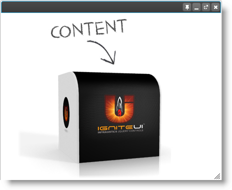

---
title: "igDialog の概要"
slug: igdialog-overview
---

# igDialog の概要

## トピックの概要

### 目的

このトピックでは、`igDialog`™ コントロールの主な機能を紹介します。

### このトピックの内容

このトピックは、以下のセクションで構成されます。

-   [**概要**](#introduction)
	-   [igDialog の概要](#introduction-html)
    -   [状態](#states)
    -   [例](#example)
-   [**機能**](#features)
    -   [表示と非表示](#show-hide)
    -   [最大化と最小化](#maximize-minimize)
    -   [固定](#pin)
    -   [ドラッグ](#drag)
    -   [サイズ変更](#resize)
    -   [位置](#position)
    -   [ヘッダーとフッター](#header-footer)
    -   [キーボードのサポート](#keyboard-support)
    -   [モーダル状態](#modal-state)
    -   [複数のダイアログ](#multiple-dialogs)
    -   [外部ページ](#external-page)
    -   [アニメーション](#animations)
    -   [子へのフォーカス](#focus-child)
    -   [永続化](#persistence)
-   [**関連コンテンツ**](#related-content)
    -   [トピック](#topics)
    -   [サンプル](#samples)


##  <a id="introduction"></a> 概要

####  <a id="introduction-html"></a> igDialog の概要

**HTML の場合:**

```html
<div id="dialog">
    igDialog Content
</div>
```

### <a id="states"></a> 状態 

以下の表では、コントロールの可能性のあるすべての状態をまとめていす。その他の詳細については関連トピックをご覧ください。

状態|説明|関連トピック | 
--- | --- | ---
Opened|*この状態では、igDialog は開いています。これがコントロールのデフォルト状態です。*|[表示と非表示](./02_Configuring/00_igDialog Show and Hide.mdx)
Closed |*この状態では、igDialog は閉じています。*|[表示と非表示](./02_Configuring/00_igDialog Show and Hide.mdx)
Minimized |*この状態では、igDialog は最小化されています。*|[最大化と最小化ウィンドウ](./02_Configuring/01_igDialog Maximize and Minimize.mdx)
Maximized|*この状態では、igDialog は最大化されています。*|[最大化と最小化ウィンドウ](./02_Configuring/01_igDialog Maximize and Minimize.mdx)

### <a id="example"></a> 例

以下の画像は、画像をコンテンツとして持つ `igDialog` を示しています。コントロールは開いた状態です。




## <a id="features"></a> 機能

#### 機能の概要

以下の表で、`igDialog` コントロールの機能を簡単に説明します。詳細については、概要表の後をご覧ください。

機能|説明
--- | ---
[表示と非表示](#show-hide)|これは、特別なボタンとコントロール API を使用してダイアログ ウィンドウを表示または非表示にする機能です。
[最大化と最小化](#maximize-minimize)|これは、特別なボタンとコントロール API を使用してダイアログ ウィンドウを最小化または最大化する機能です。
[固定](#pin)|これは、ダイアログ ウィンドウを左上端の親コンテナーに固定する機能です。
[位置](#position)|これは、親の位置とは関係なくページの任意の場所にダイアログ ウィンドウを配置する機能です。
[ドラッグ](#drag)|ページ全体でダイアログを移動する機能。
[サイズ変更](#resize)|ダイアログのサイズを変更する機能。
[ヘッダーとフッター](#header-footer)|`igDialog` コントロールは、フッターおよびヘッダーを変更するプロパティおよびボタンとその画像を変更するプロパティを提案します。
[キーボードのサポート](#keyboard-support)|Esc キーでダイアログ ウィンドウを閉じる機能。
[モーダル状態](#modal-state)|モーダル ダイアログの背後のページを無効にする機能。
[複数のダイアログ](#multiple-dialogs)|*igDialog* を入れ子でビルドする機能。
[外部ページ](#external-page)|これは、`igDialog` のコンテンツとして外部ページを読み込む機能です。
[アニメーション](#animations)|アニメーションを選択する、開く、閉じる機能。
[子へのフォーカス](#focus-child)|フォーカスされた状態を維持するために、ダイアログ内の子要素の focus イベントと blur イベントを処理する機能を設定および取得します。
[永続化](#persistence)|この機能によって、サーバーへのポストバックが実行された後、`igDialog` の状態を保存できます。

### <a id="show-hide"></a> 表示と非表示

主な機能として、ウィンドウ自体を表示または非表示にする機能があります。`igDialog` を閉じるには、ユーザー インターフェイス ボタン、Esc キー、またはコントロール API を使用できます。非表示のボタンを再度開く場合、コントロール API のみ使用できます。この機能を実現するためのプロパティとメソッドの詳細については、以下のトピックとサンプルのリンクを参照してください。

**関連トピック:**

-   [igDialog の表示と非表示](./02_Configuring/00_igDialog Show and Hide.mdx)

**関連サンプル:**

-   [基本的な使用方法](&#123;environment:SamplesUrl&#125;/dialog-window/basic-usage)

### <a id="maximize-minimize"></a> 最大化と最小化

適切なボタンを使用することによって、`igDialog` を最大化および最小化できます。コントロール API は、この動作を変更するためのプロパティとメソッドを提案します。また、ヘッダーをダブル クリックすると、Windows OS ウィンドウに似た動作を実行できます。この機能を実現するためのプロパティとメソッドの詳細については、以下のトピックとサンプルのリンクを参照してください。

**関連トピック:**

-   [igDialog の最大化および最小化](./02_Configuring/01_igDialog Maximize and Minimize.mdx)

**関連サンプル:**

-   [アイコン](&#123;environment:SamplesUrl&#125;/dialog-window/icons)

### <a id="pin"></a> 固定

`igDialog` は、左上隅にある親コンテナーに固定することができます。これによってウィンドウは移動しなくなりますが、サイズの変更は可能です。この機能の構成方法の詳細は、以下のトピックとサンプルを参照してください。

**関連トピック:**

-   [igDialog の固定](./02_Configuring/02_igDialog Pin.mdx)

**関連サンプル:**

-   [アイコン](&#123;environment:SamplesUrl&#125;/dialog-window/icons)

### <a id="drag"></a> ドラッグ

`igDialog` をドラッグ & ドロップできます。この動作をサポートするために変更が必要なプロパティは [`draggable`](&#123;environment:jQueryApiUrl&#125;/ui.igDialog#options:draggable) のみで、デフォルトで true に設定されています。

**関連サンプル:**

-   [**基本的な使用方法**](&#123;environment:SamplesUrl&#125;/dialog-window/basic-usage)

### <a id="resize"></a> サイズ変更

`igDialog` をドラッグ & ドロップできます。この動作をサポートするために変更必要なプロパティは [`resizable`](&#123;environment:jQueryApiUrl&#125;/ui.igDialog#options:resizable) のみで、デフォルトで true に設定されています。

**関連サンプル:**

-   [基本的な使用方法](&#123;environment:SamplesUrl&#125;/dialog-window/basic-usage)

### <a id="position"></a> 位置

座標、および jQuery position メソッドを使用して、`igDialog` の位置を設定できます。この機能の構成方法の詳細は、次のトピックとサンプルを参照してください。

**関連トピック:**

-   [igDialog の配置](./02_Configuring/03_igDialog Position.mdx)

**関連サンプル:**

-   [API およびイベント](./03_API Reference/02_igDialog Event Reference.mdx#attaching-handlers-jquery)

### <a id="header-footer"></a> ヘッダーとフッター

`igDialog` コントロールは、フッターおよびヘッダーを変更するプロパティ、およびボタンとその画像を変更するプロパティを提案します。この機能の構成方法の詳細は、次のトピックとサンプルを参照してください。

**関連トピック:**

-   [igDialog  のヘッダーとフッター](./02_Configuring/04_igDialog Header and Footer.mdx)

**関連サンプル:**

-   [アイコン](&#123;environment:SamplesUrl&#125;/dialog-window/icons)

### <a id="keyboard-support"></a> キーボードのサポート

Esc キーで `igDialog` を閉じることができます。この動作をサポートするために変更が必要なプロパティは [`closeOnEscape`](&#123;environment:jQueryApiUrl&#125;/ui.igDialog#options:closeOnEscape) のみで、デフォルトで true に設定されています。

**関連トピック:**

-   [Dialog ウィンドウの表示と非表示](./02_Configuring/00_igDialog Show and Hide.mdx)

**関連サンプル:**

-   [基本的な使用方法](&#123;environment:SamplesUrl&#125;/dialog-window/basic-usage)

### <a id="modal-state"></a> モーダル状態

`igDialog` がモーダル状態にある場合、背景のページは非表示および無効になります。`igDialog` コントロールを操作するだけです。この機能の構成方法の詳細は、次のトピックとサンプルを参照してください。

**関連トピック:**

-   [モーダル igDialog](./02_Configuring/06_igDialog Modal State.mdx)

**関連サンプル:**

-   [モーダル ダイアログ](&#123;environment:SamplesUrl&#125;/dialog-window/modal-dialog)

### <a id="multiple-dialogs"></a> 複数のダイアログ

複数の `igDialog` ウィジェットをページ上に表示することができ、ウィジェット間の関係を定義する必要なく、これらは適切に表示されます。通常の `igDialog` とモーダル ダイアログを組み合わせて使用することもできます。詳細については、以下のサンプルとトピックを参照してください。

**関連トピック:**

-   [複数の igDialog](./02_Configuring/07_igDialog Multiple Dialogs.mdx)

### <a id="external-page"></a> 外部ページ

`igDialog` は、ページ全体をコンテンツとして扱うことができます。この機能の構成方法の詳細は、次のトピックとサンプルを参照してください。

**関連トピック:**

-   [外部ダイアログ](./02_Configuring/05_igDialog External Page.mdx)

**関連サンプル:**

-   [外部ページの読み込み](&#123;environment:SamplesUrl&#125;/dialog-window/loading-external-page)

### <a id="animations"></a> アニメーション

`igDialog` では、オープン、クローズ時のアニメーションを選択できます。この機能の構成方法の詳細は、次のトピックとサンプルを参照してください。

**関連トピック:**

-   [igDialog のアニメート](./02_Configuring/08_igDialog Animations.mdx)

### <a id="focus-child"></a> フォーカス

コントロール自身、およびダイアログ内の子要素の focus イベントおよび blur イベントを処理する機能を設定および取得します。この動作をサポートするために変更が必要なプロパティは [`trackFocus`](&#123;environment:jQueryApiUrl&#125;/ui.igDialog#options:trackFocus) のみで、デフォルトで true に設定されています。

### <a id="persistence"></a> 永続化

この機能によって、サーバーへのポストバックが実行された後、`igDialog` の状態を保存できます。Persistence が有効な場合、`igDialog` の幅、高さ、位置、zIndex、固定位置および状態を保存する機能を使用できます。オーバーロード Dialog() コンストラクターの 1 つを使用する場合、この機能が有効になります。このコンストラクターでは、2 番目のパラメーターとして、文字列の名前を渡す必要があり、これは `igDialog` の設定を保持する非表示の入力の名前になります。コントロールは、サーバーへのコール中、`igDialog` の状態を存続させるために、この非表示のフィールドを使用します。Dialog() オーバーロードの詳細については、Dialog の API マニュアルを参照してください。

`igDialog` の永続性を有効にするには、以下のコードを使用します。

**C# の場合:**

```csharp
@Html.Infragistics()
    .Dialog("igDialog1", "hdnPersistnceInput")
    .Render()
```


## <a id="related-content"></a> 関連コンテンツ

### <a id="topics"></a> トピック

このトピックの追加情報については、以下のトピックも合わせてご参照ください。

- [*igDialog* の追加](./01_Adding igDialog.mdx): このトピックでは、`igDialog` コントロールを Web ページに追加する方法について説明します。

- [*igDialog* の構成](./02_Configuring/~Configuring igDialog.mdx): このトピックでは、すべての主な `igDialog` の機能、その構成および使用方法を参照します。

- [*igDialog* API 参照](./03_API Reference/~igDialog API Reference.mdx): このトピックでは、`igDialog` API のカテゴリーを紹介します。コントロール プロパティ、メソッド、イベントおよび CSS クラスへのすべての参照に加え、API 使用時のいくつかの具体例が含まれています。

- [*igDialog* の既知の問題と制限](./05_igDialog Known Issues.mdx): このトピックでは、`igDialog` コントロールに関する既知の問題を明らかにします。

### <a id="samples"></a> サンプル

このトピックについては、以下のサンプルも参照してください。

- [基本的な使用方法](&#123;environment:SamplesUrl&#125;/dialog-window/basic-usage): このサンプルでは、`igDialog` の高さ、幅、状態を設定する方法を紹介します。


 

 


