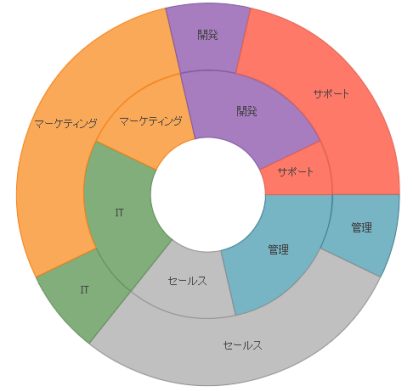

---
title: "igDoughnutChart"
slug: igdoughnutchart
---

# igDoughnutChart

## このグループのトピックについて

### 概要

このグループのトピックでは、`igDoughnutChart`™ コントロールとその使用について説明します。

`igDoughnutChart` コントロールにより、変数の発生を比例的に示すことができます。コントロールの内部半径は構成可能で、ドーナツ型チャート シリーズにはスライスの選択および展開のサポートが内蔵されています。

#### トピック

- [*igDoughnutChart* の概要](/igdoughnutchart-overview): このトピックは、`igDoughnutChart` コントロールの概要を説明します。

- [*igDoughnutChart* の追加](/igdoughnutchart-adding): このトピック グループでは、`igDoughnutChart` コントロールを HTML ページと ASP.NET MVC アプリケーションに追加する方法を示します。

- [選択と展開の構成 (*igDoughnutChart*)](/igdoughnutchart-configuring-selection-and-explosion): このトピックでは、`igDoughnutChart` のスライスの選択および展開を構成する方法を説明します。

- [jQuery および MVC API リファレンス リンク (*igDoughnutChart*)](/igdoughnutchart-api-links): このトピックでは、`igDoughnutChart` コントロールと &#123;environment:ProductNameMVC&#125; に関する API ドキュメントへのリンクを提供します。

- [既知の問題と制限 (*igDoughnutChart*)](/igdoughnutchart-known-issues-and-limitations): このトピックでは、`igDoughnutChart` コントロールの既知の問題と制限に関する情報を提供します。

 

 

