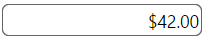
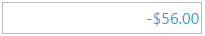

# igCurrencyEditor のスタイルおよびテーマ設定

import ApiLink from 'docs-template/components/mdx/ApiLink.astro';

# igCurrencyEditor のスタイルおよびテーマ設定


`igCurrencyEditor` の jQuery ウィジェットは、多くのスタイル設定オプションを公開します。通貨エディターのスタイルをカスタマイズするには、さまざまなテーマを使用する、またはカスタム CSS ルールをコントロールに直接適用する必要があります。 

\{environment:ProductName\} パッケージには、いくつかの jQuery UI や Bootstrap テーマが用意されています。また Bootstrap は、独自のブートストラップのテーマの生成やカスタマイズをサポートしています。詳細は、[スタイル設定とテーマ設定](/deployment-guide-styling-and-theming)を参照してください。 
エディターを含めたページ上のすべてのコントロールのスタイルは、どのテーマでも設定できます。

## ThemeRoller の使用

`igCurrencyEditor` コントロールは jQuery UI CSS フレームワークを使用するため、[jQuery UI ThemeRoller](http://jqueryui.com/themeroller/) を使用してすべてのスタイルを設定することもできます。これにより、独自に作成したテーマのカスタマイズや使用可能なギャラリーからのテーマの選択ができます。これらのテーマは、\{environment:ProductName\} のデフォルトのテーマと置き換えられます。

UI Darkness テーマを使用する通貨エディター: 



## カスタム スタイル

ご使用の CSS には、通貨エディターの多くの要素にスタイル オーバーライドが含まれている場合があります。使用可能なすべてのクラスについては、<ApiLink type="igCurrencyEditor" label="API リファレンスのテーマ設定クラス" />を参照してください。スタイルを適用するには、すべてのエディターに摘要されたグローバル クラスをオーバーライドする、または ID や他のセレクターで特定の要素をターゲットとして指定し、コントロールごとにカスタマイズできるようにします。

`igCurrencyEditor` はデフォルトで、負の値を赤色で表示します。以下の例では、この色を変更する方法を示します。

```html
<style>
.ui-igedit-negative
{
	color: #00aeef;
}
</style>
```

>**注:** 負のパターンを使用しない場合、負の値が前の画像と異なって表示されることがあります。これは地域の設定が原因です。




## 関連トピック

-   [igCurrencyEditor の概要](/igcurrencyeditor-igcurrencyeditor-overview)
 

 


