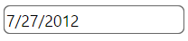

# igDateEditor のスタイル設定とテーマ設定

import ApiLink from 'docs-template/components/mdx/ApiLink.astro';

# igDateEditor のスタイル設定とテーマ設定

`igDateEditor` コントロールは、`igEditor` を拡張する jQuery ベースのウィジェットで、多くのスタイル設定オプションを公開します。日付エディターのスタイルをカスタマイズするには、テーマ オプションを使用して、カスタム CSS ルールのセットをコントロールに適用する必要があります。

\{environment:ProductName\} パッケージには、いくつかの jQuery UI や Bootstrap テーマが用意されています。また Bootstrap は、独自のブートストラップのテーマの生成やカスタマイズをサポートしています。詳細は、[スタイル設定とテーマ設定](/deployment-guide-styling-and-theming)を参照してください。エディターを含めたページ上のすべてのコントロールのスタイルは、どのテーマでも設定できます。

## ThemeRoller の使用

`igDateEditor` コントロールは jQuery UI CSS フレームワークを使用するため、[jQuery UI ThemeRoller](http://jqueryui.com/themeroller/) を使用してすべてのスタイルを設定することもできます。これにより、独自に作成したテーマのカスタマイズや使用可能なギャラリーからのテーマの選択ができます。これらのテーマは、\{environment:ProductName\} のデフォルトのテーマと置き換えられます。

UI Darkness テーマを使用する日付エディター:



## カスタム スタイル

ご使用の CSS には、日付エディターの多くの要素にスタイル オーバーライドが含まれている場合があります。使用可能なすべてのクラスについては、<ApiLink type="igDateEditor" label="API リファレンスのテーマ設定クラス" />を参照してください。スタイルを適用するには、すべてのエディターに摘要されたグローバル クラスをオーバーライドする、または ID や他のセレクターで特定の要素をターゲットとして指定し、コントロールごとにカスタマイズできるようにします。

```css
.ui-igedit-input{
	color: #00aeef;
}
```


## 関連トピック

-   [igDateEditor の概要](/igdateeditor-overview)
-   [igDateEditor の既知の問題](/igdateeditor-known-issues)

 

 


