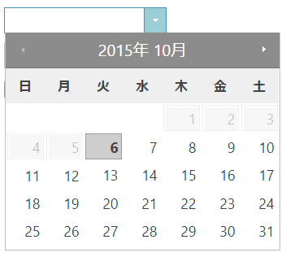

---
title: "igDatePicker の概要"
slug: igdatepicker-overview
---

# igDatePicker の概要


`igDatePicker` によって、ドロップダウン カレンダー付きの入力フィールドを使用でき、また、開発者は日付の表示形式を指定できます。`igDatePicker` コントロールは、ブラウザーから公開されるさまざまな地域のオプションを認識することにより、ローカライズをサポートします。

> **ローカライズの注意:** `igDatePicker` コントロールは `jQuery.datepicker` と依存関係があります。このため、ページでそのローカライズ ファイルを参照する必要があります。

`igDatePicker` コントロールは、任意のサーバー技術を使用して作業を構成できる豊富なクライアント側 API を公開します。&#123;environment:ProductName&#125;™ のコントロールはサーバー非依存ですが、Microsoft® ASP.NET MVC Framework 専用の &#123;environment:ProductNameMVC&#125; の一部として含まれるコントロールでは、希望する .NET™ 言語を使用して構成できます。

`igDatePicker` コントロールは、大幅にスタイル変更ができるため、デフォルトのスタイルとまったく異なるルック アンド フィールのコントロールを実現できます。スタイル設定オプションでは、独自のスタイルも jQuery UI の ThemeRoller のスタイルも使用できます。

> **注:** `igDatePicker` コントロールは独自のドロップダウンを実装していないため、`jQuery.datepicker` のドロップダウン カレンダーを再利用します。

図 1: `igDatePicker` コントロールによる日付選択



-	[igDatePicker のサンプル](&#123;environment:SamplesUrl&#125;/editors/date-picker-overview)

## 機能

`igDatePicker` には以下の特徴があります。

-   全体のテーマのサポート
-   検証
-   カスタム表示形式の定義
-   最小値と最大値の設定
-   ローカライズ
-   JavaScript クライアント API
-   ASP.NET MVC 
-   jquery.ui.datepicker でサポートされるすべての機能

## &#123;environment:ProductFamilyName&#125; CLI を使用して igDatePicker の追加

新しい igDatePicker を簡単にアプリケーションに追加するには、&#123;environment:ProductFamilyName&#125; CLI を使用します。新しいアプリケーションを作成した後、以下のコマンドを実行すると、日付の選択がプロジェクトに追加されます。

```
   ig add date-picker newDatePicker
```

このコマンドは、アプリケーションが Angular、React、または jQuery に関係なく新しい日付の選択を追加します。

すべての利用可能なコマンドおよび詳細な情報については、「[&#123;environment:ProductFamilyName&#125; CLI の使用](/general-and-getting-started/using-ignite-ui-cli)」のトピックを参照してください。

## igDatePicker の Web ページへの追加

1.  最初に、アプリケーションに必要なローカライズ済みのリソースを含めます。組み込むリソースの詳細は、「[&#123;environment:ProductName&#125; で JavaScript リソースを使用](/general-and-getting-started/deployment-guide-javascript-resources)」ヘルプ トピックをご覧ください。
2.  ご自分の HTML ページまたは ASP.NET MVC View で、必要な JavaScript ファイル、CSS ファイル、および ASP.NET MVC アセンブリを参照してください。

    **HTML の場合:**

```html
    <link type="text/css" href="/css/themes/infragistics/infragistics.theme.css" rel="stylesheet" />
    <link type="text/css" href="/css/structure/infragistics.css" rel="stylesheet" />
    <script type="text/javascript" src="/Scripts/jquery.min.js"></script>
    <script type="text/javascript" src="/Scripts/jquery-ui.min.js"></script>
    <script type="text/javascript" src="/Scripts/Samples/infragistics.core.js"></script>
	<script type="text/javascript" src="/Scripts/Samples/infragistics.lob.js"></script>
```

    **Razor の場合:**

```csharp
    @using Infragistics.Web.Mvc;

    <link type="text/css" href="@Url.Content("~/css/themes/infragistics/infragistics.theme.css")" rel="stylesheet" />
    <link type="text/css" href="@Url.Content("~/css/structure/infragistics.css")" rel="stylesheet" />

    <script type="text/javascript" src="@Url.Content("~/Scripts/jquery.min.js")"></script>
    <script type="text/javascript" src="@Url.Content("~/Scripts/jquery-ui.min.js")"></script>
    <script type="text/javascript" src="@Url.Content("~/Scripts/Samples/infragistics.core.js")"></script>
	<script type="text/javascript" src="@Url.Content("~/Scripts/Samples/infragistics.lob.js")"></script>
    <script type="text/javascript" src="@Url.Content("~/Scripts/Samples/modules/i18n/regional/infragistics.ui.regional-en.js")"></script>
```

3.  jQuery の実装では、HTML 内のターゲット要素として INPUT、DIV、または SPAN を作成します。ASP.NET MVC の実装では、含める要素を &#123;environment:ProductNameMVC&#125; が作成するため、この手順はオプションです。

    **HTML の場合:**

```html
    <input id="datePicker" type="text" />
```

4.  上記の手順完了後、日付エディターを初期化します。

    > **注:** ASP.NET MVC View では、その他のオプションをすべて設定した後で Render メソッドを呼び出す必要があります。

    **JavaScript の場合:**

```js
    <script type="text/javascript">
          $("#datePicker").igDatePicker();
     </script>
```

    **Razor の場合:**

```csharp
    @(Html.Infragistics().DatePicker()
         .ID("datePicker")
         .Render())
```

5.  Web ページを実行し、`igDatePicker` コントロールの基本セットアップを表示します。

## Value オプションの正しい設定

このトピックのこのセクションでは、一般的に使用されるいくつかのシナリオや特定のシナリオで、`igDatePicker` が value オプションの設定をどのように処理するかを示します。

value が空で編集モードの場合は、日日のみなど日付の一部を入力します。日付の他の部分は日付オブジェクトによって生成されます。これは、日付オブジェクトが現在の日付を取得して、日付の足りない部分を補うことを意味します。 たとえば、現在の Date が 2017 年 1 月 1 日 で、dateInputFormat を "dd" に設定した場合、ユーザーが "25" を入力すると、年は 2017 年になり、月は 1 月になります。結果として 2017 年 1 月 25 日になります。

すでに入力された値の一部の日を削除した場合、入力がぼかしになり、エディターが前回入力された日付から足りない部分を補います。たとえば、2015 年 2 月 28 日が入力されている場合に日を削除すると、入力がぼかしになった後で、日付は 2 月 28 日に戻ります。

注意が必要な最後のシナリオは、値に誤りがある場合です。たとえば、2015 年 2 月 29 日と入力すると、2015 年はうるう年ではないため、エディターが自動的に日付を修正します。表示される日付は、2015 年 2 月 28 日になります。 

`minValue`、`maxValue`、および `value` オプションで文字列値を使用する場合、エディターは JavaScript Date オブジェクトのコンストラクターを使用して日付オブジェクトを作成し、相対するオプションの値として使用します。
>**注:** このプロパティは、日付を取得するために `displayInputFormat` 設定を使用しません。 

### 構成の実例:
以下のサンプルは、複数の [`dataMode`](&#123;environment:jQueryApiUrl&#125;/ui.igdatepicker#options:dataMode) 設定と `igDatePicker` を構成する方法を紹介し、送信の予測値を表示します。

<div class="embed-sample">
   [&#123;environment:SamplesEmbedUrl&#125;/editors/date-picker](&#123;environment:SamplesEmbedUrl&#125;/editors/date-picker)
</div>

## 関連リンク

-   [igDatePicker のサンプル](&#123;environment:SamplesUrl&#125;/editors/date-picker-overview) 
-   [&#123;environment:ProductName&#125; の概要](/igniteui-for-jquery-overview)  
-   [&#123;environment:ProductName&#125; で JavaScript リソースを使用](/general-and-getting-started/deployment-guide-javascript-resources)