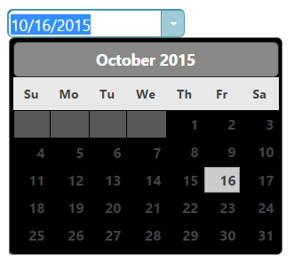

# igDatePicker のスタイルおよびテーマ設定

import ApiLink from 'docs-template/components/mdx/ApiLink.astro';

# igDatePicker のスタイルおよびテーマ設定


`igDatePicker` コントロールは、igDateEditor を拡張する jQuery ベースのウィジェットで、多くのスタイル設定オプションを公開します。数値エディターのスタイルをカスタマイズするには、テーマ オプションを使用して、カスタム CSS ルールをコントロールに適用する必要があります。

> **注:** `igDatePicker` コントロールは、`jQuery.datepicker` のドロップダウン カレンダーを再利用するため、`jQuery.datepicker` で使用可能なスタイル オプションを使用する必要があります。

## ThemeRoller の使用

`igDatePicker` コントロールは jQuery UI CSS フレームワークを使用するため、[jQuery UI ThemeRoller](http://jqueryui.com/themeroller/) を使用してすべてのスタイルを設定することもできます。これにより、独自に作成したテーマのカスタマイズや使用可能なギャラリーからのテーマの選択ができます。これらのテーマは、\{environment:ProductName\} のデフォルトのテーマと置き換えられます。

UI Darkness テーマを使用する日付ピッカー:



## カスタム スタイル

ご使用の CSS には、日付ピッカーの多くの要素にスタイル オーバーライドが含まれている場合があります。使用可能なすべてのクラスについては、<ApiLink type="igDateEditor" label="API リファレンスのテーマ設定クラス" />を参照してください。スタイルを適用するには、すべてのエディターに摘要されたグローバル クラスをオーバーライドする、またはID や他の特定の trait で特定の要素をターゲットとして指定し、コントロールごとにカスタマイズできるようにします。

```css
.ui-igedit-input{
	color: #00aeef;
}
```


## 関連トピック

-   [igDateEditor の概要](/igbulletgraph-overview)
-   [igDatePicker の概要](/igdatepicker-overview)

 

 


