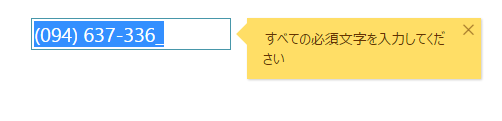

# igMaskEditor の概要

import ApiLink from 'docs-template/components/mdx/ApiLink.astro';

# igMaskEditor の概要

##igMaskEditor の概要

\{environment:ProductName\}™ のマスク エディターまたは `igMaskEditor` は、指定の入力マスクによって決定される入力制限を強制する入力フィールドを描画するコントロールです。`igMaskEditor` コントロールは、ブラウザーから公開される異なる地域のオプションを認識することにより、ローカライズをサポートします。`igMaskEditor` コントロールは、任意のサーバー技術を使用する作業を構成できる豊富なクライアント側 API を公開します。\{environment:ProductName\}™ のコントロールはサーバー非依存ですが、Microsoft® ASP.NET MVC Framework 専用の \{environment:ProductNameMVC\} の一部として含まれるコントロールでは、希望する .NET™ 言語を使用して構成できます。`igMaskEditor` コントロールは、大幅にスタイル変更ができるため、デフォルトのスタイルとまったく異なるルック アンド フィールのコントロールを実現できます。スタイル設定オプションでは、独自のスタイルも jQuery UI の ThemeRoller のスタイルも使用できます。<br />図 1: `igMaskEditor` コントロールの電話番号マスクの適用




##機能

`igMaskEditor` には以下の特徴があります。
-   全体のテーマのサポート
-   検証
-   カスタム パスの定義
-   異なるデータ モード
-   ローカライズ
-   JavaScript クライアント API
-   ASP.NET MVC


>**注:** 新しいマスク エディターの大きな変更点の 1 つは、リストとドロップダウンのサポートが廃止されたことです。ドロップダウンやリストに関連するメソッドを使用しようとすると、メソッドが使用できないことを通知するメッセージが表示されます。 

## \{environment:ProductFamilyName\} CLI を使用して igMaskEditor の追加

新しい igMaskEditor を簡単にアプリケーションに追加するには、\{environment:ProductFamilyName\} CLI を使用します。新しいアプリケーションを作成した後、以下のコマンドを実行すると、マスク エディターがプロジェクトに追加されます。

```
   ig add mask-editor newMaskEditor 
```

このコマンドは、アプリケーションが Angular、React、または jQuery に関係なく新しいマスク エディターを追加します。

すべての利用可能なコマンドおよび詳細な情報については、「[\{environment:ProductFamilyName\} CLI の使用](/Using-Ignite-UI-CLI)」のトピックを参照してください。
   
##igMaskEditor の Web ページへの追加

1.  最初に、アプリケーションに必要なローカライズ済みのリソースを含めます。組み込むリソースの詳細は、「[\{environment:ProductName\} で JavaScript リソースを使用](/deployment-guide-javascript-resources)」ヘルプ トピックをご覧ください。
2.  ご自分の HTML ページまたは ASP.NET MVC View で、必要な JavaScript ファイル、CSS ファイル、および ASP.NET MVC アセンブリを参照してください。

	**HTML の場合:**
```html
    <link type="text/css" href="/css/themes/infragistics/infragistics.theme.css" rel="stylesheet" />
    <link type="text/css" href="/css/structure/infragistics.css" rel="stylesheet" />
    <script type="text/javascript" src="/Scripts/jquery.min.js"></script>
    <script type="text/javascript" src="/Scripts/jquery-ui.min.js"></script>
    <script type="text/javascript" src="/Scripts/Samples/infragistics.core.js"></script>
	<script type="text/javascript" src="/Scripts/Samples/infragistics.lob.js"></script>
```

    **Razor の場合:**
```csharp
    @using Infragistics.Web.Mvc;
    <link type="text/css" href="@Url.Content("~/css/themes/infragistics/infragistics.theme.css")" rel="stylesheet" />
    <link type="text/css" href="@Url.Content("~/css/structure/infragistics.css")" rel="stylesheet" />
    <script type="text/javascript" src="@Url.Content("~/Scripts/jquery-1.9.1.min.js")"></script>
    <script type="text/javascript" src="@Url.Content("~/Scripts/jquery-ui.min.js")"></script>
    <script type="text/javascript" src="@Url.Content("~/Scripts/Samples/infragistics.core.js")"></script>
	<script type="text/javascript" src="@Url.Content("~/Scripts/Samples/infragistics.lob.js")"></script>
    <script type="text/javascript" src="@Url.Content("~/Scripts/Samples/modules/i18n/regional/infragistics.ui.regional-en.js")"></script>
```
3.  jQuery の実装では、HTML 内のターゲット要素として INPUT、DIV、または SPAN を作成します。ASP.NET MVC の実装では、含める要素を \{environment:ProductNameMVC\} が作成するため、この手順はオプションです。 

	**HTML の場合:**
```html
    <input id="maskEditor" />
```

4. 上記の手順完了後、数値エディターを初期化します。

    >**注:** ASP.NET MVC View では、その他のオプションをすべて設定した後で `Render` メソッドを呼び出す必要があります。

    **JavaScript の場合:**

```js
    <script type="text/javascript">
           $('#maskEditor').igMaskEditor();
    </script>
```

    **Razor の場合:**

```csharp
    @(Html.Infragistics().MaskEditor()
                 .ID("maskEditor")
                 .Render())
```

5.  Web ページを実行し、`igMaskEditor` コントロールの基本セットアップを表示します。

## 固有のオプション

### 入力マスク

このセクションで、`igMaskEditor` の複数の主なオプションを説明します。最初は <ApiLink type="igmaskeditor" member="inputMask" section="options" label="inputMask" /> です。入力マスクを表し、igMaskEditor の大量の機能はこのオプションに依存します。エディターの入力フィールドに許可される文字を指定します。つまり、予期された形式および要件に基づいてエンド ユーザーの入力を制限できます。また、`inputMask` は編集モードで必要とされる位置を表示するため、エディターがより使いやすくなります。

たとえば、電話番号の形式を指定するには、必須の数値 ("9" フラグ) を設定し、形式 (スペース、ダッシュなどのリテラル文字) も設定できます。マスクを `"(999) 999-999"` に設定して編集モードに入った場合、入力ヒントのために `(___) ___-___` のマスクが表示されます。

マスクには、フィルター フラグやリテラル文字が含まれる場合があります。リテラル文字はマスクの部分で、ユーザーによって変更できません。フィルター フラグをリテラル文字として使用するには、エスケープ "\\" 文字を使用する必要があります。デフォルト マスクは "CCCCCCCCCC" で、任意の文字を許可し、入力がオプションです。注: このオプションはランタイムに設定できません。
`inputMask` オプションの値のリストは <ApiLink type="igmaskeditor" member="inputMask" section="options" label="API ヘルプ" />に説明されます。

### データ モード

次は、<ApiLink type="igmaskeditor" member="dataMode" section="options" label="dataMode" /> およびその値を説明します。コントロールの値 (`value` メソッドおよびフォームでの送信) に影響します。テキスト、設定していないプロンプト、およびリテラルから value が含むコンテンツを決定する 6 つの `dataMode` 設定があります。デフォルト値は `allText` です。使用される場合、value メソッドはすべての入力したテキスト、すべてのプロンプト (位置)、およびリテラルを返します。`dataMode` は `inputMask` オプションに依存関係があります。ユーザー入力からテキストのみを取得し、設定していないプロンプトおよびリテラルを破棄するには、`rawText` モードを選択します。`rawTextWithLiterals` を使用すると、入力したテキストおよびリテラルを取得し、設定していないプロンプトおよびリテラルを破棄します。たとえば、`inputMask` が `(999) 999-999` に設定し、`dataMode` が `rawTextWithLiterals` に設定される場合、入力フィールドで `1234567` を入力すると、値は `(123) 456-7` になります。

オプションの値のリストは <ApiLink type="igmaskeditor" member="dataMode" section="options" label="API ヘルプ" />に説明されます。 


### 構成

**HTML:**

```html
<input id="phoneNumber"/>
```

**Javascript:**

```js
<script type="text/javascript">
    $('#phoneNumber').igMaskEditor({
        inputMask: '(999) 999-999',
        dataMode: 'rawTextWithLiterals',
        value:123456789
    });
});
</script>
```

**Razor の場合:**

```csharp
@(Html.Infragistics().MaskEditor()
    .ID("phoneNumber")
    .InputName("phoneNumber")
    .InputMask("(999) 999-999")
    .DataMode(MaskEditorDataMode.RawTextWithLiterals)
    .Value(123456789)
    .Render()
)
```

##関連リンク

-   [マスク エディターの基本サンプル](\{environment:SamplesUrl\}/editors/mask-editor-basic)
-   [\{environment:ProductName\} の概要](/igniteui-for-jquery-overview)
-   [\{environment:ProductName\} で JavaScript リソースを使用](/deployment-guide-javascript-resources)
 
 

