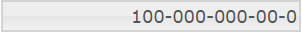

# igNumericEditor の概要

import ApiLink from 'docs-template/components/mdx/ApiLink.astro';

# igNumericEditor の概要


##igNumericEditor の概要

\{environment:ProductName\}™ 数値エディター、つまり `igNumericEditor` は `dataMode` 値で決定された数値のみを受け付ける入力フィールドを描画するコントロールです。`igNumericEditor` コントロールは、ブラウザーから公開される異なる地域のオプションを認識することにより、ローカライズをサポートします。

`igNumericEditor` コントロールは、任意のサーバー技術を使用する作業を構成できる豊富なクライアント側 API を公開します。\{environment:ProductName\}™ のコントロールはサーバー非依存ですが、Microsoft® ASP.NET MVC Framework 専用の \{environment:ProductNameMVC\} の一部として含まれるコントロールでは、希望する .NET™ 言語を使用して構成できます。

`igNumericEditor` コントロールは、大幅にスタイル変更ができるため、デフォルトのスタイルとまったく異なるルック アンド フィールのコントロールを実現できます。スタイル設定オプションでは、独自のスタイルも jQuery UI の ThemeRoller のスタイルも使用できます。

図 1: ユーザーに描画された `igNumericEditor`


[基本的な使用方法サンプル](\{environment:SamplesUrl\}/editors/basic-usage)

##機能


`igNumericEditor` には次のような特徴があります。

-   全体のテーマのサポート
-   検証
-   異なるデータ モード
-   JavaScript クライアント API
-   ASP.NET MVC
-   最小値と最大値

## \{environment:ProductFamilyName\} CLI を使用して igNumericEditor の追加

新しい igNumericEditor を簡単にアプリケーションに追加するには、\{environment:ProductFamilyName\} CLI を使用します。新しいアプリケーションを作成した後、以下のコマンドを実行すると、数値エディターがプロジェクトに追加されます。

```
   ig add numeric-editor newNumericEditor
```

このコマンドは、アプリケーションが Angular、React、または jQuery に関係なく新しい数値エディターを追加します。

すべての利用可能なコマンドおよび詳細な情報については、「[\{environment:ProductFamilyName\} CLI の使用](/Using-Ignite-UI-CLI)」のトピックを参照してください。

##igNumericEditor の Web ページへの追加


1.  最初に、アプリケーションに必要なローカライズ済みのリソースを含めます。組み込むリソースの詳細は、「[\{environment:ProductName\} で JavaScript リソースを使用](/deployment-guide-javascript-resources)」ヘルプ トピックをご覧ください。
2.  ご自分の HTML ページまたは ASP.NET MVC View で、必要な JavaScript ファイル、CSS ファイル、および ASP.NET MVC アセンブリを参照してください。

    **HTML の場合:**

```html
    <link type="text/css" href="/css/themes/infragistics/infragistics.theme.css" rel="stylesheet" />
    <link type="text/css" href="/css/structure/infragistics.css" rel="stylesheet" />
    <script type="text/javascript" src="/Scripts/jquery.min.js"></script>
    <script type="text/javascript" src="/Scripts/jquery-ui.min.js"></script>
    <script type="text/javascript" src="/Scripts/Samples/infragistics.core.js"></script>
	<script type="text/javascript" src="/Scripts/Samples/infragistics.lob.js"></script>
```

    **Razor の場合:**

```csharp
    @using Infragistics.Web.Mvc;

    <link type="text/css" href="@Url.Content("~/css/themes/infragistics/infragistics.theme.css")" rel="stylesheet" />
    <link type="text/css" href="@Url.Content("~/css/structure/infragistics.css")" rel="stylesheet" />

    <script type="text/javascript" src="@Url.Content("~/Scripts/jquery.min.js")"></script>
    <script type="text/javascript" src="@Url.Content("~/Scripts/jquery-ui.min.js")"></script>
    <script type="text/javascript" src="@Url.Content("~/Scripts/Samples/infragistics.core.js")"></script>
	<script type="text/javascript" src="@Url.Content("~/Scripts/Samples/infragistics.lob.js")"></script>
    <script type="text/javascript" src="@Url.Content("~/Scripts/Samples/modules/i18n/regional/infragistics.ui.regional-en.js")"></script>
```

3.  jQuery の実装では、HTML 内のターゲット要素として INPUT、DIV、または SPAN を作成します。ASP.NET MVC の実装では、含める要素を \{environment:ProductNameMVC\} が作成するため、この手順はオプションです。

    **HTML の場合:**

```html
    <input id="numericEditor"/>
```

4. 上記の手順完了後、数値エディターを初期化します。

    >**注:** ASP.NET MVC View では、その他のオプションをすべて設定した後で `Render` メソッドを呼び出す必要があります。

    **JavaScript の場合:**

```js
    <script type="text/javascript">
    $('#numericEditor').igNumericEditor();
    </script>
```

    **Razor の場合:**

```csharp
    @(Html.Infragistics().NumericEditor()
         .ID("numericEditor")
         .DataMode(NumericEditorDataMode.Int)
         .MinValue(0)
         .Value(0)
         .Width(120)
         .Render())
```

5.  Web ページを実行し、`igNumericEditor` コントロールの基本セットアップを表示します。

## 固有のオプション

`igNumericEditor` は、数値入力を処理するためのオプションのセットがあります。はじめにエディター値が規格のデータ型に基づいて承諾する範囲を定義する `dataMode` プロパティを説明します。デフォルト値は "double" ですが、"int"、"float"、"byte" およびその他も選択できます。すべての値については、<ApiLink type="igNumericEditor" label="igNumericEditor jQuery API" /> を参照してください。 

他にも固有のオプションとして、`decimalSeparator` があり、小数点記号として表示する文字を選択できます。`groupSeparator` にも同様の機能がありますが、このオプションでは、千以上の大きな数値のグループの桁区切りとして使用する文字を選択できます。これらの使用例は後述しますが、その前にもう 1 つプロパティを見てみましょう。`groups` は配列を値として取得します。このプロパティは、セパレーターを使用する桁数の決定に使用できます。グループは、左から右にカウントされます。また、このオプションは表示モードでのみ有効であることに注意してください。また、`decimalSeparator` および `groupSeparator` オプションを同じ値に設定しないでください。

```js
$('#divEditor').igNumericEditor({
	width: "300",
	groups: [1,2,3],
	groupSeparator:"-"
});
```



### ドロップダウン リストの構成

定義済みの値を持つドロップダウン リストを作成するには、`listItems` オプションによって数値の配列を提供できます。igNumericEditor が許可する値を項目リストに含まれる項目のみに制限できます。`isLimitedToListValues` オプションを設定します。

**HTML:**

```html
<input id="federalTax"/>
```

**Javascript:**

```js
<script type="text/javascript">
    $("#federalTax").igNumericEditor({
        listItems: [10, 15, 25, 28, 33, 35],
        value:10,
        isLimitedToListValues: true
    });
</script>
```

**Razor の場合:**

```csharp
@(Html.Infragistics().NumericEditor()
    .ID("federalTax")
    .Value(10)
    .ListItems(new List<object>() { 10, 15, 25, 28, 33, 35 })
    .IsLimitedToListValues(true)
    .Render())
```

### スピン機能の構成

スピン機能は常に[キーボード操作](/ignumericeditor-keyboard-navigation)により利用可能ですが、追加のオプションで構成できます。エディターは、`buttonType` オプションにより複数のボタンをサポートします。スピン ボタン、クリア ボタン、およびドロップダウン ボタンがあります。注: このオプションは、初期化時のみ設定できます。`'dropdown, spin'` または `'spin, clear'` などの組み合わせもサポートされます。`spinDelta` オプションは、値がスピン アクションにより編集される場合に使用される増加/減少ステップを指定します。注: `spinDelta` 値は負の数に設定できません。整数値以外の値は "double" および "float" の `dataMode` のみにサポートされます。

**HTML:**

```html
<input id="stateTax"/>
```

**Javascript:**

```js
<script type="text/javascript">
    $("#stateTax").igNumericEditor({
        buttonType: 'spin',
        spinDelta:0.01,
        minValue:-5.53,
        maxValue:5.52,
        value:-5.00
});
</script>
```

**Razor の場合:**

```csharp
@(Html.Infragistics().NumericEditor()
    .ID("stateTax")
    .ButtonType(TextEditorButtonType.Spin)
    .SpinDelta(0.01)
    .MinValue(-5.53)
    .MaxValue(5.53)
    .Value(-5.00)
    .Render())
```

>**注:** すべてのプロパティについては、<ApiLink type="igNumericEditor" label="API ドキュメント" />を参照してください。

##関連リンク


-   [基本的な使用方法サンプル](\{environment:SamplesUrl\}/editors/basic-usage)
-   [\{environment:ProductName\} の概要](/igniteui-for-jquery-overview)
-   [\{environment:ProductName\} で JavaScript リソースを使用](/deployment-guide-javascript-resources)

 

 


