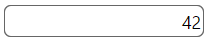
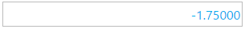

import ApiLink from 'docs-template/components/mdx/ApiLink.astro';

# igNumericEditor のスタイル設定とテーマ設定

`igNumericEditor` コントロールは、jQuery ベースのコントロールで、多くのスタイル設定オプションがあります。数値エディターのスタイルをカスタマイズするには、さまざまなテーマを使用する、またはカスタム CSS ルールをコントロールに直接適用します。 

&#123;environment:ProductName&#125; パッケージには、いくつかの jQuery UI や Bootstrap テーマが用意されています。また Bootstrap は、独自のブートストラップのテーマの生成やカスタマイズをサポートしています。詳細は、[スタイル設定とテーマ設定](/deployment-guide-styling-and-theming)を参照してください。エディターを含めたページ上のすべてのコントロールのスタイルは、どのテーマでも設定できます。

## ThemeRoller の使用

`igNumericEditor` コントロールは jQuery UI CSS フレームワークを使用するため、[jQuery UI ThemeRoller](http://jqueryui.com/themeroller/) を使用してすべてのスタイルを設定することもできます。これにより、独自に作成したテーマのカスタマイズや使用可能なギャラリーからのテーマの選択ができます。これらのテーマは、&#123;environment:ProductName&#125; のデフォルトのテーマと置き換えられます。

ドロップ リストを使用する数値エディターで UI Darkness テーマを使用:



## カスタム スタイル

ご使用の CSS には、数値エディターの多くの要素にスタイル オーバーライドが含まれている場合があります。使用可能なすべてのクラスについては、<ApiLink type="igNumericEditor" label="API リファレンスのテーマ設定クラス" />を参照してください。スタイルを適用するには、すべてのエディターに摘要されたグローバル クラスをオーバーライドする、またはID や他の特定の trait で特定の要素をターゲットとして指定し、コントロールごとにカスタマイズできるようにします。

`igNumericEditor` はデフォルトで、負の値を赤色で表示します。以下の例では、この色を変更する方法を示します。

```html
<style>
.ui-igedit-negative
{
	color: #00aeef;
}
</style>
```



## 関連トピック  

-   [igNumericEditor の概要](/ignumericeditor-overview)


 


