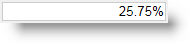

# igPercentEditor の概要

##igPercentEditor の概要


\{environment:ProductName\}™ のパーセント エディター、すなわち `igPercentEditor` は、パーセント形式に書式設定された数値のみを受け付ける入力フィールドを描画するコントロールです。`igPercentEditor` コントロールは、ブラウザーから公開される異なる地域のオプションを認識することにより、ローカライズをサポートします。

`igPercentEditor` コントロールは大幅にスタイル変更ができるため、デフォルトのスタイルとまったく異なるルック アンド フィールのコントロールを実現できます。スタイル設定オプションでは、独自のスタイルも jQuery UI の `ThemeRoller` のスタイルも使用できます。

図 1: ユーザー向けに描画した `igPercentEditor`



[基本的な使用方法サンプル](\{environment:SamplesUrl\}/editors/basic-usage)

##機能

`igPercentEditor` には以下の特徴があります。

-   全体のテーマのサポート
-   JavaScript クライアント API
-   ASP.NET MVC


##igPercentEditor の Web ページへの追加


1.  最初に、アプリケーションに必要なローカライズ済みのリソースを含めます。組み込むリソースの詳細は、「[\{environment:ProductName\} で JavaScript リソースを使用](/deployment-guide-javascript-resources)」ヘルプ トピックをご覧ください。
2.  ご自分の HTML ページまたは ASP.NET MVC View で、必要な JavaScript ファイル、CSS ファイル、および ASP.NET MVC アセンブリを参照してください。

    **HTML の場合:**

```html
    <link type="text/css" href="/css/themes/infragistics/infragistics.theme.css" rel="stylesheet" />
    <link type="text/css" href="/css/structure/infragistics.css" rel="stylesheet" />
    <script type="text/javascript" src="/Scripts/jquery.min.js"></script>
    <script type="text/javascript" src="/Scripts/jquery-ui.min.js"></script>
    <script type="text/javascript" src="/Scripts/Samples/infragistics.core.js"></script>
	<script type="text/javascript" src="/Scripts/Samples/infragistics.lob.js"></script>
```

    **Razor の場合:**

```csharp
    @using Infragistics.Web.Mvc;

    <link type="text/css" href="@Url.Content("~/css/themes/infragistics/infragistics.theme.css")" rel="stylesheet" />
    <link type="text/css" href="@Url.Content("~/css/structure/infragistics.css")" rel="stylesheet" />

    <script type="text/javascript" src="@Url.Content("~/Scripts/jquery-1.9.1.min.js")"></script>
    <script type="text/javascript" src="@Url.Content("~/Scripts/jquery-ui.min.js")"></script>
    <script type="text/javascript" src="@Url.Content("~/Scripts/Samples/infragistics.core.js")"></script>
	<script type="text/javascript" src="@Url.Content("~/Scripts/Samples/infragistics.lob.js")"></script>
    <script type="text/javascript" src="@Url.Content("~/Scripts/Samples/modules/i18n/regional/infragistics.ui.regional-en.js")"></script>
```

3.  jQuery の実装では、HTML 内のターゲット要素として INPUT、DIV、または SPAN を作成します。ASP.NET MVC の実装では、含める要素を \{environment:ProductNameMVC\} が作成するため、この手順はオプションです。

    **HTML の場合:**

```html
    <input id="percentEditor" />
```

4. 上記の手順完了後、数値エディターを初期化します。

    >**注:** ASP.NET MVC View では、その他のオプションをすべて設定した後で `Render` メソッドを呼び出す必要があります。

    **JavaScript の場合:**

```js
    <script type="text/javascript">
      $('#percentEditor').igPercentEditor();
    </script>
```

    **Razor の場合:**

```csharp
	@(Html.Infragistics().PercentEditor()
		.ID("percentEditor")
		.Render())
```

5.  Web ページを実行し、`igPercentEditor` コントロールの基本セットアップを表示します。

##関連リンク

-   [基本的な使用方法サンプル](\{environment:SamplesUrl\}/editors/basic-usage)
-   [\{environment:ProductName\} の概要](/igniteui-for-jquery-overview)
-   [\{environment:ProductName\} で JavaScript リソースを使用](/deployment-guide-javascript-resources)

 

 


