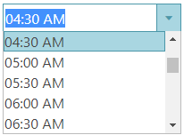

---
title: "igTimePicker の概要"
slug: igtimepicker-overview
---

# igTimePicker の概要


&#123;environment:ProductName&#125;™ `igTimePicker` では、時刻のみの入力と指定した時刻：分の値を含むドロップダウンのあるエディターを使用できます。デフォルトで、リストされる時間値は 30 分のデルタがあります。 

`igTimePicker` 入力および表示書式設定は構成可能です。デフォルトでコントロールは 12 時間形式を使用します。

指定した時間形式 (12 時間、または 24 時間の形式) により、ドロップダウン リストが 12:00 AM または 00:00 AM から開始し、11:30 PM または 23:30 PM に終了します。

コントロールは、ブラウザーに提供されるさまざまな地域のオプションを認識することにより、ローカライズをサポートします。

`igTimePicker` コントロールは、任意のサーバー技術を使用して作業を構成できる豊富なクライアント側 API を公開します。&#123;environment:ProductName&#125;™ のコントロールはサーバー非依存ですが、Microsoft® ASP.NET MVC Framework 専用のラッパーが提供するピッカー コントロールでは、希望する .NET™ 言語を使用してコントロールを構成できます。

`igTimePicker` コントロールは、大幅にスタイル変更ができるため、デフォルトのスタイルとまったく異なるルック アンド フィールのコントロールを実現できます。スタイル設定オプションでは、独自のスタイルも jQuery UI の ThemeRoller のスタイルも使用できます。

図 1: igTimePicker コントロールによる時間選択



-   [igTimePicker のサンプル](&#123;environment:SamplesUrl&#125;/editors/time-picker-overview)


## 機能

`igTimePicker` には以下の特徴があります。

-   全体のテーマのサポート
-   検証
-   [多様なモード](#button-types)
-   [カスタム入力形式の定義](#time-formats)
-   [カスタム表示形式の定義](#time-formats)
-   [最小値と最大値](#min-max-values)
-   ローカライズ
-   JavaScript クライアント API
-   ASP.NET MVC

## igTimePicker の Web ページへの追加

1.  最初にアプリケーションに必要なローカライズ済みのリソースを含めます。組み込みリソースの詳細は、「[&#123;environment:ProductName&#125; で JavaScript リソースを使用](/general-and-getting-started/deployment-guide-javascript-resources)」ヘルプ トピックを参照してください。
2.  HTML ページまたは ASP.NET MVC View で、必要な JavaScript ファイル、CSS ファイル、および ASP.NET MVC アセンブリを参照します。

    **HTML の場合:**

```html
    <link type="text/css" href="/css/themes/infragistics/infragistics.theme.css" rel="stylesheet" />
    <link type="text/css" href="/css/structure/infragistics.css" rel="stylesheet" />
    <script type="text/javascript" src="/Scripts/jquery.min.js"></script>
    <script type="text/javascript" src="/Scripts/jquery-ui.min.js"></script>
```

    **Razor の場合:**

```csharp
    @using Infragistics.Web.Mvc;

    <link type="text/css" href="@Url.Content("~/css/themes/infragistics/infragistics.theme.css")" rel="stylesheet" />
    <link type="text/css" href="@Url.Content("~/css/structure/infragistics.css")" rel="stylesheet" />

    <script type="text/javascript" src="@Url.Content("~/Scripts/jquery-1.9.1.min.js")"></script>
    <script type="text/javascript" src="@Url.Content("~/Scripts/jquery-ui.min.js")"></script>
```

3.  jQuery の実装では、HTML 内のターゲット要素として `INPUT`、`DIV`、または `SPAN` を作成します。ASP.NET MVC の実装では、含める要素を &#123;environment:ProductNameMVC&#125; が作成するため、この手順はオプションです。

    **HTML の場合:**

```html
    <input id="timePicker"/>
```

4. 上記の手順完了後、タイムピッカーを初期化します。

    > **注:** ASP.NET MVC View では、その他のオプションをすべて設定した後で `Render` メソッドを呼び出す必要があります。

    **JavaScript の場合:**

```js
    <script type="text/javascript">
          $('#timePicker').igTimePicker();
    </script>
```

    **Razor の場合:**

```csharp
    @(Html.Infragistics().TimePicker()
                 .ID("timePicker")
                 .Render())
```

5.  Web ページを実行し、`igTimePicker` コントロールの基本セットアップを表示します。

## igTimePicker の構成

### <a id="time-formats"></a>時間書式設定

`timeInputFormat` および `timeDisplayFormat` オプションは、コントロールが編集されている場合および値を表示している場合に時間の書式設定を指定します。

指定した書式が設定されない場合、`timeInputFormat` はデフォルトの "time" 値に設定されます。"time" などのプリセット値は領域オプションによって定義されるパターンにマップします。  

サポートされる書式設定は[日付および時間の書式設定](/general-and-getting-started/formatting-dates-numbers-and-strings)のパターンを使用します。時間形式は、一般的な時間指定子を使用して定義することもできます。たとえば、"HH:mm" の形式は "16:35" のように時間を表示します。"HH" は 24 時間形式で時刻の数値を、"mm" は AM/PM を除く分の数値を表示します。


### <a id="button-types"></a>ボタン タイプ
`buttonType` オプションはタイムピッカー コントロールに適用されるボタンのタイプを定義します。このオプションは提供される操作も定義します。使用可能なボタン タイプは以下の通りです。

- **clear** - クリア ボタンがエディターに追加されます。
- **dropdown** - 時間項目を含むドロップダウン リストを開くドロップダウン ボタンが追加されます。
- **none** - ボタンのないエディターが表示されます。
- **spin**  - 時間部分を増減するためのスピン ボタンが追加されます。 

 >**注:** このオプションはランタイムに設定できず、"dropdown, spin" などの組み合わせは使用できません。

### 項目のデルタおよびスピン デルタ

`itemsDelta` オプションは表示される連続時間項目の間のデルタを指定します。デフォルトの項目デルタは 30 分です。このオプションは、<kbd>上矢印</kbd>および<kbd>下矢印</kbd>を使用する場合の増減のステップも定義します。`buttonType` を "dropdown" に設定する場合、このオプションを使用します。

`spinDelta` オプションは、タイムピッカー コントロールでスピン ボタンが使用される場合に適用される増減のステップを指定します。このオプションは、<kbd>上矢印</kbd>および<kbd>下矢印</kbd>を使用する場合の増減のステップも定義します。`buttonType` を "spin" に設定する場合、このオプションを使用します。入力にフォーカスがない場合、スピン ボタンをクリックすると分の部分が変更されます。

`limitSpinToCurrentField` オプションを true に設定すると、スピン操作が単一の時間フィールドに制限され、他のフィールドに影響しません。

### <a id="min-max-values"></a>最小値と最大値

`minValue` および `maxValue` オプションは、タイムピッカーに表示/入力可能な最小値または最大値を指定します。この 2 つのオプションはコントロール ドロップダウン リストの項目の範囲も定義します。 

### ISO 日付書式のサポート
ISO 形式の日付をサポートするには、タイムピッカーの値を文字列ではなく日付に設定する必要があります。

```js
$("#timePicker").igTimePicker("option","value", new Date("2019-02-21T00:00:00.000Z"));
```   


   


