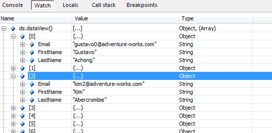

# igGrid の XML へのバインド

## 概要

\{environment:ProductName\}™ データ ソース コントロールまたは `igDataSource` は、名前空間付きおよび名前空間のない XML ドキュメントの両方にシームレスにバインドできます。 

名前空間付き XML の制限の 1 つは、ほとんどのブラウザーで、XPath 式の実行をネイティブでサポートしていない点です。幸い、データ ソース コントロールが初めから XPath 式をサポートしているので、XML の特定の部分をポイントして、ご自分のスキーマに含めることができます。 

コントロールがバインドされると、ご使用のすべてのデータを JavaScript オブジェクトの配列の形で使用できます。

このドキュメントでは、XML データをロード、変換、バインドする方法、および、`ページング`、`並べ替え`、`フィルタリング`の機能をコントロールに適用する方法を説明します。

## 例

リスト 1 に示すような、人物の集合を定義する XML 構造を考えます。

**リスト 1:** XML で宣言した人物データ

**XML の場合:**

```xml
<personContacts>
  <person>
    <generalInfo contactID="1" firstName="Gustavo" lastName="Achong" emailPromotion="true">
    	gustavo0@adventure-works.com
	</generalInfo>
    <modifiedDate FictionalFloat="0.31831">May 16 2005 4:33</modifiedDate>
  </person>
  <person>
    <generalInfo contactID="2" firstName="Catherine" middleName="R." lastName="Abel" emailPromotion="true">
    	catherine0@adventure-works.com
	</generalInfo>
    <modifiedDate FictionalFloat="0.63662">May 16 2005 4:33</modifiedDate>
  </person>
</personContacts>
```

最初の手順で、ドキュメントをロードします。リスト 2 はサーバーからドキュメントをロードするための手法の 1 つを示しています。別の実装方法も可能です。

> **注:** リスト 2 の手法では、データが Web ページと同じサーバー上にあると想定しています。

**リスト 2:** XML ドキュメントのロード

**JavaScript の場合:**

```js
function loadXMLDoc(dname) {
    if (window.XMLHttpRequest) {
    	xhttp = new XMLHttpRequest();
    }
    else {
    	xhttp = new ActiveXObject("Microsoft.XMLHTTP");
    }
    xhttp.open("GET", dname, false);
    xhttp.send();
    return xhttp.responseText;
}
```

> **注:** 手動で `XMLHttpRequest` を呼び出さずに、jQuery の `$.ajax`API を使用する選択も可能です。

次に、データ ソース コントロールには、受け取る XML を解釈するためのデータ スキーマが必要です。リスト 3 に、データ スキーマ (`$.ig.DataSchema`) を作成し、それをデータ ソース コントロール (`$.ig.DataSource` クラス) に適用する方法を示します。

**リスト 3:** データ スキーマの構成とデータ ソースのバインド

**JavaScript の場合:**

```js
$(document).ready(function () {
var xmldoc = loadXMLDoc("http://myurl.com/XML100.Pretty.Printed.xml")
    var xmlSchema = new $.ig.DataSchema("xml", { 
           fields: [
               { name: "FirstName", xpath: "generalInfo/@firstName" }, 
               { name: "LastName", xpath: "generalInfo/@lastName" }, 
               { name: "Email", xpath: "generalInfo"}], 
           searchField: "//person" 
       });

    var ds = new $.ig.DataSource({ 
           type: "xml", 
           dataSource: xmldoc, 
           schema: xmlSchema 
       });

    ds.dataBind();
}
```

この例では、次の点に注意が必要です。

-   XPath: すべてのフィールド定義に「xpath」プロパティを指定することによって、フィールドがどのように定義されるかに注意してください。これは、XML データソースに特有です。このようにして、リストにあるすべての階層オブジェクトにおいて、バインドするプロパティへのパスをデータ ソースに伝えます。
-   XPath 式を使用して `searchField` が再び定義される方法に注意してください。基本的にこの式は、バインドする必要のあるビジネス オブジェクトが Xpath 式 "//person" によって返されるものであることをデータ ソースに伝えます。
-   値へのバインドも非常に簡単です。その一例は Email フィールドです。この場合、XPath プロパティは「generalInfo」のみです。
-   また、ノード属性へのバインドは、構文 "generalInfo/@lastName" に従って実現できます。
-   スキーマを作成した後、データ ソースに渡され、そのタイプが「xml」に設定されます。
-   `dataSource` 初期化コードの `dataSource` プロパティは、XML データの文字列かすでに渡された XML Document オブジェクトのどちらかをポイントできます (データ ソースは内部的に両者を処理します)。

図 1 に、データ バインド後のデータ ソース状態を示します。

**図 1:** バインド後のデータ ソース オブジェクトからの出力




<div class="embed-sample">
   [XML のバインド](\{environment:SamplesEmbedUrl\}/grid/xml-binding)
</div>

## 関連トピック

-   [igDataSource の概要](/igdatasource-igdatasource-overview)
-   [DataSchema を使用したデータ変換の実行 (igDataSource)](/igdatasource-using-dataschema)

 

 


