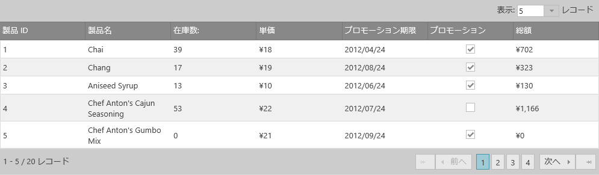

---
title: "igGrid を OData サービスにバインディング"
slug: iggrid-binding-to-web-services
---

# igGrid を OData サービスにバインディング

## 概要

igGrid のデータ ソースと機能は、OData サービスでも直接使用できますが、構成に関するいくつかの前提条件があります。以下のセクションで、oData バインディングのために igGrid を構成する場合の注意事項を説明し、Entity Framework OData サービスにバインドする方法のチュートリアルを紹介します。

## oData サービスにバインドする場合の igGrid のセットアップ
データをリモート サービスから取得する場合、データ レコードの入っているオブジェクトが他のオブジェクトでラップされているかどうかチェックすることが重要です。サービスから返されるデータが応答オブジェクトでラップされている場合、グリッドのためのデータ レコードを含む応答で、オブジェクトをポイントする responseDataKey を設定する必要があります。たとえば、応答データが以下の書式を持つサービスについて考えます。


```
 {  "odata.metadata":"http://localhost/odata/$metadata#Products&$select=ProductID,ProductName,QuantityPerUnit,UnitPrice,UnitsInStock",
"odata.count":"79",
"value":[
    {
      "ProductID":1,"ProductName":"Chai",
"QuantityPerUnit":"10 boxes x 20 bags",
"UnitPrice":"18.0000","UnitsInStock":39
    },
{
      "ProductID":2,"ProductName":"Chang",
"QuantityPerUnit":"24 - 12 oz bottles",
"UnitPrice":"19.0000","UnitsInStock":17
    }
…
]
}

```
グリッドを実際のデータ レコードに正しくバインドするには、グリッドの responseDataKey プロパティを、値オブジェクトでレコードを探すための値に設定しなければなりません。

また、リモート ページングが有効な場合、ページング機能の recordCountKey オプションを、レコードの合計数の入った応答のプロパティに対応する値に設定しなければなりません。たとえば、データ応答が上の例のようなフォーマットである場合、recordCountKey を 現在のレコード数の入ったオプションである odata.count に設定する必要があります。

デフォルトでは、igGrid は JavaScript で初期化されるときに oData 要求を送信します。

ただし、&#123;environment:ProductNameMVC&#125; Grid は、Infragistics.Web.Mvc.dll が提供する組み込みリモート機能サポートにより使用される異なる要求パラメーターを使用します。そのため、oData サービスへのバインドにそれを使用する場合は、対応する機能 URL パラメーターを null に設定する必要があります。


## チュートリアル: EntityFramework を使用する OData サービスにバインドされた MVC アプリケーションでの igGrid の作成

###概要
この手順では、Entity Framework を使用して SQL データベースからデータを取得する OData サービスとともに MVC アプリケーションで igGrid を作成するプロセスを手順を追って示します。

###要件
この手順を完了するには、コンピューター に &#123;environment:ProductName&#125; 製品がインストールされ、SQL サーバーに Northwind Database がインストールされている必要があります。
この手順では、Visual Studio 2013 および MVC5 を使用することも仮定しています。 

###概要
1.	プロジェクトのセットアップ
2.	モデルの作成
3.	oData サービスの作成
4.	ビューの作成 
5.	igGrid の定義

###手順

1.	プロジェクトのセットアップ

  - Visual Studio 2013 で、新しい ASP.NET Web アプリケーションを作成します。表示されたプロンプトで、「空の」テンプレートを選択し、Web API および MVC のためのフォルダーとコア参照を追加するチェックボックスをオンにします。

  -	パッケージ マネージャー コンソールまたは Nuget Packages ダイアログのいずれかを使用して、Nuget から以下のパッケージをインストールします。
  
		- jQuery

		- jQuery.UI.Combined

		- EntityFramework

		- Modernizr

	- *System.Runtime.Serialization* への参照を追加します。
    - *Infragistics.Web.Mvc* への参照を追加し、*Copy Local* オプションが *true* に設定されていることを確認します。 
    - &#123;environment:ProductName&#125; スクリプト ファイルを **Scripts** フォルダーに追加します。
    - &#123;environment:ProductName&#125; CSS ファイルと画像を **Content** フォルダーに追加します。
    - ソリューションをビルドし、すべてがコンパイルされたことを確認します。
    
2. モデルの作成

	- *Product* クラスを作成します。
        
    **C# の場合:**   
    
```csharp
    public class Product
    {
     public int ProductID { get; set; }
     public string ProductName { get; set; }
     public int CategoryID { get; set; }
     public string QuantityPerUnit { get; set; }
     public decimal? UnitPrice { get; set; }
     public short? UnitsInStock { get; set; }
     public bool Discontinued { get; set; }
    }
```

	- DbContext から派生する NorthwindContext と呼ばれるクラスを追加します。前のステップで追加した Product クラスの DbSet を追加します。    
          
    **C# の場合:**   
    
```csharp
     public class NorthwindContext : DbContext
    {
      	public DbSet<Product> Products { get; set; }
    }

```
     
	- Northwind データベースに接続するために、web.config ファイルに接続文字列を追加し、その名前が *DbContext* クラスと一致することを確認します。
    
```
    <connectionStrings>
    <add name="NorthwindContext" connectionString="data source=.;
		initial catalog=Northwind;integrated security=True;
		MultipleActiveResultSets=True;App=EntityFramework" 
		providerName="System.Data.SqlClient"/>
  </connectionStrings>

```
- oData サービスの作成
    
    - Controllers フォルダーに新しいコントローラーを追加します。Add Scaffold ダイアログで、“Web API 2 OData Controller with actions, using Entity Framework” を選択します。以下の設定を適用します。
        - コントローラ名: *ProductsController*
        - モデル名: *Product*
        - データ コンテキスト クラス: *NorthwindContext* (または DbContext クラスに対して使用した名前)
       
       これらの設定を使用して、Visual Studio は Product エンティティをターゲットにする OData サービスを作成します。   Get、Put、Post、Patch、および Delete のためのメソッドが作成されます。    
       
    - App_Start\WebApiConfig.cs を開き、Products エンドポイントを公開するように Register メソッドを変更します。oData ルーティング規約をサポートするようにルートを変更する必要があります。
    
    **C# の場合**
    
```
public static void Register(HttpConfiguration config)
{
   ODataConventionModelBuilder builder = 
  new ODataConventionModelBuilder();    
  builder.EntitySet<Product>("Products");
  config.Routes.MapODataRoute("odata", "odata", 
  builder.GetEdmModel());
}    
```

- ビューの作成 
    
    - *HomeController* という名前の新しい空の MVC 5 コントローラーを作成します。
        
    - *HomeController* で、Index を右クリックし、Add View を選択します。
        
    - Add View ダイアログで、Template を Empty に変更します (モデルなし)。下のすべてのチェックボックスがオフであることを確認し、Add をクリックします。
        
    - *Index.cshtml* の先頭に、*Infragistics.Web.Mvc* の using ステートメントを追加します。(IntelliSense がこの作業を支援します) Infragistics アセンブリが認識されない場合、ビューを閉じ、アプリケーションをコンパイルして、*Infragistics.Web.Mvc* アセンブリが bin フォルダーにコピーされていることを確認してください。ビュー ファイルを再度オープンすると、今度は Infragistics 参照が認識されるはずです。
        
    - Index.cshtml で、jQuery、jQuery UI、Modernizr、および &#123;environment:ProductName&#125; コントロール用の JavaScript 参照を追加します。  
        
         **HTML の場合:**
         
```html
        <script src="@Url.Content("Scripts/jquery-2.1.1.js")"></script>
        <script src="@Url.Content("Scripts/jquery-ui-1.10.4.js")"></script>
        <script src="@Url.Content("Scripts/modernizr-2.7.2.js")"></script>         
        <script src="@Url.Content("Scripts/Infragistics/infragistics.core.js")"></script>
        <script src="@Url.Content("Scripts/Infragistics/infragistics.lob.js")"></script>

```
    - *Index.cshtml* で、ドキュメントの *HEAD* に Infragistics テーマと構造スタイル シートへのリンクを追加します。
         
         **HTML の場合:**
         
```html
<link href="@Url.Content("Content/Infragistics/themes/infragistics/infragistics.theme.css")" rel="stylesheet" />
    <link href="@Url.Content("Content/Infragistics/structure/modules/infragistics.css")" rel="stylesheet" />
```
- ページで &#123;environment:ProductName&#125; グリッドを作成します。
        
     レコード型として Product クラスを使用する igGrid の宣言を追加します。DataSourceUrl プロパティは、サービスの Products エンドポイントをポイントしている必要があります。ResponseDataKey プロパティは、応答でデータを入れるプロパティの名前に設定する必要があります。この例では value です。DataBind メソッドと Render メソッドを追加して、コントロールが DataSource にバインドされ、マークアップに対して描画されるようにします。
        
```
  @(Html.Infragistics().Grid<igGrid_With_WebAPI.Models.Product>().ID("grid1")
  .Width("900px").Height("500px")
  .DataSourceUrl("/odata/Products")
  .ResponseDataKey("value")
  .DataBind()
  .Render()   
```
     列を指定する場合は、*AutoGenerateColumns* オプションを *false* に設定し、その列を明示的に定義できます。
        
```
.AutoGenerateColumns(false)
.Columns(column =>
{
    column.For(p => p.ProductID).HeaderText("Product ID")
		.Width("100px");
    column.For(p => p.ProductName).HeaderText("Product Name")
		.Width("250px");
    column.For(p => p.QuantityPerUnit).HeaderText("Quantity Per Unit")
		.Width("250px");
    column.For(p => p.UnitPrice).HeaderText("Unit Price")
		.Width("100px");
    column.For(p => p.UnitsInStock).HeaderText("Units In Stock")
		.Width("150px");
})

```
	リモート ページング、並べ替え、フィルタリングを有効にします。これらの各機能の *Type* は、*OpType.Remote* に設定します。

	ページング機能の *RecordCountKey* オプションは、データ ソースでレコード数を含むデータ ソースのオブジェクトに設定します。この例では、*odata.count* に設定します。その他の Url キーはすべて *null* に設定しなければなりません。

```
.Features(features =>
    {
          features.Paging().PageSize(10).Type(OpType.Remote)
              .PageIndexUrlKey(null).PageSizeUrlKey(null)
              .RecordCountKey("odata.count");
          features.Sorting().Type(OpType.Remote)
              .SortUrlKeyDescValue(null)
              .SortUrlAscValueKey(null)
              .SortUrlKey(null);
          features.Filtering().Type(OpType.Remote)
              .FilterExprUrlKey(null)
              .FilterLogicUrlKey(null);
    })

```
             
  以上のステップを完了した最終コードは、以下のようになります。
  
```
  @(Html.Infragistics().Grid<igGrid_With_WebAPI.Models.Product>().ID("grid1")
    .AutoGenerateColumns(false)
    .Columns(column =>
    {
        column.For(p => p.ProductID).HeaderText("Product ID")
        .Width("100px");
        column.For(p => p.ProductName).HeaderText("Product Name")
        .Width("250px");
        column.For(p => p.QuantityPerUnit)
        .HeaderText("Quantity Per Unit").Width("250px");
        column.For(p => p.UnitPrice).HeaderText("Unit Price")
        .Width("100px");
        column.For(p => p.UnitsInStock).HeaderText("Units In Stock")
        .Width("150px");
    })
    .Features(features =>
    {
        features.Paging().PageSize(10).Type(OpType.Remote)
            .PageIndexUrlKey(null).PageSizeUrlKey(null)
            .RecordCountKey("odata.count");
        features.Sorting().Type(OpType.Remote)
            .SortUrlKeyDescValue(null)
            .SortUrlAscValueKey(null)
            .SortUrlKey(null);
        features.Filtering().Type(OpType.Remote)
            .FilterExprUrlKey(null)
            .FilterLogicUrlKey(null);
    })
    .Width("900px").Height("500px")
    .DataSourceUrl("/odata/Products")    
    .ResponseDataKey("value")
    .DataBind()
    .Render()
)
```

-	アプリケーションのコンパイルと実行

グリッドは最初にデータなしでロードされますが、サービスからデータがフェッチされると、AJAX インジケーターが表示されます。データが取得されると、グリッドは以下のようになります。



ブラウザーの開発者 ツールを使用して要求を検査すると、グリッドは現在描画する必要のあるレコードのみを要求していることが確認できます。初期要求 URL には、*$skip* パラメーターと *$top* パラメーターが含まれます。これは、リモート ページング機能が現在のページのためのデータのみを返し、グリッドにバインドするためです。初期応答は、以下のようになります。

**JavaScript の場合**

```
{
  "odata.metadata":"http://localhost/odata/$metadata#Products&$select=ProductID,ProductName,QuantityPerUnit,UnitPrice,UnitsInStock","odata.count":"77","value":[
    {
      "ProductID":1,"ProductName":"Chai","QuantityPerUnit":"10 boxes x 20 bags","UnitPrice":"18.0000","UnitsInStock":39
    },{
      "ProductID":2,"ProductName":"Chang","QuantityPerUnit":"24 - 12 oz bottles","UnitPrice":"19.0000","UnitsInStock":17
    },{
      "ProductID":3,"ProductName":"Aniseed Syrup","QuantityPerUnit":"12 - 550 ml bottles","UnitPrice":"10.0000","UnitsInStock":13
    },{
      "ProductID":4,"ProductName":"Chef Anton's Cajun Seasoning","QuantityPerUnit":"48 - 6 oz jars","UnitPrice":"22.0000","UnitsInStock":53
    },{
      "ProductID":5,"ProductName":"Chef Anton's Gumbo Mix","QuantityPerUnit":"36 boxes","UnitPrice":"21.3500","UnitsInStock":0
    },{
      "ProductID":6,"ProductName":"Grandma's Boysenberry Spread","QuantityPerUnit":"12 - 8 oz jars","UnitPrice":"25.0000","UnitsInStock":120
    },{
      "ProductID":7,"ProductName":"Uncle Bob's Organic Dried Pears","QuantityPerUnit":"12 - 1 lb pkgs.","UnitPrice":"30.0000","UnitsInStock":15
    },{
      "ProductID":8,"ProductName":"Northwoods Cranberry Sauce","QuantityPerUnit":"12 - 12 oz jars","UnitPrice":"40.0000","UnitsInStock":6
    },{
      "ProductID":9,"ProductName":"Mishi Kobe Niku","QuantityPerUnit":"18 - 500 g pkgs.","UnitPrice":"97.0000","UnitsInStock":29
    },{
      "ProductID":10,"ProductName":"Ikura","QuantityPerUnit":"12 - 200 ml jars","UnitPrice":"31.0000","UnitsInStock":31
    }
  ]
}
```

ページまたはページ サイズを変更すると、クエリ パラメーターは適切に更新され、データの新しいセットが返されます。並べ替えとフィルタリングを使用する場合、クエリ パラメーター *$orderby* および *$filter* も追加されます。

## 関連リンク

-   [*igDataSource* を REST サービスへバインド](/igdatasource-binding-to-rest-services)

 

 


