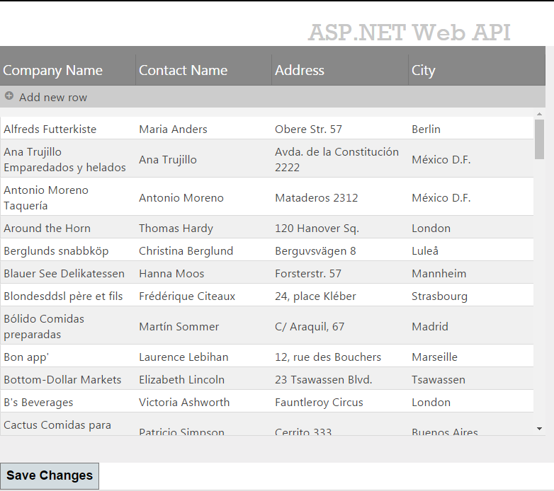
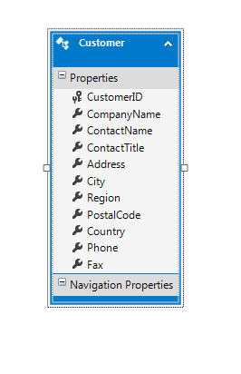

import ApiLink from 'docs-template/components/mdx/ApiLink.astro';

# ASP.NET MVC WebAPI へのバインド

## トピックの概要

### 目的
このトピックでは、igGrid™ を Web API サービスにバインドする方法を説明します。

### 前提条件
以下のリストは、このトピックを理解するための前提条件として必要なトピックへのリンクを提供します。

- [REST の更新 (igGrid)](/iggrid-rest-updating): このトピックでは、REST サービスでの igGrid サポートについて説明します。
- [igGrid の概要](/iggrid-overview): このトピックでは、機能、データ ソースへのバインド、要件、テンプレート、相互作用に関する情報を含めて、igGrid コントロールの概要を示します。

### このトピックの内容

このトピックは、以下のセクションで構成されます。

-   [ASP.NET MVC Web API へのバインド – 概念的な概要](#overview)
-   [ASP.NET MVC Web API へのバインド – 例](#example)
-   [関連コンテンツ](#related-content)

## ASP.NET MVC Web API へのバインド – 概念的な概要

### REST サービスへのバインドの概要

MVC4 Web API への igGrid のバインドは次の 2 段階のプロセスです。

-   クライアント側の REST 設定の構成
-   サーバー側の REST 設定の構成

Web API は、JSON、XML、および フォーム　URL エンコード データのシリアル化をデフォルトでサポートします。`$.ig.RESTDataSource` は、デフォルトで JSON のシリアル化をサポートします。この例では JSON が使用されています。

#### 要件

ASP.NET MVC 4 Web API へのバインドに関する一般的な要件を以下に示します。

-   ASP.NET MVC 4

#### 手順

ASP.NET MVC 4 Web API へバインドする手順の概要は、次のようになります。

1. モデルのセットアップ。
2. REST 設定による *igGrid* の初期化
3. *igGrid* のコントローラー アクションの構成


## ASP.NET MVC Web API へのバインド – 例

### 概要

このサンプルでは、igGrid をバインドし、REST 更新を有効にする方法を説明します。 

この例では、`Northwind` データベースの `Customers` テーブルのデータが使用されています。

### プレビュー

以下のスクリーンショットは最終結果のプレビューです。



### 前提条件

この手順を実行するには、以下が必要です。

-   Microsoft® Visual Studio 2010 またはそれ以降のバージョンのインストール
-   MVC 4 Framework のインストール
-   Northwind データベースのインストール
-   Infragistics.Web.Mvc.dll
-   &#123;environment:ProductName&#125; JavaScript とテーマ ファイル

### 手順

以下の手順では、igGrid を MVC 4 Web API にバインドする方法を示します。

### 手順 1: プロジェクトをセットアップします。

1. プロジェクトを作成します。
  - Visual Studio のメニューから、[ファイル] ｰ＞ [新規プロジェクト] を選択します。
  - 左側にある [インストール済みのテンプレート] から、[Visual C#] -> [Web] を選択します。
  - 中央にあるプロジェクトの一覧から [ASP.NET MVC 4 Web アプリケーション] を選択します。
  - [名前] フィールドに「igGridRESTSample」と入力し、[OK] ボタンを押します。
  - [新規 ASP.NET MVC プロジェクト] ダイアログから [Web API] を選択して [OK] ボタンを押します。

2. `Infragistics.Web.Mvc.dll` への参照を追加します。
  - 参照フォルダーを右クリックして [参照の追加…] を選択します。
  - `Infragistics.Web.Mvc.dll` を [.NET] タブから選択するか、[参照] から探し出して選択します。

3. &#123;environment:ProductName&#125; スクリプトへの参照を追加します。
  - &#123;environment:ProductName&#125; 配布可能ファイルをプロジェクトのスクリプト ディレクトリにコピーします。
  - `Views\Shared` フォルダーにある `_Layout.cshtml` ファイルに Infragistics ローダーへの参照を追加します。

**HTML の場合:**

```html
<script src="http://ajax.aspnetcdn.com/ajax/modernizr/modernizr-2.8.3.js"></script>
<script src="http://code.jquery.com/jquery-1.11.3.min.js"></script>
<script src="http://code.jquery.com/ui/1.11.1/jquery-ui.min.js"></script>
<script src="~/Scripts/Infragistics/js/infragistics.loader.js"></script>
```

`Views\Shared` フォルダーにある `_Layout.cshtml` ファイルに以下の行を追加します。

**C# の場合:**

```csharp
@Scripts.Render("~/bundles/modernizr")
@Scripts.Render("~/bundles/jquery")
```

## 手順 2: モデルをセットアップします。

### エンティティ モデルを作成します。
`Northwind` データベースの *Customers* テーブルのための ADO.NET エンティティー データ モデルを追加し、`NorthwindModel` という名前を付けます。



### Customer モデル クラスを作成します。
この例で必要とされるのは `Customer` フィールドのサブセットだけであるため、必要なデータだけを格納する別のクラスを作成します。

  - `Customer` クラスを作成します。
  - 新しいクラスを Models フォルダーに追加して、そのクラスに「`Customer.cs`」という名前を付けます。

以下のプロパティを `Customer.cs` ファイルに追加します。

**C# の場合:**

```csharp
public class Customer
{
    public string CustomerID { get; set; }
    public string CompanyName { get; set; }
    public string ContactName { get; set; }
    public string Address { get; set; }
    public string City { get; set; }
}
```


## 手順 3: REST 設定で *igGrid* を初期化します。

### Home コントローラーを構成します。
`Index` アクション メソッドを以下のコードに置き換えます。

**C# の場合:**

```csharp
public ActionResult Index()
{
    NorthwindModel.NorthwindEntities db = new NorthwindModel.NorthwindEntities();
    var customers = from c in db.Customers
                    select new Customer() { CustomerID = c.CustomerID, CompanyName = c.CompanyName, ContactName = c.ContactName, City = c.City, Address = c.Address };
    return View(customers.AsQueryable());
}
```

`Rest` プロパティを `true` に設定することによって REST サポートを有効にします。また、`RESTSettings` プロパティと更新機能も定義します。

### Home ビューを構成します。

厳密に型指定されたモデルを定義します。

**C# の場合:**

```csharp
@model IQueryable<igGridRESTSample.Models.Customer>
```

`Infragistics.Web.Mvc.dll` アセンブリを参照します。

**C# の場合:**

```csharp
@using Infragistics.Web.Mvc
```

Infragistics Loader を追加します。

**C# の場合:**

```csharp
@Html.Infragistics().Loader().ScriptPath("~/Scripts/Infragistics/js/").CssPath("~/Scripts/Infragistics /css/").Render()
```

> 注: それぞれの &#123;environment:ProductName&#125; ファイル ロケーションに合わせて `ScriptPath` と `CssPath` のロケーションを変更する必要があります。

グリッドを定義します。

**C# の場合:**

```csharp
@(Html.Infragistics().Grid(Model).
    ID("grid1").
    AutoCommit(true).
    AutoGenerateColumns(false).
    AutoGenerateLayouts(false).
    Height("500px").
    Width("700px").
    ResponseDataKey(null).
    PrimaryKey("CustomerID").
    Rest(true).
    Columns(column =>
    {
        column.For(x => x.CustomerID).HeaderText("Customer ID").DataType("string").Hidden(true);
        column.For(x => x.CompanyName).HeaderText("Company Name").DataType("string");
        column.For(x => x.ContactName).HeaderText("Contact Name").DataType("string");
        column.For(x => x.Address).HeaderText("Address").DataType("string");
        column.For(x => x.City).HeaderText("City").DataType("string");
    }).
    RestSettings(rest =>
    {
        rest.RestSetting().Create(r => r.RestVerbSetting().Url("/api/customers/").Batch(false)).
        Update(r => r.RestVerbSetting().Url("/api/customers/").Batch(false)).
        Remove(r => r.RestVerbSetting().Url("/api/customers/").Batch(false));
    }).
    Features(f => f.Updating()).
    DataSourceUrl("/api/customers/").
    Render())
```

## 手順 4: *igGrid* のコントローラー アクションを構成します。

### 1.Customers コントローラーを作成します。
Controllers フォルダーに空の Web API コントローラーを新規作成して、`CustomersController.cs` という名前を付けます。

> **注:** 通常の ASP.NET MVC コントローラーと Web API コントローラーとの違いは、前者が Controller クラスから継承し、後者が `ApiController` クラスから継承するという点にあります。

### 2.NorthwindModel プライベート フィールドを追加します。

**C# の場合:**

```csharp
private NorthwindModel.NorthwindEntities db = new NorthwindModel.NorthwindEntities();
```

### ​3.GET コントローラー アクションを定義します。

グリッドの GET 要求を処理する新しいメソッドを `CustomersController` に追加します。

**C# の場合:**

```csharp
public IEnumerable<Customer> GetCustomers()
{
    var customers = from c in db.Customers
                    select new Customer() { CustomerID = c.CustomerID, CompanyName = c.CompanyName, ContactName = c.ContactName, City = c.City, Address = c.Address };
    return customers;
}
```

`GetCustomers` メソッドで、前に定義した `Customer` オブジェクト内にある `Customers` テーブルのデータをラップします。 

> **注:** 分かりやすくするために、この例では、[リポジトリ デザイン パターン](http://msdn.microsoft.com/en-us/library/ff649690.aspx)を使用する代わりに、エンティティー フレームワーク API に直接アクセスしてデータ ストアを変更します。

### ​4.PUT コントローラー アクションを定義します。

グリッドの PUT 要求を処理する新しいメソッドを `CustomersController` に追加します。

**C# の場合:**

```csharp
public HttpResponseMessage PutCustomer(string id, Customer customer)
{
    if (ModelState.IsValid && id == customer.CustomerID)
    {
        NorthwindModel.Customer changedCustomer = new NorthwindModel.Customer()
        {
            CustomerID = customer.CustomerID,
            CompanyName = customer.CompanyName,
            ContactName = customer.ContactName,
            Address = customer.Address,
            City = customer.City
        };
        db.Customers.Attach(changedCustomer);
        db.ObjectStateManager.ChangeObjectState(customer, EntityState.Modified);
        try
        {
            db.SaveChanges();
        }
        catch (DbUpdateConcurrencyException)
        {
            return Request.CreateResponse(HttpStatusCode.NotFound);
        }
        return Request.CreateResponse(HttpStatusCode.OK, customer);
    }
    else
    {
        return Request.CreateResponse(HttpStatusCode.BadRequest);
    }
}
```

`PutCustomer` メソッドは、PUT 要求の発行時、つまり、顧客データの更新時に実行されます。id パラメーターは、ルーティング テンプレート内の `{id}` プレースホルダーに従ってマップされます。`Customer` パラメーターは既定のモデル バインダーによってコンストラクトされます。

既定のモデル バインダーのエラーは、`ModelState.IsValid` プロパティに基づいてチェックされます。そのモデルが有効なものであれば、新しい `Customer` インスタンスが `Customers` エンティティにアタッチされ、オブジェクトの状態が `EntityState.Modified` に設定されることになります。最後に、変更された顧客データが、`SaveChanges` メソッドによってデータベースに保存され、正しい状態コードが、REST の仕様どおりにクライアントへ送られます。

### ​5.POST コントローラー アクションを定義します。
グリッドの POST 要求を処理する新しいメソッドを `CustomersController` に追加します。

**C# の場合:**

```csharp
public HttpResponseMessage PostCustomer(Customer customer)
{
    if (ModelState.IsValid)
    {
        NorthwindModel.Customer newCustomer = new NorthwindModel.Customer() {
            CustomerID = customer.CustomerID,
            CompanyName = customer.CompanyName,
            ContactName = customer.ContactName,
            Address = customer.Address,
            City = customer.City
        };
        db.Customers.AddObject(newCustomer);
        db.SaveChanges();
        HttpResponseMessage response = Request.CreateResponse(HttpStatusCode.Created, customer);
        response.Headers.Location = new Uri(Url.Link("DefaultApi", new { id = customer.CustomerID }));
        return response;
    }
    else
    {
        return Request.CreateResponse(HttpStatusCode.BadRequest);
    }
}
```

`PostCustomer` メソッドは、POST 要求の発行時、つまり、顧客の新規作成時に実行されます。`Customer` パラメーターは既定のモデル バインダーによってコンストラクトされます。

既定のモデル バインダーのエラーは、`ModelState.IsValid` プロパティに基づいてチェックされます。そのモデルが有効なものであれば、新しい `Customer` インスタンスが `AddObject` メソッドによって `Customers` エンティティにアタッチされます。

最後に、その顧客が、`SaveChanges` メソッドによってデータベースに保存され、正しい状態コードが、REST の仕様どおりにクライアントへ送られます。

### ​6.DELETE コントローラー アクションを定義します。

グリッドの DELETE 要求を処理する新しいメソッドを `CustomersController` に追加します。

**C# の場合:**

```csharp
public HttpResponseMessage DeleteCustomer(string id)
{
    NorthwindModel.Customer customer = db.Customers.Single(c => c.CustomerID == id);
    if (customer == null)
    {
        return Request.CreateResponse(HttpStatusCode.NotFound);
    }
    db.Customers.DeleteObject(customer);
    try
    {
        db.SaveChanges();
    }
    catch (DbUpdateConcurrencyException)
    {
        return Request.CreateResponse(HttpStatusCode.NotFound);
    }
    return Request.CreateResponse(HttpStatusCode.OK, customer);
}
```

`DeteleCustomer` メソッドは、`DELETE` 要求の発行時、つまり、顧客データの削除時に実行されます。id パラメーターは、ルーティング テンプレート内の `{id}` プレースホルダーに従ってマップされます。

このメソッドでは、顧客がその `CustomerID` によって `Customers` エンティティから抽出され、`DeleteObject` メソッドに渡されます。最後に、その顧客が `SaveChanges` メソッドによってデータベースから削除され、正しい状態コードがクライアントへ送られます。

## 手順 5: ローカル変更を保存すし、REST 要求によりサーバーへ送信するボタンを構成します。

ボタンを追加し、その click イベントにイベント ハンドラーをアタッチします。イベントで、保留中の変更をサーバーに送信するために igGrid の <ApiLink type="igGrid" member="saveChanges" section="methods" label="saveChanges" /> メソッドを呼び出します。

```html
<button id="saveBtn">Save Changes</button>
```

```js
	$("#saveBtn").click(function () {
		$("#grid1").igGrid("saveChanges");
	});
```

変更が REST 形式でサーバーに送信され、以前指定したコントローラー アクションがそれを処理し、データをデータベースに保存します。


## 関連コンテンツ

### トピック

このトピックに関連する追加情報については、以下のトピックを参照してください。

- [REST の更新 (igGrid)](/iggrid-rest-updating): このトピックでは、REST サービスでの *igGrid* サポートについて説明します。

### リソース
以下の資料 (Infragistics のコンテンツ ファミリー以外でもご利用いただけます) は、このトピックに関連する追加情報を提供します。

- [ASP.NET Web API を使用した作業の開始](http://www.asp.net/web-api): ASP.NET Web API は、ブラウザーやモバイル デバイスを含めた広範なクライアントから利用できる HTTP サービスの構築を容易にするフレームワークです。ASP.NET Web API は、REST を多用したアプリケーションを .NET フレームワーク上で構築するための理想的なプラットフォームです。
