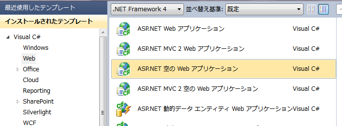
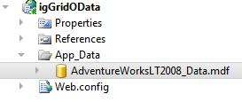
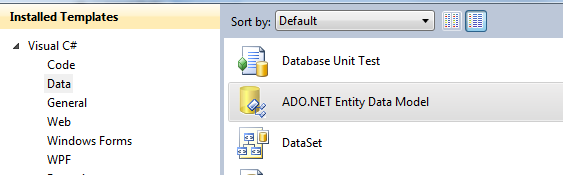
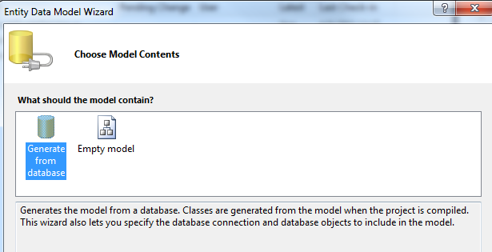
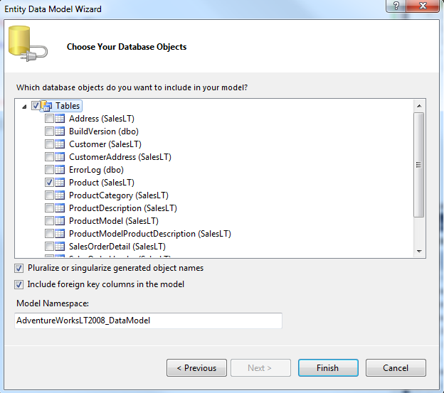
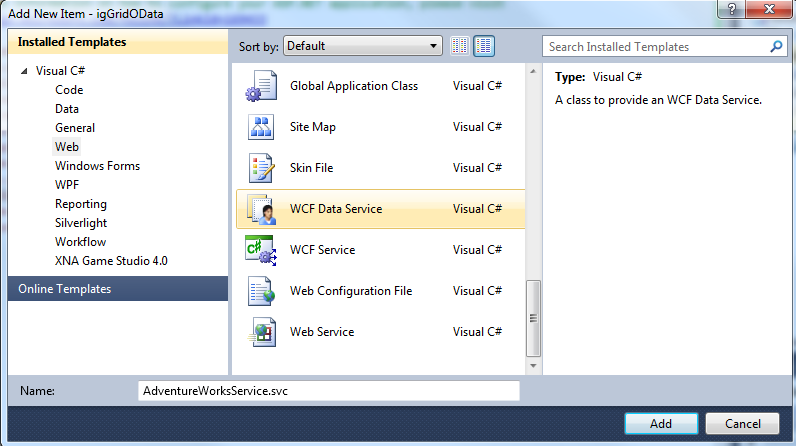
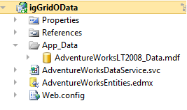
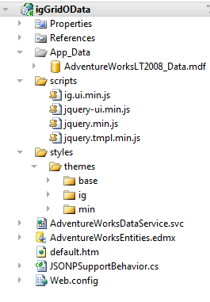
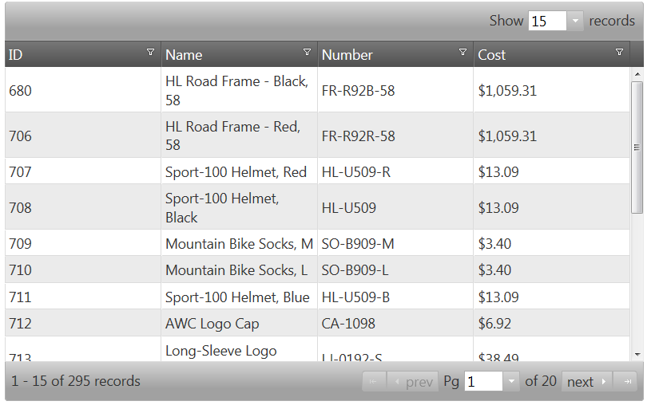

# igGrid、oData、WCF データサービスを使用した作業の開始


`igGrid` は、ページング、フィルタリング、並べ替え機能をもったクライアント側のデータ グリッド コントロールです。グリッドは、XML、JSON、JavaScript 配列、HTML テーブル、ウェブサービスから返されるリモート データなどのローカル データへバインドできます。

`igGrid` コントロールをリモート データにバインドするもっともシームレスな方法は、それを [OData](http://en.wikipedia.org/wiki/OData) と一緒に使用することです。OData または Open Data プロトコルは HTTP の上で動作し、JSON や AtomPub フォーマットのデータを共通の URL 規則を介して問い合わせたり更新する手段を提供します。つまり、URL をもつグリッドを OData サービスに提供し、ひとつのプロパティを設定し、あらゆるページングやフィルタリング、ソーティングが追加の構成を必要とせずにサーバー上で実行できます。

このトピックでは、ASP.NET Web アプリケーションに WCF データ サービスをセットアップし、`igGrid` の 2 つのオプションを設定して、リモート ページング、フィルタリング、ソーティングとともにクライアント側の jQuery グリッドをセットアップする方法を紹介します。

## 例

1.  Microsoft Visual Studio® を開き、新しい ASP.NET 空の Web アプリケーション 'igDataSourceWCFService' を作成します。

    > **注:** `igGrid` コントロールが使用する基になる `igDataSource` コンポーネントは、サーバーに依存しません。従って、この演習では、\{environment:ProductName\} がアウト オブ ボックスで ASP.NET *OData* をサポートするのに対して、ASP.NET WebForms でサポートされる OData の実装方法について説明します。

    

2.  プロジェクトへ *App_Data* フォルダーを追加し、そのフォルダーに *AdventureWorks* データベースを追加する

    > **注:** AdventureWorks データベースを入手するには、ここからダウンロードしてください。

    

3.  次に、*AdventureWorksEntities.edmx* という名称の ADO.NET エンティティ データ モデルをプロジェクトに追加し、それを *AdventureWorks* データベースに向けます。

    

    

4.  エンティティ データ モデルに含まれるようになる Product テーブルの選択

    

5.  次に、WCF データサービスを 'AdventureWorksService.svc' という名のプロジェクトに追加します。

    

6.  この時点でプロジェクトは次のようになっています。

    

7.  次に、 'AdventureWorksDataService' を開きます。このクラスは T がまだ定義されていない `DataService<T>` から派生します。エンティティ データ モデルのタイプをここで指定

    **C# の場合:**

```csharp
	public class AdventureWorksDataService : DataService<AdventureWorksLT2008_DataEntities>
```

8.  次に、`InitializeService` メソッドで `DataServiceConfiguration` を使用してデータサービスを通じた Products テーブルへのアクセスを有効にします。

    **C# の場合:**

```csharp
	public static void InitializeService(DataServiceConfiguration config)
    {
	
	    config.SetEntitySetAccessRule("Products", EntitySetRights.AllRead);
	
	    config.DataServiceBehavior.MaxProtocolVersion = DataServiceProtocolVersion.V2;

    }
```

9.  WCF Data Service は、Atom および JSON 書式をネイティブにサポートします。JSONP 形式にされたデータを有効化するために、[JSONPSupportBehavior](https://github.com/schotime/NerdDinner-PetaPoco/blob/master/NerdDinner/Services/JSONPSupportBehavior.cs) コードファイルをダウンロードし、アプリケーションに含めます。

10. アプリケーションに *JSONPSupportBehavior.cs* ファイルが入れられた時点で、必ずアプリケーションで使用されている名前空間に一致するよう名前空間を変更してください。また、`JSONPSupportBehavior` 属性を `AdventureWorksDataService` クラスに追加してください。

    **C# の場合:**

```csharp
	[JSONPSupportBehavior]
    public class AdventureWorksDataService : DataService<AdventureWorksLT2008_DataEntities>
```

11. この時点で、Web アプリケーションが実行でき、サービスのデータにアクセスできますので、`igGrid` コントロールを設定することができるようになります。

12. \{environment:ProductName\} 製品に付随する結合および縮小済みのスクリプト ファイル infragistics.core.js および infragistics.lob.js が必要です。加えて、サンプルを実行するには jQuery コア および jQuery UI スクリプトが必要です。[このヘルプ トピック](/deployment-guide-javascript-resources)では、必要なスクリプトへの参照やアプリケーションに追加する統合および縮小されたスクリプトがどこにあるかについて説明します。

    > **注:** 製品版とトライアル版は[こちら](http://jp.infragistics.com/products/jquery)からダウンロードできます。

13. プロジェクト内にスクリプト ディレクトリを作成し、そのフォルダーに JavaScript ファイルをコピーしてください。

14. スタイル ディレクトリを設定し、そのフォルダーに Infragistics テーマ ディレクトリを追加します。`igGrid` 用 jQuery テーマを使用して作業するための詳細については、[ヘルプ トピック](/iggrid-styling-and-theming)を参照してください。

15. 次に、サンプル ページを設定します。アプリケーションに対し新しい html ページを追加し、それを 'default.htm' と呼ぶことにします。それが終わると、プロジェクトは次のように表示されます。

    

16. default.htm ファイルを開き、jQuery リソース用の CSS リンクとスクリプト タグを含めます。

    **HTML の場合:**

```html
	<head>
	    <link href="css/themes/infragistics/infragistics.theme.css" rel="stylesheet" type="text/css" />
	    <link href="css/structure/infragistics.css" rel="stylesheet" type="text/css" />
	 
	    <script src="scripts/jquery.min.js" type="text/javascript"></script>
		<script src="scripts/jquery-ui.min.js" type="text/javascript"></script>
		<script src="scripts/infragistics.core.js" type="text/javascript"></script>
		<script src="scripts/infragistics.lob.js" type="text/javascript"></script>
	</head>
```

17. 次に、グリッドの基本要素として機能する HTML のボディに TABLE 要素を追加します。

    **HTML の場合:**

```html
    <body>
        <table id='tableProducts'></table>
    </body>
```

18. HEAD に別のスクリプトを追加し、`igGrid` のインスタンスを作成し、列を定義します。

    **HTML の場合:**

```html
	<script type="text/javascript">
			
		$(function () {
		
			$('#tableProducts').igGrid({
				height: '500px',
				width: '800px',
				autoGenerateColumns: false,
				columns: [
					{ headerText: 'ID', key: 'ProductID', dataType: 'number' },
					{ headerText: 'Name', key: 'Name', dataType: 'string' },
					{ headerText: 'Number', key: 'ProductNumber', dataType: 'string' },			
					{ headerText: 'Cost', key: 'StandardCost', dataType: 'number', format: 'currency'}	
				]			
			});	
	
		});
	
     </script>
```

19. `igGrid` コントロールをデータにバインドするには、データと `responseDataKey` に対する URL を定義するための ２ つのオプションを設定する必要があります。

```
	responseDataKey: 'd.results',
	dataSource: 'AdventureWorksDataService.svc/Products?$format=json',
```

    > **注:** 値 d.results は 'V2' OData サービスからくる JSON データに対する標準の応答キーです。

20.  最後に、リモートで動作ができるようにするオプションを含むグリッドの機能を有効化します。
	
	**JavaScript の場合:**

```js
		features : [{
				name : 'Selection',
				mode : 'row',
				multipleSelection : true
			}, {
				name : 'Paging',
				type : 'remote',
				pageSize : 15
			}, {
				name : 'Sorting',
				type : 'remote'
			}, {
				name : 'Filtering',
				type : 'remote',
				mode : 'advanced'
			}
		]
```


サンプルを実行して、*OData* のデータを使用して `igGrid` コントロールが生成されるのを確認できます。*OData* と組み合わせて、グリッドで `dataSource` として単一の URL を使用し、データをリモートでフィルター、並べ替え、ページングすることができます。



[**サンプルをダウンロードする**](http://dl.infragistics.com/community/jquery/codesamples/aaronm/2011-07-28/igGridOData.zip)

> **注:** AdventureWorks データベースと \{environment:ProductName\} リソースはサンプル内にありません。以下のリンクからソフトウェアを入手できます。
> 
> * [AdventureWorks データベース](http://msftdbprodsamples.codeplex.com/releases/view/37109)
> 
> * [\{environment:ProductName\}](http://jp.infragistics.com/products/jquery)


## 関連トピック

以下は、その他の役立つトピックです。

-   [igGrid/igDataSource アーキテクチャの概要](/iggrid-igdatasource-architecture-overview)
-   [Web サービスへのバインド](/iggrid-binding-to-web-services)

 

 


