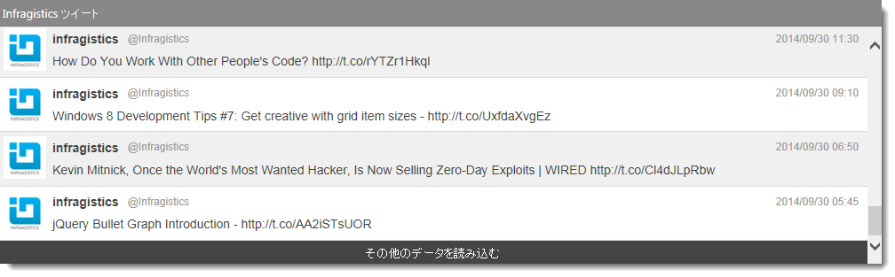

---
title: "オン デマンドの行追加の概要"
slug: append-rows-on-demand-overview
---

#オン デマンドの行追加の概要

## トピックの概要

このトピックでは、`igGrid` のオンデマンドによる行追加機能の概要について説明します。

### 前提条件

以下の表は、このトピックを理解するための前提条件として必要な概念、トピック、および記事の一覧です。

### トピック

- [igDataSource の概要](/data-sources/igdatasource/igdatasource-overview)

- [igGrid の概要](/controls/iggrid/overview)

### このトピックの内容

-   [概要](#introduction)
-   [オン デマンドによる行追加の有効化](#append-rows-on-demand)
    -   [必要なリソース](#required-resources)
    -   [初期化](#initialization)
-   [パフォーマンスについての考慮](#performance-consideration)
-   [CTP 移行ガイド](#migration-guide)
-   [関連コンテンツ](#related-content)
    -   [トピック](#topics)
    -   [サンプル](#samples)

## <a id="introduction"></a>概要

この機能は、ユーザーのグリッドでの操作中に、ページ DOM に対するデータ レコードのプログレッシブ ロードを提供しますこれは OneWay の順方向の操作で、各レコードが一番下のグリッドに追加されます。このエクスペリエンス パターンは、最新のレコードが最初に (一番上に) 描画され、ユーザーが必要とするときに残りのデータをロードする順序付けされたデータセットに最適です。Automatic と Button の 2 つのモードで動作します。

Automatic モードの場合、グリッドをスクロール ダウンしてロードされたコンテンツの一番下に到達すると、データが暗示的にロードされます。

Button モードの場合、グリッドの下のボタンをクリックまたはタップすると、追加の行がロードされます。

機能は [$.ig.DataSource](&#123;environment:jQueryApiUrl&#125;/ig.datasource) のページング機能の一番上に構築されるため、`$.ig.DataSource` でサポートされるすべての範囲のデータ ソースをサポートします。しかし、この機能はページング機能自体と互換性がありません。統合シナリオのサポートについては、｢[機能マトリックス (igGrid)](/controls/iggrid/features/feature-compatibility-matrixiggrid).mdx)｣のトピックを参照してください。



**注:** この機能は、これまでロード オン デマンドと呼ばれていました。この名称は、`igHierarchicalGrid` のロード オン デマンド機能を参照する一部の顧客を混乱させる原因でした。混乱を解消するために、`igCombo`、`igHierarchicalGrid`、`igTree` などの他のコントロールのロード オン デマンド機能と区別し、名称が｢オンデマンドによる行追加」に変更されています。移行の指示については、[CTP 移行ガイド](#migration-guide) のセクションを参照してください。

## <a id="append-rows-on-demand"></a>オン デマンドによる行追加の有効化

### <a id="required-resources"></a>必要なリソース

Infragistics Loader を使用せずにオン デマンドによる行追加機能を使用するには、以下の各リソースを参照する必要があります。

CSS ファイル

-   css\structure\infragistics.css
-   css\themes\infragistics\infragistics.theme.css

JavaScript ファイル

-   jquery.js
-   jqueryui.js
-   js\modules\infragistics.util.js
-   js\modules\infragistics.util.jquery.js
-   js\modules\infragistics.ui.shared.js
-   js\modules\infragistics.datasource.js
-   js\modules\infragistics.ui.grid.framework.js
-   js\modules\infragistics.ui.grid.appendrowsondemand.js

### <a id="initialization"></a>初期化

以下のコードでは、新しいデータが要求された時に一度に 4 つのレコードをロードするオン デマンドによる行追加機能を使用し、`igGrid` を初期化します。

**JavaScript の場合:**
```js
$(function () {
      var products = [
            { "ProductID": 1, "Name": "Adjustable Race", "ProductNumber": "AR-5381" },
            { "ProductID": 2, "Name": "Bearing Ball", "ProductNumber": "BA-8327" },
            { "ProductID": 3, "Name": "BB Ball Bearing", "ProductNumber": "BE-2349" },
            { "ProductID": 4, "Name": "Headset Ball Bearings", "ProductNumber": "BE-2908" },
            { "ProductID": 316, "Name": "Blade", "ProductNumber": "BL-2036" },
            { "ProductID": 317, "Name": "LL Crankarm", "ProductNumber": "CA-5965" },
            { "ProductID": 318, "Name": "ML Crankarm", "ProductNumber": "CA-6738" },
            { "ProductID": 319, "Name": "HL Crankarm", "ProductNumber": "CA-7457" },
            { "ProductID": 320, "Name": "Chainring Bolts", "ProductNumber": "CB-2903" }
      ];
      $("#grid").igGrid({
            dataSource: products,
            features: [
                  {
                        name: "AppendRowsOnDemand",
                        chunkSize: 4
                  }
            ]
      });
});
```
### <a id="performance-consideration"></a>パフォーマンスについての考慮

オン デマンドによる行追加機能は、`$.ig.DataSource` から要求されたレコードが DOM にロードされた場合に、グリッド コンテンツを再描画しません。ただし、他の機能と組合せた場合に、他の機能の要求によりグリッド コンテンツが再描画される場合があります。たとえば Sorting 機能は、現在の部分的なインデックスを保持したまま、DOM を再描画します。この場合、DOM で描画されるレコードの量によりパフォーマンスに影響があります。

Sorting や Filtering などの機能をローカルで実行するように設定され、オン デマンドによる行追加をリモート データ ソースで設定している時に考慮される他のシナリオはパフォーマンスの問題になります。並べ替えやフィルタリングの結果を最新の状態に維持するには、リモート サーバーから新しいデータを受け取るたびに、追加の並べ替えまたはフィルタリング操作を内部で実行しなければなりません。

### <a id="migration-guide"></a>CTP 移行ガイド

前述したように、この機能の名称は、他の機能との混同を避けるために「ロード オン デマンド｣から｢オンデマンドによる行追加｣に変更されました。&#123;environment:ProductName&#125; の以前のバージョンからアップグレードする場合、以下の情報を知っておく必要があります。

-   「installation_folder\js\modules」フォルダー内の機能ファイルの名前は、「`infragistics.ui.grid.loadondemand.js`」から「`infragistics.ui.grid.appendrowsondemand.js`」に変更されています。
-   Infragistics Loader での機能名称は「igGrid.LoadOnDemand」から「igGrid.AppendRowsOnDemand」になりました。
-   機能の名称は「igGridLoadOnDemand」から [igGridAppendRowsOnDemand](&#123;environment:jQueryApiUrl&#125;/ui.igGridAppendRowsOnDemand) に変更されています。ユーザーのすべての API 呼出しを、新しい機能名に置き換える必要があります。
-   igGrid [features](&#123;environment:jQueryApiUrl&#125;/ui.iggrid#options:features) オプションの配列では、機能の名称が「LoadOnDemand」から「AppendRowsOnDemand」に変更されています。
-   Infragistics.Web.Mvc.dll の場合
   -   コントローラの場合 - GridLoadOnDemand クラス名は、[GridAppendRowsOnDemand](Infragistics.Web.Mvc~Infragistics.Web.Mvc.GridAppendRowsOnDemand.html) に変更されています。
    -   ビューの場合 - GridLoadOnDemand メソッド名は、[GridAppendRowsOnDemand](Infragistics.Web.Mvc~Infragistics.Web.Mvc.GridFeatureBuilder`1~AppendRowsOnDemand.html) に変更されています。


## <a id="related-content"></a>関連コンテンツ

### <a id="topics"></a>トピック

このトピックの追加情報については、以下のトピックも合わせてご参照ください。

- [機能マトリックス (igGrid)](/controls/iggrid/features/feature-compatibility-matrixiggrid).mdx)

### <a id="samples"></a>サンプル

igGrid オンデマンドで行の追加機能は、グリッドにデータを追加する機能を提供します。Automatic と Button の 2 つのモードがあります。上のグリッドは Automatic モードを使用します。グリッドの下へスクロールすると、グリッドに新しいデータが追加されます。下のグリッドは Button モードを使用します。グリッドの下へスクロールし、「その他のデータを読み込む」ボタンを押すと、新しいデータを追加します。

<div class="embed-sample">
　   [オンデマンドで行の追加](&#123;environment:SamplesEmbedUrl&#125;/grid/append-rows-on-demand)
</div>
                    
