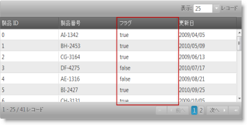
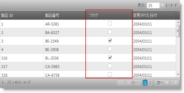

---
title: "列とレイアウト (igGrid)"
slug: iggrid-columns-and-layout
---

# 列とレイアウト (igGrid)


## 概要

このドキュメントでは、`igGrid` レイアウトおよび列設定について解説します。

### このトピックの内容

このトピックは、以下のセクションで構成されます。

-   [幅と高さの定義](#width-height)
-   [列の定義](#defining-columns)
-   [列の書式設定](#column-formatting)
-   [セル テキスト配置](#cell-text-alignment)
-   [列にマッパー機能を定義](#defining-mapper)
-   [AutoGenerateColumns](#autoGenerateColumns)
-   [スタイル設定](#styling)
-   [列のチェックボックスのレンダリング](#checkboxes)
-   [関連コンテンツ](#related-content)


## <a id="width-height"></a> 幅と高さの定義

コントロールの幅と高さを定義することによって、グリッド レイアウトを処理する方法をコントロールできます。幅または高さとして定義可能な値は以下のとおりです。

表 1: 幅および高さの値の形式

値の形式|可能な値
---|---
文字列|"500" と "500px" のどちらも有効です。
数値|500 (500px に変換します)。
パーセンテージ文字列|"50%"、"100%" など。


幅と高さを定義した場合、グリッドはスクロール可能な DIV 要素内でラップされます。高さを設定し、`fixedHeaders` を true (デフォルト) に設定すると、ユーザーがスクロールするときにグリッド ヘッダーは固定されたままになります。

> **注:** サンプルに示したように、個々の列の幅を指定することもできます。

幅と高さを設定した場合、グリッドのレンダリングに影響する複数のシナリオがあります。

表 2: ヘッダーおよびスクロールの固定を有効または無効にする効果

固定ヘッダー|スクローリング|詳細
---|---|---
いいえ|いいえ|列の幅を定義する場合、グリッドは幅に応じて伸縮します。列の幅を定義しない場合、グリッドはデータに応じて伸縮します。
はい|はい|ヘッダーは、DIV の中の独立したテーブル内に描画されます (そのため、グリッドに幅が設定され、水平スクロールバーがある場合、スクロール時にヘッダー テーブルはコンテンツと同期します)。
いいえ|はい|ヘッダーの要素は、データがホストされる単一のテーブルの中に描画されます。独立した TABLE または DIV はありません。

以下のサンプルは、`igGrid` のレイアウト プロパティを設定する方法を紹介します。以下のプロパティが公開されます。
- `caption` – グリッドの上に表示されるキャプション テキストまたは HTML。
- `fixedHeaders` - スクロールするときに表示するために列ヘッダーを固定できます。
- `defaultColumnWidth` - 列コレクションの列幅が割り当てられていないときに使用される幅。
- `width` (列) - 列に適用される幅。
- `width` - グリッドの幅。列の幅がグリッドの幅を超えると、水平スクロールバーが表示されます。

<div class="embed-sample">
    [グリッド レイアウト](&#123;environment:SamplesEmbedUrl&#125;/grid/grid-layout)
</div>

## <a id="defining-columns"></a> 列の定義

グリッド列を定義するには、リスト 1 に示すように、列グリッド オプションにオブジェクトを 追加します。

リスト 1: グリッドのオプションとしての列の定義

**JavaScript の場合:**

```js
$("#grid1").igGrid({
       autoGenerateColumns: false, columns: [
            { 
                headerText: "Country Code", 
                key: "Code", 
                width: "100px", 
                dataType: "string", 
                formatter: <formatter function>, 
                format: "" 
            },
            { 
                headerText: "Date", 
                key: "Date", 
                width: "100px", 
                dataType: "date", 
                format: "dateLong"
            },
            { 
                headerText: "Country Name", 
                key: "Name", 
                width: "80px", 
                dataType: "string"
            }
        ],
    responseDataKey: 'records',
    dataSource: remoteService,
    height: '400px'
});
```


列の定義は、キー プロパティを 1 つ以上含む JavaScript オブジェクトです。以下を含めることも可能です。

-   ヘッダー テキスト: `headerText` オプションを使用。
-   幅: `width` オプションを使用 (数値または文字列、px または % または `*`)。
-   データ型: `dataType` オプションを使用。

列の width を `*` に設定すると、グリッドが初期化されるときに列は自動サイズ変更されます。自動サイズ変更は、列を現在表示されている最も幅が広いセル コンテンツ (ヘッダーおよびフッター セルを含む) の幅にサイズ変更されます。自動サイズ変更は、仮想化が有効な場合に正しく動作しません。

`format` および `dataType` オプションは様々な方法で構成できます。

-   `dataType` は文字列、数値、日付、ブール値、またはオブジェクトを設定可能です。
-   dataType=”date” (Date オブジェクト) に対応する `format` 列プロパティは、“date”、“dateLong”、“dateLong”、“dateTime”、“timeLong”、または “MM-dd-yyyy h:mm:ss tt” などの明示的なパターンが可能です。有効なカスタムの日付の書式指定子の詳細は[「日付の書式設定」](/formatting-dates-numbers-and-strings#formatting-dates)を参照してください。
-   dataType=”number” (数値オブジェクト) または dataType=”string” に対応する `format` 列プロパティは、“number”、“double”、“int”、“currency”、または “percent” が可能です。有効なカスタムの数値の書式指定子の詳細は[「数値の書式設定」](/formatting-dates-numbers-and-strings#formatting-numbers)を参照してください。
-   dataType="bool" (ブール オブジェクト) に相対する `format` 列プロパティを "checkbox" に設定できます。
-   また、`dataType`=”number” の場合、対応する書式設定は “0.0###”、“#.##”、“0.000” などが可能です。ここで、小数点の後にくるゼロの数は、小数点以下の最小桁数を定義し、小数点の後の合計文字数は、小数点以下の最大桁数を定義します。有効なカスタムの数値の書式指定子の詳細は[「数値の書式設定」](/formatting-dates-numbers-and-strings#formatting-numbers)を参照してください。
-   `dataType` が “date” または “number” 以外の場合、対応する書式設定に“&#123;0&#125;” フラグを含めることができます。この場合、このフラグはセルの値に置換されます。たとえば、format=”Name: &#123;0&#125;” で、セルの値が “Bob” の場合、セルには “Name: Bob” が描画されます (詳細は、[文字列の書式設定](/formatting-dates-numbers-and-strings#formatting-strings)を参照してください)。

## <a id="column-formatting"></a> 列の書式設定

列の書式設定は、列のセル値がグリッドに表示される方法を定義します。書式設定はグリッドの描画フェーズに操作し、基本のデータ ソースのデータに影響しません。並べ替え、フィルター、グループ化などのデータに操作する機能は書式設定付きのセル値を使用しません。

列書式設定 (描画) は複数の `igGrid` オプションにより影響されます。これは列の [`formatter`](&#123;environment:jQueryApiUrl&#125;/ui.iggrid#options:columns.formatter)、[`format`](&#123;environment:jQueryApiUrl&#125;/ui.iggrid#options:columns.format) および [`template`](&#123;environment:jQueryApiUrl&#125;/ui.iggrid#options:columns.template) です。また、グリッドの地域設定がグリッドに適用される方法を影響する [`autoFormat`](&#123;environment:jQueryApiUrl&#125;/ui.iggrid#options:autoFormat) オプションがあります。

-  [`autoFormat`](&#123;environment:jQueryApiUrl&#125;/ui.iggrid#options:autoFormat) - 地域設定が date および number 列にグリッドで適用される方法を識別する文字列です。デフォルトで date 列のみが地域設定に基づいて書式設定されます。このオプションは [`format`](&#123;environment:jQueryApiUrl&#125;/ui.iggrid#options:columns.format) および [`formatter`](&#123;environment:jQueryApiUrl&#125;/ui.iggrid#options:columns.formatter) オプションによりオーバーライドされます。

> **注:** 地域設定を以下の式によってアクセスできます。 
```js
 $.ig.regional.defaults;
```
 
 以下は書式設定デコレータが使用されていない場合の列描画のフローです。 
```
 Raw Value -> autoFormat -> (template)* -> Cell Value
 * - オプションの設定
```

> **注:** 適用される列描画デコレータがなく、Raw 値が null 値、未定義、または空の文字列 ("") の場合、デフォルトで改行しないスペース (`&nbsp;`) がその代わりにセルに描画されます。
 
-  [`formatter`](&#123;environment:jQueryApiUrl&#125;/ui.iggrid#options:columns.formatter) - グローバル ウィンドウ オブジェクトにバインドされる関数または関数の文字列名です。データ ソース値の描画を制御します。formatter 関数の定義で値の書式設定および地域表記を制御できます。[`$.ig.formatter(rawValue, dataType, formatPattern)`](/formatting-dates-numbers-and-strings) のユーティリティ関数は、地域設定またはカスタム書式設定パターンを使用して値を書式設定するために使用できます。

**JavaScript の場合:**
```js
var formattedValue = $.ig.formatter(new Date()); //formats the date according to the current regional settings.
var formattedValue = $.ig.formatter(1000000); //formats the number according to the current regional settings.
```

[`formatter`](&#123;environment:jQueryApiUrl&#125;/ui.iggrid#options:columns.formatter) および [`format`](&#123;environment:jQueryApiUrl&#125;/ui.iggrid#options:columns.format) オプションの両方を適用できません。[`formatter`](&#123;environment:jQueryApiUrl&#125;/ui.iggrid#options:columns.formatter) 関数が定義される場合、優先があり、[`format`](&#123;environment:jQueryApiUrl&#125;/ui.iggrid#options:columns.format) は使用されません。ただし、[`formatter`](&#123;environment:jQueryApiUrl&#125;/ui.iggrid#options:columns.formatter) 関数からの値に [`template`](&#123;environment:jQueryApiUrl&#125;/ui.iggrid#options:columns.template) が適用されます。

以下は、formatter が使用されている場合の列描画のフローです。

```
Raw Value -> formatter -> (template)* -> Cell Value
* - オプションの設定
```

以下のサンプルでは、グリッドに表示する前に列値を書式設定する方法を紹介します。「メーカー フラグ」のブール列に true/false 値を Yes/No 値に変換する `formatter` 関数があります。
<div class="embed-sample">
   [列の書式関数](&#123;environment:SamplesEmbedUrl&#125;/grid/column-format-function)
</div>

-  [`format`](&#123;environment:jQueryApiUrl&#125;/ui.iggrid#options:columns.format) - 書式設定パターンを識別する文字列です。[`format`](&#123;environment:jQueryApiUrl&#125;/ui.iggrid#options:columns.format) オプションは内部に `$.ig.formatter(rawValue, dataType, formatPattern)` 関数を使用します。設定される場合、[`format`](&#123;environment:jQueryApiUrl&#125;/ui.iggrid#options:columns.format) は [`autoFormat`](&#123;environment:jQueryApiUrl&#125;/ui.iggrid#options:autoFormat) オプションの設定およびデフォルトの地域設定をオーバーライドします。

 [`format`](&#123;environment:jQueryApiUrl&#125;/ui.iggrid#options:columns.format) が使用されている場合、以下は列描画のフローです。

```
 Raw Value -> format -> (template)* -> Cell Value 
 * - オプションの設定
```

以下のサンプルはグリッドの列書式設定の機能を紹介します。「販売の開始日付」および「変更日付」列は別の日付書式設定を使用します。「価格」の数値列は通貨の書式設定を使用します。

<div class="embed-sample">
   [igGrid の列書式設定](&#123;environment:SamplesEmbedUrl&#125;/grid/column-formats)
</div>

- [`template`](&#123;environment:jQueryApiUrl&#125;/ui.iggrid#options:columns.template) - テンプレート化された文字列です。使用されるテンプレート エンジンは `templatingEngine` オプションで定義されます。 テンプレートの構文の詳細は[「テンプレート化エンジン概要」](../../../06_Infragistics-Templating-Engine/01_igTemplating Overview.mdx)を参照してください。
 
 以下は、[`template`](&#123;environment:jQueryApiUrl&#125;/ui.iggrid#options:columns.template) が使用されている場合の列描画のフローです。
 
```
 Raw Value -> (autoFormat|formatter|format)* -> template -> Cell Value 
 * - オプションの設定
```

- [`columnCssClass`](&#123;environment:jQueryApiUrl&#125;/ui.iggrid#options:columns.columnCssClass) は、セルの TD 要素に適用される CSS クラスのスペース分割されたリストです。
  [`template`](&#123;environment:jQueryApiUrl&#125;/ui.iggrid#options:columns.template) オプションが TD 要素の描画を定義する場合、列の [`columnCssClass`](&#123;environment:jQueryApiUrl&#125;/ui.iggrid#options:columns.columnCssClass) オプションが無視されます (下記例を参照)。
 以下は、[`columnCssClass`](&#123;environment:jQueryApiUrl&#125;/ui.iggrid#options:columns.columnCssClass) が使用されている場合の列描画のフローです。
 
```
 Raw Value -> (autoFormat|format|formatter)* -> columnCssClass -> template* -> Cell Value 
 * - オプションの設定
```
 
例:
```js
$("#grid1").igGrid({
    autoGenerateColumns: false,
    columns: [ {
            headerText: "Product Number", 
            key: "ProductNumber",
            dataType: "number",
            // NOTE: columnCssClass will be applied
            columnCssClass: "align-right",
            template: "<a href='/product/${ProductNumber}'>${ProductNumber}</a>"
        }, {
            headerText: "Modified Date",  
            key: "ModifiedDate",  
            dataType: "date",
            // NOTE: columnCssClass will NOT be applied
            columnCssClass: "align-center",
            template: "<td style='font-weight: bold'>${ModifiedDate}</td>"
        }
    ]
});
```

- [`headerCssClass`](&#123;environment:jQueryApiUrl&#125;/ui.iggrid#options:columns.headerCssClass) は、[`headerText`](&#123;environment:jQueryApiUrl&#125;/ui.iggrid#options:columns.headerText) オプションによって構成される列ヘッダー テキストの TH 要素に適用される CSS クラスのスペース分割されたリストです。
 以下は、[`headerCssClass`](&#123;environment:jQueryApiUrl&#125;/ui.iggrid#options:columns.headerCssClass) が使用されている場合の列描画のフローです。
 
```
 Raw `headerText` Value -> headerCssClass -> Header Text Value 
```

## <a id="cell-text-alignment"></a> セル テキスト配置

igGrid のセル テキストはデフォルトで左揃えです。セルのテキスト配置をカスタマイズするには、[`columnCssClass`](&#123;environment:jQueryApiUrl&#125;/ui.iggrid#options:columns.columnCssClass) オプションを使用します。テキストを配置するカスタム CSS クラスを作成し、`columnCssClass` を使用して列に適用します。

以下のサンプルでは、グリッド セルのテキスト配置をカスタマイズする方法を紹介します。グリッドの「製品 ID」および「再注文」の数値列のテキストが右側に配置されます。列のセルにカスタム CSS クラスが適用されています。CSS クラスはグリッド列の `columnCssClass` プロパティに設定されます。

<div class="embed-sample">
   [igGrid テキスト配置の構成](&#123;environment:SamplesEmbedUrl&#125;/grid/configure-text-alignment)
</div>

## <a id="defining-mapper"></a> 列にマッパー関数を定義

マッパー関数は、複雑なデータオブジェクトから特定のプロパティを抽出する場合に使用でき、値の表示および列のデータ処理に使用される値を定義します。
列 dataType は "object" として指定する必要があり、マッパー関数はレコードから必要なデータを抽出するために使用できます。
マッピングはデータソース レベルで完了し、すべてのデータ処理をマップ値に基づいて実行することができます。
たとえば、以下のようにデータ ソースで各レコードに複合オブジェクトがある場合:
```js
var data = [{ "ID": 0, "Name": "Bread", "Description": "Whole grain bread", "Category":  { "ID": 0, "Name": "Food", "Active": true }},
{ "ID": 1, "Name": "Milk", "Description": "Low fat milk",  "Category":   { "ID": 1, "Name": "Beverages", "Active": true } },
 ...
 ];
```
特定のプロパティや 'Category' オブジェクトの複数プロパティから計算済みの値を表示する場合 (単一文字列に ID および Name サブフィールド値を含むための値のマッピングなど)、`mapper` 関数を使用できます。

例:

**JavaScript の場合:**
```js
	mapper: function(record){
	//extracting data from complex object
	return record.Category.ID + " : " + record.Category.Name;
	}				

```
関数はコード例 2 で示すように [`mapper`](&#123;environment:jQueryApiUrl&#125;/ui.iggrid#options:columns.mapper) 列オプションで定義されます。特定の列に関連するすべてのデータ操作でデータ レコード毎に値を指定できます。
この関数は、すべてのデータ レコードを含む単一パラメーターを受け入れ、レコード毎に単一のシンプルな値を返します。

> **注:** この機能は、グリッドがこの列のデータを抽出する必要がある度に呼び出されます。これには、列に関連するデータ レンダリングやデータ操作処理が含まれます。そのため、複雑なデータの抽出および (または) 計算ロジックがある場合、パフォーマンスに影響することに注意してください。

コード例 2: igGrid の列にマッパー機能を定義します。

**JavaScript の場合:**

```js
  $("#grid").igGrid({
  columns: [
                    { headerText: "", key: "ID", dataType: "number", width: "200px" },
                    { headerText: "Name", key: "Name", dataType: "string", width: "200px" },
                    { headerText: "Description", key: "Description", dataType: "string", width: "200px" },
                    { headerText: "Category", key: "Category", dataType: "object", width: "200px",
						mapper: function(record){
								//extracting data from complex object
								return record.Category.Name;
							}					
					}
                ],
                autoGenerateColumns: false,
                dataSource: northwindProductsJSON,         
               ...
});

```

以下のサンプルは、列の mapper 関数により複合データ オブジェクトを処理する方法を紹介します。サンプルで、並べ替えおよびフィルターは mapper 関数から返された値に基づいて実行されます。コンボ エディター プロバイダーの更新は複合オブジェクトを選択したコンボ項目のレコード データとの更新を許可します。

<div class="embed-sample">
   [複合オブジェクトの処理](&#123;environment:SamplesEmbedUrl&#125;/grid/handling-complex-objects)
</div>

## <a id="autoGenerateColumns"></a> AutoGenerateColumns

`autoGenerateColumns` が *false* の場合は、列配列に列を必ず手動で定義する必要があります。`autoGenerateColumns` が *true* (デフォルト) の場合は、列を指定する必要はありません。その場合、グリッドはデータ ソース (行が 1 つ以上の場合) から自動的に列を推測し、それを列コレクションに追加します。ヘッダー テキストも自動的に生成され、データ ソース内のキーと等しくなります。自動生成される列の列幅は `defaultColumnWidth` オプションで設定します。すべての生成された列に同じ列幅を適用します。リモート データ バインドを使用するときは、クライアントのバックエンドからデータを使用可能なときのみ、ヘッダー テキストは自動的に生成されます。ただし、大部分の実環境のシナリオでは、列を明示的に定義するのが最も良い方法です。

`autoGenerateColumns` を true に設定し、列を手動で定義した場合、列をユーザーに描画する方法として、いくつかのシナリオが可能です。

-   データ ソース内の列数に一致する列カウントを定義した場合、グリッドは列コレクションに定義した順に列を描画します。また、グリッドは、ユーザーが指定したヘッダー テキスト、*dataType*、幅、および書式設定 (もしあれば) を受け入れます。
-   データ ソース内の列数に一致しない列カウントを定義した場合、定義した列が最初に描画され、そのあとに、データ ソースの残りのすべての列が自動的に生成され、定義した列の後に追加されます。

> **注:** `autoGenerateColumns` が true の場合は、データ ソース内のすべての列が常に描画されます。特定の列を描画したくない場合は、`autoGenerateColumns` を false に設定してから、列配列に必要な列を指定する必要があります。

また、すべての列の幅を個別に指定することも可能です。列の幅を指定した場合にグリッドにも幅が定義されていて、それが、自分で定義したすべての列幅の合計より小さい場合は、水平スクロールバーがグリッドに描画されます。

> **注:** 数個の列にだけ幅を指定し、それと同時にグリッドの幅を定義することは推奨しません。一部の列の幅が狭くなってしまいます。この問題を改善するには、`defaultColumnWidth` グリッド オプションを設定します。

> **注:** 更新機能を使用するには、`autoGenerateColumns` が false に設定される場合、`dataType` プロパティを設定する必要があります。更新機能は、グリッドおよび基本データ ソースの間でレコードを同期するためにプライマリ キーを使用します。プライマリ キーは値およびタイプによって比較されます。

以下のサンプルは、igGrid の列の自動生成機能を紹介します。列が自動生成された場合、ヘッダー キャプションはデータ ソースのフィールド名から設定されます。`autoGenerateColumns` オプションは `defaultColumnWidth` オプションと使用されます。
<div class="embed-sample">
   [igGrid 列の自動生成](&#123;environment:SamplesEmbedUrl&#125;/grid/auto-generate-columns)
</div>

## <a id="styling"></a> スタイル設定

jQuery グリッドは、jQuery UI Theme Roller と完全に互換性があります。そのため、Theme Roller Web アプリケーションを使用して、カスタム テーマを生成したり、既存のテーマを使用して、それをグリッドに適用できます。

最適な縮小および結合されたスタイルを使用するには、リスト 2 にある CSS 定義をインクルードする必要があります。

リスト 2: 必須のスタイルシート定義

**JavaScript の場合:**

```js
<link type="text/css" href="infragistics.theme.css" rel="stylesheet" />
<link type="text/css" href="infragistics.css" rel="stylesheet" />
```

最初の CSS、*jquery.ui.custom.css* は実際のテーマ (つまり、カラー関連のスタイル設定) を表します。これを Theme Roller から生成された CSS ファイルと置換できます。

2 番目の CSS &#123;environment:ProductName&#125; 用のカスタマイズで、Theme Roller / jQuery UI では使用できないレイアウト関連のルールを含みます。そのため、コントロールが正常に機能することを保証することが必要です。

結合されていない CSS (開発シナリオで使用される) を参照する場合は、リスト 3 に示すようにして参照を追加できます。

リスト 3: 結合または縮小されていない CSS ファイルの参照

**JavaScript の場合:**

```js
<link type="text/css" href="css/themes/infragistics/infragistics.theme.css" rel="stylesheet" />
<link type="text/css" href="css/structure/modules/infragistics.ui.grid.css" rel="stylesheet" />    
<link type="text/css" href="css/structure/modules/infragistics.ui.shared.css" rel="stylesheet" />    
```

要素の外観を変更したい場合には、custom.css ファイルを編集できます。または、あらかじめ定義されているクラス名に対しカスタム CSS ルールを定義します。

グリッドの最上位のコンテナー DIV は、クラス `ui-iggrid` でプレフィックスされるので、これをセレクターとして使用して、グリッドだけを対象にできます。あるいは、カスタム CSS を特定のグリッドにのみ適用したい場合は、グリッドの ID をセレクターとして使用できます。


## <a id="checkboxes"></a> 列のチェックボックスのレンダリング

ブール データ型を含む列の場合、デフォルトでは `igGrid` は true または false の文字列を示します。ただし、`igGrid` 列がブール データを表示するかどうかを選択するチェックボックスのオプションがあり、チェックの有無に応じて、それぞれ true または false になります。`renderCheckboxes` プロパティを true に設定すると、列のチェックボックスがレンダリングされます。チェックボックスをレンダリングするには、列の `dataType` プロパティをブール値に設定する必要があります。

16.1 以後のバージョンで、チェックボックスの視覚スタイルを向上しました。グリッドが表示モードにある場合、四角ボックスが描画されません。プレーン チェックマークのみ表示されます。この変更はユーザー エクスペリエンスの向上のためのものです。エンドユーザーは、クリックして切り替えが可能であるインタラクティブな要素として認識します。ただし、`igGrid` が編集モードに入るときは、このモードでチェックボックスの以前のルック アンド フィールドが保持されます。
クラスはデフォルトで空の `$.ig.checkboxMarkupClasses` のユーティリティ プロパティに抽象されます。チェックボックスの以前のレイアウトが以下のクラスの使用により適用できます。
`$.ig.checkboxMarkupClasses = "ui-state-default ui-corner-all ui-igcheckbox-small";`
プロパティはカスタム クラスを許可しますが、チェックボックスのレイアウトを壊さないしないように処理する必要があります。

igUpdating の以前のバージョンにチェックボックス編集の 2 つの事例がありました。1. ユーザーがセルにチェックボックスをクリックします。 2. ユーザーがセルでチェックボックス以外をクリックします。グリッドは両方のケースで編集モードに入りましたが、最初のケースでチェックボックス値が変更されました。
現在、チェックボックス編集で同じ事象があります。事象間に一貫性があります。ユーザーを最初に編集モードに入り、次にチェックボックスの値を変更できます。

以前の動作を実装する回避策は以下です。

-   グリッドの初期化の前に以下のクラスを指定します。

**JavaScript の場合:**

```js
$.ig.checkboxMarkupClasses = "ui-state-default ui-corner-all ui-igcheckbox-small";
```

-   editCellStarted に同様なイベント ハンドラーを追加します。

**JavaScript の場合:**

```js
features: [
    {
        name: "Updating",
        editMode: "cell",
        editCellStarting: function (evt, ui) {
            if (ui.columnKey === "MakeFlag" && $(evt.originalEvent.target).hasClass("ui-icon-check")) {
                ui.value = !ui.value;
            }
        }
    }
]
```

右の図では、次のコード例が Make Flag 列のチェックボックスをレンダリングする様子を示しています。


|  |  |
| --- | --- |
|  |  |


図1: ブール値を示す列 チェックボックスがレンダリングされている場合 (右) とされていない場合 (左)

**JavaScript の場合:**

```js
$("#grid1").igGrid({
    autoGenerateColumns: false,
    primaryKey: "ProductID",
    // enabling render checkboxes on a column
    renderCheckboxes: true,
    columns: [ {
            // note: if primaryKey is set and data in primary column contains numbers,
            // then the dataType: "number" is required, otherwise, dataSource may misbehave
            headerText: "(Grid_CheckboxColumn_ColumnHeader_ProductID)", 
            key(Grid_CheckboxColumn_ColumnHeader_ProductNumber)", 
            key: "ProductNumber",
            dataType: "string"
        }, {
            headerText: "(Grid_CheckboxColumn_ColumnHeader_MakeFlag)", 
            key(Grid_CheckboxColumn_ColumnHeader_ModifiedDate)", 
            key: "ModifiedDate",  
            dataType: "date"
        }
    ],
    dataSource: gridData,
    height: "300px"
});
```

以下のサンプルでは、ブール値列で true/false 値を表示する代わりにチェックボックスを有効にする方法を紹介します。
<div class="embed-sample">
   [igGrid チェックボックス列](&#123;environment:SamplesEmbedUrl&#125;/grid/checkbox-column)
</div>

**ASPX の場合:**

```csharp
<%= Html.Infragistics().Grid(Model).ID("grid1").AutoGenerateColumns(false).PrimaryKey("ProductID").RenderCheckboxes(true).Columns(column =>
    {
        column.For(x => x.ProductID).HeaderText(this.GetGlobalResourceObject("Grid", "PRODUCT_ID").ToString()).DataType("number");
        column.For(x => x.ProductNumber).HeaderText(this.GetGlobalResourceObject("Grid", "PRODUCT_NUMBER").ToString()).DataType("string");
        column.For(x => x.MakeFlag).HeaderText(this.GetGlobalResourceObject("Grid", "MAKE_FLAG").ToString()).DataType("bool");
        column.For(x => x.ModifiedDate).HeaderText(this.GetGlobalResourceObject("Grid", "MODIFIED_DATE").ToString()).DataType("date");
        })
		.DataBind().Height("300px").Render()
%>
```

## <a id="related-content"></a> 関連コンテンツ

### トピック
-   [&#123;environment:ProductName&#125; の概要](/igniteui-for-jquery-overview)
-   [日付、数値、および文字列の書式設定](/formatting-dates-numbers-and-strings)
-   [テンプレート エンジンの概要](../../../06_Infragistics-Templating-Engine/01_igTemplating Overview.mdx)
 