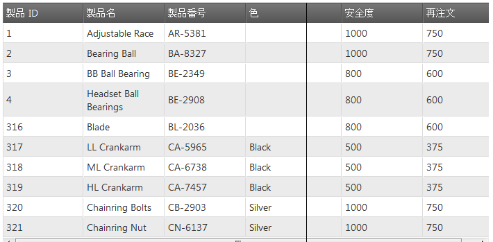

---
title: "列のサイズ変更 (igGrid)"
slug: iggrid-column-resizing
---

# 列のサイズ変更 (igGrid)

## トピックの概要

### 目的

このトピックでは、`igGrid`™ コントロールの列サイズ変更機能について説明します。

### このトピックの内容

このトピックは、以下のセクションで構成されます。

-   [**概要**](#overview)
    -   [サイズ変更機能](#resizing-features)
-   [**サイズ変更を有効にする**](#enabling-resizing)
    -   [要件](#requirements)
    -   [コード例](#examples)
-   [**クライアント側イベント**](#client-side-events)
-   [**列のサイズ変更プロパティ**](#column-resizing-properties)
-   [**関連トピック**](#topics)

## <a id="overview"></a> 概要

`igGrid` コントロールの列のサイズ変更機能によりユーザーは、グリッドの列の幅を変更できます。サイズ変更機能は、グリッド全体 (デフォルト) と列ごとの 2 つのレベルで有効にできます。ただし、個々の列をプログラム的に無効または有効にできます。

> **注:** 列サイズ変更はタッチ デバイスでサポートされません。

### <a id="resizing-features"></a> サイズ変更機能 

-   列のサイズ変更の有効化/無効化この機能は [`allowResizing`](&#123;environment:jQueryApiUrl&#125;/ui.igGridResizing#options:columnSettings.allowResizing) プロパティから管理されます。

-   ダブルクリックで自動サイズ変更を有効にする – 有効になると、列は現在表示されている最も幅が広いセル コンテンツ (ヘッダーおよびフッター セルを含む) の幅にサイズ変更されます。この機能は [`allowDoubleClickToResize`](&#123;environment:jQueryApiUrl&#125;/ui.igGridResizing#options:allowDoubleClickToResize) オプションから管理されます。

-   列幅の最大値/最小値 - サイズ変更をする場合に、ユーザーが列の幅を変更できる最小/最大幅。この機能はそれぞれ [`minimumWidth`](&#123;environment:jQueryApiUrl&#125;/ui.igGridResizing#options:columnSettings.minimumWidth)/[`maximumWidth`](&#123;environment:jQueryApiUrl&#125;/ui.igGridResizing#options:columnSettings.maximumWidth) プロパティから管理されます。

-   遅延サイズ変更 - ユーザーがサイズ変更を終了するか、直ちに適用するまでサイズ変更は保留されます。この機能は [`deferredResizing`](&#123;environment:jQueryApiUrl&#125;/ui.igGridResizing#options:deferredResizing.) オプションから管理されます。

-   構成可能なサイズ変更ハンドル - サイズ変更可能な列ヘッダーそれぞれの右側にあるサイズ変更ハンドルの幅 (ピクセル単位) がカスタマイズできます。この機能は [`handleTreshold`](&#123;environment:jQueryApiUrl&#125;/ui.igGridResizing#options:handleTreshold) オプションから管理されます。

-   列キー - 指定された列設定を適用する列を指定します。この機能は [`columnKey`](&#123;environment:jQueryApiUrl&#125;/ui.igGridResizing#options:columnSettings.columnKey) オプションから管理されます。

-   列インデックス - 指定された列設定を適用する列を指定します。この機能は [`columnIndex`](&#123;environment:jQueryApiUrl&#125;/ui.igGridResizing#options:columnSettings.columnIndex) オプションから管理されます。

## <a id="enabling-resizing"></a> サイズ変更を有効にする 

以下は最終結果のプレビューです。



### <a id="requirements"></a> 要件

リスト 1: アプリケーションへの組み込みに必要な CSS 参照および JavaScript 参照

**HTML の場合:**

```html
<link type="text/css" href="infragistics.theme.css" rel="stylesheet" />
<link type="text/css" href="infragistics.css" rel="stylesheet" />
<script type="text/javascript" src="jquery.min.js"></script>
<script type="text/javascript" src="jquery-ui.min.js"></script>
<script type="text/javascript" src="infragistics.core.js"></script>
<script type="text/javascript" src="infragistics.lob.js"></script>
```

リスト 2: 縮小も結合もしていない CSS 参照および JavaScript 参照の最小セット - サイズ変更にのみ必要

**HTML の場合:**

```html
<script type="text/javascript" src="infragistics.util.js"></script>
<script type="text/javascript" src="infragistics.util.jquery.js"></script>
<script type="text/javascript" src="infragistics.dataSource.js"></script>
<script type="text/javascript" src="infragistics.ui.shared.js"></script>
<script type="text/javascript" src="infragistics.ui.grid.framework.js"></script>
<script type="text/javascript" src="infragistics.ui.grid.resizing.js"></script>
```

### <a id="examples"></a> コード例

リスト 3: 列のサイズ変更を有効にした `igGrid` コード例

**JavaScript の場合:**

```js
$("#grid1").igGrid({
    columns: [
        { headerText: "Product ID", key: "ProductID", dataType: "number" },
        { headerText: "Product Name", key: "Name", dataType: "string" },
        { headerText: "ProductNumber", key: "ProductNumber", dataType: "string" }
    ],
dataSource: adventureWorks,
    responseDataKey: 'Records',
    width: "800px",
    height:'400px',
    features: [
        {
            name : 'Resizing',
        }
    ]
});

```
**ASPX(MVC) の場合:**

```csharp
<%= Html.Infragistics().Grid(Model).ID("grid1").PrimaryKey("ProductID").Columns(column =>
	{
	    column.For(x => x.ProductID).HeaderText("Product ID");
	    column.For(x => x.Name).HeaderText("Product Name");
	    column.For(x => x.ProductNumber).HeaderText("Product Number");
	}).Features(features => {
	    features.Resizing();
	}).Height("400").Width("800").DataSourceUrl(Url.Action("ColumnResizingGetData"))
	.DataBind().Render()%>
```

リスト 4: 特定の列の列のサイズ変更を無効にするグリッド コード例

**JavaScript の場合:**

```js
$("#grid1").igGrid({
    columns: [
        { headerText: "Product ID", key: "ProductID", dataType: "number" },
        { headerText: "Product Name", key: "Name", dataType: "string" },
        { headerText: "ProductNumber", key: "ProductNumber", dataType: "string" }
    ],
	dataSource: adventureWorks,
    responseDataKey: 'Records',
    width: "800px",
    height:'400px',
    features: [
        {
            name : 'Resizing',
            columnSettings: [
                { columnKey: "ProductID", allowResizing: false }
            ],
        }
    ]
});
```

**C# の場合:**

```csharp
<%=Html.Infragistics().Grid(Model).ID("grid1").PrimaryKey("ProductID")
	.Columns(column =>
	    {
	        column.For(x => x.ProductID).HeaderText("Product ID").Width("100px");
	        column.For(x => x.Name).HeaderText("Product Name").Width("200px");
	        column.For(x => x.ModifiedDate).HeaderText("Modified Date").Width("200px");
	        column.For(x => x.ListPrice).HeaderText("List Price").Width("200px");
	    })
	.Features(features => {
		features.Resizing().AllowDoubleClickToResize(true).DeferredResizing(true)
			.ColumnSettings(s =>
			{
				s.ColumnSetting().ColumnKey("ProductID").AllowResizing(false);
			});
	}).Height("500").DataSourceUrl(Url.Action("ColumnResizingGetData"))
	.DataBind().Render()%>
```

**ASPX(MVC) の場合:**

```csharp
<%= Html.Infragistics().Grid(Model).ID("grid1").PrimaryKey("ProductID").Columns(column =>
    {
        column.For(x => x.ProductID).HeaderText("Product ID");
        column.For(x => x.Name).HeaderText("Product Name");
        column.For(x => x.ProductNumber).HeaderText("Product Number");
    })
	.Features(features => {
		features.Resizing();
	}).Height("400").Width("800").DataSourceUrl(Url.Action("ColumnResizingGetData"))
	.DataBind().Render()%>
```

## <a id="client-side-events"></a> クライアント側イベント 

それぞれ、リスト 5 とリスト 6 に記載された 2 種類の方法でハンドラーを Reisizing にバインドできます。

リスト 5: アプリケーションの任意の場所からのクライアント側イベントへのバインド

**JavaScript の場合:**

```js
    $("#grid1").bind("iggridresizingcolumnresizing", handler);
```

リスト 6: サイズ変更機能を初期化する場合にイベント名をオプション指定した、クライアント側イベントへのバインド (大文字と小文字を区別)

**JavaScript の場合:**

```js
$("#grid1").igGrid({
    columns: [
        { headerText: "Product ID", key: "ProductID", dataType: "number" },
        { headerText: "Product Name", key: "Name", dataType: "string" },
        { headerText: "Product Number", key: "ProductNumber", dataType: "string" },
    ],
    width: '500px',
    dataSource: products,
    features: [
        {
            name: 'Resizing',
            columnResizing: handler
        }
    ]
});

//Handler code
function handler(event, args) {

}
```

> **注:**
> `columnResizing` イベントはキャンセルできます。`columnResizing` イベントをキャンセルするには、その該当イベント ハンドラーは false を返す必要があります。

グリッド列のサイズ変更機能は、表 1 にクライアント側イベントの詳細を公開しています。

表 1: サイズ変更機能の引数オブジェクト定義


| イベント名 | 引数 (args) パラメーター |
| --- | --- |
| [columnResizing](environment:jQueryApiUrl/ui.igGridResizing#events:columnResizing) | columnIndex: 現在選択されたグリッド列インデックス, columnKey: 現在選択されたグリッド列キー, owner: サイズ変更ウィジェット オブジェクトへの参照, desiredWidth: 現在選択された列の要求幅 |
| [columnResized](environment:jQueryApiUrl/ui.igGridResizing#events:columnResized) | columnIndex: 現在選択されたグリッド列インデックス, columnKey: 現在選択されたグリッド列キー, owner: サイズ変更ウィジェット オブジェクトへの参照, originalWidth: 現在選択された列の元の幅, newWidth: 現在選択された列の新しい幅 |


## <a id="column-resizing-properties"></a> 列のサイズ変更プロパティ 
以下の表は列のサイズ変更機能を管理するプロパティの詳細を記載しています。

プロパティ名|タイプおよびデフォルト値|説明
--------------|------------------------|------------
[allowDoubleClickToResize](&#123;environment:jQueryApiUrl&#125;/ui.igGridResizing#options:allowDoubleClickToResize) |ブール型 (デフォルト: True)|列を現在表示されている最も長いセル値のサイズに変更することを有効または無効にします
[deferredResizing](&#123;environment:jQueryApiUrl&#125;/ui.igGridResizing#options:deferredResizing) |ブール型 (デフォルト: False)|ユーザーがサイズ変更を終了するか、サイズ変更が直ちに適用されるまでサイズ変更を保留するかどうかを指定します。
[handleTreshold](&#123;environment:jQueryApiUrl&#125;/ui.igGridResizing#options:handleTreshold) |Int (default: 5) |サイズ変更可能な列ヘッダーそれぞれの右側に配置される、サイズ変更ハンドルの幅 (ピクセル単位)。


## <a id="topics"></a> 関連トピック
 
以下は、その他の役立つトピックです。

-   [igGrid の概要](/iggrid-overview)
-   [igGrid の機能](/iggrid-features-landing-page)

 

 

