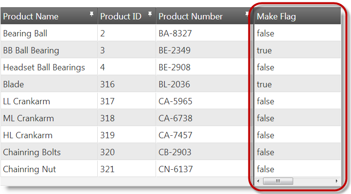
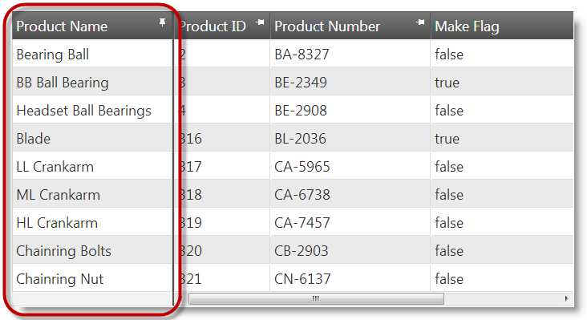

---
title: "列固定の構成 (igGrid)"
slug: iggrid-columnfixing-configuring
---

# 列固定の構成 (igGrid)

## トピックの概要

### 目的

このトピックではコード例を使用して、列固定領域の配置、列固定の初期状態、固定解除列領域の最小幅など `igGrid`™ コントロールの列固定機能を構成する方法を説明します。

### 前提条件

このトピックを理解するために、以下のトピックを参照することをお勧めします。

- [igGrid の概要](/controls/iggrid/overview): このトピックでは、`igGrid` コントロールとその機能の概念的な概要を提供し、HTML ページへの追加方法をコードを用いて説明します。

- [igGrid/igDataSource アーキテクチャの概要](/controls/iggrid/igdatasource-architecture-overview): このトピックでは、`igGrid` コントロールのインナー作用およびデータ ソース コンポーネントとの相互作用を説明します (`igDataSource`™)。

- [列固定の概要 (igGrid)](/controls/iggrid/features/columns/fixing/columnfixing-overview): このトピックでは、サポートされているユーザー インストラクションおよび主な構成オプションなど、`igGrid` の列固定機能の概要を説明します。

- [列固定の有効化 (igGrid)](/controls/iggrid/features/columns/fixing/columnfixing-enabling): このトピックではコード例を使用して、JavaScript と ASP.NET MVC で `igGrid` の列固定機能を有効にする方法を説明します。


### このトピックの内容

このトピックは、以下のセクションで構成されます。

-   [**列固定の構成の概要**](#configuration-summary)
-   [**列固定方向の構成**](#direction)
    -   [プロパティ設定](#direction-property-settings)
    -   [例: 右側の固定方向の構成](#direction-example)
-   [**列固定の初期状態の構成**](#initial-state)
    -   [概要](#initial-overview)
    -   [プロパティ設定](#initial-property-settings)
    -   [例](#initial-example)
-   [**列に対する列固定の無効化**](#disable)
    -   [概要](#disable-overview)
    -   [プロパティ設定](#disable-property-settings)
    -   [例](#disable-example)
-   [**固定できない列領域の最小幅の構成**](#non-fixable-min-width)
    -   [プロパティ設定](#non-fixable-min-width-property)
    -   [例](#non-fixable-min-width-example)
-   [**関連コンテンツ**](#related-content)
    -   [トピック](#topics)
    -   [サンプル](#samples)


## <a id="configuration-summary"></a> 列固定の構成の概要

以下の表に、`igGrid` 列固定の構成可能な要素を示します。このメソッドについては、表の下にある解説も参照してください。


|  |  |  |
| --- | --- | --- |
| 構成可能な項目 | 詳細 | プロパティ |
| 有効化 / 無効化 | デフォルトで、任意に列を固定できます。列の固定を有効または無効にできます。 | [columnSettings](environment:jQueryApiUrl/ui.iggridcolumnfixing#options:columnSettings) [columnSettings.columnKey](environment:jQueryApiUrl/ui.iggridcolumnfixing#options:columnSettings.columnKey) [columnSettings.allowFixing](environment:jQueryApiUrl/ui.iggridcolumnfixing#options:columnSettings.allowFixing) |
| [固定列の配置](/controls/iggrid/features/columns/fixing/columnfixing-configuring) | デフォルトで、固定列は左側に、固定解除列は右側に配置されます。固定列と固定解除列の位置はスワップ (固定列を右側、固定解除列を左側に配置) できます。 | [fixingDirection](environment:jQueryApiUrl/ui.iggridcolumnfixing#options:fixingDirection) |
| [初期の固定状態](/controls/iggrid/features/columns/fixing/columnfixing-configuring) | デフォルトで、列の初期設定は「固定解除」です。固定に設定を変更できます。 | [columnSettings](environment:jQueryApiUrl/ui.iggridcolumnfixing#options:columnSettings) [columnSettings.columnKey](environment:jQueryApiUrl/ui.iggridcolumnfixing#options:columnSettings.columnKey) [columnSettings.isFixed](environment:jQueryApiUrl/ui.iggridcolumnfixing#options:columnSettings.isFixed) |
| [固定解除列領域の最小幅](/controls/iggrid/features/columns/fixing/columnfixing-configuring) | 固定解除領域の最小幅を設定できます。最小幅は、常にスクロールバーから操作できるようにします。固定解除列領域の幅のデフォルト値は 30 px です。 | [minimalVisibleAreaWidth](environment:jQueryApiUrl/ui.iggridcolumnfixing#options:minimalVisibleAreaWidth) |
| データ スキップ列の初期の固定状態 | 行セレクターなどの機能は、データ スキップ列を使用して追加のコンテンツをグリッドに描画します。データ スキップ列は、データにバインドできず、行セレクター列などの機能目的に使用されるため、初期の固定状態はデータ バインドされた列とは別に管理されます。これには、特殊なプロパティである [`fixNondataColumns`](environment:jQueryApiUrl/ui.iggridcolumnfixing#options:fixNondataColumns) を使用します。 **注:** このプロパティは、固定列が左側に配置されている場合 ([`fixingDirection`](environment:jQueryApiUrl/ui.iggridcolumnfixing#options:fixingDirection) オプションが 「left」 に設定されている場合) のみ機能します。 | [fixNondataColumns](environment:jQueryApiUrl/ui.iggridcolumnfixing#options:fixNondataColumns) |


## <a id="direction"></a> グリッドでの固定列の配置の構成

デフォルトでは、固定列 ([固定列領域](/controls/iggrid/features/columns/fixing/columnfixing-overview)) は左側に、固定解除列 ([固定解除列領域](/controls/iggrid/features/columns/fixing/columnfixing-overview)) は右側に配置されます。固定列と固定解除列の位置はスワップ (固定列を右側、固定解除列を左側に配置) できます。

固定列領域と固定解除列領域との位置関係は、列固定機能の [`fixingDirection`](&#123;environment:jQueryApiUrl&#125;/ui.iggridcolumnfixing#options:fixingDirection) プロパティによって管理されます。

### <a id="direction-property-settings"></a> プロパティ設定

以下の表では、目的の構成をプロパティ設定にマップしています。

目的:|使用するプロパティ:|設定の選択肢:
---- | ----- | -----
固定列を左側に配置します。|[fixingDirection](&#123;environment:jQueryApiUrl&#125;/ui.iggridcolumnfixing#options:fixingDirection)|"left"
固定列を右側に配置します。|[fixingDirection](&#123;environment:jQueryApiUrl&#125;/ui.iggridcolumnfixing#options:fixingDirection)|"right"

### <a id="direction-example"></a> 例

以下のスクリーンショットは、以下の設定の結果、グリッドの右側に配置される固定列領域を示します。

プロパティ|値
---|---
[fixingDirection](&#123;environment:jQueryApiUrl&#125;/ui.iggridcolumnfixing#options:fixingDirection)|"right"




以下のコードはこの例を実装します。

**JavaScript の場合:**

```js
$("#grid").igGrid({
    dataSource: adventureWorks,
    autoGenerateColumns: true,
    features: [
        {
            name: "ColumnFixing",
            fixingDirection: "right"
        }
    ]
});
```

**ASPX の場合:**

```csharp
@(Html.Infragistics().Grid(Model)
.AutoGenerateColumns(true)
.ID("grid1")
.Features(f => f.ColumnFixing().FixingDirection(ColumnFixingDirection.Right))
.DataBind()
.Render())
```


## <a id="initial-state"></a> 列固定の初期状態の構成

### <a id="initial-overview"></a> 概要

グリッドの最初の初期化設定時に固定する列、および固定解除の列を指定できます。デフォルトで、すべての列の初期値は固定解除です。最初の固定列の構成は、各列で個別に行われます。

グリッドの初期化設定時に列を固定するには、列を (列キーまたは列インデックスである列識別子で) 指定し、[`isFixed`](&#123;environment:jQueryApiUrl&#125;/ui.iggridcolumnfixing#options:isFixed) プロパティを true に設定する必要があります。

-   JavaScript の場合は、列固定機能の [`columnSettings`](&#123;environment:jQueryApiUrl&#125;/ui.iggridcolumnfixing#options:columnSettings) プロパティを配列に設定します。その配列のオブジェクトは、列識別子および、その列の isFixed プロパティの設定で構成されます。
-   ASP.NET MVC の場合、チェーン メソッドでビュー内にグリッドを構成する場合、列固定機能の `ColumnSettings` メソッドを使用します。

列に対して列固定が無効になると、その列に対する列ヘッダー ピン固定ボタンが非表示になります。

### <a id="initial-property-settings"></a> プロパティ設定

以下の表は、初期の列の固定を有効にするプロパティとその設定を示します。

目的:|使用するプロパティ:|設定の選択肢:
---- | ----- | -----
初期の列固定|[columnSettings.columnKey](&#123;environment:jQueryApiUrl&#125;/ui.iggridcolumnfixing#options:columnSettings.columnKey)<br />または<br />[columnSettings.columnIndex](&#123;environment:jQueryApiUrl&#125;/ui.iggridcolumnfixing#options:columnSettings.columnIndex)|列のキー<br />または<br />列のインデックス番号
 | [columnSettings.isFixed](&#123;environment:jQueryApiUrl&#125;/ui.iggridcolumnfixing#options:columnSettings.isFixed) | true


### <a id="initial-example"></a> 例

以下のスクリーンショットは、以下の設定の結果、`igGrid` の初期化設定時に固定される Product Name 列 (列キーは "Name") を示します。


プロパティ|値
---|---
[columnSettings.columnKey](&#123;environment:jQueryApiUrl&#125;/ui.iggridcolumnfixing#options:columnSettings.columnKey)|"Name"
[columnSettings.isFixed](&#123;environment:jQueryApiUrl&#125;/ui.iggridcolumnfixing#options:columnSettings.isFixed)|true




以下のコードはこの例を実装します。

**JavaScript の場合:**

```js
$("#grid").igGrid({
    dataSource: adventureWorks,
    autoGenerateColumns: true,
    features: [
        {
            name: "ColumnFixing",
            columnSettings: [
                {
                    columnKey: "Name",
                    isFixed: true
                }
            ]
        }
    ]});
```

**ASPX の場合:**

```csharp
@(Html.Infragistics().Grid(Model)
.AutoGenerateColumns(true)
.ID("grid1")
.Features(f => 
    f.ColumnFixing()
    .ColumnSettings(cs => cs.ColumnSetting().ColumnKey("Name").IsFixed(true)))
.DataBind()
.Render())
```


## <a id="disable"></a> 列に対する列固定の無効化

### <a id="disable-overview"></a> 概要

固定を許可する列と許可しない列を指定できます。デフォルトで、グリッド内のすべての列に対して、列固定は有効です。列固定の無効化は、各列で個別に実行されます。

列の固定を無効にするには、列を (列キーまたは列インデックスである列識別子で) 指定し、[`allowFixing`](&#123;environment:jQueryApiUrl&#125;/ui.iggridcolumnfixing#options:allowFixing) プロパティを false に設定する必要があります。

-   JavaScript の場合は、機能の columnSettings プロパティを配列に設定します。その配列のオブジェクトは、列識別子および、その列の [`allowFixing`](&#123;environment:jQueryApiUrl&#125;/ui.iggridcolumnfixing#options:allowFixing) プロパティの設定で構成されます。
-   ASP.NET MVC の場合、チェーン メソッドでビュー内にグリッドを構成する場合、列固定機能の `ColumnSettings` を使用します。

列に対して列固定が無効になると、その列に対する列ヘッダー ピン固定ボタン
が非表示になります。

### <a id="disable-property-settings"></a> プロパティ設定

以下の表は、列の固定を無効にするプロパティとその設定を示します。

目的:|使用するプロパティ:|設定の選択肢:
---- | ----- | -----
初期の列固定|[columnSettings.columnKey](&#123;environment:jQueryApiUrl&#125;/ui.iggridcolumnfixing#options:columnSettings.columnKey)<br />または<br />[columnSettings.columnIndex](&#123;environment:jQueryApiUrl&#125;/ui.iggridcolumnfixing#options:columnSettings.columnIndex)|列のキー<br />または<br />列のインデックス番号
 | [columnSettings.allowFixing](&#123;environment:jQueryApiUrl&#125;/ui.iggridcolumnfixing#options:columnSettings.allowFixing) | false


### <a id="disable-example"></a> 例

以下のスクリーンショットは、以下の設定の結果、列固定が無効化された *Product Name* 列 (列キーは "Name") 示します。

プロパティ|値
---|---
[columnSettings.columnKey](&#123;environment:jQueryApiUrl&#125;/ui.iggridcolumnfixing#options:columnSettings.columnKey)|"Name"
[columnSettings.allowFixing](&#123;environment:jQueryApiUrl&#125;/ui.iggridcolumnfixing#options:columnSettings.allowFixing)|false


以下のコードはこの例を実装します。

**JavaScript の場合:**

```js
$("#grid").igGrid({
    dataSource: adventureWorks,
    autoGenerateColumns: true,
    features: [
        {
            name: "ColumnFixing",
            columnSettings: [
                {
                    columnKey: "Name",
                    allowFixing: false
                }
            ]
        }
    ]});
```

**ASPX の場合:**

```csharp
@(Html.Infragistics().Grid(Model)
.AutoGenerateColumns(true)
.ID("grid1")
.Features(f => 
    f.ColumnFixing()
    .ColumnSettings(cs => cs.ColumnSetting().ColumnKey("Name").AllowFixing(false)))
.DataBind()
.Render())
```


## <a id="non-fixable-min-width"></a> 固定解除列領域の最小幅の構成

[固定解除列領域](/controls/iggrid/features/columns/fixing/columnfixing-overview) は、水平スクロールバーで、列が固定された時に自動的に縮小します。その結果、固定解除列領域が非常に狭くなる場合があります。そのために、最小のしきい値幅を設定し、スクロールバーが引き続き操作できるようにします。最小のしきい値の幅に達した場合、[`columnFixingRefused`](&#123;environment:jQueryApiUrl&#125;/ui.iggridcolumnfixing#events) イベントが発生し、すでに固定されている複数の列の固定解除をするまで、列を固定できないことを通知します。

### <a id="non-fixable-min-width-property"></a> プロパティ設定

以下の表では、目的の構成をプロパティ設定にマップしています。

目的:|使用するプロパティ:|設定の選択肢:
---- | ----- | -----
固定できない列エリアの最小幅の構成|[minimalVisibleAreaWidth](&#123;environment:jQueryApiUrl&#125;/ui.iggridcolumnfixing#options:minimalVisibleAreaWidth)|最小幅 (ピクセル数) を示す値です。


### <a id="non-fixable-min-width-example"></a> 例

以下のスクリーンショットは、以下の設定の結果、非固定列の最小幅の外観がどのようになるか示しています。

プロパティ|値
---|---
[minimalVisibleAreaWidth](&#123;environment:jQueryApiUrl&#125;/ui.iggridcolumnfixing#options:minimalVisibleAreaWidth)|100


以下のコードはこの例を実装します。

**JavaScript の場合:**

```js
$("#grid").igGrid({
    dataSource: adventureWorks,
    autoGenerateColumns: true,
    features: [
        {
            name: "ColumnFixing",
            minimalVisibleAreaWidth: 100
        }
    ]
});
```

**ASPX の場合:**

```csharp
@(Html.Infragistics().Grid(Model)
.AutoGenerateColumns(true)
.ID("grid1")
.Features(f => f.ColumnFixing().MinimalVisibleAreaWidth(100)
.DataBind()
.Render())
```


## <a id="related-content"></a> 関連コンテンツ

### <a id="topics"></a> トピック

このトピックの追加情報については、以下のトピックも合わせてご参照ください。

- [メソッドの参照 (列固定、igGrid)](/controls/iggrid/features/columns/fixing/columnfixing-method-reference): このトピックは、`igGrid` コントロールの列固定機能に関するメソッドの参照情報を提供します。


### <a id="samples"></a> サンプル

このトピックについては、以下のサンプルも参照してください。

- [列の固定](&#123;environment:SamplesUrl&#125;/grid/column-fixing): このサンプルは、デフォルトで列を固定に設定する方法や列の固定を防止する方法など、`igGrid` の列固定の基本機能を紹介します。


 

 


