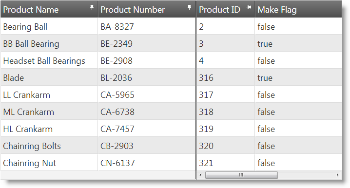
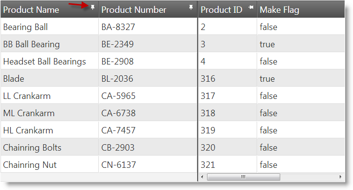
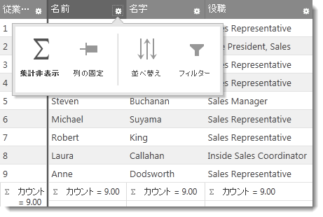
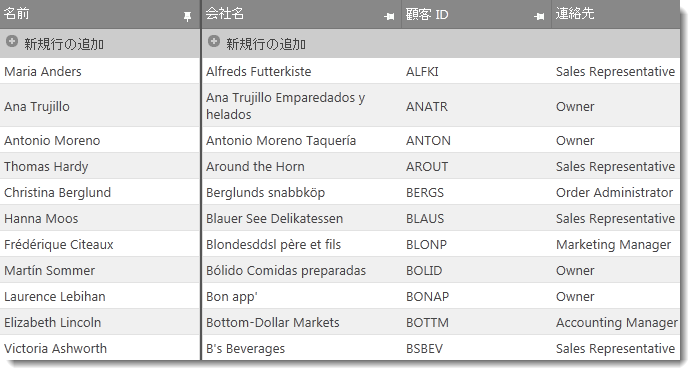

---
title: "列固定の概要 (igGrid)"
slug: iggrid-columnfixing-overview
---

# 列固定の概要 (igGrid)

## トピックの概要

### 目的

このトピックは、サポートされているユーザー インタラクションおよび主な構成オプションなど、`igGrid`™ の列固定機能の概要を説明します。

### 前提条件

このトピックを理解するために、以下のトピックを参照することをお勧めします。

- [igGrid の概要](/iggrid-overview): このトピックでは、`igGrid` コントロールとその機能の概念的な概要を提供し、HTML ページへの追加方法をコードを用いて説明します。

- [igGrid/igDataSource アーキテクチャの概要](/iggrid-igdatasource-architecture-overview): このトピックでは、`igGrid` コントロールのインナー作用およびデータ ソース コンポーネントとの相互作用を説明します (`igDataSource`™)。

- [機能セレクター](/iggrid-feature-chooser): このトピックでは、`igGrid` 機能セレクター メニューおよびそのセクションについて説明します。

- [igGrid の機能](/iggrid-features-landing-page): このトピックは、`igGrid` コントロールの機能について説明します。この列固定機能と一体化した他の機能についての理解が必要になります。

### このトピックの内容

このトピックは、以下のセクションで構成されます。

-   [**概要**](#introduction)
-   [**ユーザー インタラクションと操作性**](#user-interactions-usability)
    -   [ユーザー インタラクションの概要表](#usability-summary)
    -   [ピン固定ボタンの概要](#pin-button-summary)
    -   [機能セレクター メニューの概要](#feature-chooser-menu)
    -   [タッチ サポート](#touch-support)
-   [**列固定の構成**](#configuring)
    -   [列固定構成の概要表](#configuring-summary)
    -   [列固定のデフォルト構成](#default-configuration)
-   [**列固定と他の機能との統合**](#feature-integration)
    -   [サポートされる機能の概要](#supported-features)
    -   [サポートされていない機能の概要](#non-supported-features)
    -   [更新機能](#updating-feature)
    -   [複数列ヘッダー機能](#multi-column-headers)
    -   [行セレクター機能](#row-selectors)
	-   [仮想化](#virtualization)
-   [**キーボード操作**](#keyboard-interaction)  
-   [**関連コンテンツ**](#related-content)
    -   [トピック](#topics)
    -   [サンプル](#samples)

##  概要

`igGrid` の列固定は、グリッドの右または左の列を固定して、水平方向にスクロールしたときにユーザー ビューの外に出ないようにします。これは、グリッド インターフェイスから、または列固定機能の API を介してプログラムで実行できます。列固定がアクティブになると、固定した列と固定できる列のヘッダーにはピン固定ボタンが表示されます。

列ヘッダーのピン アイコンをクリックして、または複数の機能が有効な場合は機能セレクター ダイアログを使用して、列を固定できます。列固定はタッチ対応デバイスでも機能します。

列固定を適用すると、グリッドは以下の 2 つの領域に定義されます。

-   **固定列領域** - 固定列で構成されたスクロールできない領域。
-   **固定解除領域** - その他の列 (固定解除列) で構成されたスクロールできる領域。水平のスクロールバーがあります。

列固定領域は、左側 (デフォルト) または右側になります。以下の画像は、左側にある 2 つの列の固定列領域を示します。

列固定機能では、列の幅をピクセル単位で定義する必要があります (明示的に定義または [defaultColumnWidth](&#123;environment:jQueryApiUrl&#125;/ui.iggrid#options:defaultColumnWidth) オプションを使用して定義)。

>**注:** 列の幅はピクセル単位のみをサポートします。グリッド幅はピクセルまたはパーセンテージ単位で設定してください (設定が必要です)。

`igGrid`™ コントロールでの固定および固定解除領域は、2 つの異なるテーブル DOM 要素として実装されます。そのため、固定列領域に対してすべてのグリッド DOM 操作メソッドを複製することが必要です。通常、固定列領域の API は固定を示す接頭辞が付けられます。

##  ユーザー インタラクションと操作性

列は以下の方法で固定および固定解除できます。

-   列ヘッダーの[ピン固定ボタン](#pin-button-summary)
-   [機能セレクター ドロップダウン メニュー](#feature-chooser-menu)

###  ユーザー インタラクションの概要表

以下の表は、標準のコンピュータまたはタッチ操作対応デバイスで列を固定できる動作を示しています。固定列 / 列の固定解除:

方法|詳細|クライアント/サーバー設定
---|---|---
列ヘッダーのピン固定ボタン|列ヘッダーのピン固定ボタンをクリックすると、列の固定または解除ができます。 | 
機能セレクター メニュー|機能セレクター メニューの 固定列 / 列の固定解除オプションを選択すると、列を固定または固定解除できます。 | 

###  ピン固定ボタンの概要

列ヘッダーのピン固定ボタンは、列固定機能がその列に対して有効な場合にのみ利用できます。ピン固定ボタンのアイコンは列の状態を示します。

-   列の固定:

    

-   列の固定解除:

    

ピン固定ボタンをクリックすると列が固定 / 固定解除します。固定が無効な列には、ピン固定ボタンや機能セレクター メニューは表示されません。

列を固定すると、その列は固定列領域の最後 (右端) に挿入されます。列を固定解除すると、その列は固定解除列領域の最初 (左端) に挿入されます。

###  機能セレクター メニューの概要

列固定が[機能セレクター](/iggrid-feature-chooser)で有効な場合は、機能セレクター メニューの項目として表示されます。

列固定が有効な場合、列の固定 / 固定解除オプションが1つの項目として機能セレクター メニューに追加されます。

###  タッチ サポート

タッチ操作対応デバイスでは、ピン固定ボタンおよび機能セレクター ドロップダウン メニューが操作可能です。

##  列固定の構成

###  列固定構成の概要表

以下の表に、`igGrid` 列固定の構成可能な要素を示します。

|  |  |  |
| --- | --- | --- |
| 構成可能な項目 | 詳細 | プロパティ |
| [有効化 / 無効化](/iggrid-columnfixing-configuring) | デフォルトで、任意に列を固定できます。列の固定を有効または無効にできます。 | [columnSettings](environment:jQueryApiUrl/ui.iggridcolumnfixing#options:columnSettings) [columnSettings.columnKey](environment:jQueryApiUrl/ui.iggridcolumnfixing#options:columnSettings.columnKey) [columnSettings.allowFixing](environment:jQueryApiUrl/ui.iggridcolumnfixing#options:columnSettings.allowFixing) |
| [固定列の配置](/iggrid-columnfixing-configuring) | デフォルトで、固定列は左側に、固定解除列は右側に配置されます。固定列と固定解除列の位置はスワップ (固定列を右側、固定解除列を左側に配置) できます。 | [fixingDirection](environment:jQueryApiUrl/ui.iggridcolumnfixing#options:fixingDirection) |
| [初期の固定状態](/iggrid-columnfixing-configuring) | デフォルトで、列の初期設定は「固定解除」です。固定に設定を変更できます。 | [columnSettings](environment:jQueryApiUrl/ui.iggridcolumnfixing#options:columnSettings) [columnSettings.columnKey](environment:jQueryApiUrl/ui.iggridcolumnfixing#options:columnSettings.columnKey) [columnSettings.isFixed](environment:jQueryApiUrl/ui.iggridcolumnfixing#options:columnSettings.isFixed) |
| [固定解除列領域の最小幅](/iggrid-columnfixing-configuring) | 固定解除領域の最小幅を設定できます。最小幅は、常にスクロールバーから操作できるようにします。固定解除列領域の幅のデフォルト値は 30 px です。 | [minimalVisibleAreaWidth](environment:jQueryApiUrl/ui.iggridcolumnfixing#options:minimalVisibleAreaWidth) |
| データ スキップ列の初期の固定状態 | 行セレクターなどの機能は、データ スキップ列を使用して追加のコンテンツをグリッドに描画します。データ スキップ列は、データにバインドできず、行セレクター列などの機能目的に使用されるため、初期の固定状態はデータ バインドされた列とは別に管理されます。これには、特殊なプロパティである [`fixNondataColumns`](environment:jQueryApiUrl/ui.iggridcolumnfixing#options:fixNondataColumns) を使用します。 **注:** このプロパティは、固定列が左側に配置されている場合 ([`fixingDirection`](environment:jQueryApiUrl/ui.iggridcolumnfixing#options:fixingDirection) オプションが 「left」 に設定されている場合) のみ機能します。 | [fixNondataColumns](environment:jQueryApiUrl/ui.iggridcolumnfixing#options:fixNondataColumns) |

###  列固定のデフォルト構成

デフォルトで、列はヘッダーのピン固定ボタンで表示され、固定列は左側に配置されます。

以下の表に、固定列機能のデフォルト設定を示し、その意味を説明します。

プロパティ|タイプ|デフォルト値|説明
---|---|---|---
[fixingDirection](&#123;environment:jQueryApiUrl&#125;/ui.iggridcolumnfixing#options:fixingDirection)|string |"left"|固定列を左側に配置します。
[showFixButtons](&#123;environment:jQueryApiUrl&#125;/ui.iggridcolumnfixing#options:showFixButtons) |bool|true|列固定のビン固定ボタンをヘッダー セルに表示します。
[syncRowHeights](&#123;environment:jQueryApiUrl&#125;/ui.iggridcolumnfixing#options:syncRowHeights) |bool|true|固定列領域での行の高さが、固定解除列領域での行の高さに同期します。
[scrollDelta](&#123;environment:jQueryApiUrl&#125;/ui.iggridcolumnfixing#options:scrollDelta) |number|40|マウス ホイールまたはキーボードを使用して、固定列をスクロールしたときの差分スペースを 40 px に設定します。
[minimalVisibleAreaWidth](&#123;environment:jQueryApiUrl&#125;/ui.iggridcolumnfixing#options:minimalVisibleAreaWidth)|number|30|固定解除列領域の最小可視幅を 30 px に設定します。
[fixNondataColumns](&#123;environment:jQueryApiUrl&#125;/ui.iggridcolumnfixing#options:fixNondataColumns)|bool|true|データ スキップ列の初期設定は「固定」です。

##  列固定と他の機能との統合

###  サポートされる機能の概要

`igGrid` の列固定機能は、以下の `igGrid` 機能に統合されています。

-   [セルの結合](../../07_Cell Merging/~igGrid_CellMerging_LandingPage.mdx)
-   [フィルタリング](/iggrid-filtering)
-   [複数列ヘッダー](/iggrid-multicolumnheaders-landingpage)
-   [ページング](/iggrid-paging)
-   [サイズ変更](/iggrid-column-resizing)
-   [行セレクター](../../02_Row Selectors/~igGrid_Row_Selectors.mdx)
-   [選択](/iggrid-selection)
-   [並べ替え](/iggrid-sorting)
-   [集計](/iggrid-column-summaries)
-   [ツールチップ](igGrid-Tooltips.html)
-   [更新](/iggrid-updating)
-   [非表示](/iggrid-column-hiding)

###  サポートされていない機能の概要

列固定は、以下の `igGrid` 機能に対応していません。

-   [Groupby](/iggrid-groupby)
-   [レスポンシブ Web デザイン (RWD) モード](/iggrid-responsive-web-design-mode-landingpage)
-   [非バインド列](/iggrid-unboundcolumns-landing-page) 

サポートされていない機能を列固定と一緒に有効にすると、例外が発生します。

###  更新機能

[`更新`](/iggrid-updating)を列固定とともに有効にすると、2 つの異なる [**新しい行の追加**] ボタンが表示されます。1 つは固定列領域用で、もう 1 つは固定解除領域用です。

###  複数列ヘッダー機能

複数列ヘッダー機能が有効な場合、列固定は複数列ヘッダーの最上位レベルに対してのみ機能します。内部レベルのグループや個別の列は固定できません。

###  行セレクター機能

列固定の [`fixNondataColumns`](&#123;environment:jQueryApiUrl&#125;/ui.iggridcolumnfixing#options:fixNondataColumns) オプションは、行セレクターの列ビヘイビアーに影響を与えます。`fixNondataColumns` を true に設定すると、セレクターの列は初期状態で固定されます。`fixNondataColumns` を false に設定すると、行セレクターの列は通常のビヘイビアーを維持し、常に左側に配置されます。固定列領域には固定されません。デフォルトで、`fixNondataColumns` は true に設定されています。

固定列領域と固定解除列領域をスワップしている場合、すなわち [`fixingDirection`](&#123;environment:jQueryApiUrl&#125;/ui.iggridcolumnfixing#options:fixingDirection) オプションを 'right' に設定している場合、`fixNondataColumns` オプションは無視されます。

###  仮想化

igGrid の列固定機能は、igGrid の[仮想化](/iggrid-virtualization)機能 (固定仮想化と連続仮想化の両方) に統合されています。仮想化を有効にすると、すべての列に適用され、固定列と固定解除列およびグリッドの 2 つの領域間のスクロール位置は同期します。

>**注:** 列の仮想化はサポートされないことに注意してください。

##  キーボード操作

以下のキーボード操作が可能です。

グリッドにフォーカスがある場合:

-	TAB: 列固定 UI のフォーカス可能な要素間でフォーカスを移動: 列ヘッダーの固定/固定解除アイコン。

フォーカスが列ヘッダーの固定/固定解除アイコンにある場合:

-	ENTER - 関連する列の固定\固定解除。

##  関連コンテンツ

###  トピック

このトピックの追加情報については、以下のトピックも合わせてご参照ください。

- [列固定の有効化 (igGrid)](/iggrid-columnfixing-enabling): このトピックではコード例を使用して、JavaScript と ASP.NET MVC で `igGrid` の列固定機能を有効にする方法を説明します。

- [列固定の構成 (igGrid)](/iggrid-columnfixing-configuring): このトピックではコード例を使用して、固定列領域の配置、列固定の初期状態、固定解除列領域の最小幅など、`igGrid` コントロールの列固定機能を構成する方法を説明します。

- [メソッドの参照 (列固定、igGrid)](/iggrid-columnfixing-method-reference): このトピックは、`igGrid` コントロールの列固定機能に関するメソッドの参照情報を提供します。

###  サンプル

このトピックについては、以下のサンプルも参照してください。

- [列の固定](&#123;environment:SamplesUrl&#125;/grid/column-fixing): このサンプルは、デフォルトで列を固定に設定する方法や列の固定を防止する方法など、`igGrid` の列固定の基本機能を紹介します。

 

 

