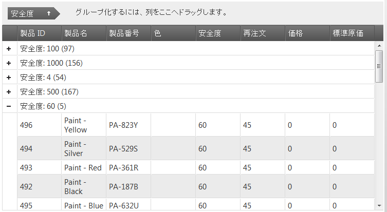
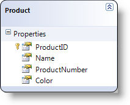

import ApiLink from 'docs-template/components/mdx/ApiLink.astro';

# 列のグループ化の有効化 (igGrid)

## トピックの概要

### 目的

このトピックでは、jQuery と MVC の両方について、`igGrid`™ のグループ化機能を有効にする手順を示します。

### このトピックの内容

このトピックは、以下のセクションで構成されます。

-   [**概要**](#introduction)
-   [**プレビュー**](#preview)
-   [**要件**](#requirements)
    -   [一般的な要件](#general-requirements)
    -   [スクリプト要件](#script-requirements)
    -   [データベース要件](#database-requirements)
-   [**jQuery におけるグループ化の有効化**](#enabling-grouping-jquery)
-   [**MVC におけるグループ化の有効化**](#enabling-grouping-mvc)
-   [**カスタムのグループ化実装**](#custom-grouping-implementations)
-   [**関連コンテンツ**](#related-content)
    -   [トピック](#topics)
    -   [サンプル](#samples)

## 概要


`igGrid` コントロールのグループ化機能はデフォルトで無効のため、明示的に有効にする必要があります。グリッドの作成時に追加プロパティ (たとえば、グループ内での並べ替え方向などのプロパティ) を構成しておきたいという場合には、グループ化したい列を明示的に設定する必要があります。

下の構成例では、グリッドのグループ化機能が有効になり、グリッドのコンテンツはデフォルトで Safety Level というグリッド列の値に基づいてグループ化されます。

## プレビュー

以下は最終結果のプレビューです。



## 要件

### 一般的な要件

-   jQuery の要件
    -   グリッドがデータ ソースに接続されている HTML 形式の Web ページであること
    -   グリッドのコンテナとして機能するテーブル タグがHTML ページの本文に含まれていること

        **HTML の場合:**

```html
        <table id="t1">
        </table>
```

-   MVC 固有の要件
    -   グリッドがデータ ソースに接続されている MS Visual Studio® の MVC 4 以後のプロジェクトであること
    -   &#123;environment:ProductNameMVC&#125; dll への参照があること - Infragistics.Web.Mvc.dll

### スクリプト要件

jQuery と MVC が jQuery ウィジェットを再描画するため、両方のサンプルに必要なスクリプトは同じです。次が必要になります。

グリッドとそのグループ化機能を実行するためには以下のスクリプトが必要とされます。

-   jQuery ライブラリ スクリプト
-   jQuery User Interface (UI) ライブラリ スクリプト
-   Infragistics ライブラリ スクリプト (これはコントロールのコードを難読化したものです)

次のコード サンプルは、HTML ファイルのヘッダー コードに追加されるスクリプトです。

**HTML の場合:**

```html
<script type="text/javascript"src="jquery.min.js"></script>
<script type="text/javascript" src="jquery-ui.min.js"></script>
<script type="text/javascript" src="infragistics.core.js"></script>
<script type="text/javascript" src="infragistics.lob.js"></script>
```

### データベース要件

このサンプルでは以下が使用されています。

-   jQuery - JSON 形式の Adventure Works。
-   MVC - Adventure Works データベース。

## jQuery におけるグループ化の有効化

`$(document).ready()` イベント ハンドラーの中で、`igGrid` を作成し、グリッドのグループ化機能を列のグループ化を許可するために構成します。下のサンプルでは、特に指定しない限り、1 つの列値 (SafetyStockLevel) に基づいてグリッドの並べ替えが行われます。

**JavaScript の場合:**

```js
$("#grid1").igGrid({
     features: [
        {
          name: 'GroupBy',
		  columnSettings: [
		  {
            columnKey: "SafetyStockLevel",
            isGroupBy: true,
            dir: "asc"
          }
        ]
       }
    ],
    dataSource: adventureWorks,
    responseDataKey: 'Records',
    autoGenerateColumns: true
});
```

結果を確認するには、ブラウザーで HTML ファイルを開きます。デフォルトのグループ化基準列に基づいてグループ化されたグリッドが表示され、他の列によってグループ化することも現在のグループ化を取り消すこともできるようになります。

## MVC におけるグループ化の有効化

1.SQL モデルへの LINQ を作成します。



2.MVC Controller メソッドを作成します。

SQL Model からデータを取得して View を呼び出すための MVC Controller メソッドを作成します。

**MVC の場合:**

```csharp
public ActionResult Default()
{
	var ctx = new AdventureWorksDataContext("ConnString");
	var ds = ctx.Products;

	return View("Events", ds);
}
```

3.グリッドを作成します。

グリッド自体を定義すると同時に、Group By 機能とその構成値をすべて定義します。

**Razor の場合:**

```csharp
@Html.Infragistics()
.Grid(Model)
.ID("grid1")
.Features(feature => {
	feature.GroupBy().ColumnSettings(groupedGolumn =>
	{
		groupedGolumn.ColumnSetting().ColumnKey("Color").IsGroupBy(true);
	});
})
.AutoGenerateColumns(true)
.PrimaryKey("ProductID")
.Width("750px")
.DataBind()
.Render()
)
```

4.プロジェクトを保存します。

5.(オプション) 結果を確認します。

結果を検証するために、アプリケーションを実行します。デフォルトのグループ化基準列に基づいてグループ化されたグリッドが表示され、他の列によってグループ化することも現在のグループ化を取り消すこともできるようになります。

## カスタムのグループ化実装

グループ化機能には、デフォルトの基準とは異なる基準に基づいてデータをグループ化するカスタム関数を使用することもできます。たとえば、特定の数値のパリティー (奇数または偶数) に基づいて列をグループ化することができます。


## 関連コンテンツ

### トピック

このトピックの追加情報については、以下のトピックも合わせてご参照ください。

- [列のグループ化の概要](/iggrid-groupby-overview)

- <ApiLink type="igGridGroupBy" label="グリッドのグループ化プロパティ リファレンス" />

- [igGrid の既知の問題および重大な変更](/iggrid-known-issues)

### サンプル

このトピックについては、以下のサンプルも参照してください。

- [グループ化](&#123;environment:SamplesUrl&#125;/grid/grouping)