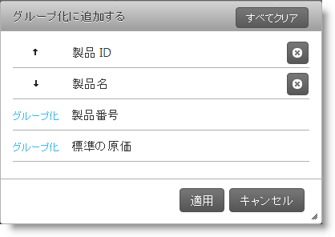
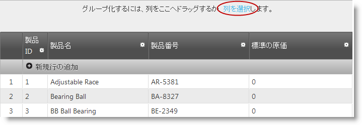
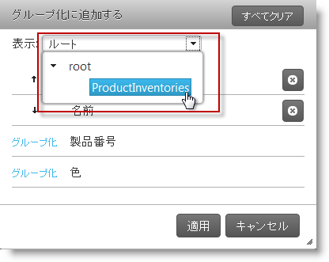
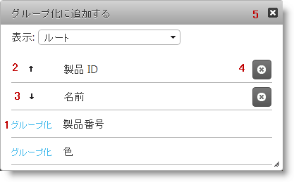
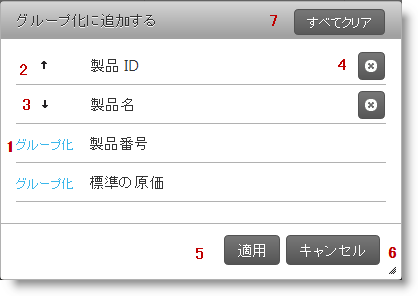

# グループ化ダイアログの概要 (igGrid)

import ApiLink from 'docs-template/components/mdx/ApiLink.astro';

# グループ化ダイアログの概要 (igGrid)

## トピックの概要

### 目的

このトピックでは、`igGrid`™ コントロールのグループ化ダイアログについて説明します。

### 前提条件

以下の表は、このトピックを理解するための前提条件として必要なトピックを示しています。

- [\{environment:ProductName\} コントロールのタッチ サポート](/touch-support-for-igniteui-for-jquery-controls): このトピックでは、\{environment:ProductName\}™ コントロールのタッチ サポート インタラクションの更新内容を紹介します。

- [機能セレクター](/iggrid-feature-chooser): このトピックでは、`igGrid`™ 機能セレクター メニューとそのそのセクションについて説明します。 

- [igGrid Group By の概要](/iggrid-groupby-overview): このトピックでは、`igGrid` におけるグループ化を示します。

- [igHierarchicalGrid™ Group By の概要](/ighierarchicalgrid-grouping-overview): このトピックでは、`igHierarchicalGrid` におけるグループ化を示します。

### このトピックの内容

このトピックは、以下のセクションで構成されます。

-   [**概要**](#introduction)
-   [**構成可能な動作**](#configurable-behaviors)
-   [**ユーザーによる操作**](#user-interactions)
    -   [ユーザー相互作用の概要](#user-interactions-summary)
    -   [即時グループ化が有効な状態のグループ化](#interactions-immediate-grouping)
    -   [遅延グループ化が有効な状態のグループ化](#interactions-deferred-grouping)
-   [**プロパティ リファレンス**](#property-reference)
-   [**メソッド リファレンス**](#method-reference)
-   [**イベント リファレンス**](#event-reference)
-   [**関連コンテンツ**](#related-content)
    -   [トピック](#topics)
    -   [サンプル](#samples)

##  概要

### グループ化ダイアログの概要

`igGrid` グループ化のモーダル ダイアログは、任意の列によるグリッドのグループ化を可能にするウィンドウです。グループ化モーダル ダイアログによって、グループ化された列を順序を選択でき、またすべての列に変更を即座に適用、あるいは複数の列に変更を一度に適用することができます。これは、タッチ プラットフォーム デバイスで、`igGrid` ごとにグループ化する必要がある場合に非常に役立ちます。グループ化ダイアログ ウィンドウは、特にタッチ プラットフォーム デバイス向けに設計されています。

モーダル ダイアログ ウィンドウは、グリッド内でグループ化される順序で、グループ化された列を表示します。

### グループ化ダイアログへのアクセス

グループ化モーダル ダイアログ ウィンドウを開くには、グループ化領域の「列を選択」のラベルをクリックします。

*Group By* ダイアログを表示するには、デフォルトではグリッドの上部にある `igGrid` グループ化領域の*列を選択*リンクをクリックします。

### igGrid および igHierarchicalGrid グループ化ダイアログの違い

`igGrid` および `igHierarchicalGrid` のダイアログの違いは、`igHierarchicalGrid` には追加のドロップ ダウンがあり、階層から列レイアウトを選択できることです。ドロップダウンからレイアウトを選択することによって、モーダル ダイアログは、現在のグリッド レイアウトのすべての列を表示します。表示された列のいくつかを選択することによって、グリッドをグループ化できます。新しいグリッド レイアウトを選択してから同じレイアウトに再び戻ると、グループ化された列の順序は保持されています。モーダル ダイアログの*すべてクリア* ボタンを押すことによって、すべてのグループ化をクリアできます。

igGrid|igHierarchicalGrid
----   | -----
 | 

##  構成可能な動作

ウィンドウには、即時グループ化および遅延グループ化 (デフォルト) の、2 つのグループ化動作があります。これは、ユーザーがグループ化アクションを実行したときに、グリッドを自動的に更新するかどうかを定義します。これらの動作は、<ApiLink type="iggridgroupby" member="modalDialogGroupByOnClick" section="options" label="modalDialogGroupByOnClick" /> プロパティの状態によって管理されます。詳細については、構成可能な動作チャートを参照してください。

### igGrid の構成可能な動作チャート

以下の表は、グループ化ダイアログの構成可能な動作を示しています。このメソッドについては、表の下にある解説も参照してください。

動作|説明|*modalDialogGroupByOnClick* 値
-------  | ----------- | ------------ 
[即時グループ化](#interactions-immediate-grouping)|ユーザーが列を選択すると、グリッドは遅延なしにその列によってグループ化されます。|true
[遅延グループ化](#interactions-deferred-grouping)|ユーザーが列を選択すると、グリッドは、**適用**ボタンがクリックされるまでグループ化されません。これによって、グループ化アクションが発生する前に、ユーザーは複数の列を選択して、その順序を定義できます。|false

##  ユーザーによる操作

###  ユーザー相互作用の概要

ユーザーがグループ化を実行する方法は、即時グループ化および遅延グループ化*が有効かどうかによって*異なります。*以下の表では、それぞれのユーザー アクションの概要をまとめています。*このメソッドについては、表の下にある解説も参照してください。

ユーザー操作|説明
-------  | -----------
[即時グループ化が有効な状態のグループ化](#interactions-immediate-grouping)|ユーザーは、列をクリックすることによって、特定の列ごとにグリッドをグループ化します。
[遅延グループ化が有効な状態のグループ化](#interactions-deferred-grouping)|ユーザーは希望の列を選択してから、**適用**ボタンをクリックしてグループ化アクションを適用します。

###  即時グループ化が有効な状態のグループ化

以下のボタンを使用します。

1.  グループ化 - 現在の列を昇順にグループ化します (行全体がクリック可能です)。
2.  上矢印 - 列は昇順でグループ化されます。ボタンを押すと、降順でグループ化されます (行全体がクリック可能です)。
3.  下矢印 - 列は降順でグループ化されます。ボタンを押すと、昇順でグループ化されます (行全体がクリック可能です)。
4.  グループの解除 - 現在の列によるグループ化を解除します。
5.  閉じる - モーダル ダイアログを閉じます。
6.  ESC (キー) - モーダル ダイアログを閉じます。

###  遅延グループ化が有効な状態のグループ化

デフォルトで、<ApiLink type="iggridgroupby" member="modalDialogGroupByOnClick" section="options" label="modalDialogGroupByOnClick" /> は false に設定されます。つまり、グループ化する列を選択してから、変更をグリッドに適用してグループ化を適用する必要があります。

以下のボタンを使用します。

1.  グループ化 - 現在の列を昇順にグループ化します (行全体がクリック可能です)。
2.  上矢印 - 列は昇順でグループ化されます。ボタンを押すと、降順でグループ化されます (行全体がクリック可能です)。
3.  下矢印 - 列は降順でグループ化されます。ボタンを押すと、昇順でグループ化されます (行全体がクリック可能です)。
4.  グループの解除 - 現在の列によるグループ化を解除します。
5.  適用 - 目的の順序で列をグループ化、それを適用します。
6.  キャンセル - モーダル ダイアログを閉じ、変更を適用しません。
7.  すべてクリア - すべてのレイアウト内のグループ化された列をすべて削除します。
8.  ESC (キー) - モーダル ダイアログを閉じます。

> **注**: `igHierarchicalGrid` ウィジェットについては、追加のドロップダウンが利用可能であり、これを使用して、まず子レイアウトを選択してから、グループ化する列を選択できます。

## プロパティ リファレンス

このセクションでは、モーダル ダイアログに影響を及ぼす、`igGrid` の Group By プロパティについて説明します。

以下の表は、モーダル ダイアログの構成を担当する、`igGrid` の Group By プロパティを示しています。

プロパティ|説明
-------  | -----------
<ApiLink type="iggridgroupby" member="modalDialogGroupByOnClick" section="options" label="modalDialogGroupByOnClick" /> |グループ化ダイアログ ウィンドウで列を選択したときに発生することを指定します。即時グループ化/グループ化解除するか、または「適用」ボタンがクリアされるまで待機します。
<ApiLink type="iggridgroupby" member="modalDialogWidth" section="options" label="modalDialogWidth" /> |ダイアログの幅を指定します
<ApiLink type="iggridgroupby" member="modalDialogHeight" section="options" label="modalDialogHeight" /> |ダイアログの高さを指定します
<ApiLink type="iggridgroupby" member="modalDialogAnimationDuration" section="options" label="modalDialogAnimationDuration" /> |ダイアログを表示/非表示にするための、アニメーションの時間を指定します (ミリ秒)
<ApiLink type="iggridgroupby" member="modalDialogDropDownWidth" section="options" label="modalDialogDropDownWidth" /> |グリッド レイアウトを表示する Modal Dialog のドロップダウンの幅を指定します
<ApiLink type="iggridgroupby" member="modalDialogDropDownAreaWidth" section="options" label="modalDialogDropDownAreaWidth" /> |ダイアログのレイアウト ドロップダウンの高さを指定します
<ApiLink type="iggridgroupby" member="modalDialogGroupByButtonText" section="options" label="modalDialogGroupByButtonText" /> |ダイアログの Group By ボタンのテキストを指定します
<ApiLink type="iggridgroupby" member="modalDialogCaptionButtonDesc" section="options" label="modalDialogCaptionButtonDesc" /> |ダイアログ内の降順に並べ替えられた各列のキャプションを指定します
<ApiLink type="iggridgroupby" member="modalDialogCaptionButtonAsc" section="options" label="modalDialogCaptionButtonAsc" /> |ダイアログ内の昇順に並べ替えられた各列のキャプションを指定します
<ApiLink type="iggridgroupby" member="modalDialogCaptionButtonUngroup" section="options" label="modalDialogCaptionButtonUngroup" /> |グループ化ダイアログ内のキャプション ボタンのグループ解除を指定します
<ApiLink type="iggridgroupby" member="modalDialogCaptionText" section="options" label="modalDialogCaptionText" /> |ダイアログのキャプション テキストを指定します
<ApiLink type="iggridgroupby" member="modalDialogDropDownLabel" section="options" label="modalDialogDropDownLabel" /> |グリッド レイアウトを表示するモーダル ダイアログのドロップダウンのラベルを指定します。
<ApiLink type="iggridgroupby" member="modalDialogRootLevelHierarchicalGrid" section="options" label="modalDialogRootLevelHierarchicalGrid" /> |レイアウトのツリー ダイアログを示す root レイアウトの名前を指定します
<ApiLink type="iggridgroupby" member="modalDialogDropDownButtonCaption" section="options" label="modalDialogDropDownButtonCaption" /> |ダイアログのグリッド レイアウト ドロップダウン ボタンのキャプションを指定します
<ApiLink type="iggridgroupby" member="modalDialogClearAllButtonLabel" section="options" label="modalDialogClearAllButtonLabel" /> |ダイアログのすべてクリア ボタンのラベルを指定します
<ApiLink type="iggridgroupby" member="emptyGroupByAreaContentSelectColumnsCaption" section="options" label="emptyGroupByAreaContentSelectColumnsCaption" /> |ダイアログを開くボタンのキャプションを指定します
<ApiLink type="iggridgroupby" member="modalDialogButtonApplyText" section="options" label="modalDialogButtonApplyText" /> |ダイアログで変更を適用するボタンのテキストを指定します
<ApiLink type="iggridgroupby" member="modalDialogButtonCancelText" section="options" label="modalDialogButtonCancelText" /> |ダイアログで変更をキャンセルするボタンのテキストを指定します

##  メソッド リファレンス

このセクションでは、モーダル ダイアログに影響を及ぼす、`igGrid` の Group By メソッドについて説明します。

以下の表は、モーダル ダイアログ API で定義される `igGrid` グループ化メソッドを示しています。

メソッド|説明
------ | -----------
<ApiLink type="iggridgroupby" member="openGroupByDialog" section="methods" label="openGroupByDialog" /> |ダイアログを表示します。表示されている場合、メソッドは何も行いません。
<ApiLink type="iggridgroupby" member="closeGroupByDialog" section="methods" label="closeGroupByDialog" /> |ダイアログを非表示にします。非表示の場合、メソッドは何も行いません。
<ApiLink type="iggridgroupby" member="renderGroupByModalDialog" section="methods" label="renderGroupByModalDialog" /> |グループ化モーダル ダイアログのマークアップを描画します。マークアップがすでに描画されている場合、`openGroupByDialog` および `closeGroupByDialog` プロパティを使用して、モーダル ダイアログをオープン/クローズします。
<ApiLink type="iggridgroupby" member="openDropDown" section="methods" label="openDropDown" /> |レイアウト ドロップダウンを開きます (`igHierarchicalGrid` の場合のみ)。
<ApiLink type="iggridgroupby" member="closeDropDown" section="methods" label="closeDropDown" /> |レイアウト ドロップダウンを閉じます (`igHierarchicalGrid` の場合のみ)。

##  イベント リファレンス

このセクションでは、モーダル ウィンドウに関連付けられた、`igGrid` のグループ化イベントについて説明します。

以下の表は、 モーダル ダイアログの操作中に発生する、`igGrid` の Sorting イベントを示しています。

イベント|説明
----- | -----------
<ApiLink type="iggridgroupby" member="modalDialogOpening" section="events" label="modalDialogOpening" /> |モーダル ダイアログが開く前に発生するイベント。 
<ApiLink type="iggridgroupby" member="modalDialogOpened" section="events" label="modalDialogOpened" /> |モーダル ダイアログがすでに開いた後に発生するイベント。
<ApiLink type="iggridgroupby" member="modalDialogMoving" section="events" label="modalDialogMoving" /> |列チューザーの位置が変わるたびに発生するイベント。
<ApiLink type="iggridgroupby" member="modalDialogClosing" section="events" label="modalDialogClosing" /> |モーダル ダイアログが閉じる前に発生するイベント。
<ApiLink type="iggridgroupby" member="modalDialogClosed" section="events" label="modalDialogClosed" /> |モーダル ダイアログが閉じた後に発生するイベント。
<ApiLink type="iggridgroupby" member="modalDialogContentsRendering" section="events" label="modalDialogContentsRendering" /> |列チューザーのコンテンツが描画される前に発生するイベント。
<ApiLink type="iggridgroupby" member="modalDialogContentsRendered" section="events" label="modalDialogContentsRendered" /> |列チューザーのコンテンツが描画された後に発生するイベント。
<ApiLink type="iggridgroupby" member="modalDialogButtonApplyClick" section="events" label="modalDialogButtonApplyClick" /> |列チューザーのリセット ボタンをクリックすると発生するイベント
<ApiLink type="iggridgroupby" member="modalDialogButtonResetClick" section="events" label="modalDialogButtonResetClick" /> |列チューザーのリセット ボタンをクリックすると発生するイベント。
<ApiLink type="iggridgroupby" member="modalDialogGroupingColumn" section="events" label="modalDialogGroupingColumn" /> |モーダル ダイアログ内のグループ化される列がクリックされたときに発生するイベント。
<ApiLink type="iggridgroupby" member="modalDialogGroupColumn" section="events" label="modalDialogGroupColumn" /> |モーダル ダイアログ内のグループ化される列がクリックされたときに発生するイベント。
<ApiLink type="iggridgroupby" member="modalDialogUngroupingColumn" section="events" label="modalDialogUngroupingColumn" /> |モーダル ダイアログ内のグループ化を解除される列がクリックされたときに発生するイベント。
<ApiLink type="iggridgroupby" member="modalDialogUngroupColumn" section="events" label="modalDialogUngroupColumn" /> |モーダル ダイアログ内のグループ化を解除される列がクリックされたときに発生するイベント。
<ApiLink type="iggridgroupby" member="modalDialogSortGroupedColumn" section="events" label="modalDialogSortGroupedColumn" /> |モーダル ダイアログ内のグループ化を解除される列がクリックされたときに発生するイベント。

##  関連コンテンツ

###  トピック

このトピックの追加情報については、以下のトピックも合わせてご参照ください。

- [\{environment:ProductName\} コントロールのタッチ サポート](/touch-support-for-igniteui-for-jquery-controls): このトピックでは、\{environment:ProductName\}™ コントロールのタッチ サポート インタラクションの更新内容を紹介します。

- [機能セレクター](/iggrid-feature-chooser): このトピックでは、`igGrid`™ 機能セレクター メニューとそのそのセクションについて説明します。 

- [igGrid Group By の概要](/iggrid-groupby-overview): このトピックでは、`igGrid` におけるグループ化を示します。
 
- [igHierarchicalGrid™ Group By の概要](/ighierarchicalgrid-grouping-overview): このトピックでは、`igHierarchicalGrid` におけるグループ化を示します。

###  サンプル

このトピックについては、以下のサンプルも参照してください。

- [グループ化](\{environment:SamplesUrl\}/grid/grouping): igGrid グループ化のモーダル ダイアログ ウィンドウの操作を示すサンプル。