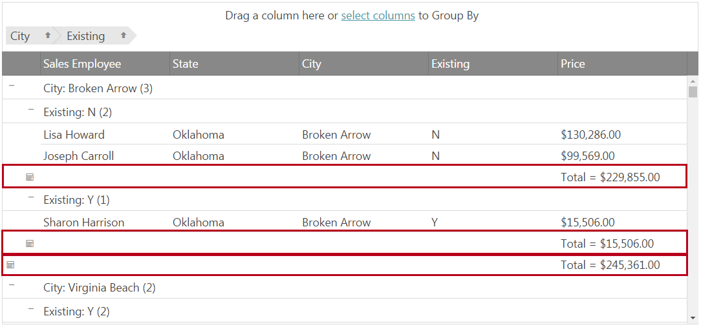
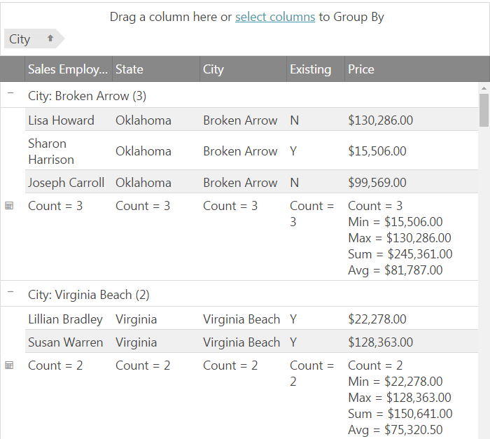

import ApiLink from 'docs-template/components/mdx/ApiLink.astro';

# グループ化集計の機能概要 (igGrid)

## トピックの概要

### 目的

このトピックでは、`igGrid`™ のグループ集計機能を紹介します。


### このトピックの内容

このトピックは、以下のセクションで構成されます。

-   [グループ化集計の機能概要](#summaries-overview)
-   [グループ化集計機能の有効化](#enable-summaries)
	- [基本設定](#summaries-basic)
	- [詳細設定](#summaries-advanced)
    - [カスタム集計](#summaries-custom)
-   [関連コンテンツ](#related-content)


## グループ化集計の機能概要

グループ化集計機能は、そのアイランドにあるデータ列の集計情報を表示するグループ データ アイランドの下、上、または上下の両方に追加の集計行を表示します。集計行は、関連するグループが展開された場合のみ表示されます。以下の画像は、グループ化された列を持つグリッドで各グループの下に「Price」列の合計数が集計行に表示されます。


    
この機能は、データ グループの意味のある集計を提供するためにデフォルトの集計関数 (合計、最小値、最大値、平均値など) の結果、またはカスタム集計の結果を表示できます。

この機能は igGrid 集計機能と組み合わせることが可能でグリッド フッターに全データの集計情報を表示できます。

## グループ化集計機能の有効化

### 基本設定

グループ集計機能を有効にするには、<ApiLink type="iggridgroupby" member="groupSummaries" section="options" label="groupSummaries" /> オプションを有効にします。

```js
$("#grid1").igGrid({
     features: [
       {
           name: 'GroupBy',
           groupSummaries: true
       }
    ],
    dataSource: data
});
```


有効な場合、グリッドは関連の列タイプにデフォルト集計を描画します。 
以下は列タイプに基づいたデフォルト列集計です。

集計|適用する列型 |
-------  | ------- |
カウント|すべての列タイプ
最小値|数値、日付
最大値|数値、日付
合計値|数値
平均|数値

以下にデフォルト設定の結果の例を示します。



適用可能な列タイプおよびデフォルト集計に関連するその他のオプションを `$.ig.util.defaultSummaryMethods` 配列で変更できます。

以下は `$.ig.util.defaultSummaryMethods` 配列の集計メソッド オブジェクトのオプションです。

名前 | 説明 | タイプ 
-----| ------------| -----
label | 集計関数の結果に適用されるラベル。 | string
name | 集計関数の名前。例: &#123;summaryFunction: "count"&#125; | string
summaryFunction | 集計の計算に使用する関数を指定します。 | function
dataType | この集計が適用できる列タイプを指定します。'any' に設定するとこの集計をすべての列タイプに適用します。 | 'any' または配列。
active | 集計を適用するかどうかを設定します。 | boolean
order | 複数の集計がある場合にこの集計が配置される順序を指定します。order: 0 の場合にすべての集計の一番上に表示されます。 |  number 
applyFormat | 書式を集計値に適用できるかどうかを設定します。 | boolean

### 詳細設定

以下のリストはメイン集計に関連するオプションについての情報を含みます。

オプション | 説明 | デフォルト値 | 有効な値 |
--------|-------------|----------------|-------------
<ApiLink type="iggridgroupby" member="groupSummaries" section="options" label="groupSummaries" /> |各列に適用されるデフォルト集計メソッドを制御します。<br/>**true** の場合 - デフォルト集計はすべての列で有効されます。<br/>**false** の場合 - デフォルト集計はすべての列で無効されます。<br/>**array** の場合 - 配列に指定された集計はすべての列で適用されます。集計オブジェクトの形式については [groupSummariesObject](#groupSummariesObject) を参照してください。<br/>|false |true, false, array|
<ApiLink type="iggridgroupby" member="groupSummariesPosition" section="options" label="groupSummariesPosition" /> |集計行の配置を指定します。<br/> **top** - 集計行がグループ レコードの上に配置されます。<br/> **bottom** - 集計行がグループ レコードの下に配置されます。<br/>**both** - グループの上部および下部に 2 つの集計行が表示されます。グループに大量のデータがある場合に便利です。| "bottom"| "top", "bottom", "both"|
<ApiLink type="iggridgroupby" member="columnSettings.groupSummaries" section="options" label="columnSettings.groupSummaries" />|columnSettings の列の集計を設定するオブジェクトの配列。メイン groupSummaries オプションより優先があります。<br/>**true** の場合 - デフォルト集計は指定した列で有効されます。<br/>**false** の場合 - デフォルト集計は指定した列で無効されます。<br/>**array** の場合 - 配列に指定された集計は指定した列で適用されます。集計オブジェクトの形式については [groupSummariesObject](#groupSummariesObject) を参照してください。<br/>|null |true, false, array, null|

groupSummaries オプションは、true/false に設定して集計を有効/無効にできます。また、その集計タイプを許可するすべての列で適用されるデフォルトの集計メソッドを配列で指定できます。以下の例は「合計」の単一のデフォルト集計の設定を指定することを紹介します。

```js
$("#grid1").igGrid({
   features: [
	{
       	name: "GroupBy",
		initialExpand: false,
		groupSummaries: [
			{
				summaryFunction: "Sum",
				label: "Total = "
			}
		]
     ]
    dataSource: data
});
```

この集計は、データ型の適用が許可されるすべての列に適用されます。 
この例で、「合計」は数値列のみに適用可能ため、グリッドの数値列のみは集計行で「合計」集計が表示されます。

`columnSettings.groupSummaries` オプションは列で集計の指定を許可します。これは groupSummaries メイン レベル オプションより優先されます。特定の列でこのオプションが設定される場合、この列に関連するメイン `groupSummaries` オプションからの設定は無視されます。

集計オプションの指定のために使用される <a id="groupSummariesObject"></a>**groupSummariesObject** は以下のプロパティを持ちます:

名前|説明|タイプ|デフォルト値
----|-------------|------|---------------
summaryFunction|集計を指定する名前またはカスタム関数。|string または function |
label |集計値の表示で使用されるラベルを設定します。|string |
summaryTemplate|各集計結果のテンプレートを設定します。|string |"&#123;label&#125;&#123;value&#125;"
format |集計値の書式設定を適用します。|string |グリッドの column.format 値。

グリッドの集計行に表示される集計の外観をカスタマイズできます。

### カスタム集計

カスタム集計は、データ アイランドからのデータの集計に使用するカスタム関数を指定します。
カスタム集計を設定するには、グループの summaries オブジェクトの `summaryFunction` プロパティに関数を設定します。

以下のコレクションのいずれかにグループ集計オブジェクトを追加し、カスタム集計に適用する列を決定します。

設定: | カスタム集計の適用先:
---|---
<ApiLink type="iggridgroupby" member="columnSettings.groupSummaries" section="options" label="columnSettings.groupSummaries" /> | 特定の列のみ。
<ApiLink type="iggridgroupby" member="groupSummaries" section="options" label="groupSummaries" /> | すべての列。
$.ig.util.defaultSummaryMethods | すべての列。

関数はデータ アイランドのデータを受け、そのデータの集計結果を返します。

カスタム集計の例:

```js
$("#grid1").igGrid({
    features: [
         {
            name: "GroupBy",
            initialExpand: false,
            columnSettings: [
                {
                    columnKey: "ExisitingCustomer",
                    groupSummaries: [
                     {
                         summaryFunction: existingCount,
                         label: "Existing Count: "
                      }
                    ]
                }
        }
    ],
    dataSource: data
 });

function existingCount(data) {
    var i, count = 0; 
    for (i = 0; i < data.length; i++) {
        if(data[i] === "Y"){
           count++;
       }
    }
    return count;
}
```


## 関連コンテンツ

### 関連サンプル

以下のサンプルでは、このトピックに関連する情報を提供しています。

- [集計とグループ化](&#123;environment:SamplesUrl&#125;/grid/grouping)

### トピック

このトピックに関連する追加情報については、以下のトピックを参照してください。

- [列のグループ化の有効化 (igGrid)](/iggrid-enabling-groupby)

- <ApiLink type="iggridgroupby" label="グリッドのグループ化のプロパティ リファレンス" />