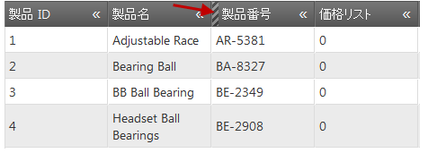

# 列の非表示の有効化 (igGrid)

## トピックの概要

### 目的

これは、`igGrid`™ コントロールで列をプログラム的に非表示にする方法を示しています。


### このトピックの内容

このトピックは、以下のセクションで構成されます。

-   [**概要**](#introduction)
-   [**プレビュー**](#preview)
-   [**要件**](#requirements)
    -   [一般的な要件](#general-requirements)
    -   [スクリプト要件](#script-requirements)
    -   [データベース要件](#database-requirements)
-   [**jQuery で列の非表示を有効にする**](#enabling-column-hiding-jquery)
-   [**MVC で列の非表示を有効にする**](#enabling-column-grouping-mvc)
-   [**キーボード操作**](#keyboard-interaction)
-   [**関連コンテンツ**](#related-content)
    -   [トピック](#topics)
    -   [サンプル](#samples)


## <a id="introduction"></a> 概要

`igGrid` コントロールの列の非表示機能はデフォルトで無効のため、明示的に有効にする必要があります。

以下の例では、非表示機能を有効にしたグリッドが構成されています。

## <a id="preview"></a> プレビュー

最終結果のプレビューを以下に示します (赤い矢印は非表示になっている SafetyStockLevel 列の非表示の列インジケーターを指しています)。



## <a id="requirements"></a> 要件

### <a id="general-requirements"></a> 全般的な要件

-   jQuery の要件

    -   グリッドがデータ ソースに接続されている HTML 形式の Web ページであること
    -   グリッドのコンテナとして機能するテーブル タグがHTML ページの本文に含まれていること

    **HTML の場合:**

```html
    <table id="grid">
    </table>
```

-   MVC 固有の要件
    -   グリッドがデータ ソースに接続されている MS Visual Studio® の MVC 4 以後のプロジェクトであること
    -   &#123;environment:ProductNameMVC&#125; dll への参照があること - Infragistics.Web.Mvc.dll

### <a id="script-requirements"></a> スクリプト要件

-   jQuery と MVC が jQuery ウィジェットを再描画するため、両方のサンプルに必要なスクリプトは同じです。次が必要になります。
    1.  jQuery ライブラリ スクリプト
    2.  jQuery User Interface (UI) ライブラリ スクリプト
    3.  &#123;environment:ProductNameMVC&#125; ライブラリ スクリプト

次のコード サンプルは、HTML ファイルのヘッダー セクションに追加されるスクリプトです。

**HTML の場合:**

```html
<script type="text/javascript" src="jquery.min.js"></script>
<script type="text/javascript" src="jquery-ui.min.js"></script>
<script type="text/javascript" src="infragistics.core.js"></script><script type="text/javascript" src="infragistics.lob.js"></script>
```

### <a id="database-requirements"></a> データベース要件

ただし、このサンプルでは以下のものが使用されています。

-   MVC - Adventure Works データベース

## <a id="enabling-column-hiding-jquery"></a> JQuery で列の非表示を有効にする

1.  **データ ソースを設定します。**

    以下のコード スニペットで使用されているデータ ソースは、あくまでこの例のために使用されているだけです。

    **HTML の場合:**

```html
    <script type="text/javascript">
    source = [
             { "ProductID": 1, "Name": "Adjustable Race", "SafetyStockLevel": 1000, "ReorderPoint": 750, "StandardCost": 0.0000 }, 
             { "ProductID": 2, "Name": "Bearing Ball", "SafetyStockLevel": 1000, "ReorderPoint": 750, "StandardCost": 0.0000 }, 
             { "ProductID": 3, "Name": "BB Ball Bearing", "SafetyStockLevel": 800, "ReorderPoint": 600, "StandardCost": 0.0000 },
             { "ProductID": 4, "Name": "Headset Ball Bearings", "SafetyStockLevel": 800, "ReorderPoint": 600, "StandardCost": 0.0000 }]

    </script>
```

2.  **igGrid を作成し、非表示機能を有効にします。**

    `$(document).ready()` イベント ハンドラーの中で、igGrid を作成し、グリッドの非表示機能を構成します。以下のコード例では、列 (SafetyStockLevel) が非表示になっています。

    **JavaScript の場合:**

```js
    $("#grid").igGrid({
        autoGenerateColumns: true,
           dataSource: source,
           features: [
           {
                name: 'Hiding',
                columnSettings: [
                { 
                    columnKey: 'SafetyStockLevel', 
                    allowHiding: true, 
                    hidden: true
                }]
           }
        ]
    });
```

3.  **ファイルを保存します。**
4.  (オプション) **結果を確認します。**
    1.  結果を検証するために、ファイルを開きます。上記のプレビューに示すような結果になっているはずです。

## <a id="enabling-column-grouping-mvc"></a> MVC で列の非表示を有効にする

1.  **MVC Controller メソッドを作成します。**

    MVC Controller メソッドを作成し、Model からデータを取得して View を呼び出します。

    **MVC の場合:**

```csharp
    public ActionResult Default()
    {
        var ds = this.DataRepository.GetDataContext().Products.Take(4);
        return View(ds);
    }
```

2.  **igGrid をインスタンス化します。**

    非表示機能を有効にした igGrid をインスタンス化します。

    **ASPX の場合:**

```csharp
    <%= Html.Infragistics().Grid(Model)
        .AutoGenerateColumns(true)
        .Features(feature =>{
            feature.Hiding().ColumnSettings(settings => settings.ColumnSetting().ColumnKey("SafetyStockLevel").Hidden(true).AllowHiding(true));
            }).DataBind()
        .Render()
    %>
```

    **Razor の場合:**

```csharp
    @( Html.Infragistics().Grid(Model)
        .AutoGenerateColumns(true)
        .Features(feature =>{
            feature.Hiding().ColumnSettings(settings => settings.ColumnSetting().ColumnKey("SafetyStockLevel").Hidden(true).AllowHiding(true));
            }).DataBind()
        .Render()
    )
```

3.  **ファイルを保存します。**
4.  (オプション) **結果を確認します。**
    1.  結果を検証するために、MVC プロジェクトを実行します。
    2.  結果を検証するために、ファイルを開きます。上記のプレビューに示すような結果になっているはずです。

## <a id="keyboard-interaction"></a> キーボード操作

以下のキーボード操作が可能です。

グリッドにフォーカスがある場合:

-	TAB: 非表示 UI のフォーカス可能な要素間でフォーカスを移動: 列ヘッダー非表示インジケーター。 

ヘッダー非表示インジケーターにフォーカスがある場合:

-	ENTER: 列を非表示。

列チューザー ダイアログにフォーカスがある場合:

-	TAB: ダイアログのフォーカス可能な要素間でフォーカスを移動: 列チューザーの表示/非表示ボタン、リセット ボタン、適用/キャンセル ボタン。

要素の 1 つにフォーカスがある場合:

-	ENTER: [表示/非表示] ボタンの状態を変更。フォーカスが [適用] または [キャンセル] ボタンにある場合、変更は適用または無視されます。
	
## <a id="related-content"></a> 関連コンテンツ

### <a id="topics"></a> トピック

このトピックの追加情報については、以下のトピックも合わせてご参照ください。

- [igGrid 構成: 列](/iggrid-configure-column-hiding)
- [&#123;environment:ProductName&#125; で JavaScript リソースを使用](/deployment-guide-javascript-resources)
- [&#123;environment:ProductName&#125; のスタイル設定とテーマ設定](/deployment-guide-styling-and-theming)

### <a id="samples"></a> サンプル

このトピックについては、以下のサンプルも参照してください。

- [列の管理](&#123;environment:SamplesUrl&#125;/grid/column-management)

 

 


