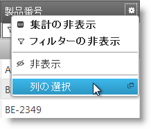
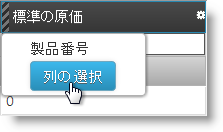
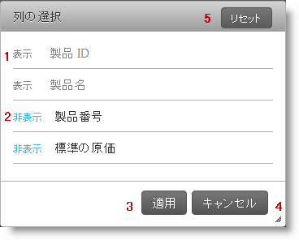
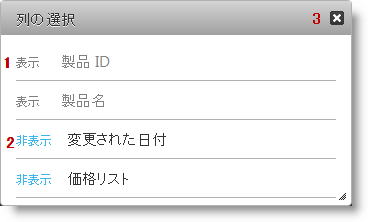

---
title: "列チューザーの構成 (igGrid)"
slug: iggrid-hiding-column-chooser
---

# 列チューザーの構成 (igGrid)

## トピックの概要

### 目的

このトピックでは、`igGrid`™ コントロールの列チューザーの非表示方法について説明します。

### 前提条件

以下の表は、このトピックを理解するための前提条件として必要なトピックを示しています。

- [**&#123;environment:ProductName&#125; コントロールのタッチ サポート**](/touch-support-for-igniteui-for-jquery-controls): このトピックでは、&#123;environment:ProductName&#125;™ コントロールのタッチ サポート インタラクションの更新内容を紹介します。

- [**igGrid 機能セレクター**](/iggrid-feature-chooser): このトピックでは、`igGrid` 機能セレクター メニューおよびそのセクションについて説明します。

- [**igGrid 非表示概要**](/iggrid-column-hiding): `igGrid` コントロールの非表示機能の概要。

### このトピックの内容

このトピックは、以下のセクションで構成されます。

-   [**概要**](#introduction)
-   [**ダイアログ ウィンドウ**](#dialog-window-states)
    -   [複数列を一度に非表示](#hide-multiple-columns)
    -   [クリックで列を非表示](#hide-on-click)
-   [**プロパティ リファレンス**](#property-reference)
-   [**メソッド リファレンス**](#method-reference)
-   [**イベント リファレンス**](#event-reference)
-   [**関連コンテンツ**](#related-content)
    -   [トピック](#topics)
    -   [サンプル](#samples)

##  概要

#### igGridHiding 列チューザーの紹介

このトピックでは、列チューザーとしても知られる `igGrid` 非表示ダイアログを使用して作業する方法を示します。列チューザー ウィンドウは 2 種類の方法で起動できます。最初の方法は、*列チューザー* リスト項目を `igGrid` 機能セレクターの詳細セクションから選択します。2 番目の方法は、非表示列コンテキスト メニューの*列チューザー* ボタンを押します。

 

##  ダイアログ ウィンドウの状態

以下の表は、列チューザー ウィンドウの状態を簡単に説明しています。ウィンドウには、[`columnChooserHideOnClick`](&#123;environment:jQueryApiUrl&#125;/ui.iggridhiding#options:columnChooserHideOnClick) オプションの値によって定義された 2 つの状態が含まれています (デフォルト値は `false`)。`true` に設定した場合、列チューザーで列名をクリックするとすぐにその列は非表示になります。

詳細は、概要表の後に記載されています。

状態|[`columnChooserHideOnClick`](&#123;environment:jQueryApiUrl&#125;/ui.iggridhiding#options:columnChooserHideOnClick) 値|説明
------|----------------------------------|------------
[複数列を一度に非表示](#hide-multiple-columns)|`false`|複数列を列チューザー ウィンドウから選択し、ウィンドウで変更が適用されると列は非表示になります。
[クリックで列を非表示](#hide-on-click)|`true`|列チューザー ウィンドウから列を選択することによって、列は即座に非表示になります。

###  複数列を一度に非表示

デフォルトで、[`columnChooserHideOnClick`](&#123;environment:jQueryApiUrl&#125;/ui.iggridhiding#options:columnChooserHideOnClick) プロパティは `false` に設定されています。つまり、表示/非表示にする列を選択してから、変更をグリッドに適用する必要があります。

以下のボタンを使用します。

1.  表示 - 列を表示します (行全体がクリック可能)
2.  非表示 - 列を非表示にします (行全体がクリック可能)
3.  適用 - 表示/非表示にする列を適用します
4.  キャンセル - 列チューザーを閉じ、変更を適用しません
5.  リセット - すべての列のデフォルト状態に戻ります (モーダル ダイアログが開いたときのような状態)
6.  ESC (キー) - モーダル ダイアログを閉じます

###  クリックで列を非表示

[`columnChooserHideOnClick`](&#123;environment:jQueryApiUrl&#125;/ui.iggridhiding#options:columnChooserHideOnClick) プロパティを `true` に設定してから、**表示**または**非表示**ボタンをクリックすると、選択したアクションが、列に対して即座に有効になります。

ウィンドウを閉じるには、右上のボタンをクリック、または **ESC** キーを押します。

以下のボタンを使用します。

1.  表示 - 列を即座に表示します (行全体がクリック可能)
2.  非表示 - 列を即座に非表示にします (行全体がクリック可能)
3.  閉じる - モーダル ダイアログを閉じます
4.  ESC (キー) - モーダル ダイアログを閉じます

##  プロパティ リファレンス

このセクションでは、列チューザーに影響を及ぼす、`igGrid` コントロールの非表示プロパティについて説明します。

以下の表は、列チューザーの構成を担当する、`igGrid` コントロールの非表示プロパティを示しています。

プロパティ|説明
---------|----------
[columnChooserHideOnClick](&#123;environment:jQueryApiUrl&#125;/ui.iggridhiding#options:columnChooserHideOnClick) |列チューザーで列名をクリックしたときに、グリッドが列を表示または非表示にするかどうかを指定します。
[columnChooserWidth](&#123;environment:jQueryApiUrl&#125;/ui.iggridhiding#options:columnChooserWidth)|デフォルトの列チューザーの幅 (ピクセル)。
[columnChooserHeight](&#123;environment:jQueryApiUrl&#125;/ui.iggridhiding#options:columnChooserHeight)|デフォルトの列チューザーの高さ (ピクセル)。
[columnChooserAnimationDuration](&#123;environment:jQueryApiUrl&#125;/ui.iggridhiding#options:columnChooserAnimationDuration) |列チューザーを表示または非表示にするための、アニメーションの時間を指定します (ミリ秒)。
[columnChooserCaptionText](&#123;environment:jQueryApiUrl&#125;/ui.iggridhiding#options:columnChooserCaptionText)|列チューザー ダイアログのキャプション。
[columnChooserDisplayText](&#123;environment:jQueryApiUrl&#125;/ui.iggridhiding#options:columnChooserDisplayText)|列チューザー ダイアログを起動するための、ドロップダウンのツール メニュー (機能セレクター) 使用するテキスト。
[hiddenColumnIndicatorTooltipText](&#123;environment:jQueryApiUrl&#125;/ui.iggridhiding#options:hiddenColumnIndicatorTooltipText) |非表示の列インジケーターのツールチップに表示されるテキスト。
[columnHideText](&#123;environment:jQueryApiUrl&#125;/ui.iggridhiding#options:columnHideText) |列を非表示にするための、ドロップダウンのツール メニュー (機能セレクター) で使用するテキスト (機能セレクター)。
[columnChooserShowText](&#123;environment:jQueryApiUrl&#125;/ui.iggridhiding#options:columnChooserShowText) |列を表示するための、Column Chooser で使用するテキスト。
[columnChooserHideText](&#123;environment:jQueryApiUrl&#125;/ui.iggridhiding#options:columnChooserHideText) |列を非表示にするための、Column Chooser で使用するテキスト。
[columnChooserResetButtonLabel](&#123;environment:jQueryApiUrl&#125;/ui.iggridhiding#options:columnChooserResetButtonLabel) |リセット ボタン用のテキストラベル。
[columnChooserButtonApplyText](&#123;environment:jQueryApiUrl&#125;/ui.iggridhiding#options:columnChooserButtonApplyText) |モーダル ダイアログで変更を適用するボタンのテキストを指定します。
[columnChooserButtonCancelText](&#123;environment:jQueryApiUrl&#125;/ui.iggridhiding#options:columnChooserButtonCancelText) |モーダル ダイアログで変更をキャンセルするボタンのテキストを指定します。

##  メソッド リファレンス

このセクションでは、列チューザーに影響を及ぼす、`igGrid` コントロールの非表示メソッドについて説明します。

以下の表は、列チューザー API が公開する `igGrid` コントロールの非表示メソッドを示しています。

メソッド|説明
-------|------------
[showColumnChooser](&#123;environment:jQueryApiUrl&#125;/ui.iggridhiding#methods:showColumnChooser) |列チューザー ダイアログを表示します。表示されている場合、メソッドは何も行いません。
[hideColumnChooser](&#123;environment:jQueryApiUrl&#125;/ui.iggridhiding#methods:hideColumnChooser) |列チューザー ダイアログを非表示にします。非表示の場合、メソッドは何も行いません。
[resetHidingColumnChooser](&#123;environment:jQueryApiUrl&#125;/ui.iggridhiding#methods:resetHidingColumnChooser) |非表示表示列を、ダイアログの初期状態にリセットします (それが開いている場合)
[removeColumnChooserResetButton](&#123;environment:jQueryApiUrl&#125;/ui.iggridhiding#methods:removeColumnChooserResetButton) |列チューザーのモーダル ダイアログからリセット ボタンを削除します

##  イベント リファレンス

このセクションでは、モーダル ウィンドウが起動する、`igGrid` コントロールの非表示イベントについて説明します。

以下の表は、ユーザーが列チューザーを操作しているときに発生する、`igGrid` コントロールの非表示イベントを示しています。

イベント|説明
-------|---------
[columnChooserOpening](&#123;environment:jQueryApiUrl&#125;/ui.iggridhiding#events:columnChooserOpening)|列チューザーが開く前に発生するイベント。
[columnChooserOpened](&#123;environment:jQueryApiUrl&#125;/ui.iggridhiding#events:columnChooserOpened)|列チューザーが開いた後に発生するイベント。
[columnChooserMoving](&#123;environment:jQueryApiUrl&#125;/ui.iggridhiding#events:columnChooserMoving)|列チューザーの位置が変わるたびに発生するイベント。
[columnChooserClosing](&#123;environment:jQueryApiUrl&#125;/ui.iggridhiding#events:columnChooserClosing)|列チューザーが閉じる前に発生するイベント。
[columnChooserClosed](&#123;environment:jQueryApiUrl&#125;/ui.iggridhiding#events:columnChooserClosed)|列チューザーが閉じた後に発生するイベント。
[columnChooserContentsRendering](&#123;environment:jQueryApiUrl&#125;/ui.iggridhiding#events:columnChooserContentsRendering)|列チューザーのコンテンツが描画される前に発生するイベント。
[columnChooserContentsRendered](&#123;environment:jQueryApiUrl&#125;/ui.iggridhiding#events:columnChooserContentsRendered)|列チューザーのコンテンツが描画された後に発生するイベント。
[columnChooserButtonApplyClick](&#123;environment:jQueryApiUrl&#125;/ui.iggridhiding#events:columnChooserButtonApplyClick)|列チューザーのリセット ボタンをクリックすると発生するイベント
[columnChooserButtonResetClick](&#123;environment:jQueryApiUrl&#125;/ui.iggridhiding#events:columnChooserButtonResetClick)|列チューザーのリセット ボタンをクリックすると発生するイベント

##  関連コンテンツ

###  トピック

このトピックの追加情報については、以下のトピックも合わせてご参照ください。

- [**&#123;environment:ProductName&#125; コントロールのタッチ サポート**](/touch-support-for-igniteui-for-jquery-controls): このトピックでは、&#123;environment:ProductName&#125;™ コントロールのタッチ サポート インタラクションの更新内容を紹介します。

- [**igGrid 機能セレクター**](/iggrid-feature-chooser): このトピックでは、`igGrid` 機能セレクター メニューおよびそのセクションについて説明します。

- [**igGrid 非表示概要**](/iggrid-column-hiding): `igGrid` コントロールの非表示機能の概要。

###  サンプル

このトピックについては、以下のサンプルも参照してください。

- [機能セレクター](&#123;environment:SamplesUrl&#125;/grid/column-management): 機能セレクターを紹介するサンプル。

