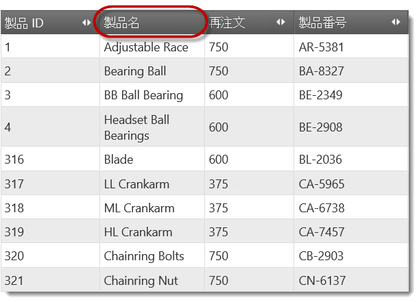
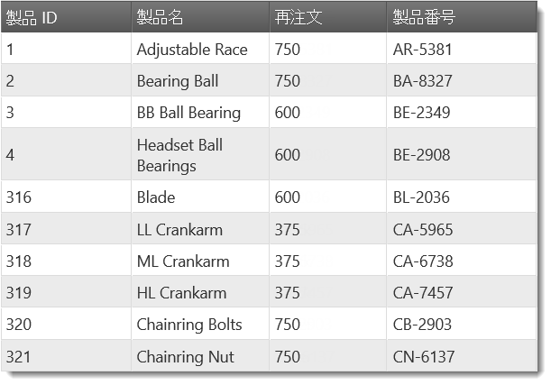

# 列移動の構成 (igGrid)

## トピックの概要

### 目的

このトピックでは、コード例を用いて、`igGrid`™ の列移動機能を構成する方法について説明します。

### 前提条件

このトピックを理解するために、以下のトピックを参照することをお勧めします。

- [列移動の概要](/iggrid-columnmoving-overview): このトピックは、`igGrid` コントロールの列移動機能およびこの機能が提供する機能性について概念的に説明します。

- [列移動の有効化](/iggrid-columnmoving-enabling): このトピックでは、コード例を用いて、`igGrid` の列移動機能を有効にする方法について説明します。


### このトピックの内容

このトピックは、以下のセクションで構成されます。

-   [**列移動の構成の概要**](#summary)
-   [**列移動モード の構成**](#mode)
    -   [プロパティ設定](#mode-property-settings)
    -   [例](#mode-example)
-   [**列移動タイプ の構成**](#type)
    -   [プロパティ設定](#type-property-settings)
    -   [例](#type-example)
-   [**列に対する列移動の無効化**](#disable)
    -   [概要](#disable-overview)
    -   [プロパティ設定](#disable-property-settings)
    -   [JavaScript での列に対する列移動の無効化](#disable-js)
    -   [MVC での列に対する列移動の無効化](#disable-mvc)
    -   [例](#disable-example)
-   [**列移動インターフェイスの無効化**](#disable-interface)
    -   [概要](#disable-interface-overview)
    -   [プロパティ設定](#disable-interface-property-settings)
    -   [例](#disable-interface-example)
-   [**関連コンテンツ**](#related-content)
    -   [トピック](#topics)
    -   [サンプル](#samples)


## <a id="summary"></a> 列移動の構成の概要

以下の表は、`igGrid` 列移動の構成可能な要素を示しています。このメソッドについては、表の下にある解説も参照してください。
<table class="table table-bordered">
	<thead>
		<tr>
            <th colspan="2">構成可能な項目</th>
            <th>詳細</th>
            <th>プロパティ</th>
</tr>
	</thead>
	<tbody>
        <tr>
            <td colspan="2">[モード](#mode)</td>
            <td>デフォルトでは[列移動モード](/iggrid-columnmoving-overview#mode)は即時です。代わりに遅延モードを構成できます。</td>
            <td><ul> <li> [mode](/iggrid-columnmoving-propertyreference#mode) </li> </ul></td>
</tr>

        <tr>
            <td colspan="2">[タイプ](/iggrid-columnmoving-configuring#type)</td>
            <td>デフォルトでは[列移動タイプ](/iggrid-columnmoving-overview#type)は DOM 操作です。代わりにグリッドの再レンダリングをタイプに構成できます。 タイプは、ブラウザーによって機能パフォーマンスに異なった影響を与えます。</td>
            <td><ul> <li> [moveType](/iggrid-columnmoving-propertyreference#moveType) </li> </ul></td>
</tr>

        <tr>
            <td colspan="2">[列](/iggrid-columnmoving-configuring#disable)</td>
            <td>どの列の移動を許可するかを指定できます。</td>
            <td><ul> <li> [columnSettings](/iggrid-columnmoving-propertyreference#columnSettings) </li> <li> [columnSettings.columnKey](/iggrid-columnmoving-propertyreference#columnKey) </li> <li> [columnSettings.allowMoving](/iggrid-columnmoving-propertyreference#allowMoving) </li> </ul></td>
</tr>

        <tr>
            <td>[インターフェイス](/iggrid-columnmoving-configuring#disable-interface)</td>
            <td>有効化/無効化</td>
            <td>グリッドの列移動インターフェイスを有効または無効にします。</td>
            <td><ul> <li> [addMovingDropdown](/iggrid-columnmoving-propertyreference#addMovingDropdown) </li> </ul></td>
</tr>

        <tr>
            <td></td>
            <td>列の移動 ダイアログのルック アンド フィール</td>
            <td>ダイアログの幅、高さおよびドラッグ アニメーション期間を構成できます。</td>
            <td><ul> <li> [movingDialogWidth](/iggrid-columnmoving-propertyreference#movingDialogWidth) </li> <li> [movingDialogHeight](/iggrid-columnmoving-propertyreference#movingDialogHeight) </li> <li> [movingDialogAnimationDuration](/iggrid-columnmoving-propertyreference#movingDialogAnimationDuration) </li> </ul></td>
</tr>
    </tbody>
</table>


## <a id="mode"></a> 列移動モード の構成

デフォルトでは[列移動モード](/iggrid-columnmoving-overview#mode)は即時です。代わりに遅延モードを構成できます。

列移動モードは、列移動機能の [`mode`](/iggrid-columnmoving-propertyreference#mode) プロパティから構成されます。

### <a id="mode-property-settings"></a> プロパティ設定

以下の表では、目的の構成をプロパティ設定にマップしています。

目的:|使用するプロパティ:|設定の選択肢:
---|---|---
遅延モードの構成|[mode](/iggrid-columnmoving-propertyreference#mode)|”deferred”
即時モードの構成|[mode](/iggrid-columnmoving-propertyreference#mode)|"immediate"


### <a id="mode-example"></a> 例

以下のコードは、列移動モードを遅延に設定する方法を示します。

**JavaScript の場合:**

```js
$("#grid").igGrid({
    dataSource: adventureWorks,
    autoGenerateColumns: true,
    features: [
        {
            name: "ColumnMoving",
            mode: "deferred"
        }
    ]
});
```

**Razor の場合:**

```csharp
@(Html.Infragistics().Grid(Model)
.AutoGenerateColumns(true)
.ID("grid1")
.Features(f => f.ColumnMoving().Mode(MovingMode.Deferred))
.DataBind()
.Render())
```


## <a id="type"></a> 列移動タイプ の構成

デフォルトでは[列移動タイプ](/iggrid-columnmoving-overview#type)は DOM 操作です。代わりにグリッドの再レンダリングをタイプに構成できます。タイプは、ブラウザーによって機能パフォーマンスに異なった影響を与えます。

列移動タイプは、列移動機能の [`moveType`](/iggrid-columnmoving-propertyreference#moveType) プロパティで管理されます。(列移動 [type](/iggrid-columnmoving-overview#type) に関する詳細は、「[列移動の概要](/iggrid-columnmoving-overview)」トピックを参照してください)

### <a id="type-property-settings"></a> プロパティ設定

以下の表では、目的の構成をプロパティ設定にマップしています。

目的:|使用するプロパティ:|設定の選択肢:
---|---|---
グリッドの再レンダリング タイプの構成|[moveType](/iggrid-columnmoving-propertyreference#moveType)|"render"
DOM 操作タイプの構成|[moveType](/iggrid-columnmoving-propertyreference#moveType)|“dom”


### <a id="type-example"></a> 例

以下のコードは、列移動タイプをグリッドの再レンダリングに設定します。

**JavaScript の場合:**

```js
$("#grid").igGrid({
    dataSource: adventureWorks,
    autoGenerateColumns: true,
    features: [
        {
            name: "ColumnMoving",
            moveType: "render"
        }
    ]
});
```

**Razor の場合:**

```csharp
@(Html.Infragistics().Grid(Model)
.AutoGenerateColumns(true)
.ID("grid1")
.Features(f => f.ColumnMoving().MoveType(MovingType.Render))
.DataBind()
.Render())
```


## <a id="disable"></a> 列に対する列移動の無効化

### <a id="disable-overview"></a> 概要

ユーザーは、移動を許可される列と許可されない列を指定できます。デフォルトでは、列移動はグリッド内のすべての列で有効になっています。列移動の無効化はそれぞれの列について行います。

列の移動を無効にするには、列 (列キーまたは列インデックスである列識別子を介して) を指定して [`allowMoving`](/iggrid-columnmoving-propertyreference#allowMoving) プロパティを false に設定する必要があります。

-   JavaScript の場合: 機能の `columnSettings` プロパティを配列に設定します。オブジェクトは列識別子からなり、その列に対して [`allowMoving`](/iggrid-columnmoving-propertyreference#allowMoving) プロパティが設定されます。詳細は、「[JavaScript での列に対する列移動の無効化](#disable-js)」ブロックを参照してください。

-   ASP.NET MVC の場合: チェーン メソッドでビュー内でグリッドを構成する場合、機能の `ColumnSettings` メソッドを使用します。詳細は、「[MVC での列に対する列移動の無効化](#disable-mvc)」ブロックを参照してください。

列の移動が無効になると、その列に対する列移動ボタンが非表示になります。

### <a id="disable-property-settings"></a> プロパティ設定

以下の表は、列の移動を無効にするプロパティとその設定です。

目的:|使用するプロパティ:|設定の選択肢:
------------ | -------------------- | ---------------
列に対する列移動の無効化|いずれか [`columnSettings.columnKey`](/iggrid-columnmoving-propertyreference#columnKey) または [`columnSettings.columnIndex`](/iggrid-columnmoving-propertyreference#columnIndex)|それぞれにいずれか<br />**列のキー**<br />または<br />**列のインデックス番号**
 | [columnSettings.allowMoving](/iggrid-columnmoving-propertyreference#allowMoving) | false


### <a id="disable-js"></a> JavaScript での列に対する列移動の無効化

JavaScript で列に対する列の移動を無効化するには、機能の `columnSettings` プロパティを配列に設定します。オブジェクトは列識別子からなり、その列に対して [`allowMoving`](/iggrid-columnmoving-propertyreference#allowMoving) プロパティが設定されます。

列移動機能の `columnSettings` プロパティを使用して、1 つ以上の列の移動を無効にします。columnSettings は配列のため、列構成オブジェクトの任意の数を保持できます。各列の構成オブジェクトは `columnKey` または `columnIndex` および `allowMoving` プロパティから構成されます。`columnKey` および `columnIndex` プロパティは構成する列を示します。`allowMoving` プロパティは true に設定されると、列の移動が可能になります (これはデフォルトのビヘイビアーであるため `allowMoving` を true に設定する必要はありません)。

`allowMoving` を false に設定すると、列の移動が無効になります。グリッド列をキーで参照する場合は、 `columnKey` プロパティを使用します。最初のグリッド列構成をインデックスで参照する場合は、 `columnIndex` プロパティを使用します。

### <a id="disable-mvc"></a> MVC での列に対する列移動の無効化

チェーン メソッドでビューにグリッドを構成時に ASP.NET MVC でのコラムの列移動を無効にするには、`ColumnSettings` メソッドを使用します。

`ColumnSettings` メソッドは、列の設定を表す ラムダ式を承諾します。ラムダ式では、`ColumnMovingSettingWrapper` オブジェクトを返す `ColumnSetting` メソッドを呼び出します。このオブジェクトには、`ColumnKey`、`ColumnIndex` および `AllowMoving` の個々の列を構成するメソッドが含まれます。これらのメソッドは、JavaScript の対応する要素の機能を真似たものです。ラムダ式の例については、[例](#disable-example) ブロックを参照してください。

### <a id="disable-example"></a> 例

以下のコードは、以下の設定の結果としてコード内に 製品名列 (列キーは “Name”) 用の列移動を無効化します。

プロパティ|値
---- | ---
[columnSettings.columnKey](/iggrid-columnmoving-propertyreference#columnKey)|"Name"
[columnSettings.allowMoving](/iggrid-columnmoving-propertyreference#allowMoving)|false




**JavaScript の場合:**

```js
$("#grid").igGrid({
    dataSource: adventureWorks,
    autoGenerateColumns: true,
    features: [
        {
            name: "ColumnMoving",
            columnSettings: [
                {
                    columnKey: "Name",
                    allowMoving: false
                }
            ]
        }
    ]});
```

**Razor の場合:**

```csharp
@(Html.Infragistics().Grid(Model)
.AutoGenerateColumns(true)
.ID("grid1")
.Features(f => 
    f.ColumnMoving()
    .MoveType(MovingType.Render)
    .ColumnSettings(cs => cs.ColumnSetting().ColumnKey("Name").AllowMoving(false)))
.DataBind()
.Render())
```


## <a id="disable-interface"></a> 列移動インターフェイスの無効化

### <a id="disable-interface-overview"></a> 概要

グリッドの[列移動インターフェイス](/iggrid-columnmoving-overview#drop-down-menu)を有効または無効にします。列移動インターフェイスを無効にするとユーザーに対して非表示になります。

デフォルトでは列移動機能は有効になっているので、列移動インターフェイス (アクティブ化するためのドロップダウンおよびボタン) も使用可能です。これは、ユーザーがドラッグ アンド ドロップで列を移動できないためタッチ デバイス用の列移動をサポートするためです。このインターフェイスを無効にするよう選択することもできます (その場合、ドロップダウンを開くためのボタンが非表示になります)。列移動インターフェイスを無効にすると、グリッド内のすべての列が影響を受けます。

列移動インターフェイスは、機能の [`addMovingDropdown`](/iggrid-columnmoving-propertyreference#addMovingDropdown) プロパティによって管理されます。

> **注:** 列移動インターフェイスは、列移動が無効である列上でも無効です。(詳細は、「[列に対する列移動の無効化](#disable)」を参照。)

### <a id="disable-interface-property-settings"></a> プロパティ設定

以下の表では、目的の構成をプロパティ設定にマップしています。

目的:|使用するプロパティ:|設定の選択肢:
------------ | -------------------- | ---------------
列移動インターフェイスの無効化|[addMovingDropdown](/iggrid-columnmoving-propertyreference#addMovingDropdown)|false


### <a id="disable-interface-example"></a> 例

以下のコード例は、列移動のための列移動ドロップダウンを無効にする方法を示しています。

プロパティ|値
------- | --------
[addMovingDropdown](/iggrid-columnmoving-propertyreference#addMovingDropdown)|false




以下のコード スニペットは、 `addMovingDropdown` プロパティをコードで使用して列を移動する方法を示します。

**JavaScript の場合:**

```js
$("#grid").igGrid({
    dataSource: adventureWorks,
    autoGenerateColumns: true,
    features: [
        {
            name: "ColumnMoving",
            addMovingDropdown: false
        }
    ]
});
```

**Razor の場合:**

```csharp
@(Html.Infragistics().Grid(Model)
.AutoGenerateColumns(true)
.ID("grid1")
.Features(f => f.ColumnMoving().AddMovingDropdown(false))
.DataBind()
.Render())
```


## <a id="related-content"></a> 関連コンテンツ

### <a id="topics"></a> トピック

このトピックの追加情報については、以下のトピックも合わせてご参照ください。

- [コードによる列の移動](/iggrid-columnmoving-movingcolumnsprogrammatically): このトピックは、列移動 API を使用して列を移動する方法をコード例を用いて説明します。

- [プロパティ リファレンス](/iggrid-columnmoving-propertyreference): このトピックは、`igGrid` の列移動機能 API の一部のプロパティに関する参考情報を提供します。

### <a id="samples"></a> サンプル

このトピックについては、以下のサンプルも参照してください。

- [列移動](\{environment:SamplesUrl\}/grid/column-management): このサンプルは、`igGrid` の列移動の構成を示します。


 

 


