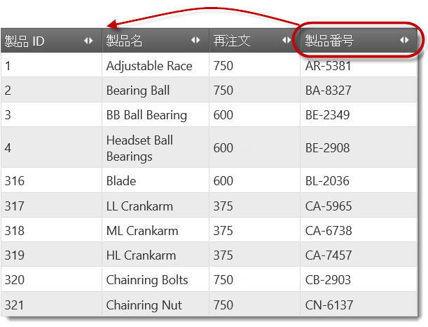
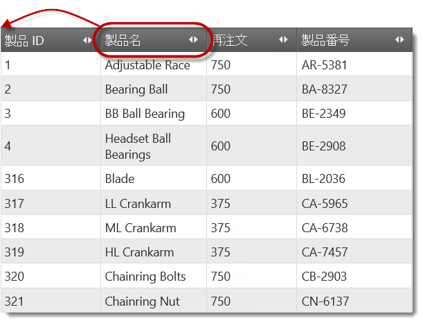
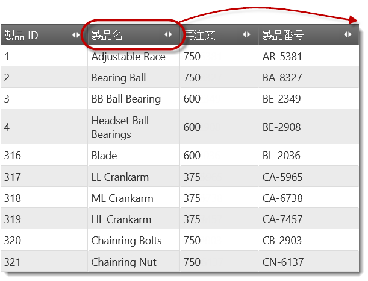

import ApiLink from 'docs-template/components/mdx/ApiLink.astro';

# コードによる列の移動 (igGrid)

## トピックの概要

### 目的

このトピックは、列移動機能の API を使用してコードで列を移動する方法を説明します。

### 前提条件

このトピックを理解するために、以下のトピックを参照することをお勧めします。

- [列移動の概要](/iggrid-columnmoving-overview): このトピックは、`igGrid` コントロールの列移動機能およびこの機能が提供する機能性について概念的に説明します。


### このトピックの内容

このトピックは、以下のセクションで構成されます。

-   [**概要**](#introduction)
-   [**moveColumn メソッド**](#moveColumn)
    -   [moveColumn メソッドの概要](#moveColumn-summary)
    -   [moveColumn メソッドのパラメーター](#moveColumn-parameters)
    -   [複数の列ヘッダーでの moveColumn メソッドの使用](#moveColumn-multi-column-headers)
-   [**コード例の概要**](#examples-overview)
-   [**コード例: グリッドを再レンダリングすることにより列を移動する**](#example-render)
    -   [説明](#example-render-description)
    -   [コード例 1](#example-render-1)
    -   [コード例 2](#example-render-2)
-   [**コード例: DOM 操作により列を移動する**](#example-dom)
    -   [説明](#example-dom-description)
    -   [コード例 1](#example-dom-1)
    -   [コード例 2](#example-dom-2)
-   [**コード例: 最も左に列を移動する**](#example-left)
    -   [説明](#example-left-description)
    -   [コード例 1](#example-left-1)
    -   [コード例 2](#example-left-2)
-   [**コード例: 最も右に列を移動する**](#example-right)
    -   [説明](#example-right-description)
    -   [コード例 1](#example-right-1)
    -   [コード例 2](#example-right-2)
-   [**関連コンテンツ**](#related-content)
    -   [トピック](#topics)
    -   [サンプル](#samples)


## 概要

列の移動は、`igGrid` 列移動機能の API を介してプログラムから実行できます。列をプログラムから移動するために列移動機能を有効にする必要はありません。

列移動 API は、以下の公開用メソッドから構成されます。

-   <ApiLink type="iggridcolumnmoving" member="moveColumn" section="methods" label="moveColumn" /> - グリッド内の列を、グリッド内の別の列と相対的に定義された指定位置に移動します。
-   <ApiLink type="iggridcolumnmoving" member="destroy" section="methods" label="destroy" /> - 機能を破壊します。


## moveColumn メソッド

### moveColumn メソッドの概要

`moveColumn` メソッドは、ソースとターゲットの列、ターゲット列との相対配置および列を移動するためのアルゴリズムを指定することにより機能します。

移動中の列の新しい位置を指定するには 2 つの方法が考えられます。

-   その位置の前に来る列を指定し、移動している列をその後ろに配置する必要があることを示します。
-   その位置の後ろに来る列を指定し、移動している列をその前に配置する必要があることを示します。

グリッド内に最初と最後の列の位置を指定するための直接的な方法はないため、列をその位置に移動する場合、グリッドの現在の最も左または最も右の列を `targetColumn` パラメーターとして使用し、最も左の位置に移動する場合は `insertAfterTargetColumn` パラメーターを false に設定し、最も右に移動する場合は true に設定する必要があります。

`moveColumn` メソッドのシグネチャ:

```
moveColumn(sourceColumn, targetColumn, insertAfterTargetColumn, useDOM)
```

例:

```
$(“#grid1”).igGrid(“moveColumn”, “Name”, “ProductID”, false);
```

`igGrid` の列移動機能の `moveColumn` メソッドは、`igGrid` の独自の `moveColumn` 公開用メソッドを使用します。これが、列移動機能を有効にすることなく列移動 API を利用できる理由です。

### moveColumn メソッドのパラメーター

以下の表は、列移動機能の `moveColumn` メソッドのパラメーターをその推奨値およびデフォルト値とともに示しています。

パラメーター|タイプ|説明|デフォルト値|必須
---|---|---|---|---
sourceColumn|number/string|キーまたはインデックスで識別される移動対象列|null | 
targetColumn|number/string|移動中の列が配置される位置の隣の参照列キーまたはインデックスで識別される参照列このパラメーターは、insertAfterTargetColumn とともに移動中の列の移動先の位置を識別します。|null | 
insertAfterTargetColumn|bool|true の場合、移動中の列は参照列の前 (左側) に挿入され、そうでない場合は後ろ (右側) に挿入されます。このパラメーターは、targetColumn と共に移動している列の移動先の位置を識別します。|true | 
inDOM|bool|列移動操作の[列移動タイプ](/iggrid-columnmoving-overview#type)を指定します。<br />**true** - 列は DOM 操作を用いて移動されます (列 DOM をデタッチして DOM ツリーに再度アタッチして戻す)。<br />**false** - 列はグリッドの再レンダリング (グリッドを最初に破壊して再作成する) を使用して移動します。|true | 


### 複数の列ヘッダーでの moveColumn メソッドの使用

マルチ列ヘッダーのコンテキストにおいて、`sourceColumn` はインデックスとなりません。`targetColumn` パラメーターはインデックスとなることができますが、その特定のグループのコンテキストの中のインデックスでなければなりません。

複数の列ヘッダーを持つ moveColumn メソッドは、グループ列の列キーを手動で設定することをお勧めします。これは、自動生成された列キー (マルチ列ヘッダー機能はデフォルトでグループに割り当てる) が内部使用専用であるためです。


## コード例の概要

以下の表は、このトピックで使用したコード例をまとめたものです。

例|説明
---|---
[グリッドを再レンダリングすることにより列を移動する](#example-render)|このコード例は、[グリッドの再レンダリング](/iggrid-columnmoving-overview#type)を使用した列の移動を示します。
[DOM 操作により列を移動する](#example-dom)|このコード例は、[DOM 操作](/iggrid-columnmoving-overview#type)を使用した列の移動を示します。
[最も左に列を移動する](#example-left)|このコード例は、グリッドの最初の列となるように列を移動する方法を示します。
[最も右に列を移動する](#example-right)|このコード例は、グリッドの最後の列となるように列を移動する方法を示します。


## コード例: グリッドを再レンダリングすることにより列を移動する

### 説明

このサンプル内のコードは、製品 ID 列と製品名列の間で製品番号列を移動します。実際の移動は[グリッドの再レンダリング](/iggrid-columnmoving-overview#type)により実行します。



以下のコード スニペットは、移動中の列の新しい位置を指定するための 2 通りの方法を示します。

### コード例 1

このコード スニペットで採用された方法では、その位置の後ろの列である製品名と相対的に製品番号列の新しい位置を定義します。これは、これらの列のキー `ProductNumber` および `Name` をそれぞれ使用し、`insertAfterTargetColumn` パラメーターを *false* に設定して行います。

**JavaScript の場合:**

```js
$("#grid1").igGridColumnMoving("moveColumn", "ProductNumber", "Name", false, false);
```

### コード例 2

このコード スニペットで採用された方法では、その位置の前の列である製品 ID と相対的に製品番号列の新しい位置を定義します。これは、これらの列のキー `ProductNumber` および `ProductID` をそれぞれ使用し、`insertAfterTargetColumn` パラメーターを *true* に設定して行います。

**JavaScript の場合:**

```js
$("#grid1").igGridColumnMoving("moveColumn", "ProductNumber", "ProductID", true, false);
```


## コード例: DOM 操作により列を移動する

### 説明

このサンプル内のコードは、製品 ID 列と製品名列の間で製品番号列を移動します。実際の移動は [DOM 操作](/iggrid-columnmoving-overview#type)により実行します。


以下のコード スニペットは、移動中の列の新しい位置を指定するための 2 通りの方法を示します。

### コード例 1

このコード スニペットで採用された方法では、その位置の後ろの列である製品名と相対的に製品番号列の新しい位置を定義します。これは、これらの列のキー `ProductNumber` および `Name` をそれぞれ使用し、`insertAfterTargetColumn` パラメーターを *false* に設定して行います。

**JavaScript の場合:**

```js
$("#grid1").igGridColumnMoving("moveColumn", "ProductNumber", "Name", false, true);
```

### コード例 2

このコード スニペットで採用された方法では、その位置の前の列である製品 ID と相対的に製品番号列の新しい位置を定義します。これは、これらの列のキー `ProductNumber` および `ProductID` をそれぞれ使用し、`insertAfterTargetColumn` パラメーターを *true* に設定して行います。

**JavaScript の場合:**

```js
$("#grid1").igGridColumnMoving("moveColumn", "ProductNumber", "ProductID", true, true);
```

`insertAfterTargetColumn` パラメーターおよび `inDOM` パラメーターはデフォルトで true であり必須ではないため省略できます。

**JavaScript の場合:**

```js
$("#grid1").igGridColumnMoving("moveColumn", "ProductNumber", "ProductID");
```


## コード例: 最も左に列を移動する

### 説明

この例では、製品名列はグリッド内の最も左 (最初) の位置に移動します。



グリッドの最初の位置に列を移動するための直接的な API メソッドまたはパラメーターはないため、その最初の位置 (製品 ID) を現在占めている列と相対的にターゲット位置を指定し、その列の前を示すことにより `moveColumn` メソッドで達成されます。これは、これらの列のキー `Name` および `ProductID` をそれぞれ使用し、`insertAfterTargetColumn` パラメーターを *false* に設定して行います。

サンプル内の[移動タイプ](/iggrid-columnmoving-overview#type)は DOM 操作 (`inDOM` は *true*) です。

### コード例 1

以下は、すべてのパラメーターが実装された `moveColumn` メソッドです。

**JavaScript の場合:**

```js
$("#grid1").igGridColumnMoving("moveColumn", "Name", "ProductID", false, true);
```

### コード例 2

以下は、オプションのパラメーターが省略された `moveColumn` メソッドです。(`inDOM` パラメーターはデフォルトで *true* であるため省略可能)

**JavaScript の場合:**

```js
$("#grid1").igGridColumnMoving("moveColumn", "Name", "ProductID", false);
```


## コード例: 最も右に列を移動する

### 説明

この例では、製品名列はグリッド内の最も右 (最後) の位置に移動します。



グリッドの最後の位置に列を移動するための直接的な API メソッドまたはパラメーターはないため、その最後の位置 (製品番号) を現在占めている列と相対的にターゲット位置を指定し、その列の後ろを示すことにより `moveColumn` メソッドで達成されます。これは、これらの列のキー `Name` および `ProductNumber` をそれぞれ使用し、`insertAfterTargetColumn` パラメーターを *true* に設定して行います。

サンプル内の[移動タイプ](/iggrid-columnmoving-overview#type)は DOM 操作 (`inDOM` は *true*) です。

### コード例 1

以下は、すべてのパラメーターが実装された `moveColumn` メソッドです。

**JavaScript の場合:**

```js
$("#grid1").igGridColumnMoving("moveColumn", "Name", "ProductNumber", true, true);
```

### コード例 2

以下は、オプションのパラメーターが省略された `moveColumn` メソッドです。(`insertAfterTargetColumn` パラメーターおよび `inDOM` パラメーターはデフォルトで *true* であり省略可能)

**JavaScript の場合:**

```js
$("#grid1").igGridColumnMoving("moveColumn", "Name", "ProductNumber");
```


## 関連コンテンツ

### トピック

このトピックの追加情報については、以下のトピックも合わせてご参照ください。

- [列移動の有効化](/iggrid-columnmoving-enabling): このトピックでは、コード例を用いて、`igGrid` の列移動機能を有効にする方法について説明します。

- [列移動の構成](/iggrid-columnmoving-configuring): このトピックでは、コード例を用いて、`igGrid` の列移動機能を構成する方法について説明します。

- [プロパティ リファレンス](/iggrid-columnmoving-propertyreference): このトピックは、`igGrid` の列移動機能 API の一部のプロパティに関する参考情報を提供します。


### サンプル

このトピックについては、以下のサンプルも参照してください。

- [列移動](&#123;environment:SamplesUrl&#125;/grid/column-management): このサンプルは、`igGrid` の列移動の構成を示します。


 

 


