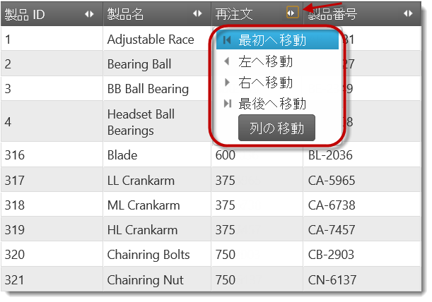
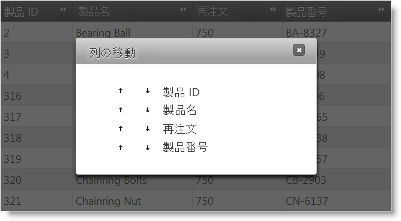
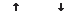
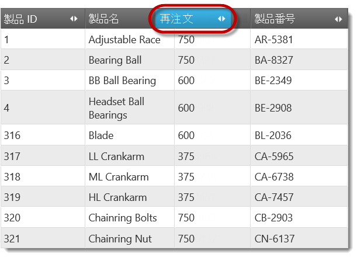
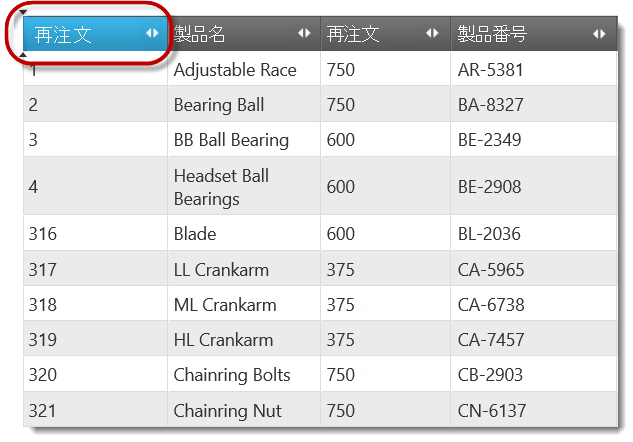

# 列移動の概要 (igGrid)

## トピックの概要

### 目的

このトピックでは、`igGrid`™ コントロールの列移動機能およびこの機能が提供する機能性について概念的に説明します。

### 前提条件

このトピックを理解するために、以下のトピックを参照することをお勧めします。

- [igGrid の概要](/iggrid-overview): このトピックでは、`igGrid` を Web ページに追加する方法を説明します。

- [igGrid/igDataSource アーキテクチャの概要](/iggrid-igdatasource-architecture-overview): このトピックでは、`igGrid` の内部機能および `igDataSource` とどのように相互作用して異なるデータ ソースへのバインディングを可能にしているかを説明します。

- [igGrid の機能](/iggrid-features-landing-page): これは、`igGrid` の全機能を説明するトピックのグループです。

### このトピックの内容

このトピックは、以下のセクションで構成されます。

-   [**概要**](#introduction)
    -   [igGrid 列移動の概要](#summary)
    -   [列移動のタイプ](#type)
    -   [グループ化された列の移動](#grouped-columns)
-   [**ユーザー インタラクションと操作性**](#user-interactions)
    -   [ユーザー インタラクションの概要表](#user-interactions-summary-table)
    -   [ドラッグ アンド ドロップによる列の移動](#drag-drop)
    -   [列の移動ドロップダウン メニューを介した列の移動](#drop-down-menu)
    -   [列の移動ダイアログを介した列の移動](#column-moving-dialog)
    -   [タッチ サポート](#touch-support)
    -   [列移動モード](#mode)
-   [**列移動の構成**](#configuring)
    -   [列移動のデフォルト構成](#default-configuration)
-   [**キーボード操作**](#keyboard-interaction)   
-   [**関連コンテンツ**](#related-content)
    -   [トピック](#topics)
    -   [サンプル](#samples)

## 概要

### *igGrid* 列移動の概要

列移動は `igGrid` の機能であり、グリッド内の列の位置を変更し、事実上グリッドの列の順序を再設定できます。これは、グリッド インターフェイスを介して、または列移動機能の API を介してプログラム的に実行できます。ユーザーはドラッグする、または特別な[列移動インターフェイス](#drop-down-menu) (列ヘッダー内のボタンで起動) から任意の列の位置を選択することにより列を移動できます。ドラッグは、タッチ対応デバイス上ではサポートされません。

一度に 1 つの列のみを移動できます。`igGrid` からの列の移動方法に関する詳細は、「[ユーザー インタラクションと操作性](#user-interactions)」を参照してください。コードによる列の移動方法については、「[プログラムによる列の移動](/iggrid-columnmoving-movingcolumnsprogrammatically)」トピックを参照してください。

列移動は、個々の列において、または列のグループにおいて実施できます。列移動は[機能セレクター](/iggrid-feature-chooser)でレンダリングされ、[複数列ヘッダー](/iggrid-multicolumnheaders-landingpage)などその他のすべての `igGrid` 機能と互換性があります。

列移動機能は、グリッド内のデータのみを再レンダリングします。データ ソースを変更することはありません。

列移動は、`igGrid` の `features` 配列に新機能オブジェクトを追加し、その機能オブジェクトの `name` プロパティを *ColumnMoving* に設定することで有効になります。有効になったら、明示的に指定されない限り列移動はすべての列で許可されます。詳細は、「[列移動の有効化](/iggrid-columnmoving-enabling) 」トピックを参照してください。

### 列移動のタイプ

列列移動のタイプは、ドキュメント オブジェクト モデル (DOM) で列がどのように移動されるのかを定義します。タイプは以下の通りです。

-   DOM 操作 - 列は、列 DOM をデタッチして DOM ツリーに再度アタッチして戻すことにより移動されます。
-   グリッドの再レンダリング - 列は、最初にグリッドを破壊してから、宛先位置にて列で再度作成することにより移動します。

デフォルトでは、列移動は DOM 操作を介して行います。一部のブラウザーでは、グリッドの再作成はノードをデタッチしてアタッチするよりも速いためタイプをグリッドの再レンダリングに明示的に設定します。

> **注:** 一般に、Internet Explorer® での列移動はグリッドの再レンダリングよりも速く、その他のブラウザーでは DOM 操作の方がパフォーマンスが良くなります。結果は、グリッドで有効にされる機能およびレンダリングされるデータ量に基づいて異なります。それに加え、アプリケーションのブラウザー要件は、タイプの選択に影響を及ぼします。

列移動タイプは、type プロパティを介して構成します。詳細は、「[列移動の構成](/iggrid-columnmoving-configuring) 」トピックを参照してください。

### グループ化された列の移動

列移動は、複数列ヘッダー機能と組み合わせて使用できます。より正確には、

-   ユーザーは個別の列と同じやり方で列グループを移動できますが、グループ内の列は列階層の同じレベル内でのみ移動できます。
-   列移動インジケーターは、各ヘッダー セル (Table Header (TH) HTML 要素) についてレンダリングされるため、ユーザーは 1 回のクリックで列グループを移動できます。列グループは、列移動ダイアログでも表示されます。

## ユーザー インタラクションと操作性

ユーザーは以下により列を移動できます。

-   **ドラッグ アンド ドロップ**
-   特別な列移動インターフェイス:
    -   **列移動ドロップダウン** - 列を移動するためのターゲット位置をリスト表示するドロップダウン
    -   **列の移動ダイアログ** - 再配置するためのオプションを持つグリッドのすべての列をリスト表示するダイアログ ウィンドウ

ドラッグ アンド ドロップは、マウスが有効なデバイス (ラップトップ、デスクトップ コンピュータ) でサポートされるため、ドラッグ アンド ドロップを介して列を移動します。ドラッグ アンド ドロップを介して列を移動するには操作モードが 2 つあります。マウスがドラッグされているときにグリッドが継続的に更新するかどうか、またはマウス ボタンを放したときにのみ更新されるかどうかに基づいて、Immediate か Deferred かになります。モードの詳細については、「[列移動モード](#mode)」セクションを参照してください。

列移動ドロップダウンはすべての種類のデバイスでサポートされますが、タッチ対応デバイスで最も有用になります。列移動目標位置 (最初、左、右または最後) をリストするオプション付きでドロップダウン メニューを開く列ヘッダー内のボタンを介してアクセスします。

**列の移動**ダイアログは、すべてのデバイスでサポートされます。ダイアログには、各列の列移動ドロップダウンから**列の移動**ボタンをクリックしてアクセスします。ダイアログは、再配置するためのオプションを持つグリッドのすべての列を一覧表示します。

### ユーザー インタラクションの概要表

以下の表は、標準のコンピュータまたはモバイル デバイス上で列を移動できるアクションのリストです。モバイル デバイスでの列移動に関する詳細は、[タッチ ポート](#touch-support) をご参照ください。

<table class="table table-bordered">
	<thead>
		<tr>
            <th colspan="2">インターフェイス</th>
            <th>ユーザー操作</th>
            <th>詳細</th>
            <th>タッチ対応デバイスのサポートの有無</th>
            <th>クライアント/サーバー設定</th>
</tr>
	</thead>
	<tbody>
        <tr>
            <td colspan="2">マウス</td>
            <td>[ドラッグ アンド ドロップ](#drag-drop)</td>
            <td>ユーザーは任意の位置に列をドラッグできます。</td>
            <td></td>
            <td>ドラッグ アンド ドロップを以下の 2 つの操作モードのいずれかで構成できます。マウスがドラッグされているときにグリッドが継続的に更新するかどうか、またはマウス ボタンを放したときにのみ更新されるかどうかに基づいて、Immediate または Deferred になります。 <ul> <li> [列移動の構成](/iggrid-columnmoving-configuring) </li> </ul></td>
</tr>

        <tr>
            <td>列移動インターフェイス</td>
            <td>ドロップダウン メニュー</td>
            <td>[ドロップダウン メニューからの列移動選択](#drop-down-menu)</td>
            <td>ユーザーは、ドロップダウン メニュー項目 (最初へ移動、左へ移動、右へ移動、最後へ移動) で列位置を変更します。</td>
            <td></td>
            <td>列移動インターフェイスは、有効 (デフォルト) または無効になります。有効である場合、メニューとダイアログの両方を使用できます。無効の場合はどちらも使用できません。 <ul> <li> [列移動の構成](/iggrid-columnmoving-configuring) </li> </ul></td>
</tr>

        <tr>
            <td></td>
            <td>ダイアログ</td>
            <td>[列移動ダイアログからの列位置の選択](#column-moving-dialog)</td>
            <td>ユーザーは、ダイアログ ウィンドウで提供されるオプションで列を再配置します。デフォルトは、列移動ドロップダウン メニューからアクセスされます。</td>
            <td></td>
            <td></td>
</tr>
    </tbody>
</table>

### ドラッグ アンド ドロップによる列の移動

ドラッグ アンド ドロップによる列移動は、マウスが有効なデバイスでのみサポートされます。

ユーザーは、ヘッダーでドラッグし任意の目標位置にドロップすることにより列を移動します。

列が選択されると (列ヘッダーに対して自動的にマウスをホバー)、ヘッダーのカラーは選択を示すように変わります。その後、クリックしてドラッグします。ヘッダーの選択カラーはドラッグ中は保持されます。ドラッグ操作の結果として列がどのように移動するかは、どの[列移動モード](#mode)が構成されているかによります。

即時モードでは、ヘッダーが別の列にかかると列全体が移動します (列がスワップされているように見える)。

遅延モードの場合、列はヘッダーが新しい位置にドロップされるまで移動しません。その代わり、列のドラッグはヘッダーのコピーが作成されることにより示され、現在の潜在的なドロップ位置は一対の矢印によって示されます。

列は列ごとにドラッグ アンド ドロップから無効にできます。詳細は、「[列移動の構成](/iggrid-columnmoving-configuring) 」トピックを参照してください。

### 列の移動ドロップダウン メニューを介した列の移動

この移動列オプションは、すべての種類のデバイス上でサポートされますが、タッチ対応デバイスではドラッグ アンド ドロップがサポートされないため特に便利です。

ユーザーはドロップダウン メニューからターゲット位置を選択することにより列を移動します。

メニューは、各列のヘッダーにデフォルトで使用可能な列移動ボタンを介してアクセスできます。このボタンをクリック/タッチすると、移動ドロップダウン メニューが開きます。列移動メニューには、列をグリッド内の特定の位置に移動するオプションがあります。

-   **First** - 列が左端に移動します。
-   **Left** - 列が左へ 1 つ移動します (左の列と位置が入れ替わります)。
-   **Right** - 列が右へ 1 つ移動します (右の列と位置が入れ替わります)。
-   **Last** - 列は右端に移動します。

各メニュー項目において、クリックされると操作が直ちに実行されます。

列移動ドロップダウン メニューには、同じ名前 (列の移動) の列移動ダイアログを開く [列の移動] ボタンもあります。(「[列の移動ダイアログを介した列の移動](#column-moving-dialog)」セクションを参照してください。)

列移動ドロップダウン メニューは、グリッド内すべての列を有効または無効にできますが、個々の列を有効または無効にすることはできません。メニューはデフォルトで有効です。[`addMovingDropdown`](/iggrid-columnmoving-propertyreference#addMovingDropdown) プロパティを false に設定すると無効になります。

**関連トピック**

-   [列移動の構成](/iggrid-columnmoving-configuring)
-   [プロパティ リファレンス](/iggrid-columnmoving-propertyreference)

### 列の移動ダイアログを介した列の移動

**列の移動**ダイアログは、グリッド内で列を再配置するための便利な方法をユーザーに提供します。このダイアログは、ユーザーが列移動ドロップダウンで [列の移動] ボタンを押すと開きます。

列の移動 ダイアログは、すべての種類のデバイス上でサポートされますが、タッチ対応デバイスではドラッグ アンド ドロップがサポートされないため特に便利です。列の移動ダイアログは、列移動ドロップダウンが有効である場合にのみ使用可能です。ドロップダウンから有効にしたり別個に呼び出すことはできません。

列の移動ダイアログは、列を移動/再配置するために 2 つの代替方法をユーザーに提供します。

-   ボタンを使用

    

-   ドラッグ アンド ドロップ

列の位置は、ユーザーがダイアログを操作するとただちに変更されます。ダイアログには [**OK**] ボタンや [**キャンセル**] ボタンはありません。

列移動機能の[movingDialogWidth](/iggrid-columnmoving-propertyreference#movingDialogWidth)、[movingDialogHeight](/iggrid-columnmoving-propertyreference#movingDialogHeight)、[movingDialogAnimationDuration](/iggrid-columnmoving-propertyreference#movingDialogAnimationDuration) プロパティでダイアログの幅、高さおよびドラッグ アニメーション期間を構成できます。

**関連トピック**

-   [列移動の構成](/iggrid-columnmoving-configuring)
-   [プロパティ リファレンス](/iggrid-columnmoving-propertyreference)

### タッチ サポート

タッチ対応デバイスでは、ユーザーは列移動ドロップダウンまたは列の移動ダイアログを介してのみ列を移動できます。ドラッグ アンド ドロップはこれらのデバイス上ではサポートされないため列は移動できません。

### 列移動モード

列移動機能の `mode` は、列ヘッダーをドラッグする場合に列をどのように移動するのかを指定します。モードは Immediate および Deferred です。

-   Immediate モード - ユーザーは列ヘッダーをドラッグいているとき、列はアニメのように入れ替わり、グリッドをヘッダーの最新位置に更新し続けます。
-   Deferred  モード - ドラッグでは列ヘッダーは移動しませんが、代わりにユーザーがマウス ボタンをリリースする場合に列がドロップされる位置をマーク付けします。列コンテンツの実際の移動は、列ヘッダーが新しい位置にドロップされると実行されます。

以下のスクリーンショットは、Immediate モードで列がドラッグされている様子を示します。ここでドラッグされた列のヘッダーがどのようにその外観と位置を変えたのかに注意してください。ヘッダーが製品名列を渡すと、再注文ポイントと製品名の列が位置を交換します。

以下のスクリーンショットは、Deferred モードで列がドラッグされている様子を示します。再注文ポイント列ヘッダーのコピーが製品 ID 列にドラッグされていますが、再注文ポイント列自体は元の位置からは移動されません。代わりに、ドロップ インジケーター (2 つの垂直矢印) が列の新しい位置を示します。マウス ボタンがリリースされると、再注文ポイント列は新しい位置へ移動します。

列移動モードは、列移動機能の mode プロパティから構成されます。デフォルトの列移動モードは Immediate です。

**関連トピック:**

- [列移動の構成](/iggrid-columnmoving-configuring)

- [プロパティ リファレンス](/iggrid-columnmoving-propertyreference)

## 列移動の構成

以下の表は、`igGrid` 列移動の構成可能な要素を示しています。このメソッドについては、表の下にある解説も参照してください。

| 構成可能な項目 | 詳細 | プロパティ |
| --- | --- | --- |
| モード | デフォルトでは[列移動モード](#mode)は即時です。代わりに遅延モードを構成できます。 | [mode](/iggrid-columnmoving-propertyreference#mode) |
| タイプ | デフォルトでは[列移動タイプ](#type)は DOM 操作です。代わりにグリッドの再レンダリングをタイプに構成できます。タイプは、ブラウザーによって機能パフォーマンスに異なった影響を与えます。 | [moveType](/iggrid-columnmoving-propertyreference#moveType) |
| 列 | どの列の移動を許可するかを指定できます。 | [columnSettings](/iggrid-columnmoving-propertyreference#columnSettings) [columnSettings.columnKey](/iggrid-columnmoving-propertyreference#columnKey) [columnSettings.allowMoving](/iggrid-columnmoving-propertyreference#allowMoving) |
| インターフェイス | グリッドの列移動インターフェイスを有効または無効にします。 | [addMovingDropdown](/iggrid-columnmoving-propertyreference#addMovingDropdown) |

### 列移動のデフォルト構成

デフォルトでは、列移動は DOM 操作 [type](#type)、immediate [mode](#mode) で構成され、列移動インターフェイスは有効になっています。以下の表は、各プロパティのデフォルト設定のリストです。

プロパティ|タイプ|デフォルト値|説明
---|---|---|---
[mode](/iggrid-columnmoving-propertyreference#mode)|string|"immediate"|デフォルトの[列移動モード](#mode)は Immediate に設定されています。
[moveType](/iggrid-columnmoving-propertyreference#moveType)|string|“dom“ |デフォルトの[列移動タイプ](#type)は DOM 操作に設定されています。
[addMovingDropdown](/iggrid-columnmoving-propertyreference#addMovingDropdown)|bool|true|列移動インターフェイスはユーザーに対して表示され操作可能です。

## キーボード操作

以下のキーボード操作が可能です。

グリッドにフォーカスがある場合:

-	TAB: 列移動 UI のフォーカス可能な要素間でフォーカスを移動: 列ヘッダーの列移動インジケーター

列移動インジケーターにフォーカスがある場合:

-	ENTER/SPACE: 列移動ドロップダウンを開く/閉じる。
-	UP/DOWN: 列移動ドロップダウン項目の移動を許可。

項目がアクティブな場合:

-	ENTER/SPACE: 指定した操作を適用。列移動ボタンにフォーカスがある場合、列移動ダイアログが開きます。

## 関連コンテンツ

### トピック

このトピックの追加情報については、以下のトピックも合わせてご参照ください。

- [列移動の有効化](/iggrid-columnmoving-enabling): このトピックでは、コード例を用いて、`igGrid` の列移動機能を有効にする方法について説明します。

- [列移動の構成](/iggrid-columnmoving-configuring): このトピックでは、コード例を用いて、`igGrid` の列移動機能を構成する方法について説明します。

- [コードによる列の移動](/iggrid-columnmoving-movingcolumnsprogrammatically): このトピックは、列移動 API を使用して列を移動する方法をコード例を用いて説明します。

- [プロパティ リファレンス](/iggrid-columnmoving-propertyreference): このトピックは、`igGrid` の列移動機能 API の一部のプロパティに関する参考情報を提供します。

### サンプル

このトピックについては、以下のサンプルも参照してください。

- [列移動](&#123;environment:SamplesUrl&#125;/grid/column-management): このサンプルは、`igGrid` の列移動の構成を示します。

 

 

