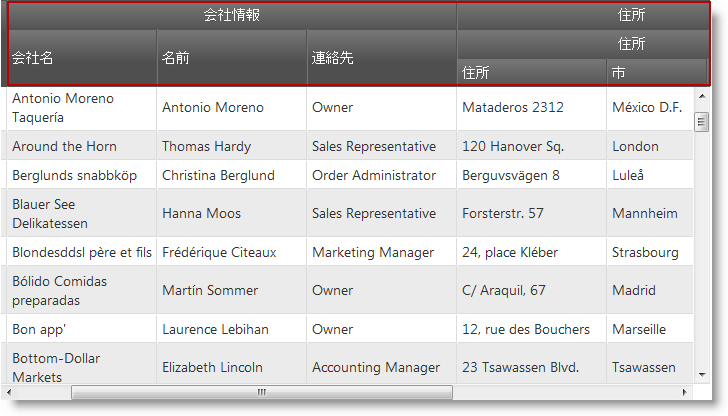
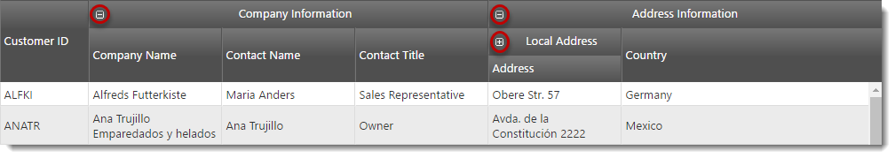
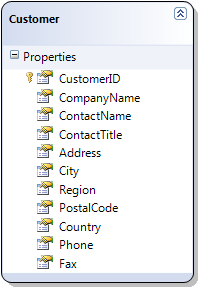

# 複数列ヘッダーの構成 (igGrid)

## トピックの概要

### 目的

このトピックでは、`igGrid`™ 複数列ヘッダー機能の構成方法について説明します。

### 前提条件

本トピックの理解を深めるために、以下のトピックを参照することをお勧めします。

- [複数列ヘッダー (igGrid)](/iggrid-multicolumnheaders-multicolumnheaders): このトピックでは、`igGrid` の複数列ヘッダー機能について説明します。


### このトピックの内容

このトピックは、以下のセクションで構成されます。

-   [**概要**](#introduction)
-   [**JavaScript での複数列ヘッダーの構成**](#js)
    -   [プレビュー](#js-preview)
    -   [概要](#js-overview)
    -   [手順](#js-steps)
-	[**JavaScript での縮小可能な列グループの構成**](#ccg-js)
	-	[プレビュー](#ccg-js-preview)
	-	[概要](#ccg-js-overview)
	-	[手順](#ccg-js-steps)
-   [**ASP.NET MVC での複数列ヘッダーの構成**](#mvc)
    -   [プレビュー](#mvc-preview)
    -   [要件](#mvc-requirements)
    -   [概要](#mvc-overview)
    -   [手順](#mvc-steps)
-	[**ASP.NET MVC での縮小可能な列グループの構成**](#ccg-mvc)
    -   [プレビュー](#ccg-mvc-preview)
    -   [要件](#ccg-mvc-requirements)
    -   [概要](#ccg-mvc-overview)
    -   [手順](#ccg-mvc-steps)
-   [**関連コンテンツ**](#related-content)
    -   [トピック](#topics)
    -   [サンプル](#samples)


## <a id="introduction"></a> 概要

複数列ヘッダー機能では、ヘッダーをグループ化できるようになっています。`igGrid.options.columns` 配列でこの機能に対応するため、group という各列オブジェクトからの新しいオプションがあります。このオプションには、他の列定義の配列を含めることができます。`group` オプションはカスケードしています。つまり、複数列ヘッダーをまとめてグループ化できるということです。グループ化された列を定義する際には、`headerText`、key、および `rowspan` の各プロパティを設定できます。`headerText` オプションはグループ キャプションを設定するために使用し、key は他の機能での使用時に列グループを参照するために使用し、`rowspan` はグループ ヘッダー セルのスパンを調整するために使用します。複数列ヘッダー API は、グリッドの列オブジェクトを介してエクスポーズされます。他の機能と同じように、この機能は、`igGrid`.options.features 配列に追加して、JavaScript ファイル内で参照する必要もあります。次のスクリーンショットは、`CompanyName`、`ContactName`、および `ContactTitle` 列用に構成された複数列ヘッダーです。


## <a id="js"></a> JavaScript での複数列ヘッダーの構成

ここでは、`igGrid` で複数列ヘッダーを構成する過程を順を追って説明します。

### <a id="js-preview"></a> プレビュー

以下のスクリーンショットは最終結果のプレビューです。



### <a id="js-overview"></a> 概要

以下はプロセスの概要です。

1. [必要な JavaScript および CSS ファイルの参照](#js-reference-resources)
2. [サンプル データの定義](#js-define-the-data)
3. [HTML プレースホルダーの定義](#js-define-the-html-placeholder)
4. [igGrid インスタンスの作成](#js-instantiate-the-grid)

### <a id="js-steps"></a> 手順

`igGrid` で複数列フッターを構成する手順を以下に示します。

1. 必要な JavaScript および CSS ファイルを参照します。 <a id="js-reference-resources"></a>
	
	次のコード スニペットは、Infragistics Loader を使用して複数列ヘッダー機能を参照しています。
	
	**HTML の場合:**
	
```html
	<script src="jquery.min.js" type="text/javascript"></script>
	<script src="jquery-ui.min.js" type="text/javascript"></script> 
	<script src="infragistics.loader.js"></script>
```
	
	**JavaScript の場合:**
	
```js
	<script type="text/javascript">
	    $.ig.loader({
	        scriptPath: "http://localhost/ig_ui/js/",
	        cssPath: "http://localhost/ig_ui/css/",
	        resources: "igGrid.MultiColumnHeaders"
	    });
	</script>
```

2. バインドするデータを定義します。 <a id="js-define-the-data"></a>
	
	次のコードは、オブジェクトの JavaScript 配列を定義します。このデータは igGrid のデータ ソースとして使用されます。
	
	**JavaScript の場合:**
	
```js
	var northwindCustomers = [
	{
	    "CustomerID": "ALFKI",
	    "CompanyName": "Alfreds Futterkiste",
	    "ContactName": "Maria Anders",
	    "ContactTitle": "Sales Representative",
	    "Address": "Obere Str. 57",
	    "City": "Berlin",
	    "Region": null,
	    "PostalCode": "12209",
	    "Country": "Germany",
	    "Phone": "030-0074321",
	    "Fax": "030-0076545"
	}, {
	    "CustomerID": "ANATR",
	    "CompanyName": "Ana Trujillo Emparedados y helados",
	    "ContactName": "Ana Trujillo",
	    "ContactTitle": "Owner",
	    "Address": "Avda. de la Constituciu00f3n 2222",
	    "City": "Mu00e9xico D.F.",
	    "Region": null,
	    "PostalCode": "05021",
	    "Country": "Mexico",
	    "Phone": "(5) 555-4729",
	    "Fax": "(5) 555-3745"
	}];
```

3. HTML プレースホルダーを定義します。 <a id="js-define-the-html-placeholder"></a>

	**HTML の場合:**
	
```html
	<table id="grid1"></table>
```

4. `igGrid` をインスタンス化します。 <a id="js-instantiate-the-grid"></a>

	次のコードでは、2 つのグループが定義されています。1 つめは「Company Information」というグループで、`CompanyName`、`ContactName`、および `ContactTitle` という列が含まれています。
	
	2 つめは「Address Information」というグループで、`Country` という列と別のグループ列が含まれています。インナー グループは「Local address」というグループで、`Address`、`City`、および `PostalCode` という列が含まれています。
	
	**JavaScript の場合:**
	
```js
	$.ig.loader(function () {
	    $("#grid1").igGrid({
	        autoGenerateColumns: false,
	        dataSource: northwindCustomers,
	        columns: [
	            { headerText: "Customer ID", key: "CustomerID", width: "100px" },
	            { headerText: "Company Information",
	                group: [
	                    { headerText: "Company Name", key: "CompanyName", width: "150px" },
	                    { headerText: "Contact Name", key: "ContactName", width: "150px" },
	                    { headerText: "Contact Title", key: "ContactTitle", width: "150px" }
	                ]
	            },
	            { headerText: "Address Information", columnKey: "AddressInformation",
	            group: [
	                { headerText: "Local address",
	                    group: [
	                        { headerText: "Address", key: "Address", width: "150px" },
	                        { headerText: "City", key: "City", width: "100px" },
	                        { headerText: "PostalCode", key: "PostalCode", width: "100px" }
	                    ]
	                },
	                { headerText: "Country", key: "Country", width: "100px" }
	            ]}
	        ],
	        features: [
	            {
	                name: 'MultiColumnHeaders'
	            }
	        ]
	    });
	});
```

## <a id="ccg-js"></a> JavaScript での縮小可能な列グループの構成

ここでは、縮小可能な列グループを持つ `igGrid` で複数列ヘッダーを構成する過程を順を追って説明します。

### <a id="ccg-js-preview"></a> プレビュー

以下のスクリーンショットは最終結果のプレビューです。



### <a id="ccg-js-overview"></a> 概要

以下はプロセスの概要です。

1. [必要な JavaScript および CSS ファイルの参照](#ccg-js-reference-resources)
2. [サンプル データの定義](#ccg-js-define-the-data)
3. [HTML プレースホルダーの定義](#ccg-js-define-the-html-placeholder)
4. [igGrid インスタンスの作成](#ccg-js-instantiate-the-grid)

### <a id="ccg-js-steps"></a> 手順

縮小可能な列グループを持つ `igGrid` で複数列フッターを構成する手順を以下に示します。

1. 必要な JavaScript および CSS ファイルを参照します。 <a id="ccg-js-reference-resources"></a>
	
	次のコード スニペットは、Infragistics Loader を使用して複数列ヘッダー機能を参照しています。
	
	**HTML の場合:**
	
```html
	<script src="jquery.min.js" type="text/javascript"></script>
	<script src="jquery-ui.min.js" type="text/javascript"></script> 
	<script src="infragistics.loader.js"></script>
```
	
	**JavaScript の場合:**
	
```js
	<script type="text/javascript">
	    $.ig.loader({
	        scriptPath: "http://localhost/ig_ui/js/",
	        cssPath: "http://localhost/ig_ui/css/",
	        resources: "igGrid.MultiColumnHeaders"
	    });
	</script>
```

2. バインドするデータを定義します。 <a id="ccg-js-define-the-data"></a>
	
	次のコードは、オブジェクトの JavaScript 配列を定義します。このデータは igGrid のデータ ソースとして使用されます。
	
	**JavaScript の場合:**
	
```js
	var northwindCustomers = [
	{
	    "CustomerID": "ALFKI",
	    "CompanyName": "Alfreds Futterkiste",
	    "ContactName": "Maria Anders",
	    "ContactTitle": "Sales Representative",
	    "Address": "Obere Str. 57",
	    "City": "Berlin",
	    "Region": null,
	    "PostalCode": "12209",
	    "Country": "Germany",
	    "Phone": "030-0074321",
	    "Fax": "030-0076545"
	}, {
	    "CustomerID": "ANATR",
	    "CompanyName": "Ana Trujillo Emparedados y helados",
	    "ContactName": "Ana Trujillo",
	    "ContactTitle": "Owner",
	    "Address": "Avda. de la Constituciu00f3n 2222",
	    "City": "Mu00e9xico D.F.",
	    "Region": null,
	    "PostalCode": "05021",
	    "Country": "Mexico",
	    "Phone": "(5) 555-4729",
	    "Fax": "(5) 555-3745"
	}];
```

3. HTML プレースホルダーを定義します。 <a id="ccg-js-define-the-html-placeholder"></a>

	**HTML の場合:**
	
```html
	<table id="grid1"></table>
```

4. `igGrid` をインスタンス化します。 <a id="ccg-js-instantiate-the-grid"></a>

	次のコードでは、2 つのグループが定義されています。1 つめは「Company Information」というグループで、`CompanyName`、`ContactName`、および `ContactTitle` という列が含まれています。
	
	2 つ目は「Address Information」というグループで、`Country` および `Full Address` という列と別のグループ列が含まれています。インナー グループは「Local address」というグループで、`Address`、`City`、および `PostalCode` という列が含まれています。

	「Company Information」グループが縮小可能で、最初に展開されています。縮小された場合、`CompanyName` 列のみが表示されます。

	「Address Information」グループも最初に展開されています。縮小された場合、非バインドの `FullAddress` 列が表示されます。

	「Local address」グループが最初に縮小されています。`Address` 列のみが表示されています。展開された場合、`City` および `PostalCode` 列が表示されます。
	
	**JavaScript の場合:**
	
```js
	$.ig.loader(function () {
	    $("#grid1").igGrid({
	        autoGenerateColumns: false,
	        dataSource: northwindCustomers,
	        columns: [
                { headerText: "Customer ID", key: "CustomerID", dataType: "string", width: "100px" },
                {
                    headerText: "Company Information",
                    group: [
                        {
                            headerText: "Company Name",
                            key: "CompanyName",
                            dataType: "string",
                            width: "150px"
                        },
                        {
                            headerText: "Contact Name",
                            key: "ContactName",
                            dataType: "string",
                            width: "150px",
                            groupOptions: {
                                hidden: "parentcollapsed"
                            }
                        },
                        {
                            headerText: "Contact Title",
                            key: "ContactTitle",
                            dataType: "string",
                            width: "150px",
                            groupOptions: {
                                hidden: "parentcollapsed"
                            }
                        }
                    ],
                    groupOptions: {
                        expanded: true,
                        allowGroupCollapsing: true
                    }
                },
                {
                    headerText: "Address Information",
                    group: [
                        {
                            headerText: "Local Address",
                            group: [
                                {
                                    headerText: "Address",
                                    key: "Address",
                                    dataType: "string",
                                    width: "150px"
                                },
                                {
                                    headerText: "City",
                                    key: "City",
                                    dataType: "string",
                                    width: "100px",
                                    groupOptions: {
                                        hidden: "parentcollapsed"
                                    }
                                },
                                {
                                    headerText: "Postal Code",
                                    key: "PostalCode",
                                    dataType: "string",
                                    width: "100px",
                                    groupOptions: {
                                        hidden: "parentcollapsed"
                                    }
                                }
                            ],
                            groupOptions: {
                                expanded: false,
                                allowGroupCollapsing: true,
                                hidden: "parentcollapsed"
                            }
                        },                            
                        {
                            headerText: "Country",
                            key: "Country",
                            width: "100px",
                            groupOptions: {
                                hidden: "parentcollapsed"
                            }
                        },
                        {
                            headerText: "Full Address",
                            width: "200px",
                            key: "FullAddress",
                            dataType: "string",
                            unbound: true,
                            formula: function (data, grid) {
                                return data["Address"] + ", " + data["City"];
                            },
                            groupOptions: {
                                hidden: "parentexpanded"
                            }
                        }
                    ],
                    groupOptions: {
                        expanded: true,
                        allowGroupCollapsing: true
                    }
                }
            ],
	        features: [
	            {
	                name: 'MultiColumnHeaders'
	            }
	        ]
	    });
	});
```


## <a id="mvc"></a> ASP.NET MVC での複数列ヘッダーの構成

ここでは、`igGrid` で複数列ヘッダーを構成する過程を順を追って説明します。

### <a id="mvc-preview"></a> プレビュー

以下のスクリーンショットは最終結果のプレビューです。


### <a id="mvc-requirements"></a> 要件

この手順を実行するには、以下が必要です。

-   Microsoft® Visual Studio 2010 またはそれ以降のバージョンのインストール
-   バージョン 4 以降の ASP.NET MVC Framework のインストール
-   Northwind データベースのインストール
-   Infragistics.Web.Mvc.dll アセンブリへの参照
-   \{environment:ProductName\} JavaScript とテーマ リソース

### <a id="mvc-overview"></a> 概要

以下はプロセスの概要です。

1. [必要な JavaScript および CSS ファイルの参照](#mvc-reference-resources)
2. [モデルの定義](#mvc-define-model)
3. [ビューの定義](#mvc-define-view)
4. [コントローラーの定義](#mvc-define-controller)

### <a id="mvc-steps"></a> 手順

`igGrid` で複数列フッターを構成する手順を以下に示します。

1. 必要な JavaScript および CSS ファイルを参照します。 <a id="mvc-reference-resources"></a>

	Index.cshtml ビューで、必要な JavaScript 参照を追加して、Infragistics ローダーのインスタンスを作成します。
	
	次のコード スニペットは、Infragistics Loader を使用して複数列ヘッダー機能を参照しています。
	
	**HTML の場合:**
	
```html
	<script src="jquery.min.js" type="text/javascript"></script>
	<script src="jquery-ui.min.js" type="text/javascript"></script> 
	<script src="infragistics.loader.js"></script>
```
	
	**C# の場合:**
	
```csharp
	@Html.Infragistics()
	.Loader()
	.ScriptPath("http://localhost/ig_ui/js/")
	.CssPath("http://localhost/ig_ui/css/")
	.Resources("igGrid.MultiColumnHeaders")
	.Render()
```

2. モデルを定義します。 <a id="mvc-define-model"></a>

	Northwind データベースの Customers テーブルに関する ADO.NET エンティティー データ モデルを追加し、このモデルに NorthwindModel という名前を付けます。
	
	

3. ビューを定義します。 <a id="mvc-define-view"></a>

	Index.cshtml ビューを開き、以下のコードを追加します。
	
	このコードでは、2 つのグループが定義されています。1 つめは「Company Information」というグループで、`CompanyName`、`ContactName`、および `ContactTitle` という列が含まれています。
	
	2 つめは「Address Information」というグループで、Country という列と別のグループ列が含まれています。インナー グループは「Local address」というグループで、`Address`、`City`、および `PostalCode` という列が含まれています。
	
	**C# の場合:**
	
```csharp
	@Html.Infragistics().Grid(Model)
	.AutoGenerateColumns(false)
	.ID("grid1")
	.PrimaryKey("CustomerID")
	.Height("400px")
	.Width("100%")
	.Columns(column =>
	{
	    column.For(x => x.CustomerID).HeaderText("Customer ID").Width("100px");
	    column.MultiColumnHeader().HeaderText("Company Information").Group(c => {
	        c.For(x => x.CompanyName).HeaderText("Company Name").Width("150px");
	        c.For(x => x.ContactName).HeaderText("Contact Name").Width("150px");
	        c.For(x => x.ContactTitle).HeaderText("Contact Title").Width("150px");
	    });
	    column.MultiColumnHeader().HeaderText("Address Information").Group(c => {
	        c.MultiColumnHeader().HeaderText("Local address").Group(c2 => {
	            c2.For(x => x.Address).HeaderText("Address").Width("150px");
	            c2.For(x => x.City).HeaderText("City").Width("100px");
	            c2.For(x => x.PostalCode).HeaderText("PostalCode").Width("100px");
	        });
	    });
	    column.For(x => x.Country).HeaderText("Country").Width("100px");
	})
	.Features(features => { 
	    features.MultiColumnHeaders();
	})
	.DataBind().Render()
```

	> **注:**
	> 複数列ヘッダーの列キーは、そのキーを引数として MultiColumnHeader チェーン メソッドに渡すことによって設定できます。
	> 例: MultiColumnHeader(“companyInformation”)

4. コントローラーを定義します。 <a id="mvc-define-controller"></a>

	Home コントローラーのインデックス アクション メソッドで、Customers データを Northwind データベースから抽出し、そのデータをビューと共に返します。
	
	**C# の場合:**
	
```csharp
	public ActionResult Index()
	{
	    var dataContext = new NorthwindDataContext();
	    var customers = dataContext.Customers.AsQueryable();
	    return View(customers);
	}
```


## <a id="ccg-mvc"></a> ASP.NET MVC での縮小可能な列グループの構成

ここでは、縮小可能な列グループを持つ `igGrid` で複数列ヘッダーを構成する過程を順を追って説明します。

### <a id="ccg-mvc-preview"></a> プレビュー

以下のスクリーンショットは最終結果のプレビューです。


### <a id="ccg-mvc-requirements"></a> 要件

この手順を実行するには、以下が必要です。

-   Microsoft® Visual Studio 2010 またはそれ以降のバージョンのインストール
-   バージョン 3 以降の ASP.NET MVC Framework のインストール
-   Northwind データベースのインストール
-   Infragistics.Web.Mvc.dll アセンブリへの参照
-   \{environment:ProductName\} JavaScript とテーマ リソース

### <a id="ccg-mvc-overview"></a> 概要

以下はプロセスの概要です。

1. [必要な JavaScript および CSS ファイルの参照](#ccg-mvc-reference-resources)
2. [モデルの定義](#ccg-mvc-define-model)
3. [ビューの定義](#ccg-mvc-define-view)
4. [コントローラーの定義](#ccg-mvc-define-controller)

### <a id="ccg-mvc-steps"></a> 手順

`igGrid` で複数列フッターを構成する手順を以下に示します。

1. 必要な JavaScript および CSS ファイルを参照します。 <a id="ccg-mvc-reference-resources"></a>

	Index.cshtml ビューで、必要な JavaScript 参照を追加して、Infragistics ローダーのインスタンスを作成します。
	
	次のコード スニペットは、Infragistics Loader を使用して複数列ヘッダー機能を参照しています。
	
	**HTML の場合:**
	
```html
	<script src="jquery.min.js" type="text/javascript"></script>
	<script src="jquery-ui.min.js" type="text/javascript"></script> 
	<script src="infragistics.loader.js"></script>
```
	
	**C# の場合:**
	
```csharp
	@Html.Infragistics()
	.Loader()
	.ScriptPath("http://localhost/ig_ui/js/")
	.CssPath("http://localhost/ig_ui/css/")
	.Resources("igGrid.MultiColumnHeaders")
	.Render()
```

2. モデルを定義します。 <a id="ccg-mvc-define-model"></a>

	Northwind データベースの Customers テーブルに関する ADO.NET エンティティー データ モデルを追加し、このモデルに NorthwindModel という名前を付けます。
	
	

3. ビューを定義します。 <a id="ccg-mvc-define-view"></a>

	Index.cshtml ビューを開き、以下のコードを追加します。
	
	次のコードでは、2 つのグループが定義されています。1 つめは「Company Information」というグループで、`CompanyName`、`ContactName`、および `ContactTitle` という列が含まれています。
	
	2 つ目は「Address Information」というグループで、`Country` および `Full Address` という列と別のグループ列が含まれています。インナー グループは「Local address」というグループで、`Address`、`City`、および `PostalCode` という列が含まれています。

	「Company Information」グループが縮小可能で、最初に展開されています。縮小された場合、`CompanyName` 列のみが表示されます。

	「Address Information」グループも最初に展開されています。縮小された場合、非バインドの `FullAddress` 列が表示されます。

	「Local address」グループが最初に縮小されています。`Address` 列のみが表示されています。展開された場合、`City` および `PostalCode` 列が表示されます。
	
	**C# の場合:**
	
```csharp
	@Html.Infragistics().Grid(Model)
	.AutoGenerateColumns(false)
	.ID("grid1")
	.PrimaryKey("CustomerID")
	.Height("400px")
	.Width("100%")
    .Columns(column =>
    {
        column.For(x => x.CustomerID).HeaderText("Customer ID").Width("100px");
        column.MultiColumnHeader().HeaderText("Company Information")
            .Group(c =>
            {
                c.For(x => x.CompanyName).HeaderText("Company Name").Width("150px");
                c.For(x => x.ContactName).HeaderText("Contact Name").Width("150px")
                    .GroupOptions(go => go.Hidden(CollapsibleGroupHidden.ParentCollapsed));
                c.For(x => x.ContactTitle).HeaderText("Contact Title").Width("150px")
                    .GroupOptions(go => go.Hidden(CollapsibleGroupHidden.ParentCollapsed)); ;
            })
            .GroupOptions(go => go.AllowGroupCollapsing(true).Expanded(true));

        column.MultiColumnHeader().HeaderText("Address Information")
            .Group(c =>
            {
                c.MultiColumnHeader().HeaderText("Local address")
                    .Group(c2 =>
                    {
                        c2.For(x => x.Address).HeaderText("Address").Width("150px");
                        c2.For(x => x.City).HeaderText("City").Width("100px")
                            .GroupOptions(go => go.Hidden(CollapsibleGroupHidden.ParentCollapsed));
                        c2.For(x => x.PostalCode).HeaderText("PostalCode").Width("100px")
                            .GroupOptions(go => go.Hidden(CollapsibleGroupHidden.ParentCollapsed));
                    })
                .GroupOptions(go => go.AllowGroupCollapsing(true).Expanded(false)
                .Hidden(CollapsibleGroupHidden.ParentCollapsed));

                c.For(x => x.Country).HeaderText("Country").Width("100px")
                    .GroupOptions(go => go.Hidden(CollapsibleGroupHidden.ParentCollapsed));
                c.Unbound("FullAddress").HeaderText("Full Address").Width("200px").Formula("fullAddressFormula")
                    .GroupOptions(go => go.Hidden(CollapsibleGroupHidden.ParentExpanded));
            })
            .GroupOptions(go => go.AllowGroupCollapsing(true).Expanded(true));

    })
	.Features(features => { 
	    features.MultiColumnHeaders();
	})
	.DataBind().Render()
```

	> **注:**
	> 複数列ヘッダーの列キーは、そのキーを引数として MultiColumnHeader チェーン メソッドに渡すことによって設定できます。
	> 例: MultiColumnHeader(“companyInformation”)

4. コントローラーを定義します。 <a id="ccg-mvc-define-controller"></a>

	Home コントローラーのインデックス アクション メソッドで、Customers データを Northwind データベースから抽出し、そのデータをビューと共に返します。
	
	**C# の場合:**
	
```csharp
	public ActionResult Index()
	{
	    var dataContext = new NorthwindDataContext();
	    var customers = dataContext.Customers.AsQueryable();
	    return View(customers);
	}
```


## <a id="related-content"></a> 関連コンテンツ

### <a id="topics"></a> トピック

このトピックに関連する追加情報については、以下のトピックを参照してください。

- [igGrid の機能](/iggrid-features-landing-page): `igGrid` の機能に関連するトピックについてのランディング ページ。


### <a id="samples"></a> サンプル

このトピックについては、以下のサンプルも参照してください。

- [縮小可能な列グループ](\{environment:SamplesUrl\}/grid/collapsible-column-groups): このサンプルでは、複数列ヘッダーを縮小可能な列グループと構成する方法を示します。


 

 


