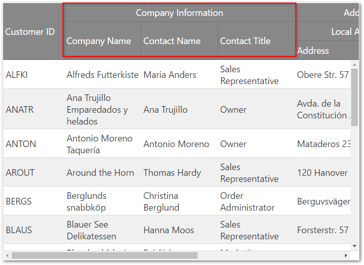
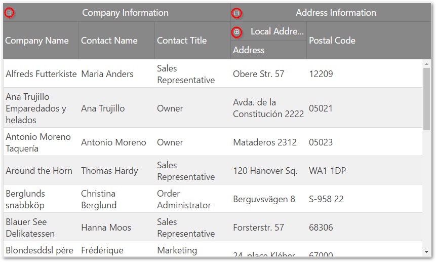

# 複数列ヘッダーの概要 (igGrid)

import ApiLink from 'docs-template/components/mdx/ApiLink.astro';

# 複数列ヘッダーの概要 (igGrid)

## トピックの概要

### 目的

このトピックでは、`igGrid`™ 複数列ヘッダー機能について説明します。

### 前提条件

本トピックの理解を深めるために、以下のトピックを参照することをお勧めします。

- [igGrid の概要](/iggrid-overview): このトピックでは、igGrid を Web ページに追加する方法について説明します。

- [igGrid/igDataSource アーキテクチャの概要](/iggrid-igdatasource-architecture-overview): このトピックでは、`igGrid` 内部の働きと、各種データ ソースとのバインディングを可能にするために igGrid が` gDataSource` とどのように協調するかを説明します。

### このトピックの内容

このトピックは、以下のセクションで構成されます。

-   [概要](#introduction)
-	[縮小可能な列グループ](#collapsible-column-groups)
-   [複数列ヘッダー プロパティの参照](#property-reference)
-   [複数列ヘッダーのメソッド参照](#method-reference)
-   [その他の機能統合の参照](#features-integration)
-   [関連コンテンツ](#related-content)


## <a id="introduction"></a> 概要

複数列ヘッダー機能では、ヘッダーをグループ化できるようになっています。`igGrid.options.columns` 配列でこの機能に対応するため、group という各列オブジェクトからの新しいプロパティがあります。このプロパティには、他の列定義の配列を含めることができます。`group` プロパティはカスケードしています。つまり、複数列ヘッダーをまとめてグループ化できるということです。グループ化された列を定義する場合、`headerText`、`key`、および `rowspan` の各プロパティを設定できます (すべてのプロパティが必須というわけではありません)。`headerText` プロパティを使用してグループ キャプションを設定します。他の機能と併せて使用した場合に `key` を使用して列グループを特定し、`rowspan` を使用してグループ ヘッダー セルの範囲を調整できます。複数列ヘッダー API は、グリッドの列オブジェクトを介してエクスポーズされます。他の機能と同じように、この機能は、`igGrid`.options.features 配列に追加して、JavaScript ファイル内で参照する必要もあります。

複数列ヘッダー機能には以下の 2 種類のセルがあります。

1.  テーブル ヘッダー セル – これは、列階層のリーフ列に直接マップされているヘッダー セルです。リーフ列はデータにバインドされており、その主要オプションはデータ ソース列キーです。この列は子を持つことはできません。つまり、グループ オプションを含まないということです。
2.  グループ ヘッダー セル – このセルは、データ バインドされていない親列にマップされています。列の key プロパティは自動的に生成されるか、手動で定義されますが、常に一意でなければなりません。この列では、グループ オプションが定義されています。

DOM では、複数列ヘッダー機能は THEAD 要素を変更します。THEAD の行数 (TR) は、列階層のレベル数と同じです。各テーブル行には `data-mch-level` 属性があり、行レベルを上から下へマークします。

列ヘッダー セル (TH) それぞれの `rowspan` 属性は列の `rowspan` プロパティにより設定されているか、複数列ヘッダー機能により自動的に計算されます。

データ バインドされた列ヘッダー セル (TH) の `data-isheadercell` 属性は true に設定されています。

グループ列の `data-mch-id` 属性は列の `key` プロパティに設定されているか、複数列ヘッダー機能により自動的に生成されます。

> **注:**
> API `$(“.selector”).igGrid(“option”, “columns”)` を使用してグリッド列を取得しようとすると、実際のデータ列が平面で表示されます。複数列ヘッダーの実際の列階層を取得する場合、`getMultiColumnHeaders` メソッドを使用する必要があります。
> 
> 例: `var columnDefinitions = $(".selector ").igGridMultiColumnHeaders("getMultiColumnHeaders");`

以下のスクリーンショットでは、複数列ヘッダーが Northwind データベースの Customers テーブルの `CompanyName`、`ContactName` および `ContactTitle` の各列に構成されているのがわかります。



以下のサンプルは、複数列ヘッダーの構成方法を示します。

<div class="embed-sample">
   [複数列ヘッダー](\{environment:SamplesEmbedUrl\}/grid/multi-column-headers)
</div>

## <a id="collapsible-column-groups"></a> 縮小可能な列グループ

縮小可能な列グループは複数列ヘッダー機能の一部で、列グループをより小さいデータ セットに縮小/展開する方法を提供します。列グループは 2 つ以上の列を含みます。列グループが縮小された場合、列のサブセットのみが表示されます。このサブセットは、以前表示した列の 1 列以上、または完全に新しい列セットになります。各縮小/展開された列は、グリッドのデータ ソースにバインドまたは計算 (バインドなし) 列が可能です。

グループを展開/縮小するには、展開/縮小ヘッダー インジケーターをクリックします。



この機能を制御するには、`groupOptions` オブジェクトの `expanded`、`allowGroupCollapsing`、および `hidden` プロパティを設定します。

## <a id="property-reference"></a> 複数列ヘッダー プロパティの参照

このセクションでは、`igGridMultiColumnHeaders` 機能のさまざまなプロパティについて説明します。

以下の表は、`igGridMultiColumnHeaders` コントロールの主なプロパティの目的と機能についてまとめています。

- <ApiLink type="iggrid" member="columns.group" section="options" label="group" />: 列に `group` プロパティがある場合、この列はグループ列で、データ ソースのデータにバインドされていません。親列は表示されているだけで、グリッドの THEAD でのみ描画されます。

- <ApiLink type="iggrid" member="columns.groupOptions" section="options" label="groupOptions" />: `group` のオプション。

- <ApiLink type="iggrid" member="columns.groupOptions.expanded" section="options" label="groupOptions.expanded" />: `group` を展開または縮小します。このプロパティは、`allowGroupCollapsing` が有効な場合のみに適用されます。

- <ApiLink type="iggrid" member="columns.groupOptions.allowGroupCollapsing" section="options" label="groupOptions.allowGroupCollapsing" />: `group` の縮小/展開を許可し、グループ ヘッダーで展開インジケーターを表示します。

- <ApiLink type="iggrid" member="columns.groupOptions.hidden" section="options" label="groupOptions.hidden" />: グループが非表示にされる条件を制御します。このプロパティは、`allowGroupCollapsing` が有効な場合のみに適用されます。グループを非表示にする 4 つのオプションがあります: なし、常に、親グループの縮小時と親グループの展開時。

- <ApiLink type="iggrid" member="columns.headerText" section="options" label="headerText" />: 列のキャプション。

- <ApiLink type="iggrid" member="columns.key" section="options" label="key" />: グループ列は、複数列ヘッダー機能が他の機能と併せて使用されている場合に、値を ID として使用する key プロパティを承諾します。たとえば、グループ列の `key` を使用して、最初にグループを非表示にします。しかし、`key` プロパティの値はデータ ソースからの列キーであってはなりません。`key` が指定されていない場合は、自動的に生成されます。各 `key` 値は `columns` 配列で一意でなければなりません。

- <ApiLink type="iggrid" member="columns.rowspan" section="options" label="rowspan" />: テーブル ヘッダー セルの `rowspan` 属性を変更できます。

	デフォルトでは、テーブル ヘッダー セルは、セルが定義されているレベルに応じて可能な最大の rowspan を保持します。

	デフォルトでは、グループ ヘッダー セルには `rowspan` は定義されていません。グループ列にカスタム `rowspan` を設定している場合、必要に応じて列のすべてのセルに `rowspan` を設定することをお勧めします。

	列セルの `rowspan` の合計は、定義されたテーブル行の数を超えてはなりません。

	例:
	
	**HTML の場合:**
	
```html
	<thead>
	    <tr><th rowspan="2">Address Information</th><th>row 1</th>
</tr>
	    <tr><th>row 2</th>
</tr>
	    <tr><th rowspan="2">Local address</th><th>row 3</th>
</tr>
	    <tr><th>row 4</th>
</tr>
	</thead>
```
	
	上記の例では、テーブル行は 4 つあります。第 1 列については、`rowspan` が 2 に設定された *Address Information* セルと *Local address* セルがあります。`rowspan` は合計 4 で、THEAD 要素で定義された行の数と等しくなります。
	
	`rowspan` が指定されていない場合、row span は、行レベルに応じてヘッダーからの最大行に合わせて、複数列ヘッダーにより自動的に計算されます。

- <ApiLink type="iggrid" member="columns.hidden" section="options" label="hidden" />: `hidden` プロパティを使用して、最初はグループ列を非表示にできます。


## <a id="method-reference"></a> 複数列ヘッダーのメソッド参照

メソッド <ApiLink type="iggrid" member="renderMultiColumnHeader" section="methods" label="renderMultiColumnHeader" /> を使用して、ランタイム時に複数列ヘッダーを変更できます。このメソッドは、新しい階層の列の配列を承諾します。`renderMultiColumnHeader` を実行する場合、グリッド全体が再バインドされ、再描画されます。これが `igGrid.options.columns` 配列を変更する唯一の方法です。

### メソッド リファレンスの概要

以下の表は、`igGridMultiColumnHeaders` コントロールの主なメソッドの目的と機能についてまとめています。

メソッド|説明|パラメーター
-------|-------------|--------
renderMultiColumnHeader|このメソッドは、呼び出されるとグリッド全体を再描画 (また、データ ソースに再バインド) し、col オブジェクトを描画します。|-   cols - 列オブジェクトの配列
<ApiLink type="iggridmulticolumnheaders" member="getMultiColumnHeaders" section="methods" label="getMultiColumnHeaders" />|複数列ヘッダー配列を返します。複数列ヘッダーが定義されていない場合は、*undefined* が返されます。|なし
<ApiLink type="iggridmulticolumnheaders" member="expandGroup" section="methods" label="expandGroup" /> |グループの展開|グループ キー、コールバック
<ApiLink type="iggridmulticolumnheaders" member="collapseGroup" section="methods" label="collapseGroup" /> |グループの縮小|グループ キー、コールバック
<ApiLink type="iggridmulticolumnheaders" member="toggleGroup" section="methods" label="toggleGroup" /> |グループの切り替え|グループ キー、コールバック

## <a id="features-integration"></a> その他の機能統合の参照

このセクションでは、他の機能と `igGridMultiColumnHeaders` の統合について説明します。

### 機能統合の概要

以下の表は、`igGridMultiColumnHeaders` と他の `igGrid` 機能との統合についてまとめています。


| 機能 | 説明 |
| --- | --- |
| 非表示 | この API を通して、key プロパティを使用して列グループまたは個々の列を非表示にできます。, 非表示インジケーターは、ヘッダー セル (TH) ごとに描画されるため、ユーザーは列グループまたは単一の列をワンクリックで非表示にできます。しかし、列グループは列チューザーでは表示されないため、ユーザーが列の非表示を解除する場合、データ バインドされた各列をクリックする必要があります。それでも、列のグループ化は正しく復元されます。 注: 非表示機能は、有効な縮小可能な列グループを持つ複数列ヘッダーをサポートしません。 |
| サイズ変更 | コードでは、テーブル ヘッダー セルのサイズ変更のみできます。サイズ変更機能の columnSettings から列グループを無効にすることはできません。, ユーザーは、データ バインドされた列だけでなく列グループのサイズも変更できます。, 列グループのサイズが変更されると、それにしたがってその子列のサイズも変更されます。 注: イミディエイト サイズ変更のパフォーマンスは、列階層により異なります。それに伴うパフォーマンス低下が見られる場合、遅延サイズ変更を使用できます。 |
| ColumnMoving | コードでは、列グループまたは個々の列の key プロパティを使用して、それらを移動できます。, ユーザーは列グループや各列を移動できます。ただし移動は同じレベル内でのみ可能です (ユーザーは兄弟列のみ再配置できます)。たとえば、個々の列は列グループ間または親グループ間で移動できません。, 移動インジケーターは、ヘッダー セル (TH) ごとに描画されるため、ユーザーは列グループまたは個々の列をワンクリックで移動できます。列グループは列ダイアログに表示され、ユーザーは列グループだけでなく個々の列も移動できます。 |


## <a id="related-content"></a> 関連コンテンツ

### トピック

このトピックに関連する追加情報については、以下のトピックを参照してください。

- [複数列ヘッダーの構成 (igGrid)](/iggrid-multicolumnheaders-configuring): このトピックでは、`igGrid` での複数列ヘッダーの構成について説明しています。

- [列の非表示を構成する](/iggrid-configure-column-hiding): このトピックでは、コードで `igGrid` コントロールの列を構成する方法について説明します。

- [列のサイズ変更 (igGrid)](/iggrid-column-resizing): このトピックでは、`igGrid` コントロールの列サイズ変更機能について説明します。


### サンプル

このトピックについては、以下のサンプルも参照してください。

- [複数列ヘッダー](\{environment:SamplesUrl\}/grid/multi-column-headers): このサンプルには、複数列ヘッダーの構成方法が示されています。
- [縮小可能な複数列ヘッダー](\{environment:SamplesUrl\}/grid/collapsible-column-groups): このサンプルには、縮小可能な複数列ヘッダーの構成方法が示されています。


 

 


