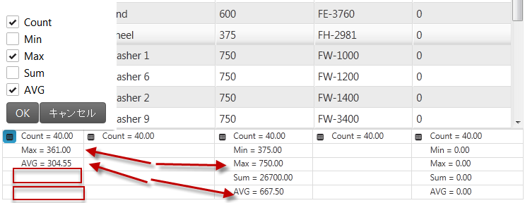
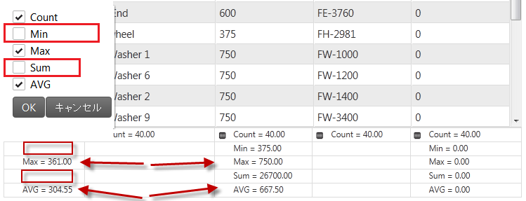
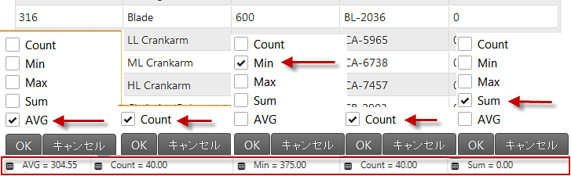
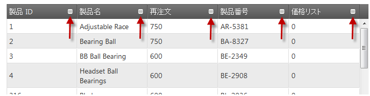
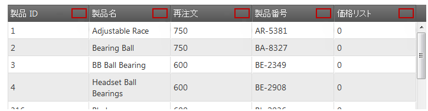
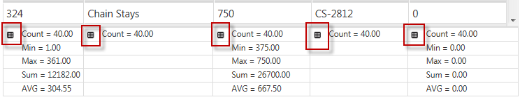
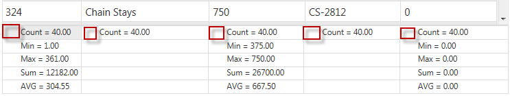

import ApiLink from 'docs-template/components/mdx/ApiLink.astro';

# 列集計の構成 (igGrid)

## トピックの概要

### 目的
 このトピックでは、`igGrid`™ で列集計を構成する方法を紹介します。

### このトピックの内容
このトピックは、以下のセクションで構成されます。

-   [**集計構成の概要**](#overview)
-   [**集計タイプを構成する**](#type)
    -   [プレビュー](#type-preview)
    -   [プロパティ設定](#type-property-settings)
    -   [コード](#type-code)
-   [**計算モード (自動/手動) を構成する**](#calculation-mode)
    -   [プレビュー](#calculation-preview)
    -   [プロパティ設定](#calculation-property-settings)
    -   [コード](#calculation-code)
-   [**集計の最適化を有効にする**](#compacting)
    -   [プレビュー](#compacting-preview)
    -   [プロパティ設定](#compacting-property-settings)
    -   [コード](#compacting-code)
-   [**集計ボタンを構成する**](#button)
    -   [プレビュー](#button-preview)
    -   [プロパティ設定](#button-property-settings)
    -   [コード](#button-code)
-   [**集計メニュー ボタンを構成する**](#menu-button)
    -   [プレビュー](#menu-button-preview)
    -   [プロパティ設定](#menu-button-property-settings)
    -   [コード](#menu-button-code)
-   [**集計計算をキャンセルする**](#cancel-calculation)
    -   [手順](#cancel-calculation-steps)
-   [**カスタム集計**](#custom-summaries)
    - [サンプル](#demo)
-   [**関連トピック**](#topics)

## 前提条件
以下のリストは、このトピックの情報を完全に理解するために前提条件を示しています。

- **トピック**
	- まず「列集計を有効にする」トピックを読む必要があります。
- **外部リソース** - まず以下のセクションを読む必要があります。
	- [jQuery bind() API](http://api.jquery.com/bind/)
	- [jQuery live() API](http://api.jquery.com/live/)


## <a id="overview"></a> 集計構成の概要
以下の表は、`igGrid` コントロールの `columnSummaries` 機能の構成可能な [画面要素] とビヘイビアを示しています。

 
構成可能なビヘイビアー/機能|構成の詳細|構成プロパティ
------------------------------|-----------------------|-------------------------
集計タイプ|集計計算のタイプは、プロパティで設定されます。|<ApiLink type="iggridsummaries" member="type" section="options" label="type" />
自動/手動計算|計算は、値を入力した直後に自動的に、またはユーザーがボタンをクリックした後に実行できます。この機能は、2 種類のレンダリング モードで提供されます。|<ApiLink type="iggridsummaries" member="calculateRenderMode" section="options" label="calculateRenderMode" />
集計の最適化|集計は特殊なレンダリング モードにより最適化して描画できます。|<ApiLink type="iggridsummaries" member="compactRenderingMode" section="options" label="compactRenderingMode" />
集計ボタン|専用プロパティから構成可能な、ヘッダー セルの集計ボタン。|<ApiLink type="iggridsummaries" member="showSummariesButton" section="options" label="showSummariesButton" />
集計メニュー ボタン|集計メニュー ボタン - 専用プロパティから構成可能な、フッター セルの集計メニュー ボタン。|<ApiLink type="iggridsummaries" member="showDropDownButton" section="options" label="showDropDownButton" />
集計計算をキャンセルする|`summaryCalculation` イベントを処理し、ある条件下でキャンセルします。|-
構成可能イベント|これらのプロパティの詳細情報は、プロパティ参照セクションのリストを参照してください。[列集計のイベント (igGrid)](/iggrid-column-summaries-events) | 


> **注:** 定義済み集計関数は列の `dataType` に基づいて有効されます。たとえば、列の `dataType` が "number" または "numeric" の場合、デフォルトの集計関数は "Count"、"Min"、"Max"、"Sum"、"Avg" (平均) です。dataType が "date" または "time" の場合、デフォルトの集計関数は "Count"、"Min"、および "Max" です。それ以外の場合 (dataType が "string"、"bool"、または "object")、デフォルトの集計関数は "Count" のみです。


## <a id="type"></a> 集計タイプを構成する 

集計タイプには、ローカルおよびリモートの 2 種類があります。このオプションは、集計の計算をクライアントで行うか、サーバーで行うかを指定します。オプションが *local*  に設定されていて、ユーザーが集計関数を選択する場合、計算はブラウザーですぐに行われますが、remote に設定されて、ユーザーが集計関数を追加する場合 (右側の画像)、ユーザーが選択を完了した後に計算値がサーバーに送信されます。

## <a id="type-preview"></a> プレビュー 

以下の図では、タイプは *local* (左側の画像)、また *remote* (右側の画像) に設定されています

<p style="display:inline-block">


</p>

## <a id="type-property-settings"></a> プロパティ設定 
以下の表は、プロパティ設定の推奨構成をマップしています。プロパティは *igGridSummaries* オプションからアクセスされます。


 プロパティ|設定                              
-------------|-----------
 type|*local*                              

### <a id="type-code"></a> コード 

**HTML の場合:**

```html
<script type="text/javascript">
$(function () {
    $("#grid1").igGrid({
       autoGenerateColumns: true,
       dataSource: adventureWorks,
       responseDataKey: 'Records',
                features: [
                {
                    name: 'Summaries',
                    type: 'local'             
                }
            ]
       });
});
</script>
```

**MVC の場合:**

```csharp
<%= Html.Infragistics().Grid(Model)
        .AutoGenerateColumns(true)
        .Features(feature =>{ 
      feature.Summaries().Type(OpType.Local);
     }).DataBind().Render()

%>
```

関連リンク:

[集計 (リモート計算)](&#123;environment:SamplesUrl&#125;/grid/summaries-remote)

## <a id="calculation-mode"></a> 計算モード (自動/手動) を構成する

どのように計算を行うか 2 種類のレンダリング モードが定義されています。これらのモードは `calculateRenderMode` プロパティで管理されています。このオプションは、すぐに計算を行うか、[OK] ボタンをクリックした後に行うかを指定します。オプションを *onselect* に設定すると、[OK]/[キャンセル] ボタンは表示されません (右側の画像)。集計をオンまたはオフにすると、計算は即座に更新され、ドロップダウン メニューの外でクリックすると、自分で計算方法を選択できます。集計をオンまたはオフにする場合にオプションを *okcancelbuttons* に設定すると (左側の画像)、計算されず、選択または選択解除されるだけです。ドロップダウンの外でクリックすると、[キャンセル] ボタンをクリックした場合と同じ操作になります。

### <a id="calculation-preview"></a> プレビュー 

以下の図では、オプション calculateRenderMode は okcancelbuttons (左側の画像) および「onselect」(右側の画像) に設定されています。
 

<p style="display:inline-block">


</p>

### <a id="calculation-property-settings"></a> 計算モードを構成するプロパティ設定 

以下の表は、プロパティ設定の推奨構成をマップしています。プロパティは `igGridSummaries` オプションからアクセスされます。

 プロパティ|設定                              
-------------|-----------
calculateRenderMode|*onselect*    

 

### <a id="calculation-code"></a> コード 

**HTML の場合:**

```html
<script type="text/javascript">
$(function () {
    $("#grid1").igGrid({
       autoGenerateColumns: true,
       dataSource: adventureWorks,
       responseDataKey: 'Records',
                features: [
                {
                    name: 'Summaries',
                    calculateRenderMode: 'onselect'
                }
            ]
    });
});
</script>
```

 

**MVC の場合:**

```csharp
<%= Html.Infragistics().Grid(Model)
        .AutoGenerateColumns(true)
        .Features(feature => { feature.Summaries().CalculateRenderMode(SummaryCalculateRenderMode.OnSelect); }).DataBind().Render()
%>
```

 

igGridSummaries オプションを使用してレンダリング モードを設定する: 

**HTML の場合:**

```html
<script type="text/javascript">
    $(function () {
      $("#grid1").igGridSummaries('option', 'calculateRenderMode', 'onselect');
    });
</script>
```

 

## <a id="compacting"></a> 集計の最適化を有効にする

この機能は、描画される集計を最適化する方法を指定します。この機能は `compactRenderingMode` オプションで制御されており、true (上の画像)、false (中央の画像)、auto (下の画像) という 3 つの値を取ることができます。*true* が設定されている場合、集計表示の最小化が有効になり、複数の集計を 1 行に表示します。

*false* オプションを指定すると、集計はタイプごとに行を変えて表示されます。オプションが *auto* に設定されている場合、表示できる集計の最大数が 1 の場合は *true*、それ以外の場合は *false* を使用します。

 

### <a id="compacting-preview"></a> プレビュー 

以下の図では、`compactRenderingMode` は *true* (上の画像)、*false* (中央の画像)、*auto* (下の画像) に設定されています。


 

 



           

### <a id="compacting-property-settings"></a> 集計の最適化を有効にするプロパティ設定 

以下の表は、プロパティ設定の推奨構成をマップしています。
プロパティは `igGridSummaries` オプションからアクセスされます。


 プロパティ|設定                              
-------------|-----------
 compactRenderingMode|*true*  


### <a id="compacting-code"></a> コード 
**HTML の場合:**

```html
<script type="text/javascript">
$(function () {
    $("#grid1").igGrid({
       autoGenerateColumns: true,
       dataSource: adventureWorks,
```
           responseDataKey: 'Records',
                    features: [
                    &#123;
                        name: 'Summaries',
                        compactRenderingMode: true
                    &#125;
                ]
        &#125;);
    &#125;);
    &lt;/script&gt;

 

**ASPX の場合:**

    &lt;%= Html.Infragistics().Grid(Model)
            .AutoGenerateColumns(true)
            .Features(feature =>&#123; feature.Summaries().CompactRenderingMode(SummaryCompactRenderingMode.True); &#125;).DataBind().Render()
    %>

 

`igGridSummaries` オプションを使用してコンパクト モードを設定します。

**HTML の場合:**

```html
<script type="text/javascript">
    $(function () {
      $("#grid1").igGridSummaries('option', 'compactRenderingMode', true);
    });
</script>
```

## <a id="button"></a> 集計ボタンを構成する

`showSummariesButton` プロパティにより、列のヘッダーで集計ボタンを表示または非表示にすることができます。*true *に設定されている場合 (上の画像)、ユーザーはボタンをクリックして、グリッドの集計を非表示または表示できます。`showSummariesButton` オプションが false に設定されている場合 (下の画像)、ボタンは表示されません。

### <a id="button-preview"></a> プレビュー 
以下の図では、`showSummariesButton` オプションは *true* (上の画像) および *false* (下の画像) に設定されています。






### <a id="button-property-settings"></a> 集計ボタンを有効にするプロパティ設定 

以下の表は、プロパティ設定の推奨構成をマップしています。
プロパティは `igGridSummaries` オプションからアクセスされます。

プロパティ|設定                              
-------------|-----------
 showSummariesButton|*true*  


### <a id="button-code"></a> コード 

**HTML の場合:**

    &lt;script type="text/javascript">
    $(function () &#123;
        $("#grid1").igGrid(&#123;
           autoGenerateColumns: true,
           dataSource: adventureWorks,
           responseDataKey: 'Records',
                    features: [
                    &#123;
                        name: 'Summaries',
                        showSummariesButton: true
                    &#125;
                ]
        &#125;);
    &#125;);
    &lt;/script&gt;

 

**ASPX の場合:**

```csharp
<%= Html.Infragistics().Grid(Model)
        .AutoGenerateColumns(true)
        .Features(feature =>{      
           feature.Summaries().ShowSummariesButton(true);
            }).DataBind().Render()
%>
```

`igGridSummaries` オプションを使用して集計ボタンを設定する:

**HTML の場合:**

```html
<script type="text/javascript">
    $(function () {
      $("#grid1").igGridSummaries('option', 'showSummariesButton', true);
    });
</script>
```

## <a id="menu-button"></a> 集計メニュー ボタンを構成する

`showDropDownButton` プロパティにより、使用可能なボタン集計でメニューを開くボタンを表示または非表示にすることができます。このオプションを *true* に設定している場合 (上の画像)、集計メニュー ボタンが使用できます。

`showDropDownButton` プロパティが *false* に設定されている場合 (下の画像)、集計メニュー ボタンはグリッドに表示されません。これは特定の集計を表示し、初期化後にユーザーがその集計を変更できないようにする場合に便利です。

### <a id="menu-button-preview"></a> プレビュー 

以下の図では、`showDropDownButton` は *true* (上の画像) および *false* (下の画像) に設定されています。





### <a id="menu-button-property-settings"></a> 集計メニュー ボタンを有効にするプロパティ設定 

以下の表は、プロパティ設定の推奨構成をマップしています。プロパティは `igGridSummaries` オプションからアクセスされます。


プロパティ|設定                              
-------------|-----------
 showDropDownButton|*true*  

 
### <a id="menu-button-code"></a> コード 

**HTML の場合:**

```html
<script type="text/javascript">
$(function () {
    $("#grid1").igGrid({
       autoGenerateColumns: true,
       dataSource: adventureWorks,
       responseDataKey: 'Records',
                features: [
                {
                    name: 'Summaries',
                    showDropDownButton: true
                }
            ]
     });
});
</script>
```

**ASPX の場合:**

```csharp
<%= Html.Infragistics().Grid(Model)
        .AutoGenerateColumns(true)
        .Features(feature =>{      
           feature.Summaries().ShowDropDownButton(true);
            }).DataBind().Render()
%>
```

`igGridSummaries` オプションを使用してドロップダウン ボタンを設定します。

**HTML の場合:**

```html
<script type="text/javascript">
    $(function () {
      $("#grid1").igGridSummaries('option', 'showDropDownButton', true);
    });
</script>
```

 

## <a id="cancel-calculation"></a> 集計計算をキャンセルする

`summariesCalculating` イベントを処理することで、集計計算をキャンセルできます。

以下はプロセスの概念的概要です。

1.  **summariesCalculating イベントを処理する**
2.  **イベントのキャンセル**

### <a id="cancel-calculation-steps"></a> 手順 

1.  **`summariesCalculating` イベントを処理する**

    1.  **ハンドラー関数を定義します。**

        `summariesCalculating` イベントが発生した場合に呼び出される関数を定義します。

	    **HTML と ASPX の場合:**

```html
	    <script type="text/javascript"> 
	        function gridSummariesCalculating (evt, ui) { ... };   
	    </script>
```
     
	2.  **ハンドラーを igGrid の *summariesCalculating* イベントに設定します。**
	
	3.	いったんハンドラーを定義したら、`summariesCalculating` イベントのハンドラーとして設定する必要があります。jQuery では、これはウィジェットがインスタンス化されるときに行うことができます。
		
		ASP.NET MVC では、jQuery live または bind API を使用してイベントを添付する必要があります。また live または bind API の使用は、純粋な jQuery 実装のイベントを添付するためのオプションです。このイベントの型は `iggridsummariessummariescalculating` です。
  
		**HTML の場合:**
```html
	    $(function () {
	        $("#grid1").igGrid({
	           autoGenerateColumns: true,
	           dataSource: adventureWorks,
	           responseDataKey: 'Records',
	                    features: [
	                    {
	                        name: 'Summaries',
	                        showDropDownButton: true,
	                        summariesCalculating: gridSummariesCalculating
	                    }
	                ]
	          });
	    });
```
	
		**HTML と ASPX の場合:**
```js
	    $("#grid1").live("iggridsummariessummariescalculating ", gridSummariesCalculating);
```

2.  **false を返すことでイベントをキャンセルする**

	**HTML と ASPX の場合:**
	
```html
	<script type="text/javascript">       
	    function gridSummariesCalculating (evt, ui) {
	       if (conditionNotMet) 
	          return false;
	     };   
	</script>
```

## <a id="custom-summaries"></a> カスタム集計
カスタム summaryOperands オブジェクト (*custom* タイプの `summaryOperands`) を定義すると、集計機能をカスタム機能へポイントして行集計を計算します。`compactRenderingMode` が false に設定されている場合、両方の結果が定義され、カスタム メソッドは並べ替え順序に従って集計行に配置されます。以下のサンプルは 2 つのカスタム集計関数 (*countTrueValues*、*countFalseValues*) を含みます。ブール値列の *true* または *false* 値の数を計算します。その集計関数は「メーカー フラグ」列で使用されます。

### <a id="demo"></a> サンプル
<div class="embed-sample">
    [igGrid カスタム集計](&#123;environment:SamplesEmbedUrl&#125;/grid/summaries-custom)
</div>
	
### <a id="topics"></a> 関連トピック

以下は、その他の役立つトピックです。

-   [列集計の有効化 (igGrid)](./00_igGrid_Enabling _Column_Summaries.mdx)
-   [列集計イベント (igGrid)](/iggrid-column-summaries-events) 

 

 


