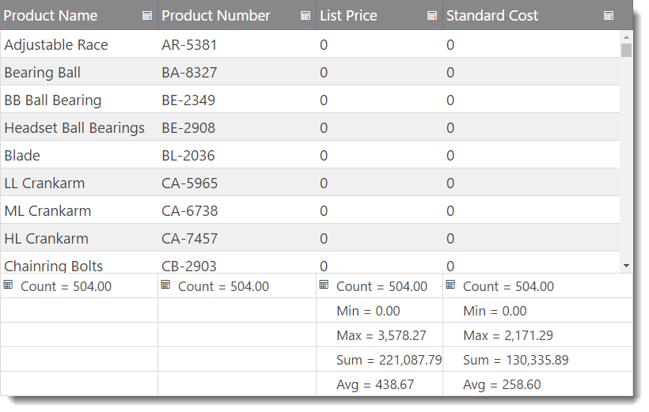

# 列集計の有効化 (igGrid)

## トピックの概要

### 目的
これは、`igGrid`™ コントロールの列集計ウィジェットをプログラム的に有効にする方法を示しています。

### このトピックの構成
このトピックは、以下のセクションで構成されます。

-   [**概要**](#introduction)
-   [**プレビュー**](#preview)
-   [**要件**](#requirements)
    -   [全般的な要件](#general-requirements)
    -   [スクリプト要件](#scrip-requirements)
    -   [データベース要件](#database-requirements)
-   [**JQuery で列集計を有効にする**](#enabling-js)
-   [**MVC で列集計を有効にする**](#enabling-mvc)
-	[**キーボード操作**](#keyboard-interaction)
-   [**関連コンテンツ**](#related-content)
    -   [トピック](#topics)
    -   [サンプル](#samples)

## <a id="introduction"></a> 概要
列集計ウィジェットにより、`igGrid` はグリッドの列にあるデータの集計行を表示できます。事前に設定された集計関数がありますが、カスタム関数を作成してカスタム集計を計算できます。

`igGrid` コントロールの列集計機能はデフォルトで無効のため、明示的に有効にする必要があります。

以下の例では、集計機能を有効にした `igGrid` が構成されています。

## <a id="preview"></a> プレビュー
以下は最終結果のプレビューです。



## <a id="requirements"></a> 要件

### <a id="general-requirements"></a> 全般的な要件 
-   jQuery の要件

    -   グリッドがデータ ソースに接続されている HTML 形式の Web ページであること
    -   グリッドのコンテナとして機能するテーブル タグが HTML ページの本文に含まれていること

    **HTML の場合:**

```html
    <table id="grid">
    </table>
```

-   MVC 固有の要件
    -   グリッドがデータ ソースに接続されている MS Visual Studio® の MVC 4 または MVC 3 プロジェクトであること
    -   \{environment:ProductNameMVC\} dll への参照があること - Infragistics.Web.Mvc.dll

### <a id="scrip-requirements"></a> スクリプト要件 

-   jQuery と MVC が jQuery ウィジェットを再描画するため、両方のサンプルに必要なスクリプトは同じです。次が必要になります。次が必要になります。

    1.  jQuery ライブラリ スクリプト
    2.  jQuery User Interface (UI) ライブラリ スクリプト
    3.  \{environment:ProductNameMVC\} ライブラリ スクリプト

次のコード サンプルは、HTML ファイルのヘッダー セクションに追加されるスクリプトです。

**HTML の場合:**

```html
<script type="text/javascript" src="jquery.min.js"></script>
<script type="text/javascript" src="jquery-ui.min.js"></script>
<script type="text/javascript" src="infragistics.core.js"></script>
<script type="text/javascript" src="infragistics.lob.js"></script>
```

### <a id="database-requirements"></a> データベース要件 
このサンプルでは以下が使用されています。

-   MVC - Adventure Works データベース

## <a id="enabling-js"></a> JQuery で列集計を有効にする

1.  データ ソースを設定します。

    以下のコード スニペットで使用されているデータ ソースは、あくまでこの例のために使用されているだけです。

    **HTML の場合:**

```html
    <script type="text/javascript">
    var adventureWorks = [
{ "ProductID": 1, "Name": "Adjustable Race", "ProductNumber": "AR-5381", "StandardCost": 0.0000, "ListPrice": 0.0000 }, 
{ "ProductID": 2, "Name": "Bearing Ball", "ProductNumber": "BA-8327", "StandardCost": 0.0000, "ListPrice": 0.0000 }, 
{ "ProductID": 3, "Name": "BB Ball Bearing", "ProductNumber": "BE-2349", "StandardCost": 0.0000, "ListPrice": 0.0000 },
    ...
    ]

    </script>
```

2.  igGrid を作成し、集計機能を有効にします。

    `$(document).ready()` イベント ハンドラーの中で、igGrid を作成し、グリッドの集計機能を構成します。

    **JavaScript の場合:**

```js
    $("#grid").igGrid({
        autoGenerateColumns: false,
		dataSource: adventureWorks,
        columns: [
                    { headerText: "Product Name", key: "Name", dataType: "string", width: "40%" },
                    { headerText: "Product Number", key: "ProductNumber", dataType: "string", width: "20%" },
                    { headerText: "List Price", key: "ListPrice", dataType: "number", width: "20%" },
                    { headerText: "Standard Cost", key: "StandardCost", dataType: "number", width: "20%" }
        ],
        features: [
                   {
                     name: 'Summaries'
                   }
              ]
    });
```

3.  ファイルを保存します。
4.  (オプション) 結果を確認します。

    結果を検証するために、ファイルを開きます。上記のプレビューに示すような結果になっているはずです。
	
5. サンプル
    <div class="embed-sample">
        [igGrid 集計](\{environment:SamplesEmbedUrl\}/grid/summaries)
    </div>

## <a id="enabling-mvc"></a> MVC で列集計を有効にする

1.  MVC Controller メソッドを作成します。

    MVC Controller メソッドを作成し、Model からデータを取得して View を呼び出します。

    **MVC の場合:**

```csharp
    public ActionResult Default()
    {
        var ds = this.DataRepository.GetDataContext().Products.Take(4);
        return View(ds);
    }
```

2.  igGrid をインスタンス化します。

    columnSummaries 機能を有効にした igGrid をインスタンス化します。

    **ASPX の場合:**

```csharp
    <%= Html.Infragistics().Grid(Model)
            .AutoGenerateColumns(true)
            .Features(feature =>{
                feature.Summaries();
                }).DataBind()
            .Render()
    %>
```

    **Razor の場合:**

```csharp
    @( Html.Infragistics().Grid(Model)
            .AutoGenerateColumns(true)
            .Features(feature =>{
                feature.Summaries();
                }).DataBind()
            .Render()
        )
```

3.  ファイルを保存します。
4.  (オプション) 結果を確認します。

    結果を検証するために、MVC プロジェクトを実行して、ファイルを開きます。上記のプレビューに示すような結果になっているはずです。

## <a id="keyboard-interaction"></a> キーボード操作

以下のキーボード操作が可能です。
グリッドにフォーカスがある場合:

-	TAB: 集計 UI のフォーカス可能な要素間でフォーカスを移動: [列集計] ボタンおよびドロップダウン。

列ヘッダーの [集計の表示/非表示] ボタンにフォーカスがある場合:

-	ENTER: グリッド下に集計を表示/非表示。

列フッターの [集計の表示/非表示] ボタンにフォーカスがある場合:

-	ENTER/SPACE: 集計ドロップダウンを開く。

集計ドロップダウンにフォーカスがある場合:

-	TAB: 利用可能な集計項目間でフォーカスを移動。
-	ENTER/SPACE: リストにある現在アクティブな集計項目を選択/選択解除。フォーカスが [OK] または [キャンセル] ボタンにある場合、ドロップダウンを閉じる、または変更がボタンに基づいて適用または無視されます。
-	ESCAPE: ドロップダウンの変更を無視して閉じます。


## <a id="related-content"></a> 関連コンテンツ

### <a id="topics"></a> トピック

以下は、その他の役立つトピックです。

- [列集計の構成 (igGrid)](/iggrid-configuring-column-summaries)

- [\{environment:ProductName\} で JavaScript リソースを使用](/deployment-guide-javascript-resources)

- [\{environment:ProductName\} のスタイル設定とテーマ設定](/deployment-guide-styling-and-theming)

### <a id="samples"></a> サンプル

-   [列の集計](\{environment:SamplesUrl\}/grid/summaries)
-   [集計 (リモート計算)](\{environment:SamplesUrl\}/grid/summaries-remote)
-   [カスタム集計](\{environment:SamplesUrl\}/grid/summaries-custom)

 

 


