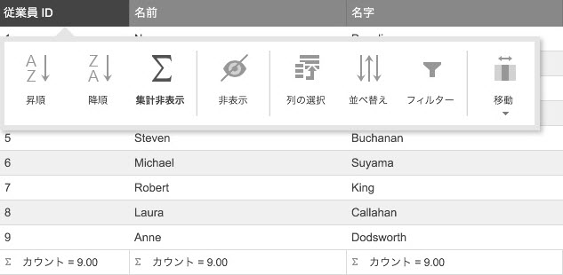

# 機能セレクター (igGrid)

import ApiLink from 'docs-template/components/mdx/ApiLink.astro';

# 機能セレクター (igGrid)

## 概要
機能セレクターは、タッチ環境またはデスクトップ環境でグリッド機能とのインタラクションを提供します。機能セレクターの目的は、グリッドで 2 つ以上の機能が有効な場合、タッチに対応するグリッド機能へのアクセスを提供します。グリッドのコンテキストに基づいて、ギア アイコンまたは列ヘッダーをクリック/タップすると、機能セレクターをアクセスします。

以下のサンプルは機能セレクターを紹介します。

    [機能セレクター](\{environment:SamplesEmbedUrl\}/grid/feature-chooser)

## タッチ環境とタッチ サポートのない環境
igGrid は、グリッドがタッチ対応の環境で実行されているかどうかを決定するために Modernizr ([`Modernizr.touch`](http://modernizr.com/docs/#touch)) を使用します。タッチ環境は、モバイル デバイスおよびタッチ スクリーンを持つデスクトップ ブラウザーです。タッチをサポートしない環境は、タッチ スクリーンがないデスクトップ ブラウザーおよび古い web ブラウザーです。

グリッドが実行されている環境は、列ヘッダーが描画された方法に影響します。たとえば、タッチ対応環境で複数の機能 (並べ替えおよびフィルターなど) が有効なグリッドを実行している場合、列ヘッダーをタップすると、機能セレクターを表示し、グリッドのデータを並べ替え、またはフィルター機能を提供します。以下の画像は、ギア アイコンのないタッチ対応環境で機能セレクターを表示します。
 
または、グリッドがタッチ サポートのない環境で描画される場合、機能セレクターは列ヘッダーで描画されるギア アイコンにより利用可能です。

> **注**: グリッドをデスクトップまたはノート PC で表示している際に、ギア アイコンが列ヘッダーに表示されていない場合、タッチ スクリーンが周辺機器にある可能性があります。

## ギア アイコン
ギア アイコンの目的は、機能セレクターの表示状態の切り替えです。列ヘッダー全体がギア アイコンの代わりに機能セレクターの表示状態を切り替える可能性があります。

ギア アイコンの表示状態のデフォルト設定は、グリッドが実行されている環境に基づいて変更します。グリッドがタッチをサポートしない環境で描画される場合、アイコンは列ヘッダーで表示されます。グリッドがタッチ対応の環境で描画される場合、ギア アイコンは列ヘッダーに描画されません。代わりに、列ヘッダー全体で機能セレクターを切り替えます。

ギア アイコンの表示動作はグリッドの <ApiLink type="iggrid" member="featureChooserIconDisplay" section="options" label="featureChooserIconDisplay" /> オプションにより制御されます。このオプションのデフォルト値は `desktopOnly` です。操作は上記に説明があります。ギア アイコンをすべての環境で表示するには、`featureChooserIconDisplay` を always に設定します。

> **注**: `featureChooserIconDisplay` オプションを使用すると、アプリケーションがタッチ対応の環境で実行されているかどうかを決定する `Modernizr` が返す値と異なるロジックを実装できます。
## 機能アイコンの表示状態の制御

機能セレクターで機能を非表示にする場合があります。機能セレクターで表示されるアイコンは `renderInFeatureChooser` プロパティを設定してカスタマイズできます。

各グリッド機能は、オブジェクトのプロトタイプに `renderInFeatureChooser` プロパティを含みます。たとえば、機能セレクターで並べ替えボタンを非表示するには、コードで以下のオプションを設定します。

    $.ui.igGridSorting.prototype.renderInFeatureChooser = false;

> **注**: その他の機能のアイコンを非表示するには、機能のオブジェクト名を `igGridSorting` の代わりに使用します。
この機能の変更はオブジェクトのプロトタイプに適用されます。つまり、ページのすべてのグリッドは `renderInFeatureChooser` プロパティの変更を使用します。

## キーボード操作

以下のキーボード操作を機能セレクターで使用できます。

### フォーカスの適用
キーボード コマンド|説明
--- | ---
TAB |フォーカス可能な要素の間にフォーカスを移動します

### ギア アイコンがフォーカスを持つ場合
キーボード コマンド|説明
--- | ---
ENTER/SPACE |関連する列の機能セレクターを開く/閉じる。

### 機能セレクターが開いている場合
キーボード コマンド|説明
--- | ---
TAB|機能セレクターのボタン内のフォーカスを移動します。フォーカスは LEFT/RIGHT キーを使用して移動できます。

### フォーカスが機能セレクターのボタンにある場合:
キーボード コマンド|説明
--- | ---
LEFT/RIGHT |機能セレクターのボタン間を移動できます。

### 特定のボタンにフォーカスがある場合:
キーボード コマンド|説明
--- | ---
ENTER/SPACE|関連する操作を適用します (開く/閉じる 追加ドロップダウン、特定の機能に関連するダイアログ ウィンドウを開く)

### 列の移動をナビゲートする
`ColumnMoving` ボタンは ENTER/SPACE または DOWN キーでドロップダウンを表示できます。 
ドロップダウンが開いているときは、UP/DOWN キーで項目間を移動できます。項目にフォーカスがある場合、ENTER/SPACE ボタンで選択できます。

## 関連コンテンツ
### トピック
このトピックの追加情報については、以下のトピックも合わせてご参照ください。

- [列チューザーの構成 (igGrid)](/iggrid-hiding-column-chooser)
- [igGrid 複数並べ替えモーダル](/iggrid-multiple-sorting-dialog)
- [igGrid フィルタリング](/iggrid-filtering)
- [\{environment:ProductName\} コントロールのタッチ サポート](/touch-support-for-igniteui-for-jquery-controls)
