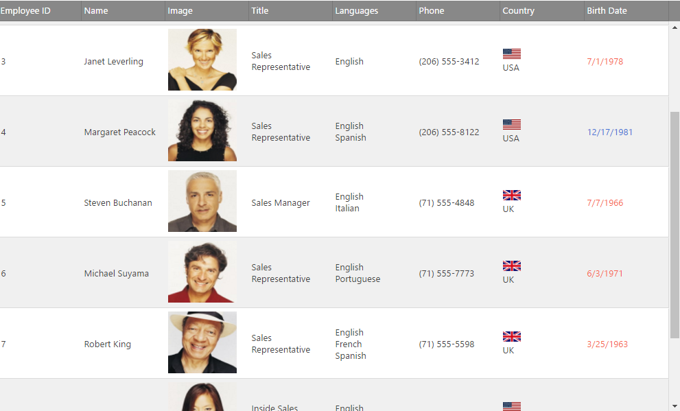
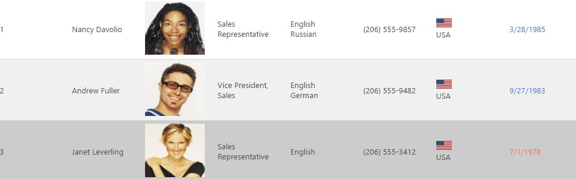

---
title: "jsRender の統合 (igGrid)"
slug: iggrid-jsrender-integration
---

# jsRender の統合 (igGrid)

## トピックの概要

### 目的

このトピックは、jsRender の統合、その構成の説明、および jsRender 構文を使用してカスタム列 `template` を作成するコード例について概要を説明します。

### 前提条件

以下の表は、このトピックを理解するための前提条件として必要な概念、トピック、および記事の一覧です。

- トピック
	- [Infragistics テンプレート エンジン](../../../06_Infragistics-Templating-Engine/~Infragistics Templating Engine.mdx): このセクションには、Infragistics® テンプレート エンジンの使用に関するトピックが含まれています。
- 外部リソース
	- [jsRender テンプレート エンジン](https://github.com/BorisMoore/jsrender)


### このトピックの内容

このトピックは、以下のセクションで構成されます。

-   [**jsRender の統合の概要**](#overview)
-   [**jsRender テンプレートの構成 ー 概要**](#configuring-overview)
-   [**コード例: JavaScript で jsRender 構文を使用したカスタム列テンプレートの作成**](#js-example)
	-   [前提条件](#js-prerequisites)
	-   [概要](#js-overview)
	-   [手順](#js-steps)
-   [**行編集テンプレートおよび [フィルター オプションの設定] ダイアログ**](#row-edit-filter)
-   [**関連コンテンツ**](#related-content)
    -   [トピック](#topics)
    -   [サンプル](#samples)


## <a id="overview"></a> jsRender の統合の概要

JsRender は、定型文構造を定義し、それを再利用して HTML を動的に生成する JavaScript ライブラリです。JsRender は、HTML5 の開発向けの新しいテンプレート ライブラリです。このライブラリは高性能で、コードを使用しないタグ構文を持ちます。また、jQuery にもドキュメント オブジェクト モデル (DOM) にも依存せず、カスタム関数の作成をサポートし、純粋な文字列ベースのレンダリングを使用します。

v13.2 以降の igGrid は、jsRender のテンプレート機能をサポートします。テンプレート機能は、オプションの [`templatingEngine`](&#123;environment:jQueryApiUrl&#125;/ui.iggrid#options:templatingEngine) によって管理されます。このオプションのデフォルト値は、「infragistics」です。このオプションで、`igGrid` は Infragistics テンプレート エンジンを使用して、コントロールでテンプレートをレンダリングします。jsRender をテンプレート エンジンとして使用するには、プロパティを jsRender に設定する必要があります。

以下のスクリーンショットは、jsRender でレンダリングしたグリッドです。 




## <a id="configuring-overview"></a> jsRender テンプレートの構成 ー 概要

デフォルトでは、igGrid コントロールは Infragistics テンプレート エンジンを使用します。したがって、jsRender を使用するには、[`templatingEngine`](&#123;environment:jQueryApiUrl&#125;/ui.iggrid#options:templatingEngine) オプションを使用して明示的に構成する必要があります。これは、JavaScript と ASP.NET MVC では異なります。


以下の表で、igGrid コントロールに対して jsRender テンプレートを構成する方法を簡単に説明しています。詳細は、表の後のコード例を参照してください。

jsRender をテンプレート エンジンとして使用するには、|以下を実行します。
---|---
JavaScript ファイル|`igGrid` の構成で、`templatingEngine` オプションの値を「jsRender」に設定します。
ASP.NET MVC|`Grid` の構成で、`TemplatingEngine` メソッドのパラメーター値を `GridTemplatingEngine.JsRender` に設定します。


## <a id="js-example"></a> コード例: JavaScript で jsRender 構文を使用したカスタム列テンプレートの作成

この手順では、jsRender syntax ヘルパー関数を使用して、`igGrid` でカスタム列 [`template`](&#123;environment:jQueryApiUrl&#125;/ui.iggrid#options:columns.template) を作成する方法を説明します。

### プレビュー

以下のスクリーンショットは、結果のプレビューです。この例では、1950 年以前の年月日のセルを持つ行に青のフォントを使用しています。それ以外の行には、赤のフォントを使用しています。国のセルのテンプレートには、画像があります。



### <a id="js-prerequisites"></a> 前提条件

この手順を実行するには、以下のリソースが必要です。

1.  バージョン 13.2 に必要な &#123;environment:ProductName&#125; の JavaScript ファイルと CSS ファイル
2.  ページで参照される jsRender ライブラリ

**JavaScript の場合:**

```js
<script type="text/javascript" src="http://cdn.jsdelivr.net/jsrender/1.0pre35/jsrender.js"></script>
```

### <a id="js-overview"></a> 概要

以下はプロセスの概念的概要です。

1.  jsRender テンプレート エンジンを使用するための `igGrid` の構成
2.  文字列列テンプレートの作成
3.  テンプレート固有のヘルパー関数の宣言
4.  列テンプレートの値の設定

### <a id="js-steps"></a> 手順

以下は、手動で作成された列と更新機能を使用して `igGrid` を DataTable にバインドするための一般的な手順です。

1. ** jsRender テンプレート エンジンを使用するための `igGrid` の構成**

	`templatingEngine` オプションの値を「jsRender」に設定します。
	
	列 `template` を使用するための他の関数については、列を配列として定義します。
	
	**JavaScript の場合:**
	
```js
	$("#grid12").igGrid({
                width: "100%",
                height: "600px",
                autoGenerateColumns: false,
                autoCommit:true,
                columns: [
                        { headerText: "Employee ID", key: "ID", dataType: "number" },
                        { headerText: "Name", key: "Name", dataType: "string" },
                        { headerText: "Image", key: "ImageUrl", dataType: "object" },
                        { headerText: "Title", key: "Title", dataType: "string" },
						{ headerText: "Languages", key: "Languages", dataType: "object" },
                        { headerText: "Phone", key: "Phone", dataType: "string" },
                        { headerText: "Country", key: "Country", dataType: "string" },
                        { headerText: "Birth Date", key: "BirthDate", dataType: "date" }
                    ],
                dataSource: northwindEmployees,
                primaryKey: "ID",
                templatingEngine: "jsrender"
        });
```

2. **テンプレート固有のヘルパー関数の宣言**

	文字列データを日付に変換するためのヘルパー関数を定義します。
	
	列テンプレートのデータ ソースに文字列として保存されている日付を比較する場合は、この関数を使用します。
	
	**JavaScript の場合:**
	
```js
	$.views.helpers(
            {
                toDate: function (val) {
                    return new Date(val);
                }
           });

            $.views.helpers(
            {
                toFullName: function (val) {
                    var name = val.split(',').reverse().join(" ");
                    return name;
                }
            });
```

3. **文字列列テンプレートの作成**
	
	2 つの列に jsRender テンプレートを定義します。  
	
	BirthDate行のテンプレートについては、文字列のコンテキストでヘルパー関数 toDate を直接使用します。Country 列のテンプレートは画像を使用しています。
	
	**JavaScript の場合:**
	
```js
	ImageUrl}}></img>
	
	Country}}.gif'></img>{{>Country}}
	
	<span style='color:{{if #view.hlp('toDate')(BirthDate) > #view.hlp('toDate')('1950-01-01T00:00:00.000')}} blue {{else}} red {{/if}};'>{{>BirthDate}}</span>
```

4. **列テンプレートの値の設定**

	カスタムの jsRender テンプレートを使用するための列テンプレート オプションを定義します。
	
	**JavaScript の場合:**
	
```js
	$("#grid12").igGrid({
                width: "100%",
                height: "600px",
                autoGenerateColumns: false,
                autoCommit:true,
                columns: [
                        { headerText: "Employee ID", key: "ID", dataType: "number" },
                        { headerText: "Name", key: "Name", dataType: "string", template: "{{>#view.hlp('toFullName')(Name)}}" },
                        {
                            headerText: "Image", key: "ImageUrl", dataType: "object",
                            template: "ImageUrl}}></img>"
                        },
                        { headerText: "Title", key: "Title", dataType: "string" },
                        {
                            headerText: "Languages", key: "Languages", dataType: "object",
                            template: "{{for Languages}}<div>{{:name}}</div>{{/for}}"
                        },
                        { headerText: "Phone", key: "Phone", dataType: "string" },
                        {
                            headerText: "Country", key: "Country", dataType: "string",
                            template: "Country}}.gif'></img> <span style='display: table-cell;vertical-align: middle;'>{{>Country}}</span>"
                        },
                        {
                            headerText: "Birth Date", key: "BirthDate", dataType: "date",
                            template: "<span style='color:{{if #view.hlp('toDate')(BirthDate) > #view.hlp('toDate')('1980-01-01T00:00:00.000')}}#4573D6{{else}}#F75F4F{{/if}};'>{{>BirthDate}}</span>"
                        }
                    ],
                dataSource: northwindEmployees,
                primaryKey: "ID",
                templatingEngine: "jsrender"
        });
```

5. **サンプル**
<div class="embed-sample">
   [igGrid JsRender の結合](&#123;environment:SamplesEmbedUrl&#125;/grid/jsrender-integration)
</div>

## <a id="row-edit-filter"></a> 行編集テンプレートと詳細フィルタリングとの統合

デフォルトでは、行編集テンプレートと詳細フィルタリング ダイアログでは Infragistics テンプレート エンジンを使用します。`templatingEngine` プロパティを「jsRender」 に設定する場合は、jsRender をテンプレート エンジンとして使用して、両方をレンダリングします。

> *Infragistics* テンプレート エンジンを使用するテンプレートは、jsRender テンプレート エンジンと両立しません。jsRender を使用するために、すべての列テンプレート、レスポンシブ構成テンプレート、およびユーザー独自の行編集テンプレートを jsRender 構文で書き込みます。


## <a id="related-content"></a> 関連コンテンツ

### <a id="topics"></a> トピック

このトピックの追加情報については、以下のトピックも合わせてご参照ください。

- [基本的な列テンプレートの作成](./00_Columns/06_Template/00_Creating a Basic Column Template in the igGrid.mdx): このトピックでは、`igGrid` の基本的な列テンプレートを作成する方法を紹介します。

- [列テンプレートの構成 (igGrid、RWD モード)](/iggrid-responsive-web-design-mode-configuring-row-and-column-templates): このトピックは、コード例を用いて `igGrid`™ コントロールの各 Responsive Web Design (RWD) モード 構成に対して列テンプレートを定義する方法、およびアクティブな RWD モード構成の切り替え時のテンプレートの自動変更を構成する方法について説明します。


 

 


