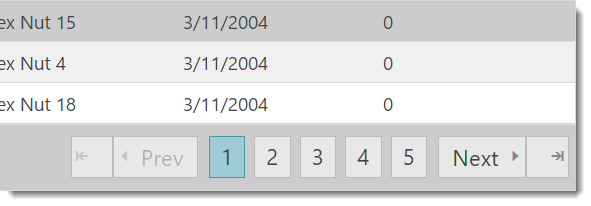
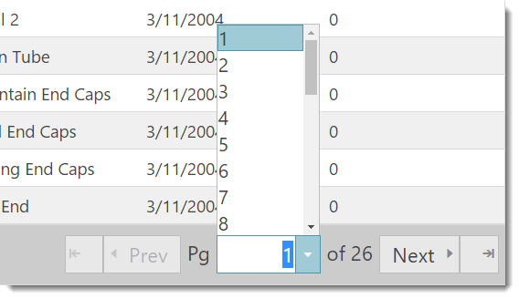
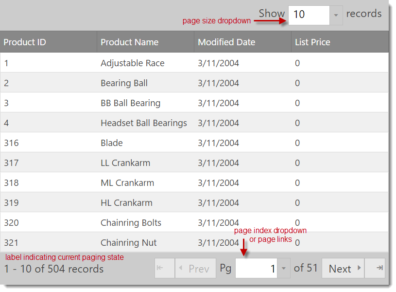

# ページング (igGrid)

## このトピックの内容

このトピックは、以下のセクションで構成されます。

-   [概要](#overview)
-   [データ書式](#data-formats)
-   [ページングを有効にする](#enabling-paging)
-   [サンプル](#sample)
-   [ASP.NET MVC コード](#mvc)
-   [リモート ページング](#remote)
-   [API の使用](#api)
-   [クライアント側イベント](#client-events)
-   [ページング UI 要素の位置](#ui-elements)
-   [既知の問題と制限](#limitations)
-   [ページング プロパティ](#properties)
-   [ページング CSS クラス](#css)
-   [キーボード操作](#keyboard-interaction)
-   [関連コンテンツ](#related-content)


## <a id="overview"></a> 概要

&#123;environment:ProductName&#125;™ グリッド、つまり `igGrid` のページング機能では、オリジナル データ ソースから事前に定義された数のレコードだけフェッチすることで、パフォーマンスが向上できるよう、ページ中のデータを分割できます。

**図 1: 一般的なグリッド ページング UI**



**図 2: ドロップダウン セレクターを使用したページング**



> **注:** グリッドのページング機能は jQuery UI ウィジェットとして実装されているため、一般的な jQuery UI ウィジェットの標準ライフサイクルに従います。

ページングの設定は、ローカルまたはリモートで実行できます。ローカルの場合、ページング操作はクライアントで行われます。つまり、データはすべてブラウザー上にあるものの、`pageSize` プロパティで指定された数のレコードだけがユーザーに描画されます。

「リモート」シナリオの場合、すべてのページ変更について、グリッドは `pageIndex` や `pageSize` など要求に必要なすべてのパラメーターを自動的に計算し、付加することで、グリッドで指定された `dataSource` への要求を開始します。

ページング機能では、ユーザーは UI を通して `pageSize` を変更できます。この UI はグリッド列ヘッダーの上にあるグリッド ヘッダーで、またはページャー領域の一部として利用できます。

> **注:** ページング UI のすべてのパーツは、キーボード上の TAB キーと Shift-TAB キーでナビゲートできます。


## <a id="data-formats"></a> データ書式

ページング機能は、あえて設定せずに oData サービスへのバインディングをサポートしています。oData へバインドする場合、必須パラメーターはサービス要求で自動的に決定され、設定されます。グリッドの `dataSource` オプションをサービス URL にポイントするだけです。

&#123;environment:ProductNameMVC&#125; Grid からページングを使用する場合、ページング URL パラメーターを LINQ 式に変換することで、ページング関連のすべてのデータのバインディング ロジックが自動的に行われます。

`pageCountLimit` プロパティの値によって、UI はページ リンクからページ インデックス ドロップダウンの描画へ自動的に切り替わります。

> **注:** グリッドのページング機能で使用されるドロップダウンとエディターは、`igEditor` コントロールのインスタンスです。


## <a id="enabling-paging"></a> ページングを有効にする

ページングを有効にするには、まず必要な JavaScript および CSS の依存関係を組み込む必要があります。必要な依存関係を組み込む最も簡単な方法は、リスト 1 に示すように､スクリプトとスタイルを組み合わせて縮小したものを使用することです。

- **リスト 1: グリッド ページングに必要なスクリプトと CSS ファイル**

	**HTML の場合:**
	
```html
	<link type="text/css" href="infragistics.theme.css" rel="stylesheet" />
	<link type="text/css" href="infragistics.css" rel="stylesheet" />
	<script type="text/javascript" src="jquery.min.js"></script>
	<script type="text/javascript" src="jquery-ui.min.js"></script>
	<script type="text/javascript" src="infragistics.core.js"></script><script type="text/javascript" src="infragistics.lob.js"></script>
```
	
	ページングに最小限必要な &#123;environment:ProductName&#125;™ スクリプトのみを組み込む場合は、リスト 2 に示すようにスクリプトを参照するだけで組み込むことができます。

- **リスト 2: グリッド ページングを有効にするのに必要な最小限のスクリプトとスタイル**

	**HTML の場合:**
	
```html
	<script type="text/javascript" src="infragistics.util.js"></script>
	<script type="text/javascript" src="infragistics.util.jquery.js"></script>
	<script type="text/javascript" src="infragistics.dataSource.js"></script>
	<script type="text/javascript" src="infragistics.ui.shared.js"></script>
	<script type="text/javascript" src="infragistics.ui.popover.js"></script>
	<script type="text/javascript" src="infragistics.ui.editors.js"></script>
	<script type="text/javascript" src="infragistics.ui.grid.framework.js"></script>
	<script type="text/javascript" src="infragistics.ui.grid.paging.js"></script>
```

- **リスト 3: ページングが有効になっている igGrid コントロールの初期化**

	**JavaScript の場合:**
	
```js
	$("#grid1").igGrid({
	    columns: [
	        { headerText: "Product ID", key: "ProductID", dataType: "number" },
	        { headerText: "Product Name", key: "Name", dataType: "string" },
	        { headerText: "ProductNumber", key: "ProductNumber", dataType: "string" }
	    ],
	    dataSource: adventureWorks,
	    responseDataKey: 'Records',
	    features: [
	        {
	            name : 'Paging',
	            type: "local",
	            pageSize : 7
	        }
	    ]
	});
```

- **リスト 4: グリッドのインスタンス化に使用する HTML コンテナー**

	**HTML の場合:**
	
```html
	<table id="grid1"></table>
```

- **リスト 5: JSON データの例**

	**応答:**
	
```js
	var adventureWorks = { "Records" : [ 
	      { "Name" : "Adjustable Race",
	        "ProductID" : 1,
	        "ProductNumber" : "AR-5381"
	      },
	      { "Name" : "Bearing Ball",
	        "ProductID" : 2,
	        "ProductNumber" : "BA-8327"
	      }
	      /*the full JSON output is omitted*/
	    ]
	}
```

## <a id="sample"></a> **サンプル** 

<div class="embed-sample">
   [igGrid ページング](&#123;environment:SamplesEmbedUrl&#125;/grid/paging)
</div>


## <a id="mvc"></a> ASP.NET MVC コード

**リスト 6** は、ASP.NET MVC ビューでページングが有効な &#123;environment:ProductNameMVC&#125; Grid を初期化する方法を紹介します。

- **リスト 6: ASP.NET MVC のページングが有効になっているグリッドの初期化**

	**ASPX の場合:**
	
```csharp
	<%= Html.Infragistics().Grid(Model).ID("grid1").Columns(column =>
	   {
	      column.For(x => x.ProductID).HeaderText("Product ID").Width("100px");
	      column.For(x => x.Name).HeaderText("Product Name").Width("200px");
	      column.For(x => x.ProductNumber).HeaderText("Product Number").Width("200px");
	   }).
	   Features(features => 
	   {
	      features.Paging().PageSize(20);
	   }).
	   Height("500").
	   DataSourceUrl(Url.Action("PagingGetData")).
	   DataBind().
	   Render() %>
```
	
	**C# の場合:**
	
```csharp
	public class HomeController : Controller
	{
	    public ActionResult Index()
	    {
	        return View();
	    }
	    [GridDataSourceAction]
	    public ActionResult PagingGetData()
	    {
	        return View(this.GetCustomers().AsQueryable());
	    }
	    private List<Product> GetProducts()
	    {
	        List<Product> products = new List<Product>()
	        {
	            new Product() { ProductID = 1, Name = "Adjustable Race", ProductNumber = "AR-5381" },
	            new Product() { ProductID = 1, Name = "Bearing Ball", ProductNumber = "BA-8327" }
	        };
	        return products;
	    }
	}
```


## <a id="remote"></a> リモート ページング

&#123;environment:ProductNameMVC&#125; を使用する場合、自動的にリモート ページングを処理します。`ActionResult` (**リスト 6**) を返す `GridDataSourceActionAttribute` 属性を含む操作メソッドを作成する必要があります。操作メソッドはデータを `IQueryable` のインスタンスとして渡します。`IActionFilter` インターフェイスを実装する `GridDataSourceActionAttribute` クラスは、要求パラメーターによってデータを変換して `JsonResult` として返します。

カスタム リモート サービスを実装している (ASP.NET または PHP などの) 場合、ページャーを正しく初期化して描画するには、サービスで `responseDataKey` (グリッド オプション) および `recordCountKey` (ページング オプション) の両方を指定する必要があります。`recordCountKey` メンバーは、バックエンドに存在する合計レコード数を Paging ウィジェットに通知します。`responseDataKey` は、結果データが含まれる応答のプロパティを指定します。

したがって、リモート ページングを使用する場合、グリッドは次のように正しい要求パラメーターを自動的に生成します。

```
http://<server>/grid/PagingGetData?page=2&pageSize=25
```

> **注:** ページング オプションの `pageSizeUrlKey` / `pageIndexUrlKey` をそれぞれ設定して、キー名を変更できます。


## <a id="api"></a> API の使用

次のように、ページ インデックスまたはページ サイズをプログラムで変更できます。

- **リスト 7: ページ サイズの取得**

	**JavaScript の場合:**
	
```js
	$(“#grid1”).igGridPaging("option", "pageSize");
```

- **リスト 8: 現在のページ インデックスを取得する**
	
	**JavaScript の場合:**
	
```js
	$(“#grid1”).igGridPaging("option", "currentPageIndex");
```

- **リスト 9: 3番目のページがロードされるよう現在のページ インデックスを変更する**

	**JavaScript の場合:**
	
```js
	$(“#grid1”).igGridPaging(“pageIndex”, 2);
```

`visiblePageCount` オプションを変更すると、グリッドで簡単に「クイック ページ」効果が得られます。つまり、グリッドは `visiblePageCount` で定義されたページ リンクの数だけしか描画しないことを意味します。したがって、`visiblePageCount` が 5 で、ページ 3 にいた場合、ページ リンク「1」と「2」は左側に描画され、ページ リンク「4」と「5」は右側に描画されます。

> **注:** 実際のページ カウントが `pageCountLimit` オプションの値を超えている場合、ページング ウィジェットは現在のページを選択するため、ドロップダウンを描画し続けます。

また、ページング オプションの `pageSizeList` (配列) オプションを設定して、ページ サイズ リストをカスタマイズすることもできます。配列の値はそれぞれ、ページ インデックス順に追加されたページのサイズを指定します。次に例を示します。

```
pageSizeList: [10, 44, 123, 5]
```

上記の配列では、ページ 1 は 10 行に等しく、ページ 2 は 44 などページのサイズを指定します。


## <a id="client-events"></a> クライアント側イベント

初期化中またはウィジェットがインスタンス化された後に、クライアント側イベントにバインドできます。まず、グリッドの既存のインスタンスにアプローチできます。

- **リスト 10: クライアントにおけるイベント ハンドラーのページ インデックスされた変更イベントへの関連付け**
	
	**JavaScript の場合:**
	
```js
	$("#grid1").bind("iggridpagingpageindexchanged", handler);
```

> **注:** ページングがまだインスタンス化されていない場合、「バインド」ではなく「ライブ」を使用します。

2 番目のアプローチでは、ページング機能を初期化する場合にオプションとしてイベント名を指定して、初期化中にイベント ハンドラーを定義できます。

> **注:** このバインド構文では、バインドまたはライブ jQuery 関数の付加と違い、大文字と小文字を区別します。

- **リスト 11: 初期化中のイベント ハンドラーのページ インデックス変更への関連付け**

	**JavaScript の場合:**
	
```js
	{
	    Name: “Paging”,
	    pageIndexChanging: handler,
	    < other paging options>
	}
```

「ハンドラー」関数はリスト 12 のコードに似ています。

- **リスト 12: ページング機能で呼び出された空のイベント ハンドラー**

	**JavaScript の場合:**
	
```js
	function handler(event, args) {
	
	}
```

> **注:** `args` はイベントごとにそれぞれ、以下に詳細に説明します。

### クライアント側イベント
表 1: クライアント側イベントのリスト

イベント名|説明|イベント引数の定義
---|---|---
pageIndexChanging|ページ インデックスが変更され、データがデータ バインドされる前に発生し、キャンセルできます。イベントをキャンセルするには、ハンドラーで false を返します。|`newPageIndex`: 新しいページのインデックス。<br/>`currentPageIndex`: 現在ページのインデックス。<br/>`owner`: igGridPaging オブジェクトへの参照。
pageIndexChanged|ページ インデックスが変更された後に発生します。|`pageIndex`: 新しいページ インデックスのインデックス。<br/>`owner`: igGridPaging オブジェクトへの参照。
pageSizeChanging|ページ サイズが UI の DropDown から変更された場合に発生します。ページ サイズが API を使用して手動で変更された場合は発生しません。|`currentPageSize`: 現在のページ サイズ<br/>`newPageSize`: 新しいページ サイズ<br/>`owner`: igGridPaging オブジェクトへの参照。
pageSizeChanged|ページ サイズが変更された後に発生します。|`pageSize`: 新しいページ サイズ<br/>`owner`: igGridPaging オブジェクトへの参照。
pagerRendering|ページがその要素の描画を開始する前に発生します。カスタム ページング シナリオが多い場合、キャンセルし、オーバーライドできます。|`dataSource`: データ ソース オブジェクトへの参照。<br/>`owner`: igGridPaging オブジェクトへの参照。
pagerRendered|ページャーがその要素の描画をした後に発生します。|`pagerRendering` イベントと同じです。


## <a id="ui-elements"></a> ページング UI 要素の位置

**図 1: ページング UI 要素の位置**




## <a id="limitations"></a> 既知の問題と制限
-   選択されたセルと行は、ページ間で保持されません。


## <a id="properties"></a> ページング プロパティ
表** 2** に、ページング機能に使用できる初期化オプションのリストおよび説明を詳しく記載しています。

> **注:** 括弧内の値は、デフォルト オプション値を表します。

**表 2: 使用可能なグリッド ページング初期化オプション**

ページング オプション|説明
---|---
currentPageIndex (0)|現在のページ インデックス。pageIndex(index) を呼び出して、API により手動で設定または起動できます。
pageSize (25)|1 ページに表示するレコード数。デフォルトは 25 です。
recordCountKey (null)|レコードの総数をポイントする応答のプロパティ。したがって応答が JSON オブジェクトの場合、これはバックエンドにレコード総数を保持しているオブジェクト プロパティです。
pageSizeUrlKey (null)|ページ サイズがエンコードされている URL パラメーター名。(例: ?psize=20)
pageIndexUrlKey (null)|上記と同じですが、インデックスの場合に指定されます。値が空 (null) の場合、oData 構文が使用されます。値は、グリッドに設定後 igDataSource コントロールにデリゲートされます。
type (“remote”)|ページングのタイプで、ローカルまたはリモートです。データ ソースとしてサービス URL があり、同時にローカル ページングを備えています。
showPageSizeDropDown (true)|ページ サイズを変更できるようにするドロップダウンが描画されるかどうかを定義します。
pageSizeDropDownLabel (“表示: “)|ページ サイズ ドロップダウン ラベルの前に描画されるラベル テキスト。
pageSizeDropDownTrailingLabel (“レコード”)|ページ サイズ ドロップダウンの描画後に描画される後続ラベル テキスト。
pageSizeDropDownLocation (“above”)|このオプションの値は「above」または「inpager」です。「inpager」オプションは、グリッドのフッター領域内にあるページャー UI の最後のパーツとしてページ サイズ ドロップダウンを描画します。「above」オプションは、グリッド ヘッダーより上のドロップダウンを描画します。スタイル設定により、ドロップダウンを左側、右側、または中央に表示できます。デフォルトは右側です。
showPagerRecordsLabel (true)|これは、合計 XXX レコードからどのレコードを表示するかを指定するラベルです。通常、「239 レコード中の 100 ～ 125」が一般的な値になります。
pagerRecordsLabelTemplate ("$startRecord$ - $endRecord$ / $recordCount$ レコード")|カスタマイズに使用できるページャー レコード ラベルのテンプレート。
nextPageLabelText (“次へ”)|次ページの画像またはアイコン前に描画されるラベル テキスト。
prevPageLabelText (“前へ”)|前ページの画像またはアイコン後に描画されるラベル テキスト。
firstPageLabelText|上記と同じです。
lastPageLabelText|上記と同じです。
showFirstLastPages (true)|前ページの画像またはボタンを描画するかどうかを定義します。
showPrevNextPages (true)|次のページと同じです。
currentPageDropDownLeadingLabel (“ページ”)|特定のページ インデックスの選択に使用するドロップダウンの前にあるスパン要素の先頭ラベル テキスト。
currentPageDropDownTrailingLabel ("/ $count$")|上記と同じですが、後続ラベル スパンの場合に指定されます。
currentPageDropDownTooltip|ページ インデックス ドロップダウンのローカライズされたカスタム ツールチップ。
pageSizeDropDownTooltip|ページ サイズ ドロップダウンのローカライズされたカスタム ツールチップ。
pagerRecordsLabelTooltip|ページャー レコード ラベルのローカライズされたカスタム ツールチップ。
pageSizeList [5, 10, 20, 25, 50, 75, 100]|ページ サイズ ドロップダウンのオプション リスト。
pageCountLimit (10)|この値を超えると (デフォルト値は 10)、描画はページ リンク/数からドロップダウンへと切り替わり、ページングを容易にします。
visiblePageCount (5)|描画されたページ リンクの表示数。アクティブまたは現在のページ リンクは常に中央にあり、左側または右側に描画された数と等しくなります (奇数です)。その他のページ リンクは PREV ボタンおよび NEXT ボタンで表示できます。
defaultDropDownWidth (70)|ページ インデックス ドロップダウンとページ サイズ ドロップダウンのデフォルト幅。
firstPageLabelText|最初のページ ラベルに表示されるテキスト。
lastPageLabelText|最後のページ ラベルに表示されるテキスト。
showFirstLastPages (true)|最初と最後のページ ボタンを描画するかどうかを指定します。
pageSizeDropDownTooltip (ページ単位のレコード数の選択)|ページ サイズ ドロップダウンのローカライズされたカスタム ツールチップを指定します。
pagerRecordsLabelTooltip (現在のレコード範囲)|ページャー レコード ラベルのローカライズされたカスタム ツールチップを指定します。
prevPageTooltip (前ページに移動)|前ページ ボタンのツールチップ。
nextPageTooltip (次ページに移動)|次ページ ボタンのツールチップ。
firstPageTooltip (最初のページに移動)|最初のページ ボタンのツールチップ。
lastPageTooltip (最後のページに移動)|最後のページ ボタンのツールチップ。
pageTooltipFormat (page $index$)|ページ リンクまたはページ ボタンのローカライズされたカスタム ツールチップ。


## <a id="css"></a> ページング CSS クラス
グリッド ページング機能を使用する場合、ある指定の UI 要素のページャーの外観をカスタマイズする場合があります。表 3 は、グリッド ページャー UI に適用された使用可能なクラスの詳細を示しています。

**表 3: ページング ウィジェットに使用できるクラス**

UI 領域|描画された UI 領域の概要|この領域に適用された CSS クラスのリスト
---|---|---
pagerClass|ページャー全体で、グリッド テーブルの後に描画された DIV またはスクロールしている DIV です。|ui-widget ui-iggrid-pager ui-helper-clearfix
pageLink|ページ番号ごとにすべての `&lt;li&gt;` 内の `<a>` タグに適用されたクラス。|ui-iggrid-pagelink ui-helper-reset
page|ページ番号を保持する `&lt;UL&gt;` のすべての `&lt;/li&gt;&lt;li&gt;` に適用されたクラス。|ui-iggrid-page ui-state-default ui-corner-all
pageHover|ホバーされるときにページ リスト項目に適用されるクラス。|ui-iggrid-page-hover ui-state-hover
pageList|ページ番号 (リンク) のリストを保持する `&lt;UL&gt;` に適用されたクラス。|ui-helper-reset ui-iggrid-pagelist
pageLinkCurrent|現在のページ インデックスの Li の `<a>` タグに適用されたクラス。|ui-iggrid-pagelinkcurrent
pageCurrent |現在のページ インデックスに対応する `&lt;/li&gt;&lt;li&gt;` タグに適用されたクラス。|ui-iggrid-pagecurrent ui-state-active ui-corner-all
pageFocused|キーボード ナビゲーションを使用した場合に、フォーカスを持つ現在のページに適用されたクラス。|ui-iggrid-pagefocused ui-state-focus
prevPage|前のアイコン画像と前のラベルを保持する DIV に適用されたクラス。|ui-iggrid-prevpage
nextPage |次のアイコン画像と次のラベルを保持する DIV に適用されたクラス。|ui-iggrid-nextpage
nextPageLabel|次のページ テキストの SPAN ラベルに適用されます。|ui-iggrid-nextpagelabel
prevPageLabel|前のページ テキストの SPAN ラベルに適用されます。|ui-iggrid-prevpagelabel
nextPageLabelDisabled|(ページ インデックスが 0 の場合など) 無効になっている場合、前のページ テキストの SPAN ラベルに適用されます。|ui-iggrid-nextpagelabeldisabled
prevPageLabelDisabled|同じですが、前のラベルが無効になっている場合に適用されます。|ui-iggrid-prevpagelabeldisabled
nextPageImage|次ページの画像を背景画像として表示するスパンに適用されます。|ui-iggrid-nextpageimg ui-icon ui-icon-triangle-1-e
prevPageImage|前のイメージの場合と同じです。|ui-iggrid-prevpageimg ui-icon ui-icon-triangle-1-w
nextPageImageDisabled|同じですが、画像は無効になっています (次のレコードはありません)。|ui-iggrid-nextpageimgdisabled ui-icon-disabled ui-icon-triangle-1-e
prevPageImageDisabled|同じですが、画像は無効になっています (現在のインデックスは 0 です)。|ui-iggrid-prevpageimgdisabled ui-icon-disabled ui-icon-triangle-1-w
pagerRecordsLabel|レコード総数から開始レコードまたは終了レコードを示すラベルを保持するスパンに適用されます。通常は、ページャー フッターの左側に描画されています。|ui-iggrid-pagerrecordslabel
pageSizeLabel|ページ サイズ ドロップダウンの前に描画されたスパンに適用されます。(上記スクリーンショットのグリッドの上)|ui-iggrid-pagesizelabel
pageSizeDropDown|igEditor ドロップダウン コントロールを保持しているスパンに適用されます。|ui-iggrid-pagesizedropdown
pageSizeDropDownContainer|ページ サイズ ドロップダウンのフロント ラベル、ドロップダウン、後続ラベルを保持する ３ つのスパンに適用されます。このクラス一式は、ページ サイズ ドロップダウンがページャー フッターの中または右側に描画される場合に適用されます。|ui-helper-clearfix ui-iggrid-pagesizedropdowncontainer
pageSizeDropDownContainerAbove|上記と同じですが、ページ サイズ ドロップダウンがグリッドの上に描画される場合に適用されます。|ui-widget ui-helper-clearfix ui-iggrid-pagesizedropdowncontainerabove
pageDropDownContainer|エンド ユーザーが現在のページ インデックスを選択できるドロップダウンのラベルまたはエディターのスパンのドロップダウン コンテナー。|ui-iggrid-pagedropdowncontainer
pageDropDownLabels|「ページ &lt;index&gt; / XXX」など、ページ インデックスを選択するドロップダウンの前後のラベルを保持する先頭および後続の SPAN に適用されます。|ui-iggrid-pagedropdownlabels
pageDropDown|igEditor ドロップダウンがインスタンス化されているスパンに適用されます。|ui-iggrid-pagedropdown

## <a id="keyboard-interaction"></a> キーボード操作

以下のキーボード操作が可能です。

グリッドにフォーカスがある場合:

-	TAB: ページャー UI のフォーカス可能な要素間でフォーカスを移動: ボタン、ページリンク、およびドロップダウン。
フォーカスがページ サイズ ドロップダウンにある場合、利用可能なページ サイズのリストが表示され、以下の操作が可能です。
-	UP/DOWN: 利用可能なリスト項目間を移動。
-	SPACE/ENTER: 現在強調表示される項目を選択。新しい項目が選択されると、新しいページサイズがグリッドに適用され、ページ サイズ ドロップダウンが閉じます。

ページャー ボタンにフォーカスがある場合:

-	ENTER/SPACE: [アクティブ ページャー] ボタンを選択し、それに基づいて現在のページ インデックスが変更されます。
フォーカスがページ インデックス ドロップダウンにある場合、利用可能なページ インデックスが表示され、ページ サイズ ドロップダウンと同じ操作が適用されます。

## <a id="related-content"></a> 関連コンテンツ

### <a id="topics"></a> トピック

-   [igGrid の概要](/iggrid-overview)
-   [選択の概要 (igGrid)](/iggrid-selection-overview)
-   [フィルタリング (igGrid)](/iggrid-filtering)
-   [並べ替えの概要 (igGrid)](/iggrid-sorting-overview)


